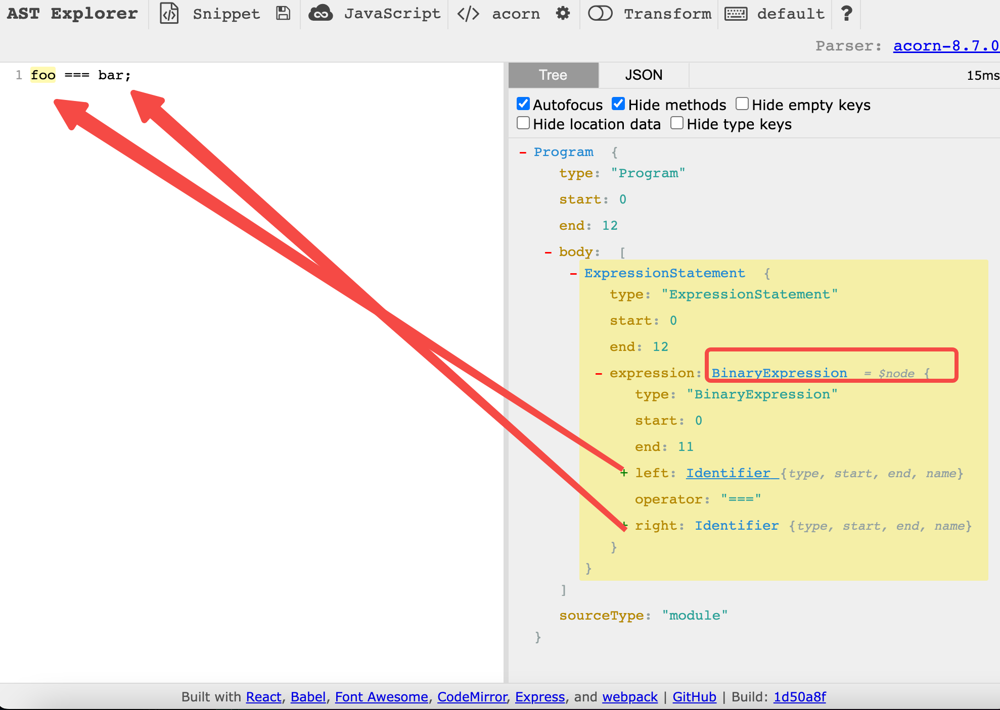
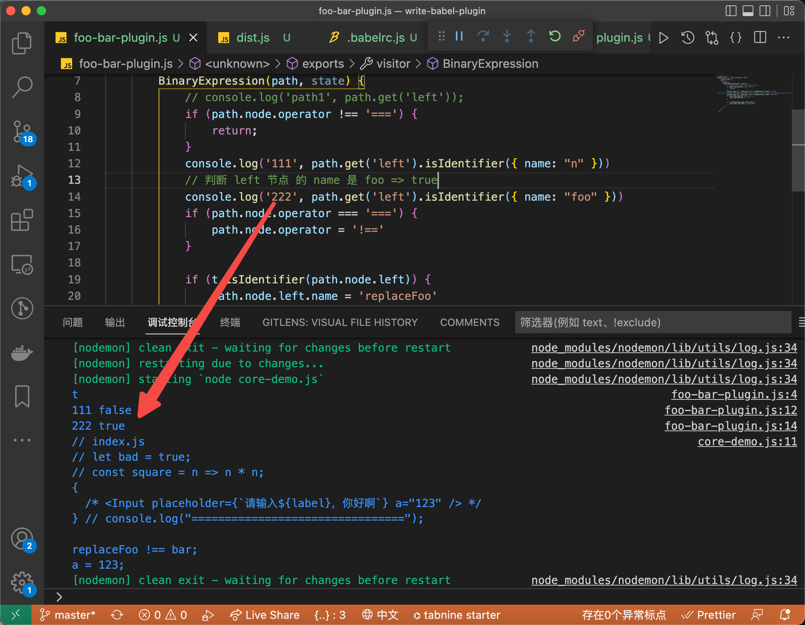
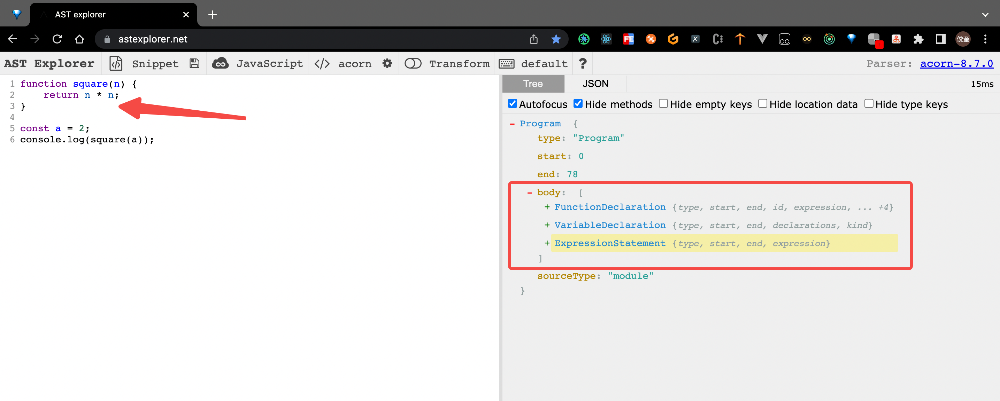
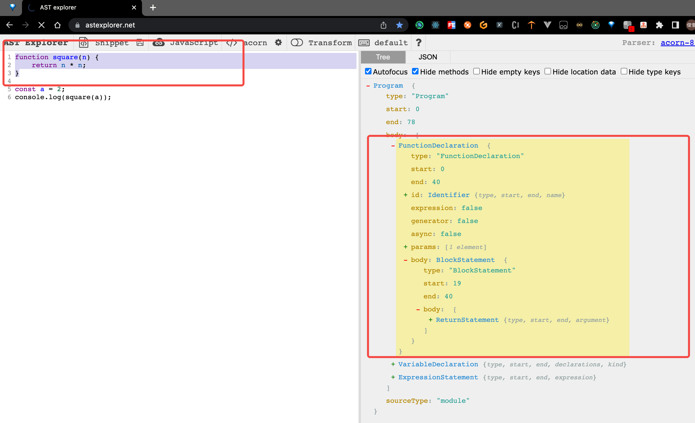
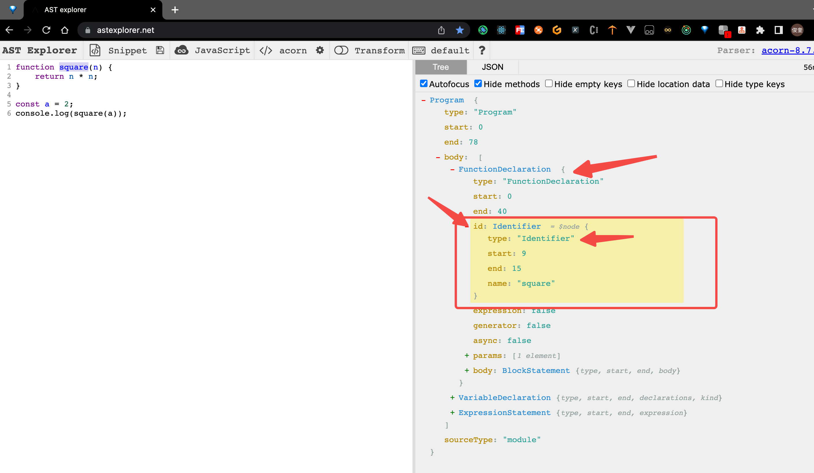
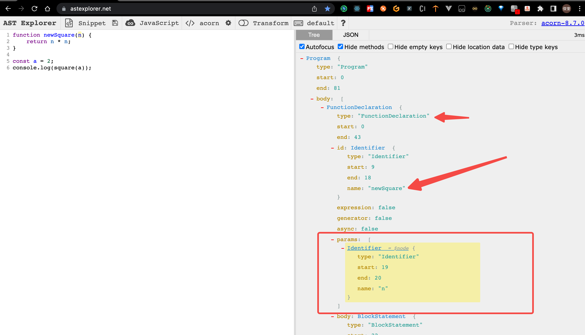
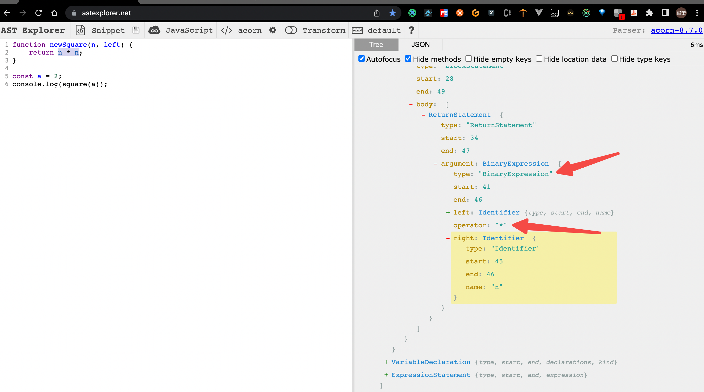
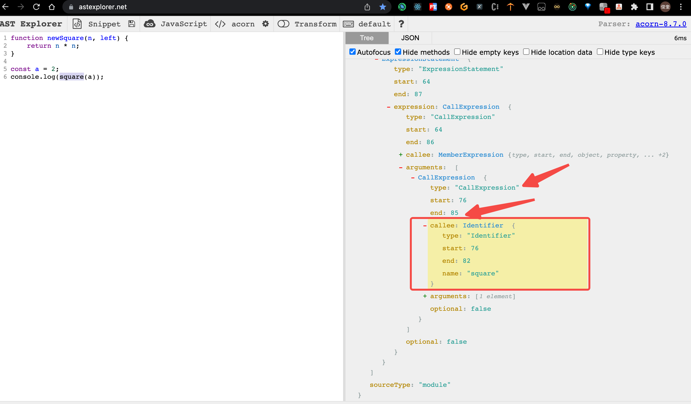

# Babel 插件的编写(下)

本文并未详细介绍所有的 babel path 节点的相关 api，详细的 关于 path 节点的相关文档 请见 [官方推荐文档（中文 有点老旧）](https://github.com/jamiebuilds/babel-handbook) 或者 [根据官方原版 英文文档 翻译的 中文文档（已经向 官方 提了 PR 但是暂未合并）](https://github.com/fu1996/babel-handbook/blob/master/translations/zh-Hans/plugin-handbook.md)，推荐的 是 先看 此文档，发现其中 部分 api 不熟悉 的时候 再去查 api 文档，印象深刻。

## 1. babel 插件的 API 规范

1. Babel 插件 本质上是一个函数，该函数 接受 babel 作为参数，通过 会 使用 `babel`参数里的 `types`函数

```js
export default function(babel) {
  // plugin contents
}
// or
export default function({types}) {
  // plugin contents
}
```

2. 返回的 是一个 对象。对象的 `visitor`属性是这个插件的主要访问者。`visitor`的 每个函数中 都会接受 2 个 参数： `path`和 `state`

```js
export default function ({ types: t }) {
  return {
    visitor: {
      // 此处的函数 名 是从 ast 里 取的
      Identifier(path, state) {},
      ASTNodeTypeHere(path, state) {},
    },
  };
}
```

## 2. 来个 demo 实现 ast 层面的 代码替换

**目的：** 将 `foo === bar;` 转为 `replaceFoo !== myBar;`

1. 首先 通过 https://astexplorer.net/ 来分析 ast 结构。



```json
{
  "type": "BinaryExpression",
  "operator": "===",
  "left": {
    "type": "Identifier",
    "name": "foo"
  },
  "right": {
    "type": "Identifier",
    "name": "bar"
  }
}
```

2. 从 `BinaryExpression`添加 访问者 进行 ast 节点处理，可以 看到 当 `operator`为 === 的时候 需要进行处理。代码如下

```js
// plugin.js
module.exports = function ({ types }) {
  console.log("t");
  return {
    visitor: {
      BinaryExpression(path, state) {
        console.log("path1", path);
        // 不是 !== 语法的 直接返回
        if (path.node.operator !== "===") {
          return;
        }
      },
    },
  };
};
```

3. 进行 ast 节点的 更改，因为 ast 是一个对象，可以 对 path 字段 直接更改其属性值即可。 比如 将 left 和 right 节点 的 name 进行修改。

   ```js
   // plugin.js
   module.exports = function ({ types }) {
     console.log("t");
     return {
       visitor: {
         BinaryExpression(path, state) {
           console.log("path1", path);
           if (path.node.operator !== "===") {
             return;
           }
           if (path.node.operator === "===") {
             path.node.operator = "!==";
           }
           if (path.node.left.name === "foo") {
             path.node.left.name = "replaceFoo";
           }
           if (path.node.right.name === "bar") {
             path.node.right.name = "myBar";
           }
         },
       },
     };
   };
   ```

   4. 从 index.js 经过 上述 babel 插件处理以后得出 dist.js 内容为：

      ```js
      // index.js
      foo === bar;
      a = 123;

      // babel 插件处理后
      replaceFoo !== myBar;
      a = 123;
      ```

## 3. 上一小节 掌握了 ast 节点 基础的 修改 和 访问，加深一下 ast 节点的操作

### 1. 获取 ast 节点的 属性值：path.node.property

```javascript
BinaryExpression(path) {
  path.node.left;
  path.node.right;
  path.node.operator;
}
```

### 2. 获取 该属性 内部的 path (节点信息)： path.get(xxx)

```javascript
BinaryExpression(path) {
  path.get('left'); // 返回的是一个 path 性的
}
Program(path) {
  path.get('body.0');
}
```

### 3. 检查节点的类型， 通过 babel 参数自带的 types 函数进行检查。

1. 简单判断节点的类型

```js
// plugin.js
module.exports = function ({ types: t }) {
  console.log("t");
  return {
    visitor: {
      BinaryExpression(path, state) {
        console.log("path1", path.get("left"));
        if (path.node.operator !== "===") {
          return;
        }
        if (path.node.operator === "===") {
          path.node.operator = "!==";
        }
        // 等同于 path.node.left.type === "Identifier"
        if (t.isIdentifier(path.node.left)) {
          path.node.left.name = "replaceFoo";
        }
      },
    },
  };
};
```

2. 判断节点的类型，外加 浅层属性的校验

```js
BinaryExpression(path) {
  if (t.isIdentifier(path.node.left, { name: "n" })) {
    // ...
  }
}
```

功能上等同于：

```
BinaryExpression(path) {
  if (
    path.node.left != null &&
    path.node.left.type === "Identifier" &&
    path.node.left.name === "n"
  ) {
    // ...
  }
}
```



## 4. 再来一道关于 ast 操作节点的题小试身手（关键还是学会看 ast 语法树和 尝试一些 ast 节点相关的 api）

当前程序代码为：

```js
function square(n) {
  return n * n;
}

const a = 2;
console.log(square(a));
```

目标程序代码是：

```js
function newSquare(n, left) {
  return left ** n;
}

const a = 2;
console.log(newSquare(a, 222));
```

整体操作 ast 语法树的分析逻辑：（结尾会放完整代码）

1. 将 `square`函数命名 进行 更名，改为 `newSquare`
2. 将 `newSquare`（因为 `square`参数 节点的 ast 名称 已经改为了`newSquare` ）的入参增加 一个 `left`参数
3. 将 `n * n` 进行 替换，换成 `left ** n;`
4. 在调用 `square`处 进行修改，首先将函数名 改为 `newSquare`，然后在，对该函数的入参增加 一个 `222`

### 1. 首先分析 原代码的 ast 语法树

可以看到当前程序 代码 被解析为 3 段 ast 语法树 节点



### 2. 接下来分析 函数定义 的这个节点

鼠标滑选 1-3 行，发现右侧 自动展开了。



### 3. 进行第一步：将 `square`函数命名 进行 更名，改为 `newSquare`



由图看出，如何确定 当前的节点是 square 函数的命名 节点呢？（1 分钟 思考一下）。

- 节点的类型首先是：**Identifier** 类型，并且 当前节点 的 `name` 字段是 **square**
- 节点的 父级 节点的 类型 是 **FunctionDeclaration** 的。

伪代码如下：

```js
// 新建 变量，记录 新函数的函数名
const newName = "newSquare";
// 获取当前 函数的 父级。查找最接近的父函数或程序：
const parentFunc = path.getFunctionParent();
if (parentFunc) {
  // 当前父节点 是 square函数 并且当前的节点的key是 id（此处是为了确认 square 的函数命名节点）。
  // 然后对此函数进行重命名 从 square 改为 newName
  if (parentFunc.node.id.name === "square" && path.key === "id") {
    console.log("对 square 进行重命名：", newName);
    path.node.name = newName;
  }
}
```

### 4. 接下来 将 `newSquare`的入参增加 一个 `left`参数。



- 当前节点 的 类型 是 `Identifier`类型，并且是 在 名为 `params`的 列表里 (列表，就意味着 可以 进行 增删改查了)
- 当前节点的 父级 节点类型 是 **FunctionDeclaration** 的，并且 父级节点下的 **id 的 name** 属性 已经变更为了 `newSquare`

伪代码如下：

```js
// 当前父节点 是 square函数 并且当前的节点的listKey是 params（此处是为了排除 square 的函数命名节点）。
// 此处是在重命名后才会走的 逻辑 所以 该节点 父级的 名称判断用的是 newName 而不是 square
if (
  parentFunc.type === "FunctionDeclaration" &&
  parentFunc.node.id.name === newName &&
  path.listKey === "params"
) {
  console.log("新增函数参数 left");
  path.container.push(t.identifier("left"));
}
```

### 5. 将 `n * n` 进行 替换，换成 `left ** n;`



- 发现 如果单纯的 去 操作 **Identifier**类型的 n 情况有些多，并且 当前情况 还要 判断 操作符（**operator**） 是不是 `*`,换个思路，去操作 **BinaryExpression** 类型的数据

- 在 **BinaryExpression**类型 中，仅仅 需要 判断 当前 `operator`的 属性 是不是 我们需要的 `*`

  伪代码如下：

  ```js
        BinaryExpression(path, state) {
          if (path.node.operator !== "*") return;
          console.log("BinaryExpression");
          // 替换一个节点
          path.replaceWith(
            // t.binaryExpression("**", path.node.left, t.NumericLiteral(2))
            t.binaryExpression("**", t.identifier("left"), t.identifier("n"))
          );
        },
  ```

### 6. 最后一步：在调用 `square`处 进行修改，首先将函数名 改为 `newSquare`，然后在，对该函数的入参增加 一个 `222`



- 目标 是将 name 字段的 `square` 字段 改为 `newSquare`。

方法一：其 父级节点 是一个 `CallExpression`，直接在其 父级节点 操作 它。

伪代码 如下：

```js
      CallExpression(path, state) {
        console.log("CallExpression");
        // 当前被调用函数的 名称 是 square
        if (path.node.callee.name === 'square') {
          console.log("在 CallExpression 中，更改 被调用 函数 square 的名字 为", newName);
          path.node.callee.name  = newName;
        }
      },
```

方法二：通过 节点 `Identifier` 进行操作

- 判断当前 节点的属性是 `callee` 表示是被调用的，并且 当前 节点的 名字 为 `square`

伪代码如下：

```js
// 判断是不是 square 的函数调用
if (path.key === "callee" && path.isIdentifier({ name: "square" })) {
  console.log("对square函数调用进行重命名", newName);
  path.node.name = newName;
}
```

### 7. 总结 以及 全部代码

到现在，你会发现其实 对 ast 语法树的操作，主要还是 操作一个 ast 语法树的对象，只要 对 ast 语法树 对象 进行 符合 ast 语法树 相关规则的 属性的 更改，babel 就会 自动 处理 ast 语法树对象 并生成 新的 代码。

**核心代码**

```js
// square-plugin.js
// 新建 变量，记录 新函数的函数名
const newName = "newSquare";

module.exports = function ({ types: t }) {
  return {
    visitor: {
      Identifier(path, state) {
        console.log("走进 Identifier");
        if (path.parentPath && path.listKey === "arguments") {
          console.log("增加参数");
          path.container.push(t.NumericLiteral(222));
          return;
        }

        // 获取当前 函数的 父级。查找最接近的父函数或程序：
        const parentFunc = path.getFunctionParent();
        if (parentFunc) {
          // 当前父节点 是 square函数 并且当前的节点的listKey是 params（此处是为了排除 square 的函数命名节点）。
          // 此处是在重命名后才会走的 逻辑 所以 该节点 父级的 名称判断用的是 newName 而不是 square
          if (
            parentFunc.type === "FunctionDeclaration" &&
            parentFunc.node.id.name === newName &&
            path.listKey === "params"
          ) {
            console.log("新增函数参数 left");
            path.container.push(t.identifier("left"));
          }
          // 当前父节点 是 square函数 并且当前的节点的key是 id（此处是为了确认 square 的函数命名节点）。
          // 然后对此函数进行重命名 从 square 改为 newName
          if (parentFunc.node.id.name === "square" && path.key === "id") {
            console.log("对 square 进行重命名：", newName);
            path.node.name = newName;
          }
        }
        // 方法二： 判断是不是 square 的函数调用
        // if (path.key === 'callee' && path.isIdentifier({name: 'square'})) {
        //   console.log("对square函数调用进行重命名", newName);
        //   path.node.name = newName;
        // }
      },
      BinaryExpression(path, state) {
        if (path.node.operator !== "*") return;
        console.log("BinaryExpression");
        // 替换一个节点
        path.replaceWith(
          // t.binaryExpression("**", path.node.left, t.NumericLiteral(2))
          t.binaryExpression("**", t.identifier("left"), t.identifier("n"))
        );
      },
      CallExpression(path, state) {
        console.log("CallExpression");
        // 方法1： 当前被调用函数的 名称 是 square
        if (path.node.callee.name === "square") {
          console.log(
            "在 CallExpression 中，更改 被调用 函数 square 的名字 为",
            newName
          );
          path.node.callee.name = newName;
        }
      },
      FunctionDeclaration(path, state) {
        console.log("FunctionDeclaration");
        // const params = path.get('params');
        // const params = path.get('params');
        // params.push(t.identifier('left'));
        // console.log('FunctionDeclaration end', path);
        // path.params = params;
        // path.params.push(t.identifier('right'));
      },
    },
  };
};
```
