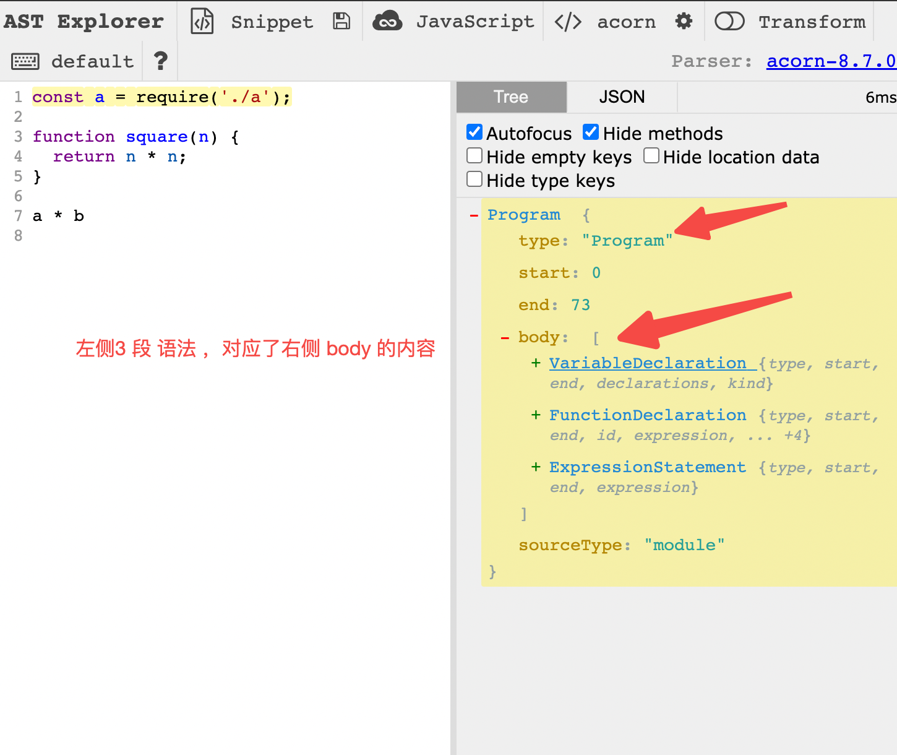
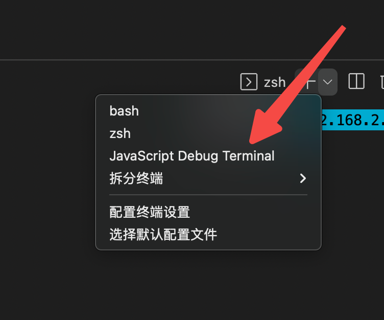
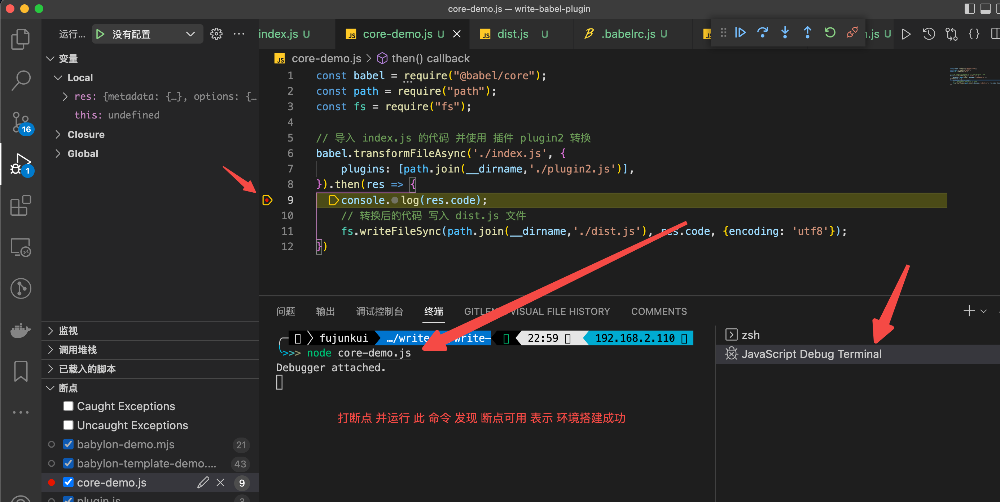
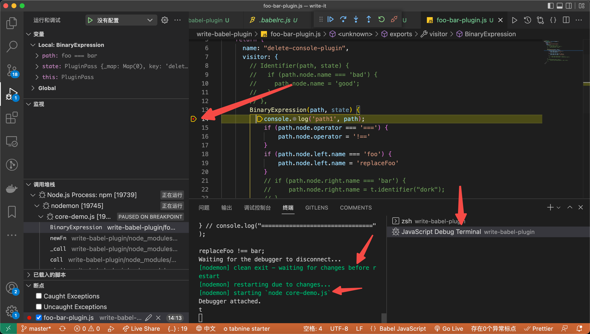

# Babel 插件的编写(上)

## 学习的背景

- es6 是如何转换为 es5 的？
- 为啥 之前 jsx 需要 手动导入 react ，现在不需要了？
- 国际化内容 需要写 t 函数的 地方太多 ，懒得写了。（业务方面）

## 1. babel 常用包的介绍 （写插件必备知识）

代码 转 语法树的 官网：https://astexplorer.net/

### 1. Babylon 是 Babel 的解析器，代码转为 AST 语法树

1. `npm init -y`进行项目的初始化 搭建
2. **Babylon** 是 Babel 的解析器，是 将 代码 转换为 AST 语法树的 工具，现在来安装它`npm install --save babylon`
3. 新增 `babylon-demo.mjs` （注意是 mjs 结尾的，方便使用 ESmodule 语法），写入 如下内容。调用 **babylon.parse**生成 ast 语法树

```javascript
import * as babylon from "babylon";

const code = `function square(n) {
  return n * n;
}`;

const ast = babylon.parse(code);
console.log(ast);
// Node {
//   type: "File",
//   start: 0,
//   end: 38,
//   loc: SourceLocation {...},
//   program: Node {...},
//   comments: [],
//   tokens: [...]
// }
```

### 2. Babel-traverse 来操作 AST 语法树

1. `npm install --save babel-traverse`安装 依赖。
2. 利用 语法树 将 code 中的 n 替换为 x。（别急 下一步 就是 根据新的 语法树 生成代码）

```javascript
import * as babylon from "babylon";
import traverse from "babel-traverse";

const code = `function square(n) {
  return n * n;
}`;

const ast = babylon.parse(code);
// 对 抽象语法树 一层层的 遍历
traverse.default(ast, {
  // 树 的节点 会 作为 参数 传入 enter 函数
  enter(path) {
    // 如果当前节点 是 Identifier 并且 name 是 n。就替换为 x
    if (path.node.type === "Identifier" && path.node.name === "n") {
      path.node.name = "x";
    }
  },
});
```

### 3. [`babel-generator`](https://github.com/babel/babel/tree/master/packages/babel-generator)根据修改的语法树 生成代码 和源码映射（source map）

1. 安装 依赖 `npm install --save babel-generator`
2. 将 AST 语法树 生成代码

```javascript
import * as babylon from "babylon";
import traverse from "babel-traverse";
import generate from "babel-generator";

// 原始代码
const code = `function square(n) {
  return n * n;
}`;
// ast 是对象 属于引用型
const ast = babylon.parse(code);

// 对 抽象语法树 一层层的 遍历
traverse.default(ast, {
  // 树 的节点 会 作为 参数 传入 enter 函数
  enter(path) {
    // 如果当前节点 是 Identifier 并且 name 是 n。就替换为 x
    // 因为 ast 是对象，所以 此处做的变更会 直接影响到 ast
    if (path.node.type === "Identifier" && path.node.name === "n") {
      path.node.name = "x";
    }
  },
});
// 对节点操作过以后的代码
const targetCode = generate.default(ast).code;

console.log("targetCode", targetCode);
// targetCode function square(x) {
//   return x * x;
// }
```

### 4. 发现对节点的判断 需要写的代码很多，抽离出公共的包来进行节点的判断。[`babel-types`](https://github.com/babel/babel/tree/master/packages/babel-types)（AST 节点里的 Lodash 式工具库）

1. 安装：`npm install --save babel-types`
2. 优化上面代码的 AST 节点的 if 判断。

```javascript
import * as babylon from "babylon";
import traverse from "babel-traverse";
import generate from "babel-generator";
// 注意 node_modules 模块里 导出的是 default
import { default as t } from "babel-types";

// 原始代码
const code = `function square(n) {
  return n * n;
}`;
// ast 是对象 属于引用型
const ast = babylon.parse(code);

// 对 抽象语法树 一层层的 遍历
traverse.default(ast, {
  // 树 的节点 会 作为 参数 传入 enter 函数
  enter(path) {
    // 如果当前节点 是 Identifier 并且 name 是 n。就替换为 x
    // 因为 ast 是对象，所以 此处做的变更会 直接影响到 ast
    // if (
    //   path.node.type === "Identifier" &&
    //   path.node.name === "n"
    // ) {
    //   path.node.name = "x";
    // }
    if (t.isIdentifier(path.node, { name: "n" })) {
      path.node.name = "x";
    }
  },
});
// 对节点操作过以后的代码
const targetCode = generate.default(ast).code;

console.log("targetCode", targetCode);
// targetCode function square(x) {
//   return x * x;
// }
```

### 5. 通过 AST 来生成 CODE 可读性 太差。使用[`babel-template`](https://github.com/babel/babel/tree/master/packages/babel-template)来实现占位符的来生成代码。

1. 安装依赖：`npm install --save babel-template`
2. 当前的需求是：我不想手动导入 文件 a 依赖。即：**const a = require("a");**这句话 我不想写。
3. 首先构建 ast 的模板：判断哪些是变量，哪些是 语法。

```javascript
// 构建模板
const buildRequire = template(`
  const IMPORT_NAME = require(SOURCE);
`);
```

4. 使用 变量 进行 填充

```javascript
// 创建ast
const astImport = buildRequire({
  IMPORT_NAME: t.identifier("a"),
  SOURCE: t.stringLiteral("a"),
});
```

5. 分析 何时塞入 这段 ast 。使用 https://astexplorer.net/ 分析 得知。代码和 图片如下

```javascript
import * as babylon from "babylon";
import traverse from "babel-traverse";
import generate from "babel-generator";
import { default as template } from "babel-template";
// 注意 node_modules 模块里 导出的是 default
import { default as t } from "babel-types";

// 构建模板
const buildRequire = template(`
  const IMPORT_NAME = require(SOURCE);
`);
// 创建ast
const astImport = buildRequire({
  IMPORT_NAME: t.identifier("a"),
  SOURCE: t.stringLiteral("a"),
});

// 原始代码
const code = `
function square(n) {
  return n * n;
}`;
// ast 是对象 属于引用型
const ast = babylon.parse(code);

// 对 抽象语法树 一层层的 遍历
traverse.default(ast, {
  // 树 的节点 会 作为 参数 传入 enter 函数
  enter(path) {
    // 如果当前节点 是 Identifier 并且 name 是 n。就替换为 x
    // 因为 ast 是对象，所以 此处做的变更会 直接影响到 ast
    // if (
    //   path.node.type === "Identifier" &&
    //   path.node.name === "n"
    // ) {
    //   path.node.name = "x";
    // }
    if (t.isIdentifier(path.node, { name: "n" })) {
      path.node.name = "x";
    }
    // 在程序的开头 塞进去 我的 ast
    if (t.isProgram(path.node)) {
      console.log("塞入我写的 ast");
      path.node.body.unshift(astImport);
    }
  },
});
// 对节点操作过以后的代码
const targetCode = generate.default(ast).code;

console.log("targetCode", targetCode);
// 塞入我写的 ast
// targetCode const a = require("a");

// function square(x) {
//   return x * x;
// }
```

## 2. 开始 撸 Babel 的插件

### 1. 开始撸插件代码 之前 必须要有一个 方便调试的 babel 的环境

1. 安装 babel 核心包 [@babel/core](https://www.babeljs.cn/docs/babel-core) （文档：https://www.babeljs.cn/docs/usage#%E6%A0%B8%E5%BF%83%E5%BA%93）。`npm install --save-dev @babel/core`
2. 新建 demo 代码 `index.js`

```javascript
// index.js
let bad = true;
const square = (n) => n * n;
```

3. 新建插件 `plugin2.js`

   ```javascript
   // plugin.js
   module.exports = function ({ types: babelTypes }) {
     return {
       name: "deadly-simple-plugin-example",
       visitor: {
         Identifier(path, state) {
           if (path.node.name === "bad") {
             path.node.name = "good";
           }
         },
       },
     };
   };
   ```

   4. 新建 `core-demo.js`使用 babel-core 来编译 代码

   ```javascript
   const babel = require("@babel/core");
   const path = require("path");
   const fs = require("fs");

   // 导入 index.js 的代码 并使用 插件 plugin2 转换
   babel
     .transformFileAsync("./index.js", {
       plugins: [path.join(__dirname, "./plugin2.js")],
     })
     .then((res) => {
       console.log(res.code);
       // 转换后的代码 写入 dist.js 文件
       fs.writeFileSync(path.join(__dirname, "./dist.js"), res.code, {
         encoding: "utf8",
       });
     });
   ```

   5. 测试 断点是否生效（方便后期调试）

   vscode 中 新建 debug 终端

   



### 2. 使用 nodemon 包优化环境，提高调试的效率 （nodemon + debug 提高效率）

1. 安装依赖: `npm i nodemon`
2. 配置 package.json 的 script 命令为：（监听文件变更时候忽略 dist.js ，因为 dist 的变更会引起 脚本的重新执行，脚本的重新执行又 产生新的 dist.js）

```bash
 "babylon": "nodemon core-demo.js --ignore dist.js"
```

3. 开启 debug 终端，运行 `npm run babylon`即可看到文件变更 会自动走到断点里



babel 插件需要写的东西太多，本小节只是完成环境的搭建。具体请见下节。
