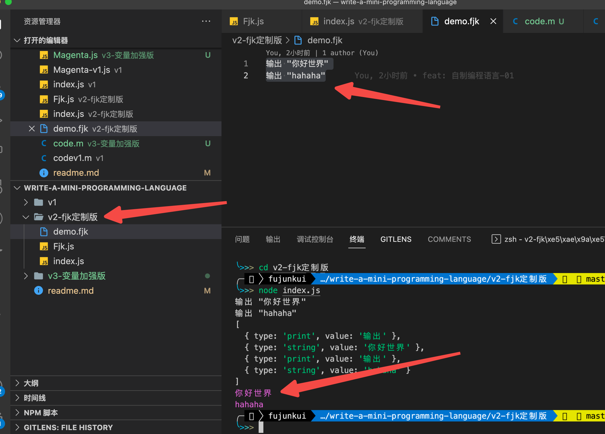

# 手把手教你不到 200 行代码实现属于自己的超 mini 版编程语言

## 题目是有点标题党的嫌疑，但是 看完这篇文章如果没有收获，你倒立洗头

### 带着疑问去学习：

- 各种各样的编程语言层出不穷，进而会产生许多带有不同后缀的 文件（.js,.jsx,.ts,.py,.go,.php,.java），这些文件的内容对程序员来说是逻辑的表达，但是对计算机来说，也就是带着不同后缀的二进制文件，那他们是如何变成机器读得懂的语言呢？
- 如果我想要 实现一个属于自己后缀的 语言应该怎么实现呢？

> 编程语言是将字符串转换为各种机器代码输出的规则集。

简而言之，编程语言只是一组预定义的规则。有一定的编程范式，然后通过编译器/解释器 来转换为控制计算机运行的机器语言。而我们今天就是要利用 js 来实现一个简单的解释器。

### 先看效果

新建文件 `demo.fjk`

内容为：

```js
输出 "你好世界"
输出 "hahaha"
```

运行得出：



核心代码仅仅 120 行


这只是其中的一个思路，你完全可以结合`webpack`使用自己的后缀，使用自己的 loader 去解析和处理。

## 01. 使用 nodejs 获取编程文件，并读取 编程数据

这个对各位资深大佬那不是分分钟搞定？

```js
//demo.fjk
输出 "你好世界"
输出 "hahaha"

// index.js

const Fjk = require('./Fjk')
const fs = require('fs')
const path = require('path')

const codes = fs.readFileSync(path.join(__dirname, './demo.fjk'), 'utf8').toString().replace(/\r/g, '/n')

const magenta = new Fjk(codes);

magenta.run();

```

大致解读一下，我们先读取到 `demo.fjk`的文件内容，然后替换其中的换行，然后把读取到的代码 交给 由类 `Fjk`创建的 实例 去 处理，执行 run 方法去执行`demo.fjk`程序。

## 02. 去实现这个 Fjk 的类

- 首先接受传递 过来的代码 `constructor`构造函数
- 接下来去实现 `run`函数，去执行 这串代码

```js
class Fjk {
  constructor(codes) {
    this.codes = codes;
  }
  run() {
    console.log(this.codes);
  }
}
```

**到此结束。**哈哈，心里一慌吧？😄 😄 😄 真正的 实现才刚刚开始

## 03. 去实现一个简单的词法分析，把 输入的 代码 字符串 变为 可读的 有逻辑的数据结构（AST 语法树）

### 0 先提取常用的常量

```js
const PrintStr = "输出";

const TokenTypes = {
  String: "string",
  Print: "print",
  Varchar: "varchar",
};
```

### 1. 简单分析整体思路

第一步 要创建一个 游标 记录下当前解析的位置

第二步 要创建一个 列表 记录下 解析后的数据

第三步 一个字 一个字的 去解析判断，去分析。

大体的代码结构如下：（文末附有 GitHub 地址，提供完整代码）

```js
    // 词法解析
    tokenize() {
        const length = this.codes.length;
        // 记录当前 解析的 位置
        let pos = 0;
        let tokens = [];
    		while (pos < length) {
            let currentChar = this.codes[pos];
        }

    }
```

### 2. 判断 currentChar 的类型

- 如果是 空格 和 换行 直接跳过就行
- 如果是 `"`那就是 **字符串**类型
- 如果是 `print` 那就是 `关键字`

伪代码如下：


### 3. 是空格 或者换行的情况 比较简单 一个 continue 直接跳过就行

### 4. 当 currentChar 为 `"` 的时候，要取出 两个 `"`包裹的内容 作为字符串。

对当前的 pos 进行移动累加，一直 移动到当前 字符串 的内容 为 `"`，此时的 res 记录的就是 `"xxx"`之中的 xxx 内容，然后放入 tokens 里。

代码如下：


### 5. 最后一个判断，判断是不是系统关键字

第一步还是对字符串进行提取，提取完毕以后 判断是不是 `关键字` 如果是关键字就存入 tokens 里

代码如下：


经过**词法分析** 处理以后的 数据结构如下：（这个是简单的版本的复杂版本的可以去 GitHub 里看 v3 版本）

## 04. 获取到 token 以后 再次进行语法分析

怎么进行语法分析呢？简单来说 就是 一个完整的句子。

比如说：**我学习 js**。就不能是 **我 js** ，缺少了 关键字 就不能表述出想说的意思了。在者说就是：用 js 写了赋值 语句，写成了 **const = 123**，从语法上就死掉了。话不多说 开搞。

### 逐个逐个的进行 token 解析

写一个 parse 函数 接受 词法解析后的 `tokens`。

- 从第一个 tokens 开始解析
- 如果是 `输出`关键词的 token ，就需要 判断 下一个 token **是否是 字符串** 这样才满足语法

代码如下

```js
// 语法解析
    parse(tokens) {
        const len = tokens.length;
        let pos = 0;
        while (pos < len) {
            const currentToken = tokens[pos];
            // 如果是 PrintStr 关键字 也就是 `输出`
            if (currentToken.type === TokenTypes.Print && currentToken.value === PrintStr) {
                // 如果下一个 currentToken 不存在
                if (!tokens[pos + 1]) {
                    return console.log('当前行错误，期望的是字符串' + pos);
                }
                // 校验下一个 currentToken 是否是 字符串
                let isString = tokens[pos + 1].type === 'string';
                if (!isString) {
                    return console.log(`currentToken 解析错误 ${tokens[pos + 1].type}，期望的是字符串`)
                }
                // 语法没有错误 输出
                console.log('\x1b[35m%s\x1b[0m', tokens[pos + 1].value);
                // pos 的位置增加2，2 代表的 是 PrintStr 一个 currentToken 字符串 一个 currentToken
                pos+= 2
            } else {
                return console.log(`未匹配的token ${currentToken.type}`)
            }
        }
    }
```

## 总结

这个 mini 的编程语言，虽然 语法简单，但是 这个思路是很重要的，把 代码的输入，词法解析 以及 语法解析都涉及到了。还有一个 v3 复杂版本的，增加了 变量的 相关 解析，大家可以自己试试实现。（也可以参考我的 GitHub v3 版本）

输入如下：

```js

print "hello world"
var world = "hahaha"
print world
```

输出如下：

```shell
hello world
hahaha
```

附上完整的 代码地址 ：[实现一个 mini 版编程语言](https://github.com/fu1996/write-it/tree/main/write-a-mini-programming-language)
