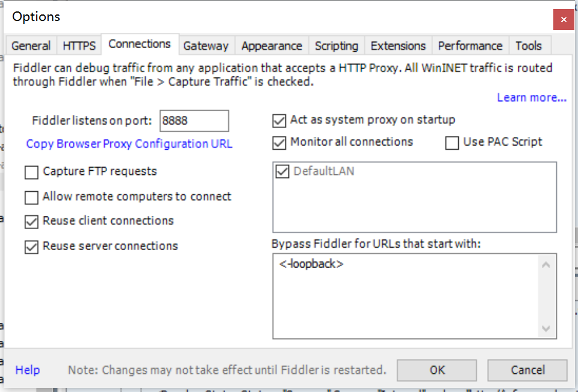
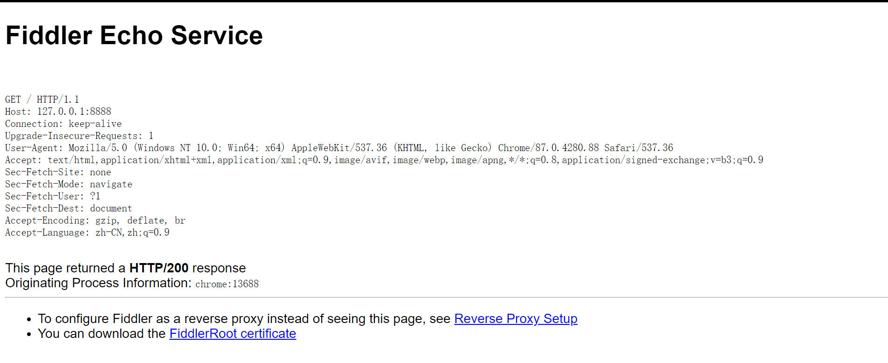
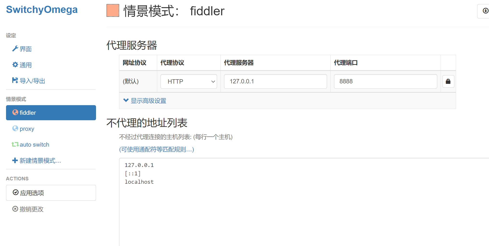
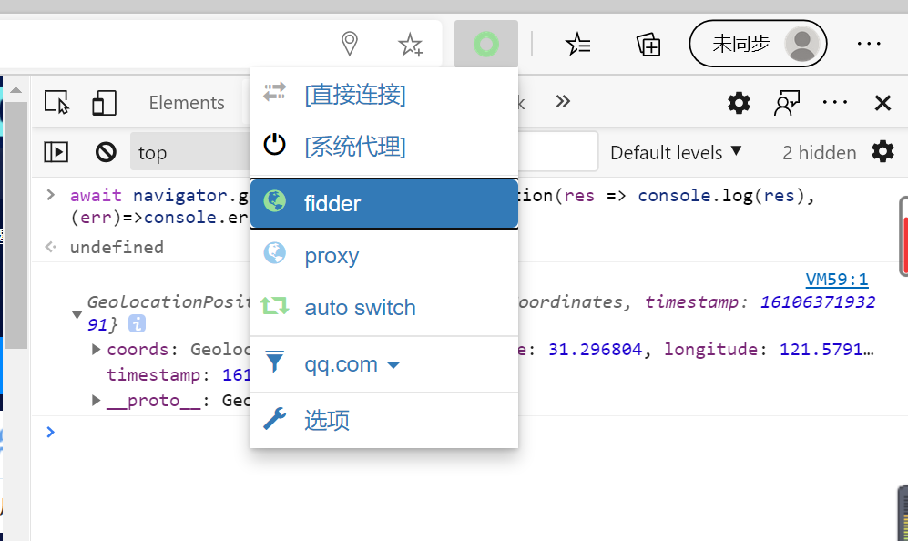
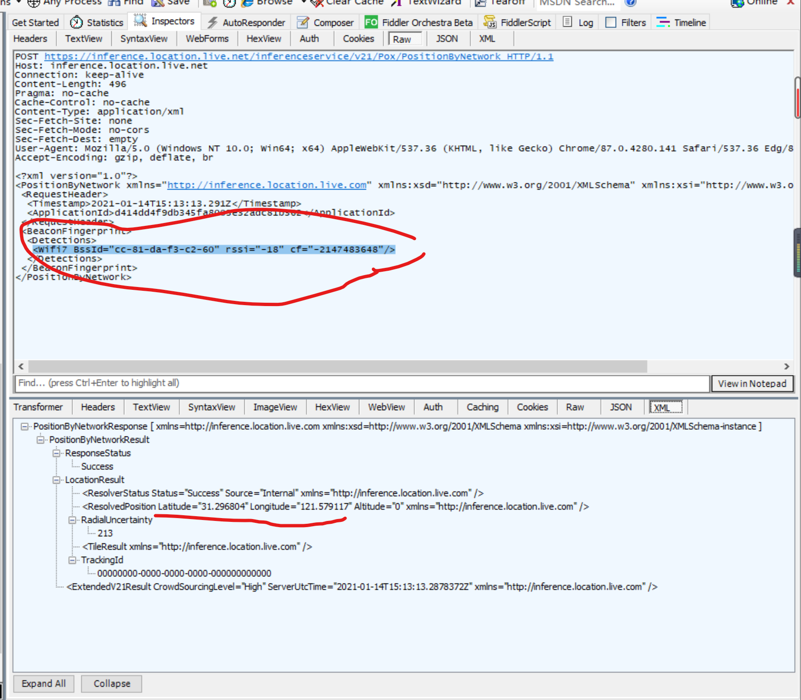
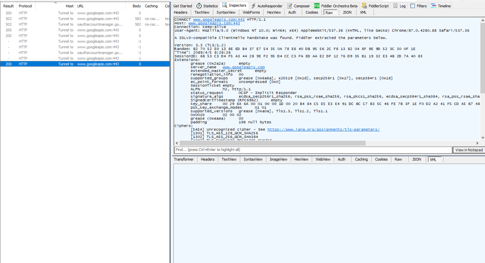
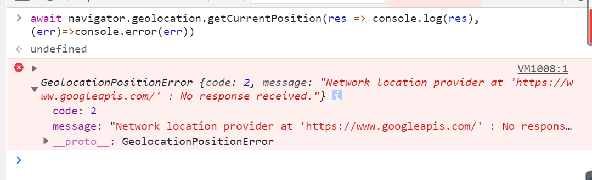

# 抓包神器 Fiddler 抓 H5 地理位置请求的数据

`GeolocationPositionError {code: 2, message: "Network location provider at 'https://www.googleapis.com/' : No response received."}`的根本原因分析

上篇文章中得出谷歌浏览器使用 H5 地理位置 API 会调用接口失败，但是 Edge 会成功。想不出原因，看了很多文章发现都是要浏览器调用远程服务的，于是有了这篇文章，通过 Fiddler 抓包 H5 API 调用的服务 【Fiddler 是学 python 爬虫时候学的 🤭】

## 安装配置 Fidder 【自行百度，此处不是重点】

配置需要启用 Https 和 设置仅从浏览器抓包

```
配置路径：Tool > Options > Https
```


端口默认 8888



浏览器输入 `你的ip:8888` ，出现下图界面就是成功了



## 安装浏览器的代理工具`Proxy SwitchyOmega`。

谷歌【安装插件需要科学一点】，Edge 的直接应用商店安装就行。


配置插件，新建情景模式，名字随意，配置成如下



使用情景模式



## 抓取浏览器的请求【此处用的 Edge】

任意打开一个`https`协议的网站，打开控制台。输入如下代码，开始抓包

```js
await navigator.geolocation.getCurrentPosition(
  (res) => console.log(res),
  (err) => console.error(err)
);
//结果如下
```

```js
GeolocationPosition {coords: GeolocationCoordinates, timestamp: 1610637193291}coords: GeolocationCoordinates {latitude: 31.296804, longitude: 121.579117, altitude: null, accuracy: 213, altitudeAccuracy: null, …}timestamp: 1610637193291__proto__: GeolocationPosition
```

查看 Fidder



可以发现，也是通过 WIFI 进行定位的，然后获取的经纬度。

## 谷歌浏览器的抓包分析



控制台结果



# 大佬的总结文章和各种方式定位的原理

https://blog.csdn.net/fen747042796/article/details/65445122
