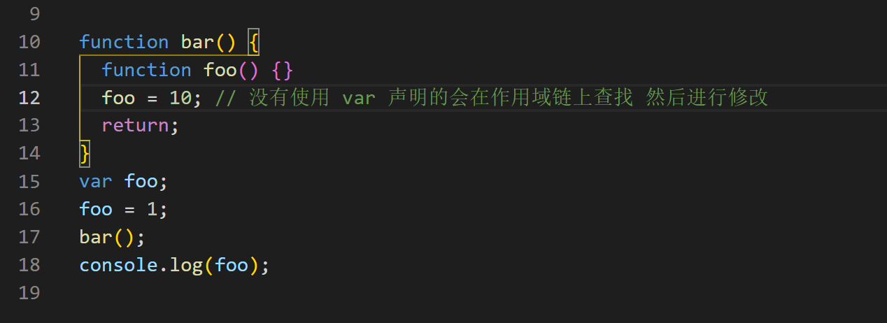
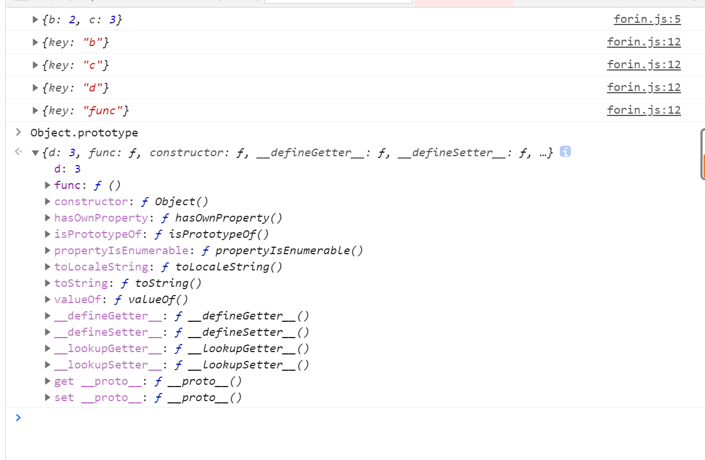
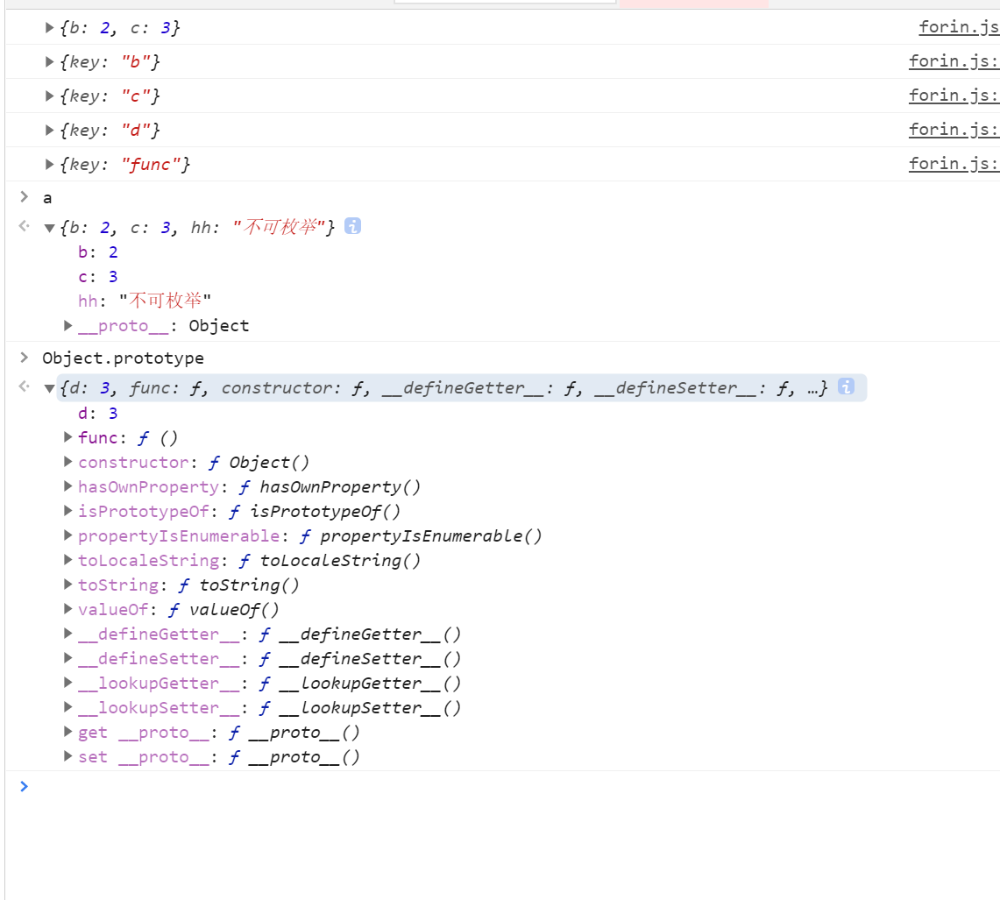
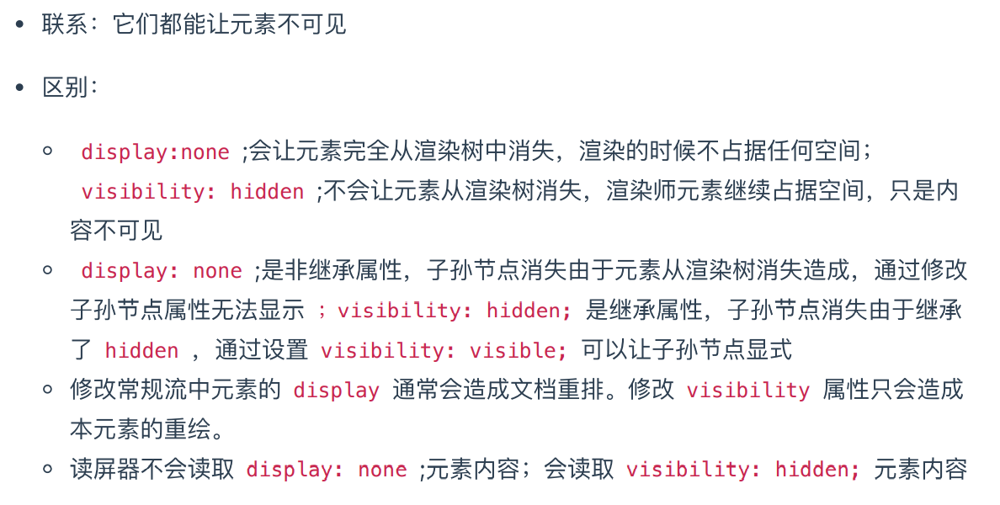

# 易混点

## 1.函数声明提前和变量提升 【let const 和 var】

https://www.cnblogs.com/echolun/p/7612142.html

- **函数会首先被提升，然后才是变量**

- ```js
  console.log(a);
  var a = "孙悟空";
  function a() {
    console.log("小钻风");
  }
  ```

- 变量已存在声明 二次声明会被忽略

- 上面代码等同于：

- ```js
  function a() {
    console.log("小钻风");
  }
  var a; //由于上面函数已声明a,相同的变量名声明会被直接忽略
  console.log(a); //输出函数本体
  a = "孙悟空";
  ```

  测试题：

  ```js
  console.log(a); //?
  a(); //?
  var a = 3;
  function a() {
    console.log(10);
  }
  console.log(a); //?
  a = 6;
  a(); //?
  ```

  测试题 2

  ```js
  var foo = 1;
  function bar() {
    foo = 10;
    return;
    function foo() {} // 在 return 后不执行 但是不影响变量提前
  }
  bar();
  alert(foo); //答案：1
  ```

  相当于

  

  **注意 bar 函数里面的 foo 此时也是函数的颜色**

## 2.arguments 的操作

```js
function foo(a) {
  arguments[0] = 2;
  alert(a); //答案：2，因为：a、arguments是对实参的访问，b、通过arguments[i]可以修改指定实参的值
}
foo(1);
```

## 3. for in 是否可以遍历原型上的属性 =》 可以

```js
const a = {
  b: 2,
  c: 3,
};
console.log(a);
Object.prototype.d = 3;
Object.prototype.func = function () {
  console.log("obj func");
};

for (const key in a) {
  console.log({ key });
  if (Object.hasOwnProperty.call(a, key)) {
    const element = a[key];
  }
}
```



发现自己添加的原型属性和方法依然可以遍历出来，但是对象本身的不可遍历，查阅资料发现，浅红色的时不可枚举属性。

https://blog.csdn.net/web_zhouliang/article/details/78710034

给对象 a 添加不可枚举属性

```js
Object.defineProperty(a, "hh", {
  value: "不可枚举",
  enumerable: false,
});
```



**遍历的本质还是枚举**

扩展：[枚举一个对象的所有属性](https://developer.mozilla.org/zh-CN/docs/Web/JavaScript/Guide/Working_with_Objects#%E6%9E%9A%E4%B8%BE%E4%B8%80%E4%B8%AA%E5%AF%B9%E8%B1%A1%E7%9A%84%E6%89%80%E6%9C%89%E5%B1%9E%E6%80%A7)

## 4.重绘和重排，哪些属性会引起重排？

**重排**是指`dom树发生结构变化后，需要重新构建dom结构`。 **重绘**是`指dom节点样式改变，重新绘制`。 **重排一定会带来重绘，重绘不一定有重排。**

**如何减少浏览器重排**：将需要多次重排的元素，position 属性设为 absolute 或 fixed，这样此元素就脱离了文档流，它的变化不会影响到其他元素。

## 5.new 做了什么

## 6.js 为什么是单线程的

## 7.同步和异步的理解

1.同步和异步的区别?

同步：阻塞的

-张三叫李四去吃饭，李四一直忙得不停，张三一直等着，直到李四忙完两个人一块去吃饭

=浏览器向服务器请求数据，服务器比较忙，浏览器一直等着（页面白屏），直到服务器返回数据，浏览器才能显示页面

异步：非阻塞的

-张三叫李四去吃饭，李四在忙，张三说了一声然后自己就去吃饭了，李四忙完后自己去吃

=浏览器向服务器请求数据，服务器比较忙，浏览器可以自如的干原来的事情（显示页面），服务器返回数据的时候通知浏览器一声，浏览器把返回的数据再渲染到页面，局部更新

## 8.Map Set 和 Symbol

## 9.for...in 和 for...of

for...of 可以用来遍历数组，类数组对象，argument，字符串，Map 和 Set，

for...in 用来遍历对象

## 10.Object.is() 与原来的比较操作符“ ===”、“ ==”的区别？

两等号判等，会在比较时进行类型转换；

三等号判等(判断严格)，比较时不进行隐式类型转换,（类型不同则会返回 false）；

Object.is 在三等号判等的基础上特别处理了 NaN 、-0 和 +0 ，保证 -0 和 +0 不再相同，

但 Object.is(NaN, NaN) 会返回 true.

## 11.fetch 和 Ajax 有什么不同

## 12.GET 和 POST 的区别

## 13.存储相关（cookie，web storage 和 session）

cookie 优点： 1.可以解决 HTTP 无状态的问题，与服务器进行交互 缺点： 1.数量和长度限制，每个域名最多 20 条，每个 cookie 长度不能超过 4kb 2.安全性问题。容易被人拦截 3.浪费带宽，每次请求新页面，cookie 都会被发送过去

### 1.cookie 和 session 区别

1.cookie 数据存放在客户的浏览器上，session 数据放在服务器上。 2.session 会在一定时间内保存在服务器上。当访问增多，会比较占用你服务器的性能。考虑到减轻服务器性能方面，应当使用 COOKIE。

sessionStorage 是当前对话的缓存，浏览器窗口关闭即消失，localStorage 持久存在，除非清除浏览器缓存。

### 2.什么是 Cookie 隔离？（或者说：请求资源的时候不要让它带 cookie 怎么做）

如果静态文件都放在主域名下，那静态文件请求的时候都带有的 cookie 的数据提交给 server 的，非常浪费流量，

所以不如隔离开。

因为 cookie 有域的限制，因此不能跨域提交请求，故使用非主要域名的时候，请求头中就不会带有 cookie 数据，

这样可以降低请求头的大小，降低请求时间，从而达到降低整体请求延时的目的。

同时这种方式不会将 cookie 传入 Web Server，也减少了 Web Server 对 cookie 的处理分析环节，

提高了 webserver 的 http 请求的解析速度。

## 14.页面缓存原理

页面缓存状态是由 http header 决定的，一个浏览器请求信息，一个是服务器响应信息。主要包括 Pragma: no-cache、Cache-Control、 Expires、 Last-Modified、If-Modified-Since。

### Ajax 解决浏览器缓存问题？

1、在 ajax 发送请求前加上 anyAjaxObj.setRequestHeader("If-Modified-Since","0")。

2、在 ajax 发送请求前加上 anyAjaxObj.setRequestHeader("Cache-Control","no-cache")。

3、在 URL 后面加上一个随机数： "fresh=" + Math.random();。

4、在 URL 后面加上时间戳："nowtime=" + new Date().getTime();。

## 15.xss 和 csrf

## 16.git fetch 是干嘛的

## 17.状态码 304 是干嘛的 具体，405 504 又是干嘛的

## 18.伪类和伪元素的区别

## 19.postison 的几种属性和 display

## 20.盒模型的理解

## 21.原型继承的几种方式

## 22.事件委托原理

## 23.行内元素 和块级元素有哪些，及其区别？

## 24.display: none; 与 visibility: hidden; 的区别


