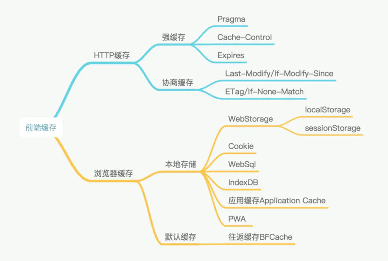
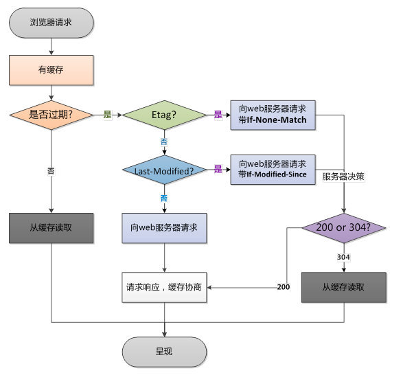
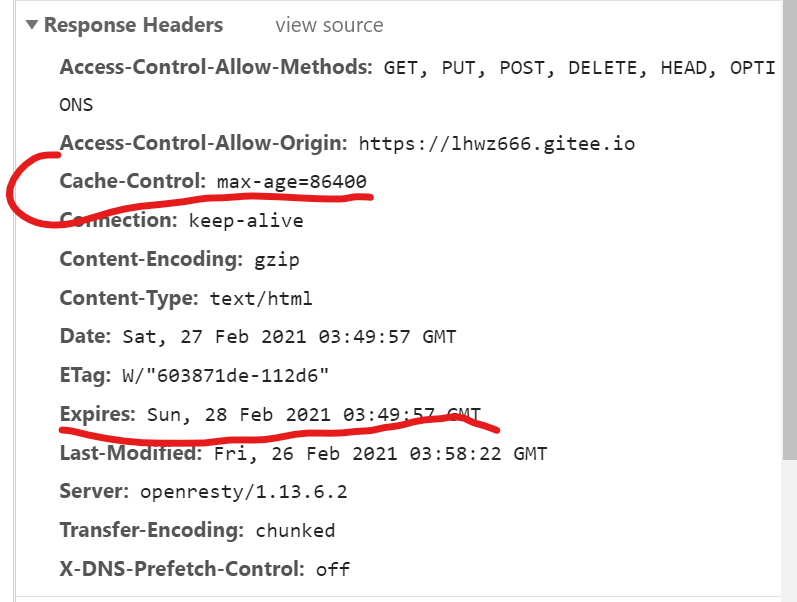
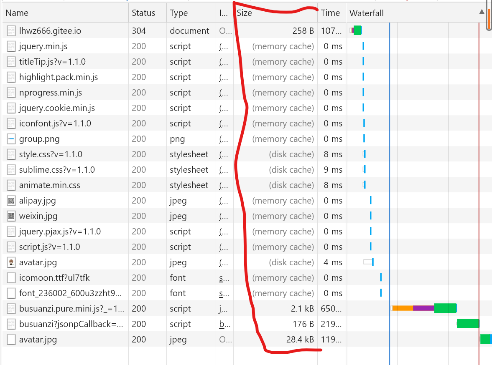

# 前端要用的缓存

## 1.缓存分类和其使用原因

前端缓存主要是分为`HTTP缓存`和`浏览器缓存`。其中 HTTP 缓存是在 HTTP 请求传输时用到的缓存，主要在服务器代码上设置；而浏览器缓存则主要由前端开发在前端 js 上进行设置。

​ 缓存可以说是性能优化中简单高效的一种优化方式了。一个优秀的缓存策略可以缩短网页请求资源的距离，减少延迟，并且由于缓存文件可以重复利用，还可以减少带宽，降低网络负荷。

​ 对于一个数据请求来说，可以分为发起网络请求、后端处理、浏览器响应三个步骤。浏览器缓存可以帮助我们在第一和第三步骤中优化性能。比如说直接使用缓存而不发起请求，或者发起了请求但后端存储的数据和前端一致，那么就没有必要再将数据回传回来，这样就减少了响应数据。

就好比你去吃饭，开始点饭【网络请求】，先看下有没有做好的，可以直接吃的【本地缓存】，如果没有做好的，和老板商量下啥好吃，让老板重新做新的【后端处理】，然后开始享受美食【浏览器响应】。



### 请求步骤



## 2.http 缓存的分类

### 概念：

1. 强缓存
2. 协商缓存

区别：当使用本地缓存的时候，是否需要去问下浏览器，这个缓存是不是不能用了。【就是去吃饭的时候，问下老板有没有现成的做好的，能直接开吃不】，

协商缓存：需要和服务器商量一下，最终能否使用本地缓存。【状态码 200 是最新的，304 没有更改】

强缓存：强缓存是直接向浏览器查找请求结果，并根据其保质期【expire 和 Cache-Control】来判断该资源是否可以使用。

## 3.强制缓存：本地缓存

情况 1：使用本地缓存，你首先需要本地有这个缓存啊，如果没有该缓存结果，那不行啊，巧妇难为无米之炊，直接向服务器要一个最新的。【本地无资源=》请求服务器】

情况 2：本地有缓存，但是缓存标识失效了【到保质期了，但是还想吃这个口味的】，于是乎带着这个缓存标识去问问服务器咋办【此处需要使用协商缓存了】？

情况 3：本地有缓存，且没有失效【哈哈，没得过期，直接开整】。使用本地的缓存。

### 强制缓存的缓存标识：【保质期】

当浏览器请求服务器的时候，服务器会在响应头里面将请求结果一起返回给服务器【你去买东西，肯定带有保质期和资源啊】。控制强制缓存的字段分别是 Expires 和 Cache-Control，其中 Cache-Control 优先级比 Expires 高。

### Expires:【到期日】【HTTP/1.0】

存储的是服务器返回的该请求的缓存结果的到期时间，如果你再次发起请求时候，客户端时间小于该 Expires 时间，直接使用缓存结果。【一个老的判断过期的方法，是否可以手动修改客户端时间，一直使该资源不过期呢？或者存在时差呢？】

### Cache-Control：【保质时间】【HTTP/1.1】

Cache-Control 缓存解决了上面 Expires 使用客户端时间去校验是否过期的问题。

Cache-Control 的取值

```
public：所有内容都将被缓存（客户端和代理服务器都可缓存）

private：所有内容只有客户端可以缓存，Cache-Control的默认取值

no-cache：客户端缓存内容，但是是否使用缓存则需要经过协商缓存来验证决定

no-store：所有内容都不会被缓存，即不使用强制缓存，也不使用协商缓存

max-age=xxx (xxx is numeric)：缓存内容将在xxx秒后失效
```



### 浏览器的本地缓存的存放位置



分为内存缓存【memory cache】和硬盘缓存【disk cache】，浏览器读取顺序肯定先使用快的啊，内存缓存优先，然后是硬盘缓存，最后是服务器请求。

浏览器会在 js 和图片等文件解析执行后直接存入内存缓存中，那么当刷新页面时只需直接从内存缓存中读取(from memory cache)；而 css 文件则会存入硬盘文件中，所以每次渲染页面都需要从硬盘读取缓存(from disk cache)。

## 4.协商缓存

协商缓存时强制缓存【保质期到期了】失效后，浏览器携带缓存标识【目的是问问客服还能吃不？】向服务器发起请求

情况 1：客服`看了一眼缓存标识`说 没关系的 还是能吃的，又给了你一个新的保质期标签【换换标签而已，但是内容没有变】，状态码为 304

情况 2 ：客服`看了一眼缓存标识`说 过期了 不能使用了，给您来份新的，【直接以旧换新，获取全新内容和全新保质期标签】，返回 200 带上最新的产品。

那么要讲讲客服怎么看的缓存标识了。

### 协商缓存的缓存标识

同样，协商缓存的标识也是在响应报文的 HTTP 头中和请求结果一起返回给浏览器的，控制协商缓存的字段分别有：Last-Modified / If-Modified-Since 和 Etag / If-None-Match，其中 Etag / If-None-Match 的优先级比 Last-Modified / If-Modified-Since 高。

### Etag:服务器响应时返回的当前资源文件的唯一标识

`If-None-Match`客户端再次发送请求时，会带上上次请求返回的 Etag 这个唯一标识，服务器会根据这个 Etag 的唯一标识来判断是否改变，如果没有改变就返回 304，继续使用缓存文件，如果改变了就返回 200 和新的资源文件

### Last-Modified:上次请求返回的最后被更改时间

If-Modified-Since 会携带上次请求返回的 Last-Modified 的值，来告诉服务器，上次请求修改的最后被更改时间，服务器做对比，服务器的资源最后被修改时间大于 If-Modified-Since 的字段，则重新返回最新资源，状态码 200，否则还是 304.

参考文章链接：https://www.jianshu.com/p/256d0873c398

参考文章链接：https://segmentfault.com/a/1190000020786519
