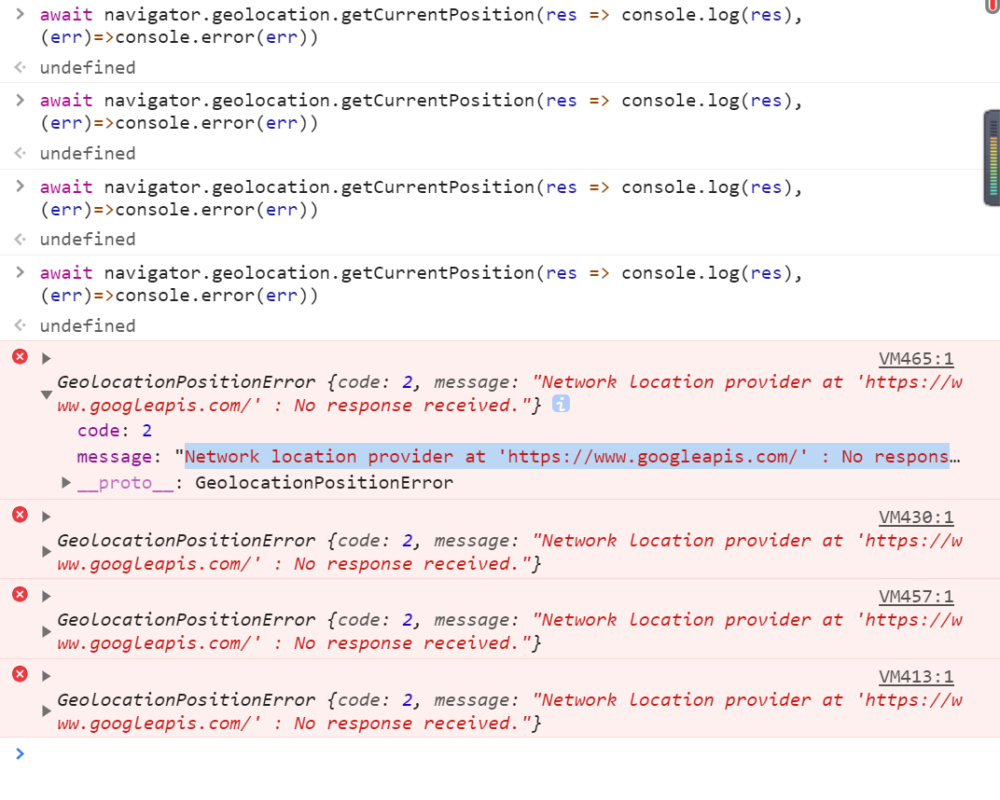
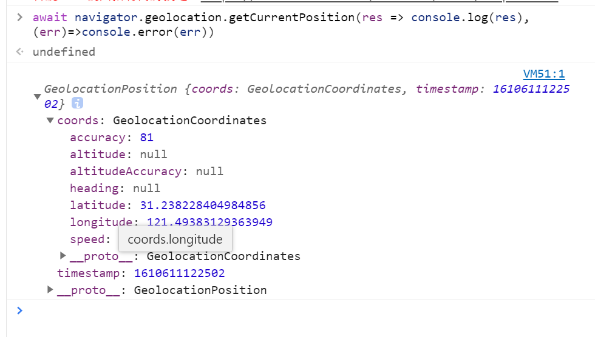

# 需求：获取用户当前的地理详细信息

## 1.使用 H5 的 api。

W3C 中的此 API 说明：https://w3c.github.io/geolocation-api/

找一个 https【https://www.baidu.com/】协议的网站【测试的不用https，直接浏览器打开本地HTML也是可以的】，然后打开控制台，输入下面命令，就可以直接查看能否使用这个API。【需要允许授权，等该GPS返回数据】

```js
await navigator.geolocation.getCurrentPosition(
  (res) => console.log(res),
  (err) => console.error(err)
);
```

API 的原理：https://segmentfault.com/q/1010000004246400?utm_source=sf-similar-question

### 谷歌浏览器下：

此方法会调用谷歌 API 的服务，国内的话，还是会报错的。



### 微软的 Edge:调用成功



## 2.借用第三方地图的 api

### 高德的：

高德地图的定位 api,分为两种，默认的话是使用 ip 进行精确定位，如果 IP 定位失败则使用 H5API 定位，如果用户使用了更改 ip 的软件会定位失败。第二种是优先使用 H5API 定位【也就是 GPS，需要获取用户授权，但是谷歌浏览器存在问题，】无法获取经纬度，然后再使用 IP 定位。

总的来说：使用 IP 定位的会因为使用代理软件而错误。使用 GPS 定位的目前发现谷歌浏览器会获取定位失败。

```js
<!DOCTYPE html>
<html lang="en">
  <head>
    <title>GET VIDEO</title>
    <meta charset="utf-8" />
  </head>
  <body>
    <div id="container"></div>
    <script
      type="text/javascript"
      src="https://webapi.amap.com/maps?v=1.4.15&key=your_key"
    ></script>
    <script>
      mapObj = new AMap.Map("iCenter");
      mapObj.plugin("AMap.Geolocation", function () {
        geolocation = new AMap.Geolocation({
          enableHighAccuracy: true, //是否使用高精度定位，默认:true
          timeout: 10000, //超过10秒后停止定位，默认：无穷大
          maximumAge: 0, //定位结果缓存0毫秒，默认：0
          convert: true, //自动偏移坐标，偏移后的坐标为高德坐标，默认：true
          showButton: true, //显示定位按钮，默认：true
          buttonPosition: "LB", //定位按钮停靠位置，默认：'LB'，左下角
          buttonOffset: new AMap.Pixel(10, 20), //定位按钮与设置的停靠位置的偏移量，默认：Pixel(10, 20)
          showMarker: true, //定位成功后在定位到的位置显示点标记，默认：true
          showCircle: true, //定位成功后用圆圈表示定位精度范围，默认：true
          panToLocation: true, //定位成功后将定位到的位置作为地图中心点，默认：true
          zoomToAccuracy: true, //定位成功后调整地图视野范围使定位位置及精度范围视野内可见，默认：false
          GeoLocationFirst: true, // 默认为false，设置为true的时候可以调整PC端为优先使用浏览器定位，失败后使用IP定位
        });
        mapObj.addControl(geolocation);
        geolocation.getCurrentPosition();
        AMap.event.addListener(geolocation, "complete", onComplete); //返回定位信息
        AMap.event.addListener(geolocation, "error", onError); //返回定位出错信息
        function onComplete(data) {
          console.log(data);
        }
      });
    </script>
  </body>
</html>

```

使用哪种定位方式的参数:`GeoLocationFirst`

高德地图 API：https://lbs.amap.com/api/javascript-api/reference/location#m_AMap.Geolocation

### 谷歌地图的：

官方 API:https://developers.google.cn/maps/documentation/javascript/examples/map-geolocation

相关使用文档：https://segmentfault.com/a/1190000006173834
