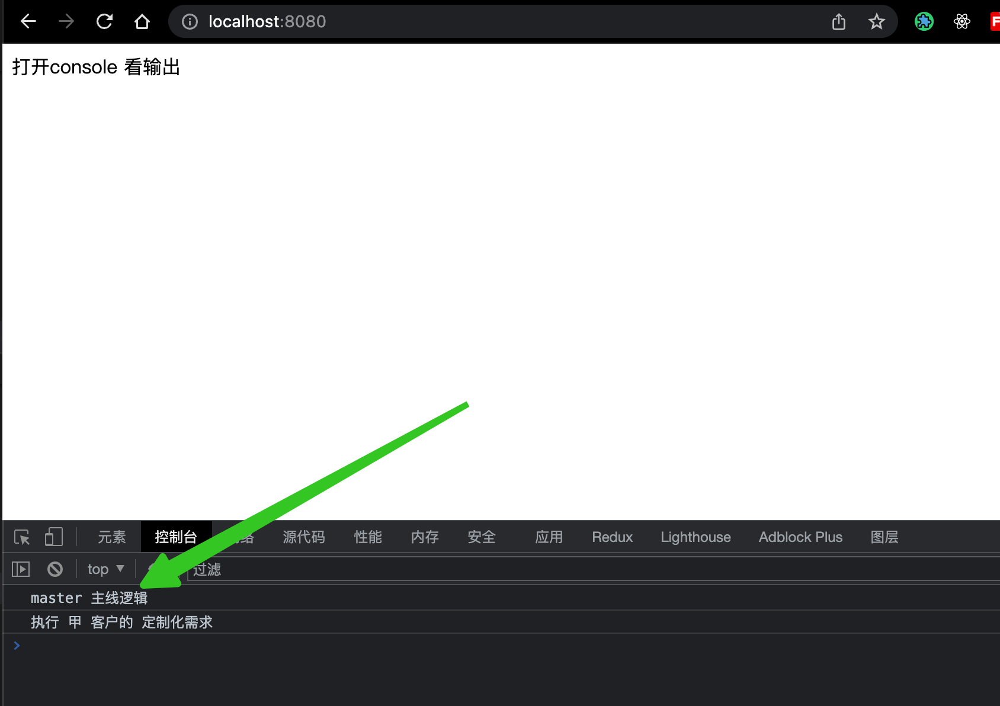

## 如何一套前端代码满足多个客户的定制化需求

当小伙伴们看到标题的时候，是不是脑袋中已经冒出了 N 个解决方案了呢？

在实际的业务场景中，随着公司的 ToB 业务做的风生水起，标准化的方案开始难以满足日益增长的客户需求了，慢慢的 部分客户 因为业务场景不同 都开始搞起了定制化需求。

### 业务场景——不服务于业务的代码都是耍流氓

假设有 **三** 位客户，为了便于区分，就叫**甲，乙，丙**吧，突然有一天客户经理收到 **甲客户** 的诉求说 产品的主线上的这块业务逻辑 和 他们公司的实际情况 有些出入，需要进行定制化处理。在你收到反馈以后，发现业务改动不是很多，并且改动量不是很大，当下就 基于 **master** 切了一个 **feature-jia-baba** 分支，10 分钟代码改完提交测试。测试通过，给客户甲 安排了 上线，随后 收到客户甲的 表扬信，夸赞你效率高。

过了两天，**客户乙** 提了 一个新的需求，经过讨论对接开始进行迭代开发，开发完毕以后 **合入 master** 安排 上线。过了两天 客户甲 也想要 主线上的 这个功能，脑壳一想，此时有两种解决方案：1. Cherry-pick 之前的 功能提交 2. **feature-jia-baba** 分支拉取一下最新的 master。

又过了两天，**客户丙** 说 之前给客户甲上线的功能 我也要，并且我这边还要增加需求，老办法 基于 **feature-jia-baba** 分支 拉了一个 **feature-jia-bing-baba** 分支,吭哧吭哧一顿提交。又满足了**客户丙**的需求。

（上面的都是基于 git 分支模型，建立的为了满足不同客户需求分支管理模型）

当你在主线 master 进行开发的时候，迭代了 N 个需求，每次 给客户甲上线的时候都要 **feature-jia-baba** 分支 和 **master 分支**合入一次，再发包给甲客户。给丙上线的时候 也是 要 **feature-jia-bing-baba** 分支 和 **master 分支** 合入一次，发包给丙客户。某天来了新同事，忘记了上面的规范，直接把 **master 分支**的包 都给了 三位客户，第二天新同事 因为右脚踏入公司门被毕业。

### 有没有更好的，更细致的解决方案呢？

1. git 分支模型：基于客户的需求 进行分支管理，后期客户体量大，定制需求增多的时候，你就开始后悔了。
   - 优点：简单粗暴，立即见效，
   - 缺点：不长远，不是最好的解决方案，只是解决了当下，应归属于 临时解决方案，随着客户体量的增加会导致日常工作在处理分支合并和维护上花费较多时间，造成身心和心理上的疲惫。
2. 因为是前端代码，所以可以在运行时，对 全局对象 window 增加某个客户的专属标识，进而通过环境判断去执行特定的代码。
3. 通过打包工具（如 webpack） 在编译时 就进行 区分打包，使得最后生成的 dist 目录 仅仅是 某位客户的代码。

目前我只想到了以上的 3 种方法，对于具体的业务场景 可以选择其中的 一种 或者 两种方法结合使用。

Git 分支管理模型，没有什么代码层面的知识，只需要操作 git 命令，就可以实现，此处就不细讲了。接下来主要讲剩余两种解决方案。

### 1. 运行时 通过客户标识进行 区分

相关的技术点：**前端三大件 + Nginx + docker**

demo 走起：

#### 1.首先新建 index.html 文件，按照顺序 引入 **user-symbol.js**（客户标识）和 **index.js**（业务逻辑代码）

```html
<!DOCTYPE html>
<html lang="en">
  <head>
    <meta charset="UTF-8" />
    <meta http-equiv="X-UA-Compatible" content="IE=edge" />
    <meta name="viewport" content="width=device-width, initial-scale=1.0" />
    <title>客户标识</title>
  </head>
  <body>
    <div>打开console 看输出</div>
    <script src="./user-symbol.js" defer></script>
    <script src="./index.js" defer></script>
  </body>
</html>
```

两个 js 文件较为简单，大致贴图一下（文末有 GitHub 地址）


#### 2. 使用 docker 通过 Nginx 镜像 部署前端服务

```shell
# 构建docker 镜像
docker build -t user-symbol -f Dockerfile ../window-user-symbol
# -p：当前机器的8080端口和镜像80 端口绑定，使用8080端口
# -v：映射 当前文件夹下的/env/user-symbol.js 到/usr/share/nginx/html/user-symbol.js
# --name：指定生成的镜像名
# -d：指定使用的基础镜像
docker run -itd -p 8080:80 -v ${PWD}/env/user-symbol.js:/usr/share/nginx/html/user-symbol.js --name user-test-2 -d user-symbol
```

其中核心的是 docker -v 的命令。可参考 https://zhuanlan.zhihu.com/p/423028401，简单来说就是你在改变宿主机的 user-symbol.js 文件，同时运行中的 docker 镜像里的该文件也会改变，可以 理解为 vue 里的双向绑定。

运行完以后 出现此界面就属于成功了。


#### 3.访问 8080 端口

默认的挂载的 user-symbol.js 的数据如下：

```js
window.env = {
  userAgent: "jia",
};
```

所以执行的是 客户甲 相关的 定制化需求



然后修改 user-symbol.js，修改后的结果如下：

```js
window.env = {
  userAgent: "yi",
};
```

刷新界面以后可以看到如下结果：


**总结：**通过 docker 的 挂载 功能 和 window 对象上 挂载唯一标识，可以实现，不修改现有业务代码和部署镜像的情况下，实现动态控制定制化用户的需求，并且因为是 js 文件，所以可以在 js 里面做的事情就会增多，自由度灵活性较高。

温馨提示：在生产情况下 一般会 要求 此种类型的 配置型 js 优先加载，除了放在 index.html 中 之外，还可以使用 loadjs 在 js 中进行控制 [github.com](https://github.com/muicss/loadjs)。

比如在 react 项目中，要求先加载 config 配置文件，然后才开始 执行 react 主流程相关逻辑，伪代码如下：

```react
import { useState } from 'react';
import loadjs from 'loadjs';
import { isProd } from './utils';

const REMOTE_CONFIG_URL = isProd ? '/static/config.js' : '/config.js';

const App = () => {
  const [loadedJs, setLoadedJs] = useState(false);
  // 保证配置文件成功引入 才会渲染主流程逻辑
  if (!loadjs.isDefined('config')) {
    loadjs([REMOTE_CONFIG_URL], 'config', function () {
      setLoadedJs(true);
    });
  }
  if (!loadedJs) {
    return null;
  }
  return <div>主逻辑开始</div>;
};
export default App;

```

### 2.编译时 结合打包工具 干掉多余的代码

本次使用的打包工具是 webpack，其他打包工具实现原理类似。

#### 1. 举一（最常见的案例）

那首先想到的就是 webpack 中常用的环境变量的区分，webpack 配置文件中配置 mode 指定当前的运行环境 ，然后就可以使用 `process.env.NODE_ENV` （会被默认注入）去获取当前的运行环境，`process.env.NODE_ENV` 本质上就是通过 `DefinePlugin`这个插件 注入的。详情可以参考 [模式(Mode) | webpack 中文文档 (docschina.org)](https://webpack.docschina.org/configuration/mode/#usage)，另外，千万注意的是 这里的 process 并不是 node 中的 process，好多教程都将 node 中的 process 对象和 webpack 中 process 进行**混淆**了。webpack 中关于此处的相关源代码截图如下：


简单测试一下以上内容的正确性，先假设：webpack 中的 process 和 node 中 process 是相同的。

1. ##### 通过 npm 脚本进行传参，新增 npm 脚本如下：

```json
"build:aa": "webpack --env user=aa",
```

2. ##### 简单的在 `webpack.config.js` 中新增如下内容：

```js
// 0.初始的webpack 对象
console.log("init webpack config", env, process.env);
const { user, mode = "development" } = env;
// 1.将 user 绑定到 node 环境的 process 对象上
process.env.user = user;
// 2. 验证是否绑定成功
console.log("current user", process.env.user);
```

执行结果如下：


3. ##### 既然在 node 的 process.env 上绑定成功了，那就放心大胆用它吧（😄，开玩笑哈）

Index.js 文件内容如下：

```js
const addText = (text) => {
  const div = document.createElement("div");
  div.innerHTML = text;
  document.body.appendChild(div);
};

const getProcessText = () => {
  if (process.env.NODE_ENV === "production") {
    return "生产环境的代码";
  } else {
    return "开发环境的代码";
  }
};

addText(getProcessText());

const getUserText = () => {
  if (process.env.user === "aa") {
    return "运行客户aa 的代码";
  } else {
    return "运行通用代码";
  }
};

addText(getUserText());
```

4. ##### 把打包出来的 dist 文件 放入 html 并 启动 服务查看一下控制台的输出：

从运行结果中可以得出如下结论：

- webpack 中的 `process.env.NODE_ENV`会被直接替换为 真实的 常量，见 第 8 行的 if 判断代码（源代码是：`if (process.env.NODE_ENV === 'production')`）
- node 中的 process 和 webpack 中的 process 不是一个。见控制台报错的输出，浏览器根本不知道 这个 process 是个啥（未定义）。


#### 2. 反三（类推扩展）

既然 webpack 本质上 使用了 `DefinePlugin`这个插件实现了运行时环境变量的注入，那我们岂不是可以注入一下当前的 客户 标识。

还是之前的 npm 脚本：

```
 "build:aa": "webpack --env user=aa",
```

新增 webpack 配置（附上完整版配置）：

```js
const path = require("path");
const HtmlWebpackPlugin = require("html-webpack-plugin");
const webpack = require("webpack");

// 使用cli 进行传参： https://webpack.docschina.org/api/cli/#environment-options
module.exports = (env) => {
  // 0.初始的webpack 对象
  console.log("init webpack config", env, process.env);
  const { user, mode = "development" } = env;
  // 1.将 user 绑定到 node 环境的 process 对象上
  process.env.user = user;
  // 2. 验证是否绑定成功
  console.log("current user", process.env.user);
  /**
   * 此写法可以使用 webpack 配置类型 的自动补全
   * @type {import("webpack").Configuration}
   */
  const config = {
    mode,
    entry: path.join(__dirname, "./index.js"),
    output: {
      path: path.join(__dirname, "dist"),
      filename: "bundle.js",
    },
    plugins: [
      new HtmlWebpackPlugin({
        template: path.join(__dirname, "./index.html"),
        filename: "index.html",
      }),
      // 增加 用户标识
      new webpack.DefinePlugin({
        "process.env.user": JSON.stringify(user),
      }),
    ],
  };
  return config;
};
```

再次打包输出，查看控制台：


结论：

优点：通过 `DefinePlugin` 确实把 相关配置 注入到了 webpack 的打包过程中，并且在编译构建的时候进行了替换。这样是可以实现在编译时 通过定义 多个不同的客户标识的 npm 脚本 进行解决 一套代码 适配多个客户的问题。

缺点：随着需求的增加，你会发现代码里 需要写多个 `process.env.user === 'aa'` ，`process.env.user === 'bb'` 和 `process.env.user === 'cc'`，尽快进行了封装提取，但是代码 的可读性 和 客户功能的区分度还是不够明显，并且 npm 脚本很可能变成如下配置：

```js
const getUserText = () => {
  // 假设客户的定制业务逻辑复杂，代码量上去了，可就不是这么易读了
  if (process.env.user === "aa") {
    return "运行客户aa 的代码";
  } else if (process.env.user === "bb") {
    return "运行客户bb 的代码";
  } else if (process.env.user === "cc") {
    return "运行客户cc 的代码";
  } else {
    return "运行通用代码";
  }
};
```

```json
  "scripts": {
    "build:aa": "webpack --env user=aa",
    "build:bb": "webpack --env user=bb",
    "build:cc": "webpack --env user=cc"
  },
```

#### 3. 学习 Taro 框架的思想，通过文件后缀进行客户环境的区分

我根据 taro 框架中，不同文件后缀代表不同端的思路，开发了一款插件，npm 地址：[@fu1996/webapck-resolver-mode-plugin - npm (npmjs.com)](https://www.npmjs.com/package/@fu1996/webapck-resolver-mode-plugin)。

接下来简单介绍一下使用流程。

首先安装一下插件：

```bash
# 为当前项目安装
npm i -D @fu1996/webapck-resolver-mode-plugin
```

然后再 webpack 中进行使用，修改`webpack.config.js`，注意是在`resolve`中添加该插件：

```js
// 引入该插件
const WebpackResolverModePlugin = require('@fu1996/webapck-resolver-mode-plugin');

// resolve 中追加
resolve: {
            plugins: [
              new WebpackResolverModePlugin({
                exclude: /node_modules/, // 排除的目录
                includeFileSuffix: [".js", ".jsx"], // 参与条件渲染的文件后缀
                mode: user, // 目标 模式：根据此模式 自动打包
              })
            ],
        },
```

此处的 mode 会根据上面的 用户 标识 进行适配，比如 user 是 aa，当前引用的文件是`xxx`，那么就会`优先寻找 xxx.aa.js` 结尾的文件，如果找不到就去`寻找 xxx.js`的文件 进行使用。

对现有代码进行更改：

首先将：`getUserText`方法中的客户代码抽离到不同文件后缀的文件中（序号 1），然后将其引入（序号 2），然后修改使用逻辑（序号 3）


如果运行 `npm run build:aa`。打出来的包就 会优先寻找以 `aa.js`结尾的文件，并打入生产 js 中。

结论：

优点：业务代码和文件后缀进行绑定，比较显而易见，并且后期易维护。

缺点：会产生大量的以客户结尾的文件，需要新安装一个插件。

### 3. 总结

|                                             | 运行时/编译时 | 业务场景                                                                   | 代码侵入级别         |
| ------------------------------------------- | ------------- | -------------------------------------------------------------------------- | -------------------- |
| docker -v 动态替换 js 配置文件              | 运行时        | 充当前端环境变量，前端动态配置下拉选，客户标识区分                         | 业务场景多，不易区分 |
| 通过 DefinePlugin 插件 配置                 | 编译时        | —— 见官网：[webpack](https://webpack.docschina.org/plugins/define-plugin/) | 代码侵入性高         |
| 通过 `webapck-resolver-mode-plugin`插件配置 | 编译时        | 区分多版本，多客户场景                                                     | 属于文件级别进行区分 |

方法之间不是互斥的，一个项目里可以使用多个方法去满足复杂的业务开发场景，毕竟只有适合当前业务场景的方法才是最好的方法。

文章相关的 Github 地址：[fu1996/for-business-user (github.com)](https://github.com/fu1996/for-business-user)

大家如果有什么其它好的建议和想法，欢迎评论留言，一起学习，共同进步。
