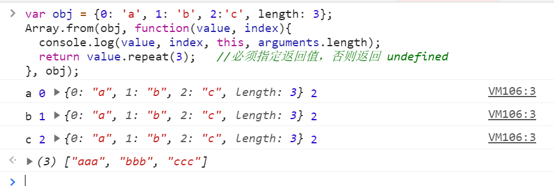

# 深入数组的各个 API

## 1.带着问题去学习

- 数组的构造器有哪几种？
- 哪些是改变自身的方法？
- 哪些不是改变自身的方法？
- 遍历的方法有哪些？

## 2.数组的构造器

### 使用构造器 Array 和字面量 []

为了创建一个长度不为 0，但是又没有任何元素的数组，可选以下任何一种方式：

```js
var arr = new Array(arrayLength); // 方法一

var arr = Array(arrayLength); // 方法二

// 这样有同样的效果 方法三
var arr = [];
arr.length = arrayLength;

// demo
var arr = [42]; // 创建一个只有唯一元素的数组:
// the number 42.
var arr = Array(42); // 创建一个没有元素的数组,
// 但是数组的长度被设置成42.

// 上面的代码与下面的代码等价
var arr = [];
arr.length = 42;
```

**注意:** 以上代码，数组长度（arrayLength）必须为一个数字（Number）。否则，将会创建一个只有单个（所输入的）元素的数组。 调用 `arr.length` 会返回数组长度，但是数组实际上包含了空的（`undefined`）元素。 因此在数组上使用 `for...in` 循环，将不会返回任何的值 。

### 使用 ES6 新增的构造方法：Array.of 和 Array.from

**Array.of**

Array.of 几乎和 Array 的构造器功能一直，唯一区别在单个数字参数的处理上

当参数为 1 个时候，Array.of 是把参数变为数组的一项，而 Array 是生成长度和参数相同的数组

```js
Array.of(8.0); // [8]
Array(8.0); // [empty × 8]
Array.of(8.0, 5); // [8, 5]
Array(8.0, 5); // [8, 5]
Array.of("8"); // ["8"]
Array("8"); // ["8"]
```

**Array.from**

看名字就可以知道，目的是为了基于其他对象来创建一个新数组。【是返回新的数组，不改变原对象】，只要一个对象有迭代器，Array.from 就会把它变为一个数组。

此函数接受 3 个参数

1. 类似数组的对象，必选
2. 加工函数，新生成的数组会经过该函数的加工再返回
3. this 作用域，表示加工函数执行时 this 的值

```js
var obj = { 0: "a", 1: "b", 2: "c", length: 3 };
Array.from(
  obj,
  function (value, index) {
    console.log(value, index, this, arguments.length);
    return value.repeat(3); //必须指定返回值，否则返回 undefined
  },
  obj
);
```



拥有迭代器的对象还包括 String、Set、Map 等，Array.from 统统可以处理

```js
// String
Array.from("abc"); // ["a", "b", "c"]
// Set
Array.from(new Set(["abc", "def"])); // ["abc", "def"]
// Map
Array.from(
  new Map([
    [1, "ab"],
    [2, "de"],
  ])
);
// [[1, 'ab'], [2, 'de']]
```

### Array 的判断

```
var a = [];
// 1.基于instanceof
a instanceof Array;
// 2.基于constructor
a.constructor === Array;
// 3.基于Object.prototype.isPrototypeOf
Array.prototype.isPrototypeOf(a);
// 4.基于getPrototypeOf
Object.getPrototypeOf(a) === Array.prototype;
// 5.基于Object.prototype.toString
Object.prototype.toString.apply(a) === '[object Array]';
```

ES6 之后新增了一个 Array.isArray 方法，能直接判断数据类型是否为数组。

```js
if (!Array.isArray) {
  Array.isArray = function (arg) {
    return Object.prototype.toString.call(arg) === "[object Array]";
  };
}
```

## 3.改变自身的方法

基于 ES6，会改变自身值的方法一共有 9 个，分别为 pop、push、reverse、shift、sort、splice、unshift，以及两个 ES6 新增的方法 copyWithin 和 fill。

```js
// pop方法
var array = ["cat", "dog", "cow", "chicken", "mouse"];
var item = array.pop();
console.log(array); // ["cat", "dog", "cow", "chicken"]
console.log(item); // mouse
// push方法
var array = ["football", "basketball", "badminton"];
var i = array.push("golfball");
console.log(array);
// ["football", "basketball", "badminton", "golfball"]
console.log(i); // 4
// reverse方法
var array = [1, 2, 3, 4, 5];
var array2 = array.reverse();
console.log(array); // [5,4,3,2,1]
console.log(array2 === array); // true
// shift方法
var array = [1, 2, 3, 4, 5];
var item = array.shift();
console.log(array); // [2,3,4,5]
console.log(item); // 1
// unshift方法
var array = ["red", "green", "blue"];
var length = array.unshift("yellow");
console.log(array); // ["yellow", "red", "green", "blue"]
console.log(length); // 4
// sort方法
var array = ["apple", "Boy", "Cat", "dog"];
var array2 = array.sort();
console.log(array); // ["Boy", "Cat", "apple", "dog"]
console.log(array2 == array); // true
// splice方法
var array = ["apple", "boy"];
var splices = array.splice(1, 1);
console.log(array); // ["apple"]
console.log(splices); // ["boy"]
// copyWithin方法
var array = [1, 2, 3, 4, 5];
var array2 = array.copyWithin(1, 3);
console.log(array === array2, array2); // true [4, 5, 3, 4, 5]
// fill方法
var array = [1, 2, 3, 4, 5];
var array2 = array.fill(10, 0, 3);
console.log(array === array2, array2);
// true [10, 10, 10, 4, 5], 可见数组区间[0,3]的元素全部替换为10
```

```js
arr.copyWithin(target[, start[, end]])

var array = [1,2,3,4,5];
var array2 = array.copyWithin(1,3); // 从索引为3的开始复制，直到最后，把赋值的值放在第1个位置上
// [1, 4, 5, 4, 5]

```

## 4.不改变自身的方法

基于 ES7，不会改变自身的方法也有 9 个，分别为 concat、join、slice、toString、toLocaleString、indexOf、lastIndexOf、未形成标准的 toSource，以及 ES7 新增的方法 includes。

```js
// concat方法
var array = [1, 2, 3];
var array2 = array.concat(4, [5, 6], [7, 8, 9]);
console.log(array2); // [1, 2, 3, 4, 5, 6, 7, 8, 9]
console.log(array); // [1, 2, 3], 可见原数组并未被修改
// join方法
var array = ["We", "are", "Chinese"];
console.log(array.join()); // "We,are,Chinese"
console.log(array.join("+")); // "We+are+Chinese"
// slice方法
var array = ["one", "two", "three", "four", "five"];
console.log(array.slice()); // ["one", "two", "three","four", "five"]
console.log(array.slice(2, 3)); // ["three"]
// toString方法
var array = ["Jan", "Feb", "Mar", "Apr"];
var str = array.toString();
console.log(str); // Jan,Feb,Mar,Apr
// tolocalString方法
var array = [{ name: "zz" }, 123, "abc", new Date()];
var str = array.toLocaleString();
console.log(str); // [object Object],123,abc,2016/1/5 下午1:06:23
// indexOf方法
var array = ["abc", "def", "ghi", "123"];
console.log(array.indexOf("def")); // 1
// includes方法
var array = [-0, 1, 2];
console.log(array.includes(+0)); // true
console.log(array.includes(1)); // true
var array = [NaN];
console.log(array.includes(NaN)); // true
```

## 5.数组遍历的方法

基于 ES6，不会改变自身的遍历方法一共有 12 个，分别为 forEach、every、some、filter、map、reduce、reduceRight，以及 ES6 新增的方法 entries、find、findIndex、keys、values。

```js
// forEach方法
var array = [1, 3, 5];
var obj = { name: "cc" };
var sReturn = array.forEach(function (value, index, array) {
  array[index] = value;
  console.log(this.name); // cc被打印了三次, this指向obj
}, obj);
console.log(array); // [1, 3, 5]
console.log(sReturn); // undefined, 可见返回值为undefined
// every方法
var o = { 0: 10, 1: 8, 2: 25, length: 3 };
var bool = Array.prototype.every.call(
  o,
  function (value, index, obj) {
    return value >= 8;
  },
  o
);
console.log(bool); // true
// some方法
var array = [18, 9, 10, 35, 80];
var isExist = array.some(function (value, index, array) {
  return value > 20;
});
console.log(isExist); // true
// map 方法
var array = [18, 9, 10, 35, 80];
array.map((item) => item + 1);
console.log(array); // [19, 10, 11, 36, 81]
// filter 方法
var array = [18, 9, 10, 35, 80];
var array2 = array.filter(function (value, index, array) {
  return value > 20;
});
console.log(array2); // [35, 80]
// reduce方法
var array = [1, 2, 3, 4];
var s = array.reduce(function (previousValue, value, index, array) {
  return previousValue * value;
}, 1);
console.log(s); // 24
// ES6写法更加简洁
array.reduce((p, v) => p * v); // 24
// reduceRight方法 (和reduce的区别就是从后往前累计)
var array = [1, 2, 3, 4];
array.reduceRight((p, v) => p * v); // 24
// entries方法
var array = ["a", "b", "c"];
var iterator = array.entries();
console.log(iterator.next().value); // [0, "a"]
console.log(iterator.next().value); // [1, "b"]
console.log(iterator.next().value); // [2, "c"]
console.log(iterator.next().value); // undefined, 迭代器处于数组末尾时, 再迭代就会返回undefined
// find & findIndex方法
var array = [1, 3, 5, 7, 8, 9, 10];
function f(value, index, array) {
  return value % 2 == 0; // 返回偶数
}
function f2(value, index, array) {
  return value > 20; // 返回大于20的数
}
console.log(array.find(f)); // 8
console.log(array.find(f2)); // undefined
console.log(array.findIndex(f)); // 4
console.log(array.findIndex(f2)); // -1
// keys方法
[...Array(10).keys()]; // [0, 1, 2, 3, 4, 5, 6, 7, 8, 9]
[...new Array(10).keys()]; // [0, 1, 2, 3, 4, 5, 6, 7, 8, 9]
// values方法
var array = ["abc", "xyz"];
var iterator = array.values();
console.log(iterator.next().value); //abc
console.log(iterator.next().value); //xyz
```


以上，数组的各方法基本讲解完毕，这些方法之间存在很多共性，如下：

所有插入元素的方法，比如 push、unshift 一律返回数组新的长度；

所有删除元素的方法，比如 pop、shift、splice 一律返回删除的元素，或者返回删除的多个元素组成的数组；

部分遍历方法，比如 forEach、every、some、filter、map、find、findIndex，它们都包含 function(value,index,array){} 和 thisArg 这样两个形参。
