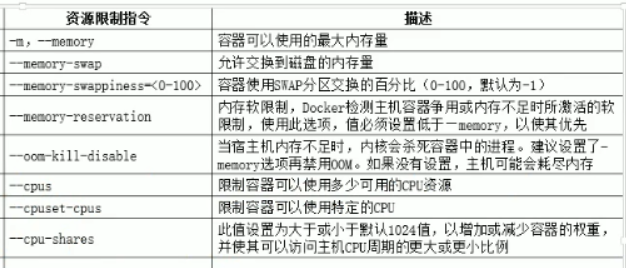
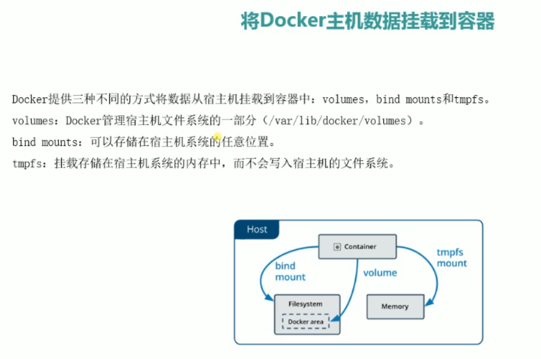
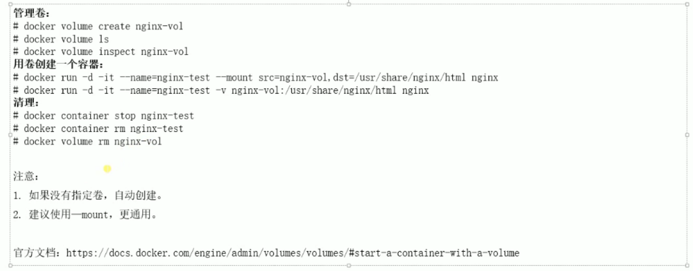

# 常用命令

## 启动重启命令

docker 启动命令,docker 重启命令,docker 关闭命令

```
启动        systemctl start docker
守护进程重启   sudo systemctl daemon-reload
重启docker服务   systemctl restart  docker
重启docker服务  sudo service docker restart
关闭docker service docker stop
关闭docker systemctl stop docker
```

## 进入一个容器

```
sudo docker exec -it [container_id] bash
```

## 与本机互传文件

首先需要确定 docker 容器的 container_id,可以使用 docker ps -a 查看你要操作的 docker 容器的 container_id
docker 容器向本机传送文件

```
docker cp container_id:docker容器内的文件全路径 本机保存文件的全路径
```

例如：docker cp 4a2f08d2c1f8:/data1/configure.txt E:\PHP\configure.txt
本机向 docker 容器传送文件

```
docker cp 本机保存文件的全路径 container_id:docker容器内的文件全路径
```

例如：docker cp E:\PHP\configure.txt 4a2f08d2c1f8:/data1/configure.txt

**安装 docker**

CentOS7 # 安装依赖包 yum install -y yum-utils device-mapper-persistent-data lvm2 # 添加 Docker 软件包源 yum-config-manager \ --add-repo \ https://download.docker.com/linux/centos/docker-ce.repo # 更新 yum 包索引 yum makecache fast # 安装 Docker CE yum install docker-ce # 启动 systemctl start docker # 测试 docker run hello-world docker version # 卸载 yum remove docker-ce rm -rf /var/lib/docker

Ubuntu14.06/16.04 # 安装证书 $ sudo apt-get install \ apt-transport-https \ ca-certificates \ curl \ software-properties-common # 添加 Docker 源的 KEY $ curl -fsSL https://download.docker.com/linux/ubuntu/gpg | sudo apt-key add - # 添加 Docker 软件包源 $ sudo add-apt-repository \ "deb [arch=amd64] https://download.docker.com/linux/ubuntu \ $(lsb_release -cs) \ stable" # 更新 apt 包索引 $ sudo apt-get update # 安装 Docker CE $ sudo apt-get install docker-ce # 测试 sudo docker run hello-world sudo docker version # 卸载 Docker CE $ sudo apt-get purge docker-ce $ sudo rm -rf /var/lib/docker

**linux**

自动配置 Docker 加速器（推荐）

_适用于 Ubuntu14.04、Debian、CentOS6 、CentOS7、Fedora、Arch Linux、openSUSE Leap 42.1_

[registry-mirro](https://link.jianshu.com/?t=https://www.daocloud.io/mirror#accelerator-doc)下·[r 配置命令](https://link.jianshu.com/?t=https://www.daocloud.io/mirror#accelerator-doc) 如下（注意修改为自己的地址）：

curl -sSL https://get.daocloud.io/daotools/set_mirror.sh | sh -s http://你的的地址.m.daocloud.io

**在配置完成后根据终端中的提示重启 docker 使配置生效。**

手动配置 Docker 加速器

Docker 版本在 1.8 - 1.11

找到 Docker 配置文件，不同的 Linux 发行版的配置路径不同，具体路径请参考 [Docker 官方文档](https://link.jianshu.com/?t=https://docs.docker.com/engine/admin/)

在配置文件中的 DOCKER_OPTS 加入

--registry-mirror=你的加速地址

重启 Docker（不同的 Linux 发行版的重启命令不一定相同）

service docker restart

https://www.daocloud.io/mirror



进入容器 id 为 xyz 的控制台

docker exec -it xyz sh

docker 镜像配置源文件：

/etc/docker/daemon.json


给镜像打标记

docker tag

导出和导入镜像


**创建容器常用命令：**

**docker container run [cmd]**


docker container run [cmd]

run 的参数：常用的 -itd

ctrl+ p + q 退出当前容器命令行但不结束容器

--cpus :后面参数是核数

--memory ：参数是内存大小 512m

而 swap ：而交换区的内存是--memory 的 2 倍 ，在内存不够时启用，比内存慢。

**管理容器常用的命令：**


进入 nginx03 伪终端


列出 bs1 的 root 目录，并拷贝 anaconda-ks.cfg 文件到这里


sudo pip3 install virtualenvwrapper -i http://pypi.douban.com/simple/ --trusted-host=pypi.douban.com/simple

其他书签

https://blog.csdn.net/Sun_White_Boy/article/details/81144924

https://blog.csdn.net/qq_37189082/article/details/97658103

https://www.cnblogs.com/ZhangRuoXu/p/6370107.html

https://zhuanlan.zhihu.com/p/137114974

https://blog.csdn.net/sirobot/article/details/106888683

## docker 批量删除

```bash
杀死所有正在运行的容器
docker kill $(docker ps -a -q)

删除所有已经停止的容器
docker rm $(docker ps -a -q)

删除所有未打 dangling 标签的镜像
docker rmi $(docker images -q -f dangling=true)

删除所有镜像
docker rmi $(docker images -q)

强制删除镜像名称中包含“doss-api”的镜像
docker rmi --force $(docker images | grep doss-api | awk '{print $3}')
```

## 管理应用程序数据——数据卷



**volume 数据卷**

使用本地映射到容器的数据卷，一百个容器可以使用相同的本事数据卷。实现数据共享。 和-v 差不多，但是-v 不通用。



**Bind Mounts 绑定挂载\*\***已经存在\***\*于宿主机的数据**


**实战：搭建 lnmp 网站平台实战**

**1.自定义网络**

```bash
docker network create lnmp
```

**2.创建 MySQL 数据库容器[需要授权 ip 登录]**

```bash
docker run -itd  --name lnmp_mysql  --net lnmp  -p 3306:3306  --mount src=mysql-vol,dst=/var/lib/mysql  -e MYSQL_ROOT_PASSWORD=123456  mysql:5.6 --character-set-server=utf8
```

**3.创建所需数据库**

```bash
docker run -itd \ --name lnmp_web \ --net lnmp \ -p 88:80 \ --mount type=bind,src=/app/wwroot.dst=/var/www/html richarvey/nginx-php-fpm
```
