# 工作常用的命令

## 1.初始化仓库 【创建一个.git 的隐藏目录】

```shell
git init
```

## 2.版本创建和回退

### 1.第一条提交记录

新建`code.txt` 文档并新增一行代码

```
this is the first line
```

提交改变的文件

```bash
git add code.txt
git commit -m '版本1'
```

### 2.查看提交记录`git log`

```bash
git log // 当前终端的操作记录
git reflog // 终端可关闭的记录
```

### 3.再新增一条

`code.txt`新增一行代码

```
this is the first line
this is second line
```

提交此条记录

```bash
git add code.txt
git commit -m '版本2'
```

### 4.版本的回退`git reset --hard [参数]`

#### 1.参数为 HEAD

```bash
git reset --hard HEAD^
```

HEAD 表示当前最新版本，HEAD^表示当前版本的前一个版本,HEAD^^表示当前版本的前前个版本，也可以使用 HEAD~1 表示当前版本的前一个版本,HEAD~100 表示当前版本的前 100 版本。

**回到版本 1**

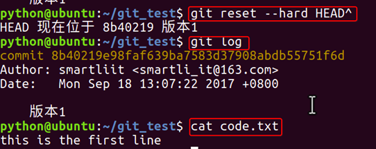

#### 2.参数为提交记录的版本号

使用`git reflog`查看我们的历史操作记录，`git reset --hard [版本hash]`可以跳回到指定的版本

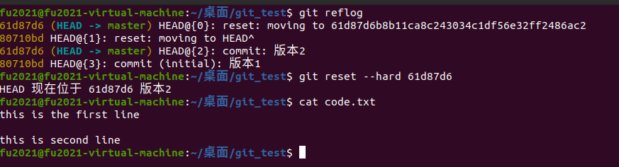

## 3.工作区和暂存区

### 1.工作区

当前工作的目录，比如`git_test`目录，就是一个工作区

### 2.版本库

`.git`这个目录是 git 的版本库，有名叫`stage`的**暂存区**，还有 git 自动创建的`master`分支，以及指向了 master 的指针 HEAD 。

因为 git 会为我们默认创建了一个 master 的分支，上述的版本 1 和版本 2 的提交记录都是再 master 分支上进行的。

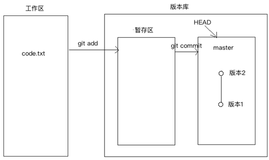

- ·`git add` 命令就是把更改的内容提交到暂存区，
- `git commit`命令才会把暂存区的内容，提交到当前分支上

新增`code2.txt`并添加如下内容

```bash
the code2 first line
```

修改`code.txt`的文件

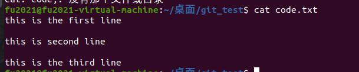

`git status`查看工作区的状态

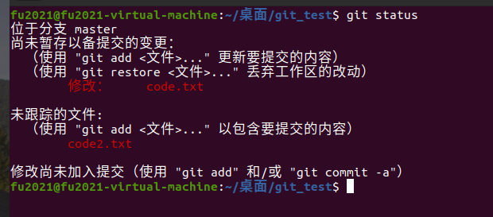

因为 code.txt 文件已经被添加过工作区，所以当前的是只有变更的，而新增的 code2.txt 没有被添加和提交过，所以没有被跟踪。

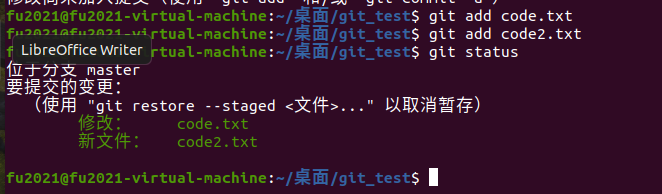

使用 git add 命令 把两次的更改都存进暂存区，使用 commit 进行提交到当前的分支。

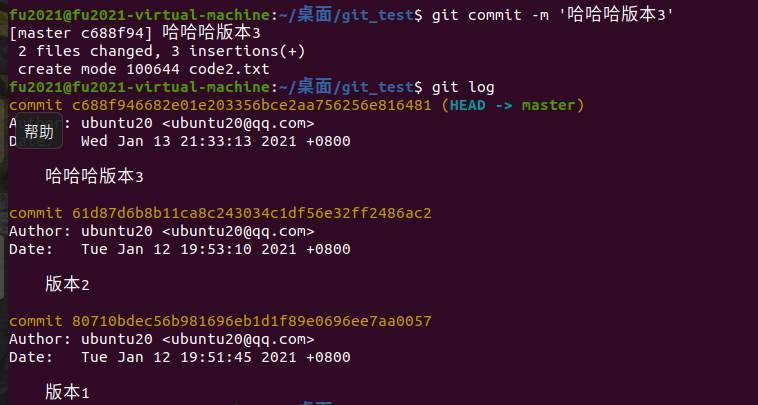

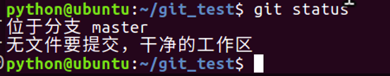

### 3.管理修改

git commit : **只会把通过 git add 命令添加进暂存区的内容给提交到当前版本中**

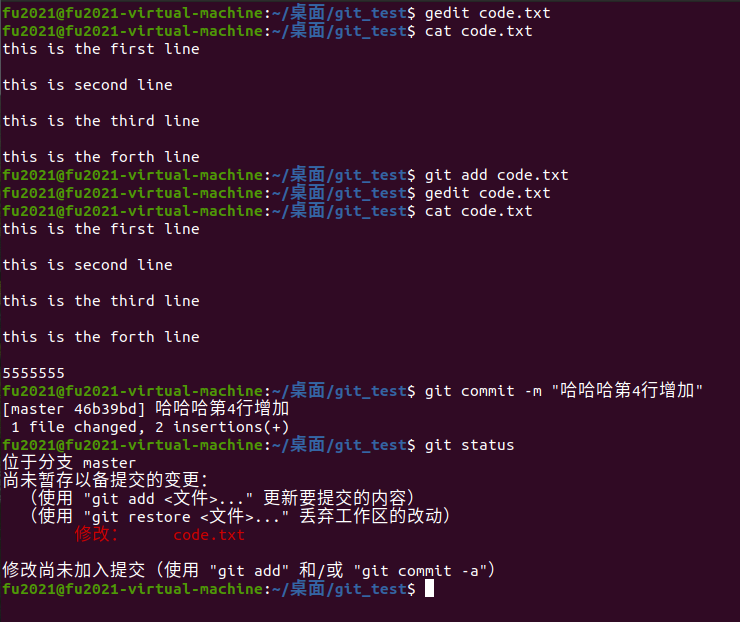

可以看到最新增加的`555555`内容因为被 git add 进暂存区，所以没有被 git commit 到当前版本，工作区依然存在这个`55555`的改动。

### 4.放弃【撤销】当前的修改【未执行 git add 操作的】

```bash
git checkout -- [文件名]
```

继续上次的操作，当前的 code.txt 中的文本包含此次工作区增加的`5555`,然后取消此次的更改

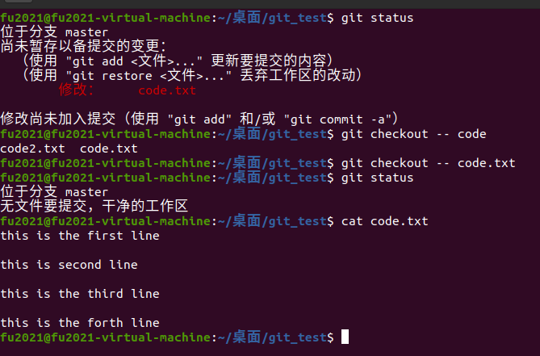

可以看到执行命令后，工作区干净了，此次的内容也被还原了更改前的状态。

### 5.放弃当前暂存区的更改【执行了 git add 操作的】

```bash
git reset HEAD [文件名]
// 或者
git restore --staged [文件名]
```

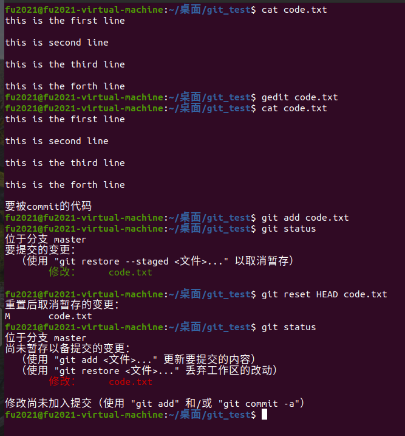

修改 code.txt 的代码，然后提交到暂存区，git status 的状态 变为 ：`要提交的变更`,然后执行 git reset 命令 撤销此次 git add 操作，git status 重新变为 工作区修改了 code.txt 文件

使用`git restore`命令

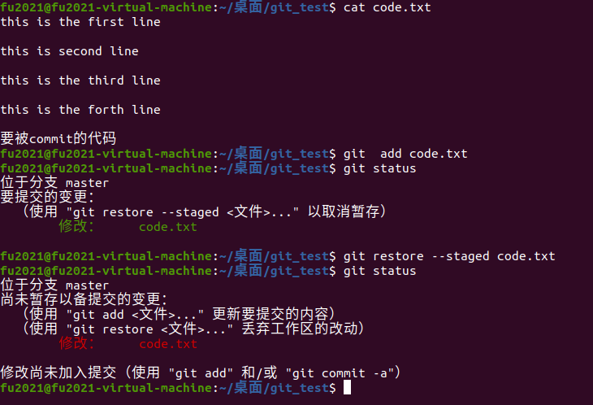

### **6.应用场景**

场景 1：当你改乱了工作区某个文件的内容，想直接丢弃工作区的修改时，用命令 git checkout -- file。

场景 2：当你不但改乱了工作区某个文件的内容，还添加到了暂存区时，想丢弃修改，分两步，第一步用命令 git reset HEAD file，就回到了场景 1，第二步按场景 1 操作。

场景 3：已经提交了不合适 的修改到版本库时，想要撤销本次提交，使用版本回退。
