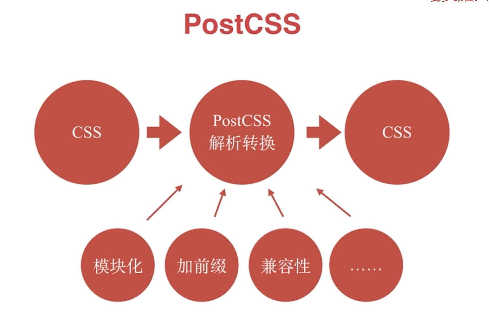
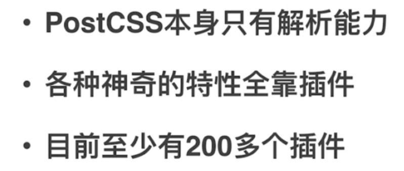
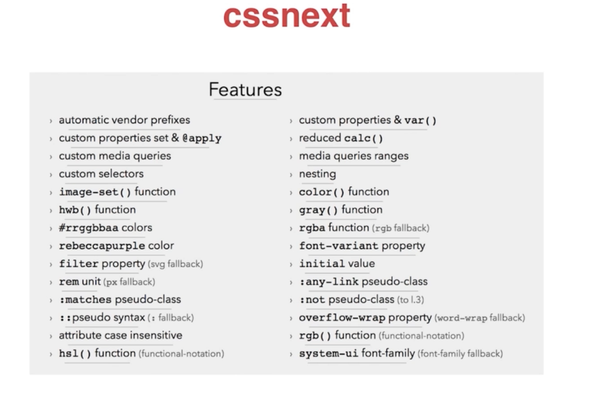
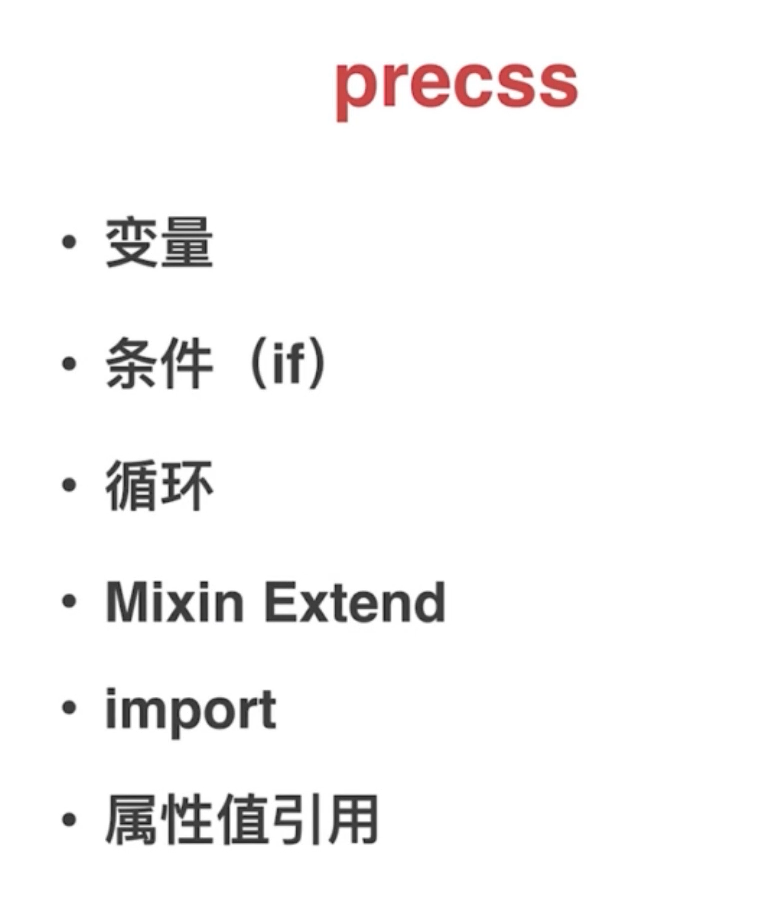
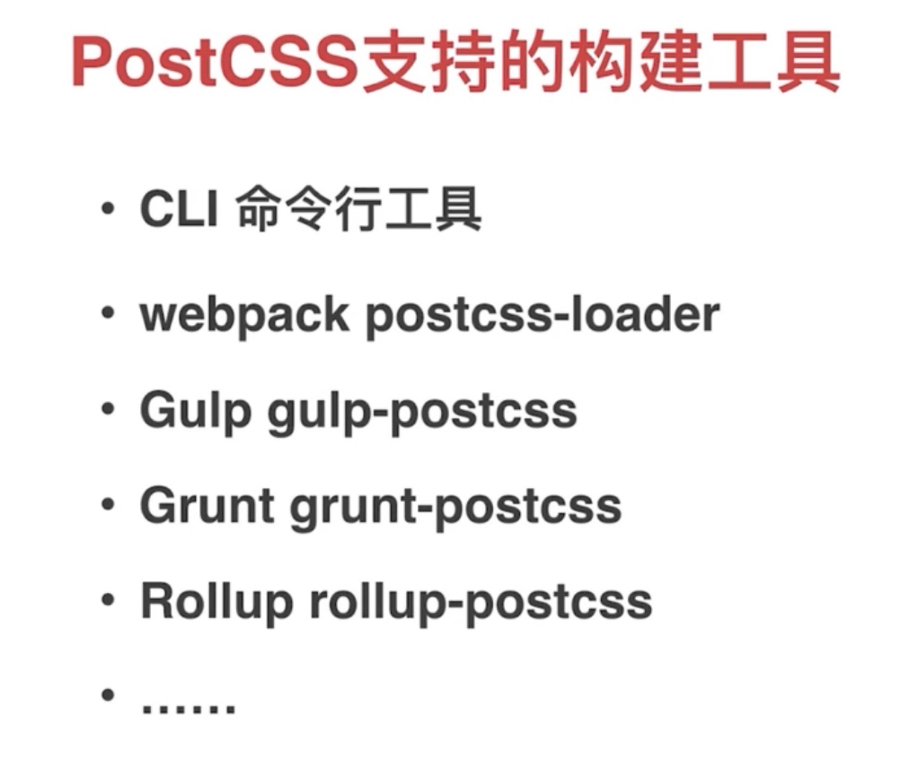
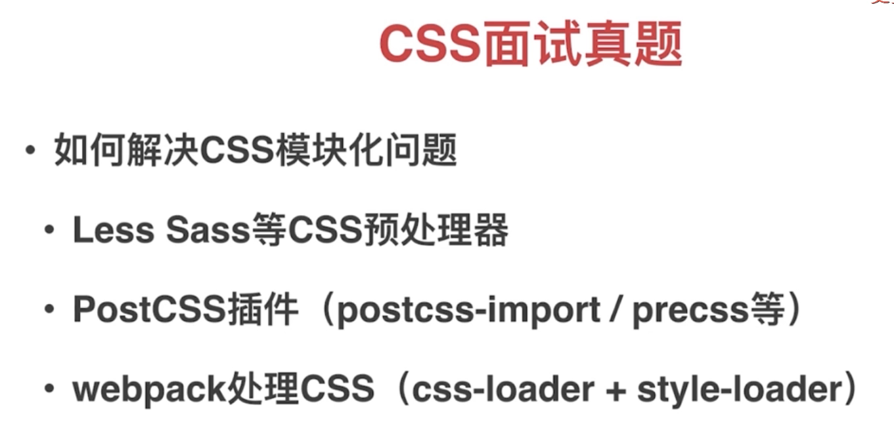
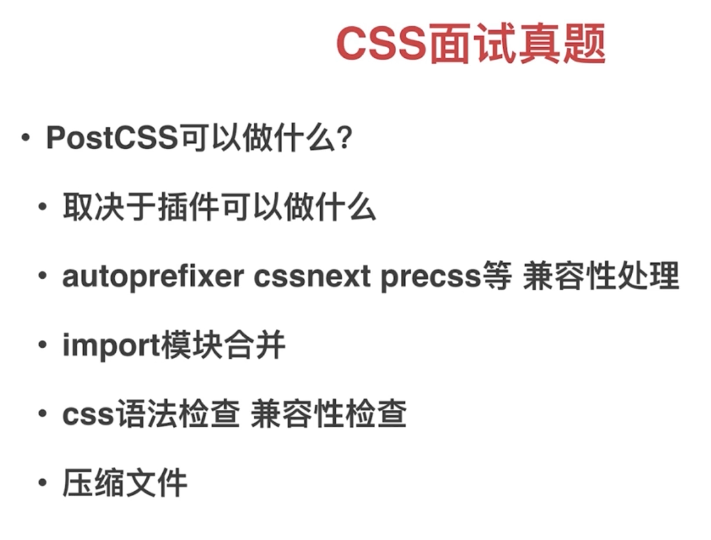
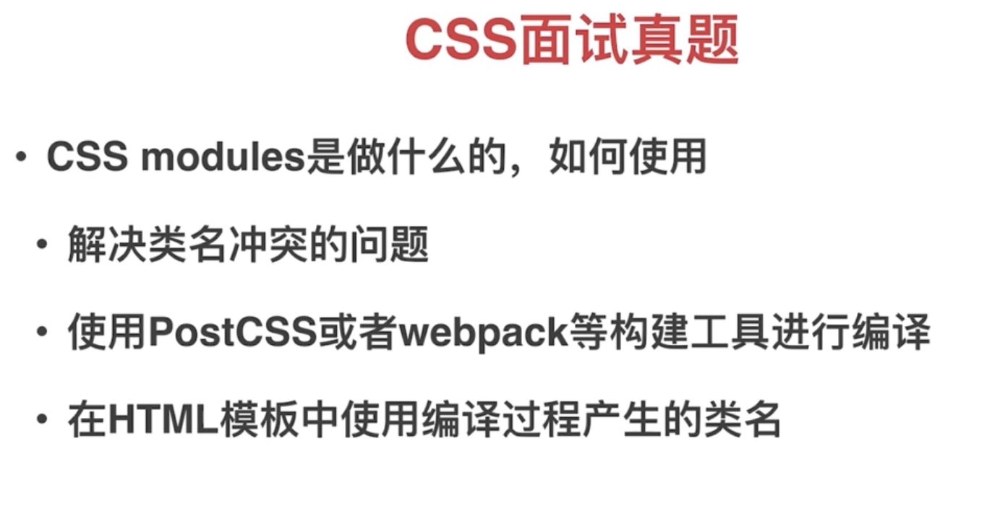
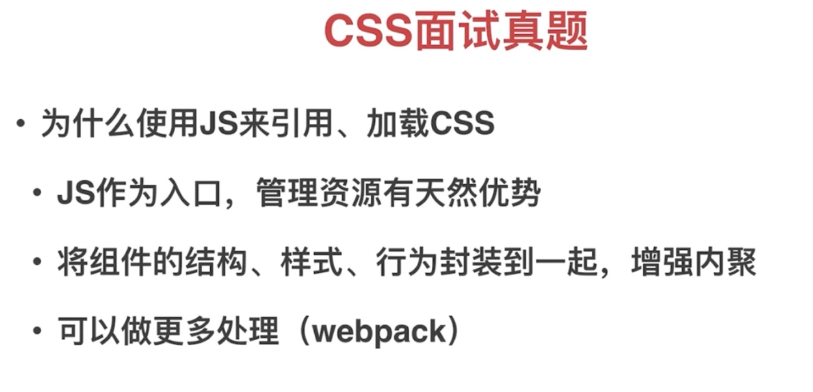

# CSS 工程化

## PostCSS

## 1.postcss 的能力来源

## 2.postcss 好用的插件

- import 模块合并
- autpprefixier 自动加前缀
- cssnano 压缩代码
- cssnext 使用 css 新特性
- precss 可以使用 变量 Mixin 循环等

## cssnext

## precss

## postcss 构建工具

## webpack 使用 loader 进行加载 css 文件

## 

