# css

# H5CSS3

学习网站：https://www.freecodecamp.org/

## 0.H5

### 1.常见的元素

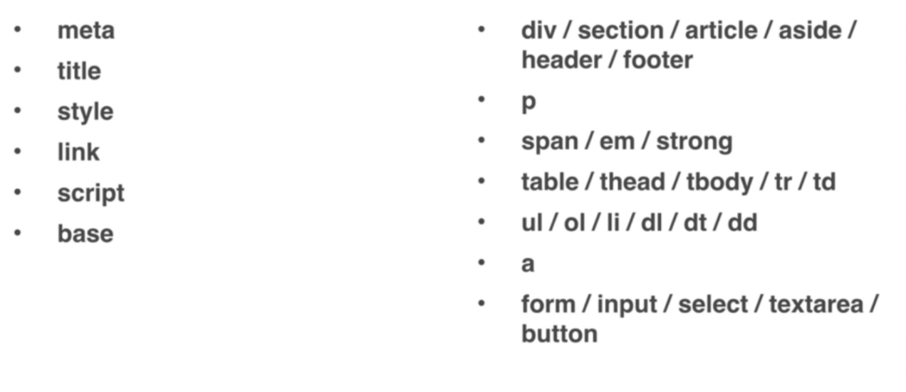

#### 1.meta

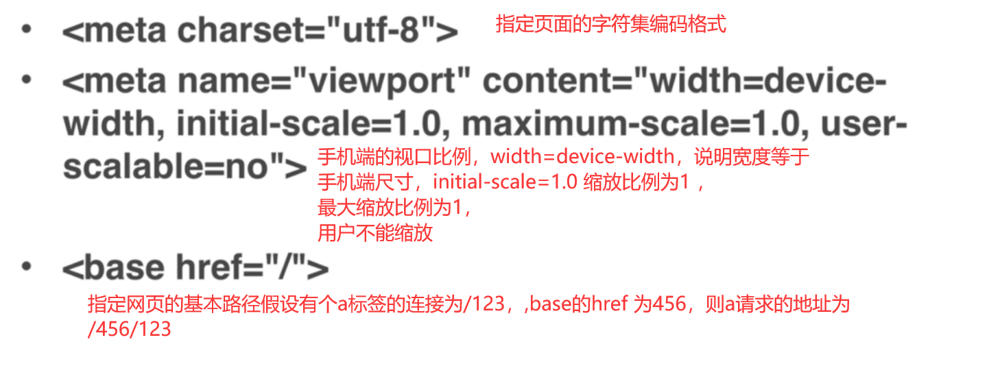

### 2.适配移动端的第一步就是：增加 viewport 属性

### 3.重要元素以及属性


### 4.如何理解 HTML 【结构——文档——区域和大纲】

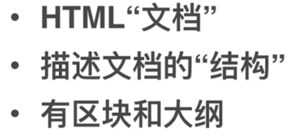

**增加的语义化标签：就是为了生成大纲**：检测的网站http://h5o.github.io/

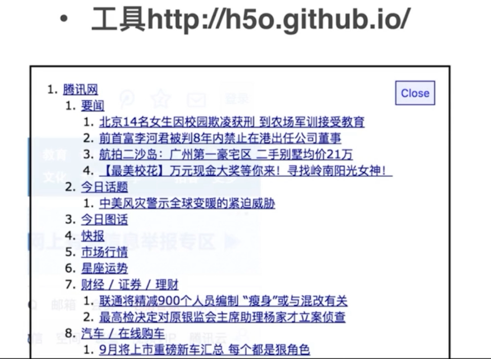

主要语义化标签：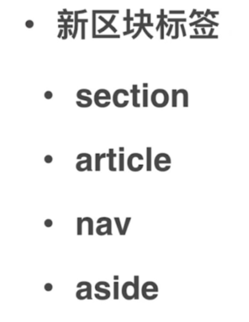

### 5.html 的版本

验证规范：http://validator.w3.org/


### 6.CSS 选择器

#### 1.基本规则 【分号是分隔符，不是结束符】

```
选择器{
	属性:值;
	属性:值
}
```

#### 2.选择器的解析规则 从右向左 【减少匹配次数，提高性能】


#### 3.选择器的分类

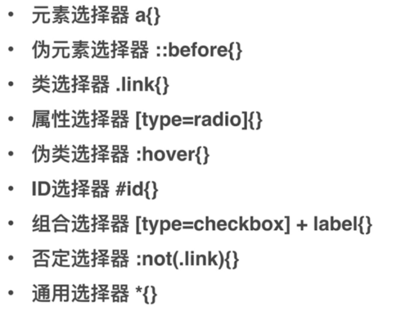

#### 4.选择器的权重

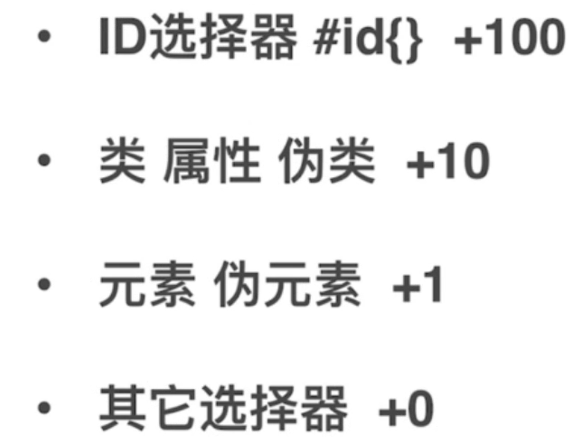

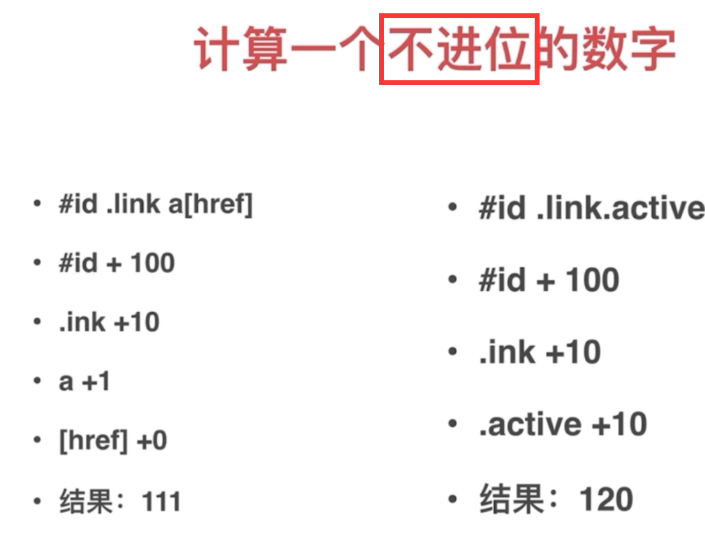

不进位的意思是：11 个类选择器的结果是 110 ，而一个 ID 选择器的结果是 100，110>100,但是因为是不进位的，所以还是 ID 选择器的样式被应用。

#### 5.其他权重

- !important 的优先级最高
- 行内元素属性优先级高
- 相同权重，后写的会覆盖前面的，后面的生效

### 7.非布局样式

#### 1.font-family


字体族不要用引号包裹：和 fallback 机制


##### **自定义字体**：如果是远程字体 注意跨域问题


#### 2.行高 line-height 和 横向对齐方式 vertical-align：

**如果父元素没有设置高度，行高会默认撑起父元素的高度，高度大于文字 font-size 高度时候文字会居中**

文字大小不一样的默认以基线【base-line】对齐，可以通过 vertical-align 来调整对齐方式

vertical-align：如果设置像素，则是以基线为基础开始移动的

**面试题：为啥图片下方会有空隙**：因为图片默认也是 inline 元素，会遵循行高的规则，默认的对齐方式是基线，而不是底线，所以会有空隙

如何去除：

1. 横向对齐方式改为 bottom：
2. 变为 block 元素

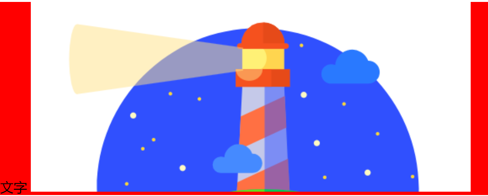

#### 3.背景的知识

##### 1.背景色

```css
.c1 {
  height: 90px;
  /* background:rgba(255,0,0, .3); */
  /* background:url(./test.png); */
}
```

##### 2.渐变色背景

```css
.c2 {
  height: 90px;
  /* background: -webkit-linear-gradient(left, red, green); */
  /* background: linear-gradient(to right, red, green); */
  /* background: linear-gradient(180deg, red, green); */
  /* background: linear-gradient(135deg, red 0, green 10%, yellow 50%, blue 100%); */
  background: linear-gradient(
      135deg,
      transparent 0,
      transparent 49.5%,
      green 49.5%,
      green 50.5%,
      transparent 50.5%,
      transparent 100%
    ), linear-gradient(45deg, transparent 0, transparent 49.5%, red 49.5%, red
        50.5%, transparent 50.5%, transparent 100%);
  background-size: 30px 30px;
}
```

效果图：


##### 3.多背景的叠加

背景色和背景图同时设置

```css
.c1 {
  height: 900px;
  background: red url(./test_bg.png);
  background-repeat: no-repeat;
  /* 位置控制 相对于容器的 */
  /* background-position: center top; */
  /* background-position: 20px 30px; */
  /* 大小控制 */
  /* background-size:100px 50px; */
}
```

##### 4.背景图片和属性【雪碧图】

雪碧图的实现

```css
.c2 {
  width: 20px;
  height: 20px;
  background: url(./test_bg.png) no-repeat;
  background-position: -17px -5px;
  background-size: 261px 113px;
}
```

##### 5.base64 和性能优化

优点：减少了 HTTP 连接数

缺点：

- 体积增大了三分之一
- 会导致 css 文件变得很大
- 浏览器会先对其进行解码

应用场景：小图标之类的，使用 base64

##### 6.多分辨率的匹配 ：高分辨率的图片来改变大小适配

#### 4.边框属性

##### 1.线形 大小 颜色

```css
.c1 {
  width: 400px;
  height: 200px;
  /* border: 1px solid red; */
  /* border:5px solid red; */
  /* border:5px dotted red; */
  border: 5px dashed red;
}
```

##### 2.边框背景图

原图 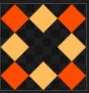

使用：

```css
.c2 {
  width: 400px;
  height: 200px;
  /* border-width: 30px; */
  /* 必须是实线 才能使用 边框图片 */
  border: 30px solid transparent;
  /* 30：四个角的宽度 round 指定边框中间内容的重复方式 */
  border-image: url(./border.png) 30 round;
}
```

##### 3.三角形的实现：边框的实现是因为 边框的衔接部分是斜切的

```css
.c3 {
  width: 400px;
  height: 200px;
  border-bottom: 30px solid red;
  border-right: 30px solid blue;
  border-left: 30px solid transparent;
  /* border-right: 30px solid transparent; */
}
```

#### 5.滚动 scroll：内容比容器多的时候会滚动

蓝色为容器背景

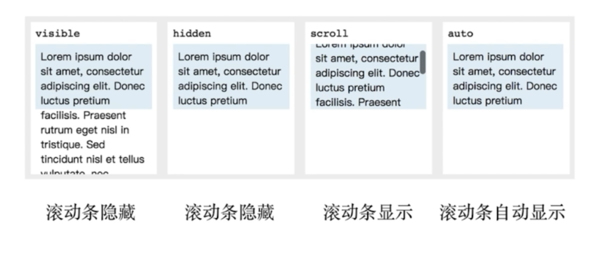

#### 6.文字换行


```css
<div
  class="c1"
  > This
  is
  a
  long
  and
  Supercalifragilisticexpialidocious
  sentence.
  一二三四五六，七八九零一二，这是一句巨长巨长又没有空间可以换行的句子哦。
  </div
  > .c1 {
  border: 1px solid;
  width: 8em;
  /* 超长单词 是否折行 尽量保持完整行 */
  overflow-wrap: normal;
  /* 是以一句话为单位 还是以一个词为基本单位 进行折行  */
  word-break: normal;
  /* 控制是否换行 */
  white-space: normal;
}
```

#### 7.装饰性的属性


#### 8.css hack

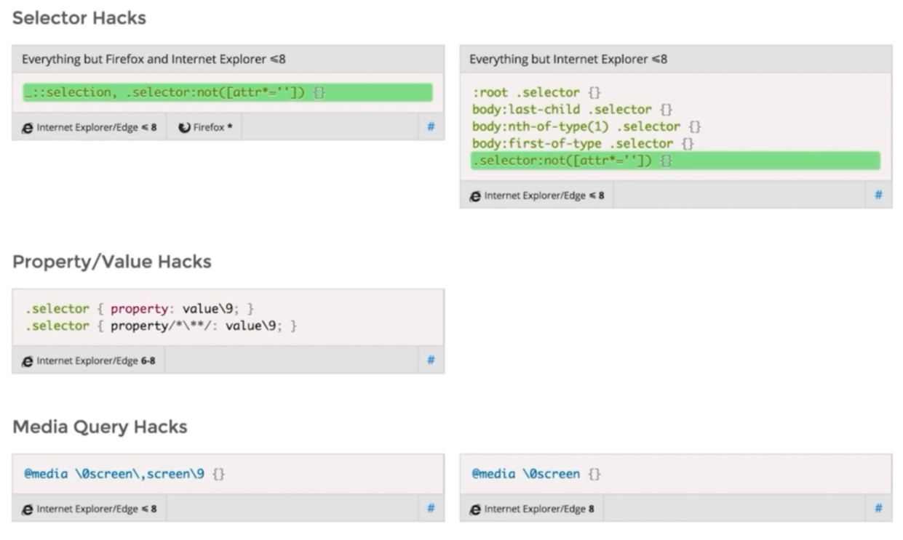

- Hack 不合法 但是生效的写法
- 目的是区分不同的浏览器
- 缺点：难理解 难维护 易失效
- 替换方案：特性检测 判断不同的浏览器 针对性的增加不同的 class

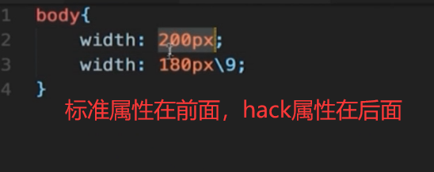

#### 9.案例

利用伪类实现选中效果 组合选择器的使用：https://www.runoob.com/css/css-combinators.html

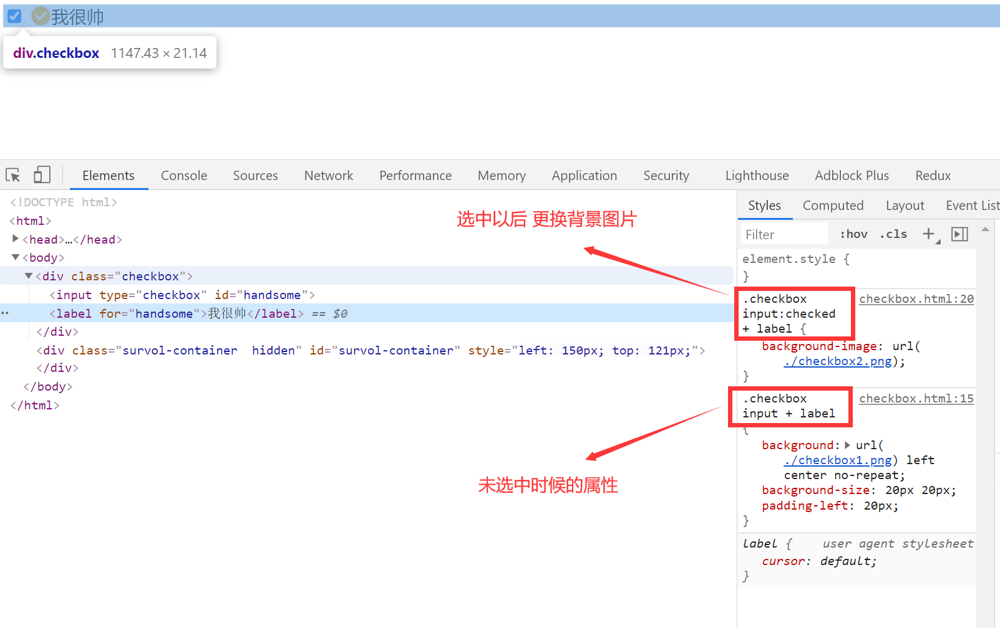

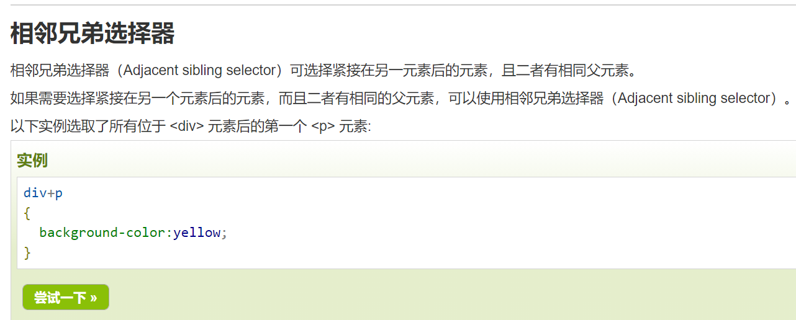

https://ryanseddon.com/demo/css_tree/

## 1.CSS3 【层叠式样式表】

### 1.长度单位

**概念**：长度单位的两种主要类型是绝对单位和相对单位。绝对单位与长度的物理单位有关。例如，`in`和`mm`分别指英寸，毫米。绝对长度单位近似于屏幕上的实际测量值，但是根据屏幕的分辨率会有一些差异。

相对单位，例如`em`或`rem`，是相对于另一个长度值的。例如，`em`基于元素字体的大小。如果您使用它来设置`font-size`属性本身，则它是相对于父项的属性`font-size`。

### 2.CSS 继承以及优先级

**1.子元素默认继承 body 属性，**

```html
<style>
  body {
    background-color: black;
    font-family: monospace;
    color: green;
  }
  .pink-text {
    color: pink;
  }
  /* style中样式的声明顺序最重要，后面的会覆盖前面的 */
  .blue-text {
    color: blue;
  }
</style>
<h1 class="blue-text pink-text">Hello World!</h1>
```

**2.ID 选择器的权重大于 类选择器**

```html
<style>
  body {
    background-color: black;
    font-family: monospace;
    color: green;
  }
  .pink-text {
    color: pink;
  }
  .blue-text {
    color: blue;
  }
  #orange-text {
    color: orange;
  }
</style>
<h1 id="orange-text" class="pink-text blue-text">Hello World!</h1>
```

**3.内联样式大于 ID 大于类**

```html
<style>
  body {
    background-color: black;
    font-family: monospace;
    color: green;
  }
  #orange-text {
    color: orange;
  }
  .pink-text {
    color: pink;
  }
  .blue-text {
    color: blue;
  }
</style>
<h1 id="orange-text" class="pink-text blue-text" style="color:white;">
  Hello World!
</h1>
```

**4.important 最大**

```html
<style>
  body {
    background-color: black;
    font-family: monospace;
    color: green;
  }
  #orange-text {
    color: orange;
  }
  .pink-text {
    color: pink !important;
  }
  .blue-text {
    color: blue;
  }
</style>
<h1 id="orange-text" class="pink-text blue-text" style="color: white">
  Hello World!
</h1>
```

### 3.颜色表示方法：

1. 英文
2. 16 进制
3. RGB

### 4.CSS 变量

#### 1.变量的定义

```css
.penguin {
  /* Only change code below this line */
  --penguin-skin: gray;
  --penguin-belly: white;
  --penguin-beak: orange;
  /* Only change code above this line */

  position: relative;
  margin: auto;
  display: block;
  margin-top: 5%;
  width: 300px;
  height: 300px;
}
```

#### 2.变量的使用和默认值 GRAY

```css
.penguin-top {
  top: 10%;
  left: 25%;
  background: var(--penguin-skin, gray);
  width: 50%;
  height: 45%;
  border-radius: 70% 70% 60% 60%;
}
```

#### 3.变量定义在:root 中

原因：通过在:root 中创建变量，他们将全局可用，并且在样式表中的任何其他访问器访问，后面的元素可以默认继承该变量。也可以创建新的样式类更改该样式变量。

#### 4.变量的适用场景：简化媒体查询

```css
:root {
  --penguin-size: 300px;
  --penguin-skin: gray;
  --penguin-belly: white;
  --penguin-beak: orange;
}
/* 在宽度小于350px的时候使用下面的变量 */
@media (max-width: 350px) {
  :root {
    /* Only change code below this line */
    --penguin-size: 200px;
    --penguin-skin: black;
    /* Only change code above this line */
  }
}
```

## 2.视觉设计

### 1.text-align：

- justify:最后一行以外的所有文本行与行框的左边缘右边缘相交
- left:【默认】左对齐
- right:右对齐
- center:居中

### 2.小标签

- 倾斜：em
- 加粗强调语气：strong
- 下划线：u
- 删除线：s
- 分割线：hr

### 3.font-size:字体大小

### 4.box-shadow：边框阴影

参数：

- offset-x:水平轴的偏移量
- offset-y:垂直轴的偏移量
- blur-radius：模糊半径
- spread-radius:扩散半径
- color:颜色

```css
/* 水平轴偏移110px
      垂直轴偏移10px
      模糊半径：3px
      颜色：rgba(0,0,0,0.19)
可用逗号分隔设置多个
     */
box-shadow: 110px 10px 3px rgba(0, 0, 0, 0.19), 0 60px 30px rgba(0, 0, 0, 0.23);
```

### 5.opacity：透明度，范围为 0-1

### 6.text-transform：样式转换大小写

- lowercase:全小写
- uppercase：全大写
- capitalize：首字母大写
- initial：使用默认值
- inherit：继承自父元素的属性
- none:默认值，使用原始文本

### 7.font-weight:设置字体的粗细

### 8.line-height：行高，垂直的间距

### 9.伪类【一个冒号的行为】

#### 1.概念：可添加到选择器中的关键字，以便选择元素的特定状态

#### 2. :hover：鼠标悬停该元素时候的状态

#### 9.1.伪元素【两个冒号的元素】

##### 1.伪元素 用于在选定元素前后 添加内容，其中 content 代表要添加的内容为必填项

```css
<style>
  .heart {
    position: absolute;
    margin: auto;
    top: 0;
    right: 0;
    bottom: 0;
    left: 0;
    background-color: pink;
    height: 50px;
    width: 50px;
    transform: rotate(-45deg);
  }
  .heart::after {
    background-color: pink;
    content: "";
    border-radius: 50%;
    position: absolute;
    width: 50px;
    height: 50px;
    top: 0px;
    left: 25px;
  }
  .heart::before {
    content: "";
    background-color: pink;
    border-radius: 50%;
    position: absolute;
    width: 50px;
    height: 50px;
    top: -25px;
    left: 0px;
  }
</style>
<div class="heart"></div>

```

### 10.定位方式

#### 1.盒模型 W3C 和 IE 盒模型：

**CSS 中将每一个元素都当作一个盒子**

#### 2.按照默认样式元素分类

https://www.cnblogs.com/ghost-monkey/p/9727290.html

##### **a.块元素 block【一层楼】**

**默认的块元素：**

```html
div, p, ul,li,header,footer,section,article 等
```

##### **b.行内元素 inline**【楼的小房间】

**默认的行内元素**：可能没有规则的框框

```html
a,span,img 等 加宽度没有效果
```

文档流是 LRVH (从左到右，上到下的显示)，对于块级元素是会（横向方向）填满它的包含元素（父级元素的），而行内元素则不是，它的所有子元素会在一行显示，（如果所有子元素的宽度超过了其父容器的宽度，则会自动换到下一行）

##### c.行内块元素 inline-block ：select

3.按照内容分类

http://www.w3.org/TR/html5/dom.html#content-models

https://html.spec.whatwg.org/multipage/dom.html#kinds-of-content

https://www.zhangjinglin.cn/blog/d37dbcd34db6df9e7adfbe3ae2d8ad95.html

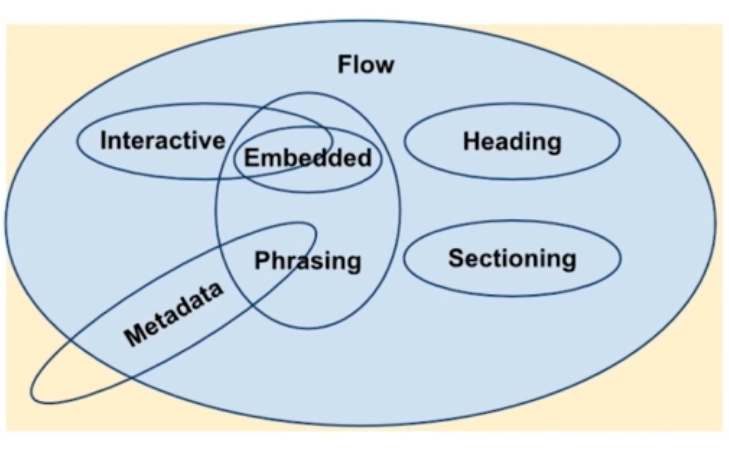

##### 4.HTML 的元素嵌套关系

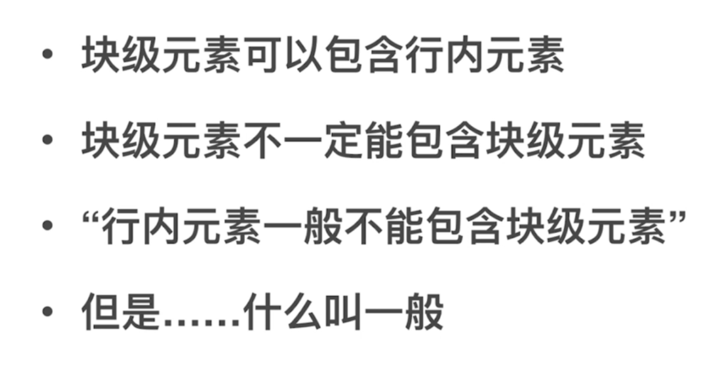

**a 元素可以包含块级元素**：因为 a 是透明元素，可以去掉，再看嵌套规则

https://html.spec.whatwg.org/multipage/text-level-semantics.html#the-a-element

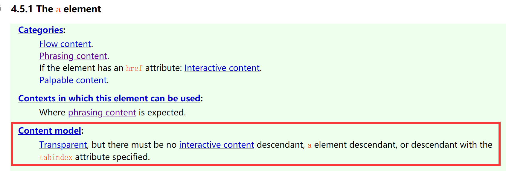

通过 content-model:来确定可以嵌套的元素

#### 3.position【定位】【重点】

**relative:相对自身定位**

当元素的位置设置为相对位置时，它允许您指定 CSS 在页面正常流中相对于当前位置的移动方式。它与左或右、上或下的 CSS 偏移属性配对。它们表示将项目从其正常位置移开的像素、百分比或 ems 数。

将元素的位置更改为“相对”不会将其从正常流中移除-它周围的其他元素仍会表现为该项处于其默认位置。

可以使用 上下左右属性来控制距离自身之前多少像素

**absolute：相对于父级进行绝对定位**

它将元素相对于其父容器锁定到位。与相对位置不同，**这会从文档的正常流中删除元素，因此周围的项会忽略它**。CSS 偏移属性（顶部或底部、左侧或右侧）用于调整位置。

绝对定位的一个细微差别是，它将相对其最近定位的祖先锁定。如果忘记向父项添加位置规则（这通常是使用 position:relative；），浏览器将继续查找链并最终默认为 body 标记。

**fixed:固定定位**

是一种绝对定位，可以锁定相对于浏览器窗口的元素。与绝对定位类似，它与 CSS offset 属性一起使用，并从文档的正常流中删除元素。

固定位置和绝对位置之间的一个关键区别是具有固定位置的元素在用户滚动时不会移动。

**float:浮动定位**

浮动元素从文档的正常流中移除，并被推到包含父元素的左侧或右侧。它通常与 width 属性一起使用，以指定浮动元素需要多少水平空间。

**z-index:更改层级显示关系**

当元素被定位为重叠时（即使用 position:absolute | relative | fixed | sticky），HTML 标记中**后面的元素将默认显示在前面元素的顶部**。但是，z-index 属性可以指定元素堆叠的顺序。它必须是一个整数（即整数而不是十进制数），元素的 z-index 属性值越高，它在堆栈中的位置就越高

#### 4.居中

##### 1.margin：auto 时候水平居中

#### 5.渐变色的添加 【amcharts4】

##### 1.单个 渐变色的创建

```html
<style>
  div {
    border-radius: 20px;
    width: 70%;
    height: 400px;
    margin: 50px auto;
    /* 参数一 指定颜色转换开始方向：其中90deg表示水平渐变（从左到右），而45deg的角度类似于反斜杠 
    后面的参数是渐变色的多少
    */
    background: linear-gradient(35deg, #cff, #fcc);
  }
</style>

<div></div>
```

##### 2.重复渐变色的创建

```html
<style>
  div {
    border-radius: 20px;
    width: 70%;
    height: 400px;
    margin: 50 auto;
    /* 
    渐变从0像素处的黄色开始，在距起始点40像素处渐渐与第二种蓝色混合。由于下一个颜色停止也是在40像素处，所以渐变会立即变为第三个颜色绿色，而绿色本身与第四个颜色值红色混合，因为这是距离渐变开始点80个像素的地方。
     */
    background: repeating-linear-gradient(
      90deg,
      yellow 0px,
      blue 40px,
      green 40px,
      red 80px
    );
  }
</style>

<div></div>
```

#### 6.background:

##### 1.使用背景图片

```html
background:url("https://cdn-media-1.freecodecamp.org/imgr/MJAkxbh.png") }
```

##### 2.transparent 变透明

#### 7.transform 【变换也可以用在伪元素上】

##### 1.放大缩小 scale

```css
/* 放大比例 2 */
transform: scale(2);
```

##### 2.倾斜角度：skewX skewY

```css
/* x轴倾斜角度 */
transform: skewX(-32deg);
transform: skewY(-10deg);
```

#### 8.动画效果 【可以用在伪元素上】

##### 1.使用方法

1. animation name 设置动画的名称，
2. @keyframes 稍后使用该名称来告诉 CSS 哪些规则与哪些动画相匹配
3. animation-duration 来设置动画时长

##### 2.@keyframes 详解

@keyframes 可以精确的指定动画在持续时间内发生的事情，通过动画期间为特定的 **帧**来提供 css 属性实现的，动画时间百分比范围为 0-100%，0%代表开头，100%代表结尾。

##### 3.动画填充模式（animation-fill-mode ）：动画填充模式指定动画完成后应用于元素的样式。

- forwards:保持原有动画结尾效果

```css
animation-fill-mode: forwards;
```

##### 4.控制元素的移动 【控制相对定位或者绝对定位】

```css
<style>
  div {
    height: 40px;
    width: 70%;
    background: black;
    margin: 50px auto;
    border-radius: 5px;
    position: relative;
  }

  #rect {
    animation-name: rainbow;
    animation-duration: 4s;
  }

  @keyframes rainbow {
    0% {
      background-color: blue;
      top: 0px;
  	  left:0px;
    }
    50% {
      background-color: green;
      top: 50px;
      left:25px;
    }
    100% {
      background-color: yellow;
      top: 0px;
      left:-25px;

    }
  }
</style>

<div id="rect"></div>

```

##### 5.控制动画的次数（animation-iteration-count）

- 设置数字 为次数
- infinite ：无限次

##### 6.动画的效果（animation-timing-function）

如果动画是一辆汽车在给定时间（动画持续时间）内从点 a 移动到点 B，则动画计时功能将显示汽车在行驶过程中如何加速和减速。

- ease 【默认】：慢开始，中间加速，后面减速
- ease-out:开始时候快速然后减速
- ease-in：开始速度慢，在结束时候加速
- linear：线性整个过程匀速前进

## 3.【重点】应用的可访问性挑战

### 1.img 标签的 alt 属性：有值或者留空

**有值：**有助于在图像无法加载或用户无法看到的情况下使用。搜索引擎也使用它来了解图像包含的内容

**留空：**图像已经用文本内容解释或未在页面中无意义的情况下，可为空。

**PS:**对于带有标题的图像，仍要包含 alt 文本方便搜索引擎进行分类

### 2.语义化标签 article section div main nav header footer audio video

如果一本书是文章【article】，那么每一章就是一节【section】。当内容组之间没有关系时，使用 div。

- nav 导航栏
- header 网站头部
- footer 主要用于包含版权信息或指向通常位于页面底部的相关文档的链接

快速记忆：一本书 article section 一个人 header nav main footer 听歌 audio 看视频 video

audio

```html
<audio id="meowClip" controls>
  <source src="audio/meow.mp3" type="audio/mpeg" />
  <source src="audio/meow.ogg" type="audio/ogg" />
</audio>
```

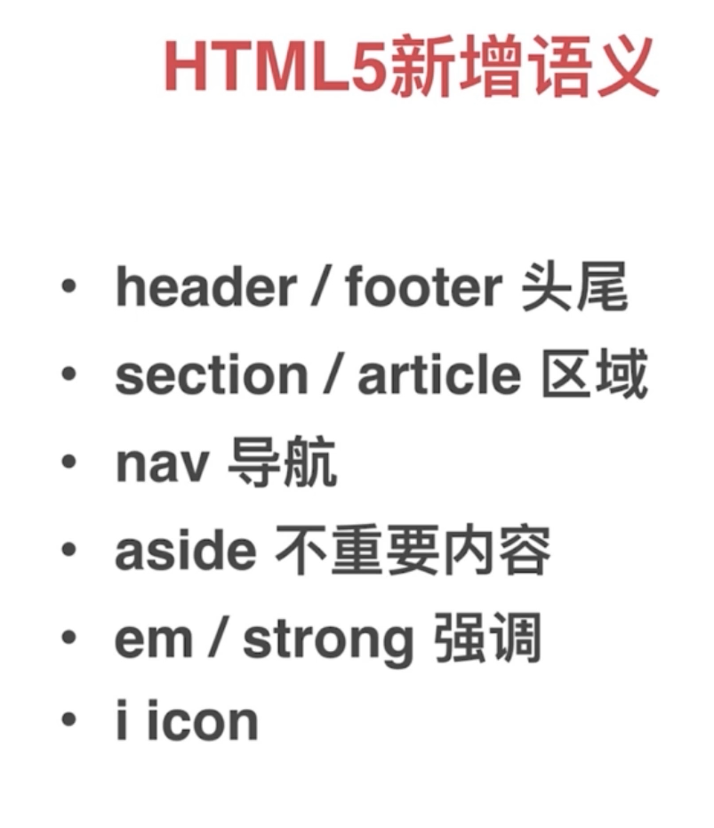

### 3.语义化标签之图表可视化部分 figure figcaption【重点】

HTML5 引入了 figure 元素以及相关的 figcaption。这些项一起使用时，会将视觉表示（如图像、图表或图表）与其标题一起包装。通过对相关内容进行语义分组，并提供一个文本替代方案来解释该图，这将使可访问性得到双重提升。

```html
<figure>
  
  <br />
  <figcaption>
    Master Camper Cat demonstrates proper form of a roundhouse kick.
  </figcaption>
</figure>
```

### 4.提高表单字段的可访问性 label fieldset legend 【重点表单提交】

label 标记上的 for 属性将该标签与表单控件**id**显式关联，增强表单可读性。

fieldset:包围整个单选框组，使用 legend 来描述这个单选框组是做什么的

```html
<form>
  <label for="name">Name:</label>
  <input type="text" id="name" name="demo" />
</form>
```

```html
<form>
  <fieldset>
    <legend>Choose one of these three items:</legend>
    <input id="one" type="radio" name="items" value="one" />
    <label for="one">Choice One</label><br />
    <input id="two" type="radio" name="items" value="two" />
    <label for="two">Choice Two</label><br />
    <input id="three" type="radio" name="items" value="three" />
    <label for="three">Choice Three</label>
  </fieldset>
</form>
```

### 5.表单类型 input type="date" 日期选择器

### 6.时间的标准化描述 time 标签和 其 datetime 属性

```html
<p>
  Master Camper Cat officiated the cage match between Goro and Scorpion
  <time datetime="2013-02-13">last Wednesday</time>, which ended in a draw.
</p>
```

### 7.键盘快捷键 accesskey

HTML 提供 accesskey 属性来指定一个快捷键来激活或集中元素。这可以使仅使用键盘的用户更有效地导航。

```html
<button accesskey="b">Important Button</button>
```

### 8.键盘焦点 tabindex

当标签设置 tabindex 属性时候，tanindex 的取值范围 正数负数和零

- 负数时候【通常为-1】：表示可以聚焦的，但是无法通过键盘 tab 键切换访问，聚焦时还可以使用 css 伪类 focus

- ```html
  p:focus { background-color: yellow; color:blue; }

  <p tabindex="0">
    Instructions: Fill in ALL your information then click <b>Submit</b>
  </p>
  ```

- 设置 tabindex=“1”将首先将键盘焦点放在该元素上。然后它循环指定的 tabindex 值序列（2、3 等），然后转到 default 和 tabindex=“0”项。

自定义 tabindex 会改变默认 tab 切换顺序

### 9.总结表单新增内容

- 类型新增：日期，时间，搜索
- 功能新增：表单验证 max min required pattern 等 https://blog.csdn.net/qq_42249896/article/details/84945624
- Placeholder 和自动聚焦[autofocus]

## 4.响应式 web 布局

### 1.媒体查询 @media

```
设备最大宽度 小于等于100时候应用样式
@media (max-width: 100px) { /* CSS Rules */ }

设备高度 大于等于350时候应用样式
@media (min-height: 350px) { /* CSS Rules */ }

```

### 2.响应式图像宽度

- max-width:100% 保证图像不会比容器更宽
- height:auto 保持其原始宽高比

```css
img {
  max-width: 100%;
  height: auto;
}
```

### 3.图像的最佳宽度和高度应该为真实宽高的一半

- 使图像正确显示在高分辨率显示器上的最简单方法是将其宽度和高度值定义为原始文件的一半。

- ```html
  <style>
    img {
      height: 100px;
      width: 100px;
    }
  </style>

  
  ```

### 4.根据界面进行响应式排版 vw vh vmax vmin

- vw（视口宽度）：10vw 是视口宽度的 10%。
- vh（视口高度）：3vh 为视口高度的 3%。
- vmin（视口最小值）：70vmin 是视口较小尺寸（高度或宽度）的 70%。
- vmax（视口最大值）：100vmax 是视口较大尺寸（高度或宽度）的 100%。

### 5.flex 布局学习 https://coding.imweb.io/demo/flex/

#### 1.将容器变成 flex 布局：display:flex;

#### 2.flex-direction:控制布局的排列方式

- row:横向排列
- column：竖向排列
- row-reverse：横向反向排列
- column-reverse：竖向反向排列

#### 3.justify-content：主轴的对齐和分隔 flex 子项的方式

- flex-start：顶部对齐
- flex-end: 底部对齐
- space-between：第一个子项靠在容器的左侧，最后一个靠在容器的右侧，剩余的空间均匀的分布在子项中
- space-around：和 space-between 的相似 只不过第一个和最后一个会剩余半个间隔空间
- space-evenly：

#### 4.align-items：交叉轴的对齐方式 https://www.runoob.com/cssref/css3-pr-align-items.html

| center     | 元素位于容器的中心。弹性盒子元素在该行的侧轴（纵轴）上居中放置。（如果该行的尺寸小于弹性盒子元素的尺寸，则会向两个方向溢出相同的长度）。 | [测试 »](https://www.runoob.com/try/playit.php?f=playcss_align-items&preval=center)     |
| ---------- | ---------------------------------------------------------------------------------------------------------------------------------------- | --------------------------------------------------------------------------------------- |
| flex-start | 元素位于容器的开头。弹性盒子元素的侧轴（纵轴）起始位置的边界紧靠住该行的侧轴起始边界。                                                   | [测试 »](https://www.runoob.com/try/playit.php?f=playcss_align-items&preval=flex-start) |
| flex-end   | 元素位于容器的结尾。弹性盒子元素的侧轴（纵轴）起始位置的边界紧靠住该行的侧轴结束边界。                                                   | [测试 »](https://www.runoob.com/try/playit.php?f=playcss_align-items&preval=flex-end)   |
| baseline   | 元素位于容器的基线上。如弹性盒子元素的行内轴与侧轴为同一条，则该值与'flex-start'等效。其它情况下，该值将参与基线对齐。                   |                                                                                         |

#### 5.flex-wrap：子项的拆分为多行，默认是一行

#### 【以下全为 flex 子项的属性】

#### 6.flex-shrink:子项在容器收缩时候的放缩比例 【flex 子项的属性】

此属性接受一个数值，当数字越大，收缩的越大。例如：一个子项的该属性为 1，另外一个项目的该属性为 3，则该属性为 3 的比该属性为 1 的小的多。

#### 7.flex-grow：子项在容器方法时候的膨胀比例【flex 子项的属性】

此属性接受一个数值，当数字越大，膨胀的越大。例如：一个子项的该属性为 1，另外一个项目的该属性为 3，则该属性为 3 的比该属性为 1 的膨胀【大】的多。

#### 8.flex-basis: 子项在使用 flex-shrinl 和 flex-grow 进行调整以前的初始大小【子项的默认宽度属性】

#### 9.flex 子项属性的简写：flex: 0 1 auto; 增大 伸缩 默认宽度

#### 10.order ：更改子项在容器中的排列顺序，order 越小越靠前

### 6.栅格化布局 Grid

#### 1.栅格化布局 Grid : display:grid;

#### 2.栅格的数量 和宽度属性 grid-template-columns

```css
/* 三行的栅格 每个宽度为100px */
grid-template-columns: 100px 100px 100px;
/* 网格模板列被设置为创建两列；第一列宽度为100px，第二列最小宽度为50px，最大宽度为200px */
grid-template-columns: 100px minmax(50px, 200px);
```

#### 3.手动设置行数 和行高：grid-template-rows

```css
/* 栅格的高度： */
grid-template-rows: 50px 50px;
```

使用 repeat 函数 来快速定义行数

**格式：** repeat(数量,宽度)

```css
/* 快速创建100行20像素的格子 */
grid-template-rows: repeat(100, 50px);

/* 1fr 50px 重复两次 最后一个像素是20px */
grid-template-columns: repeat(2, 1fr 50px) 20px;
```

**repeat 的 auto-fill 【自动填满】属性：**根据容器的大小自动插入尽可能多的行或列，结合使用 minmax，可以创建灵活的布局 ，**当容器的大小超过所有项目的组合大小时，子项的宽度取最【小】值**

```css
/* 
    自动填充 行，行的宽度最小为60px，最大为1fr
    当容器的一行宽度为 60px<width<120px 时候
    当前行只能有一个子项
    当大于120px  120px<=width<180px时候 满足最小为60px
    当前行有两个子项 第三个的最小宽度满足不了
     */

grid-template-columns: repeat(auto-fill, minmax(60px, 1fr));
```

**repeat 的 auto-fit【自动适合】属性：** **当容器的大小超过所有项目的组合大小时，子项的宽度取最【大】值**

```css
grid-template-columns: repeat(auto-fit, minmax(60px, 1fr));
```

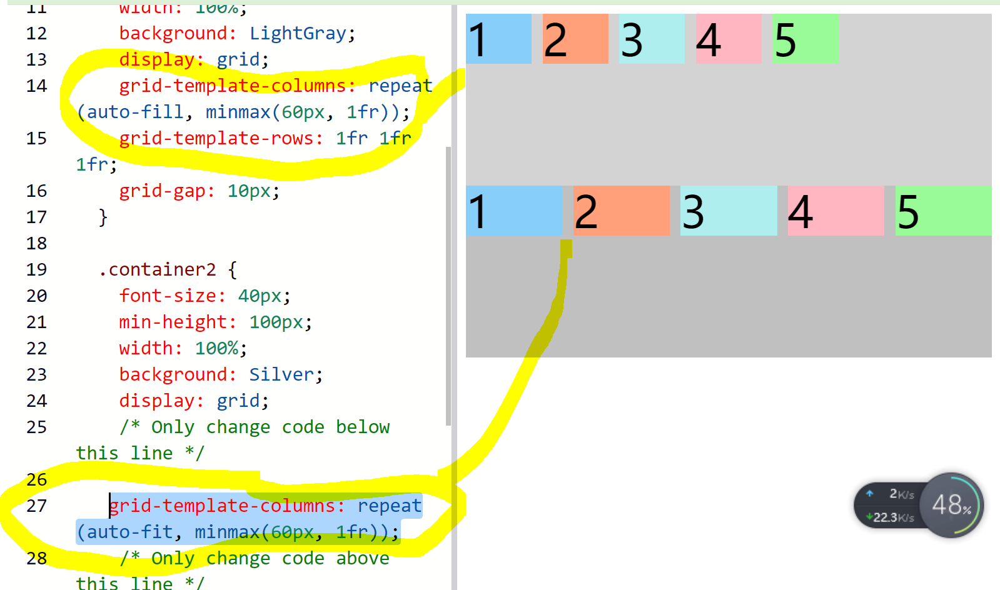

#### 4.Grid 的宽度的设置

- fr:剩余空间的平均分隔
- auto:行或者列自动设置为内容的宽度和高度
- %：将列或行调整为其容器的百分比宽度

```css
/* 创建5列，第一列和内容一样宽，第二列是50px 第三列是容器的10% 最后的两列是：将剩余空间分为3个部分，第4列分配两个，第5列分配一个 */
grid-template-columns: auto 50px 10% 2fr 1fr;
```

#### 5.创建横轴的子项之间的间隙 grid-column-gap

```css
grid-column-gap: 20px;
```

#### 6.纵轴之间的间隙：grid-row-gap

```css
grid-row-gap: 5px;
```

#### 7.子项间隙的简写：grid-gap：10px 20px

```css
/* 行之间是10px 列之间是20px */
grid-gap: 10px 20px;
```

#### 8.合并子项：grid-column 和 grid-row

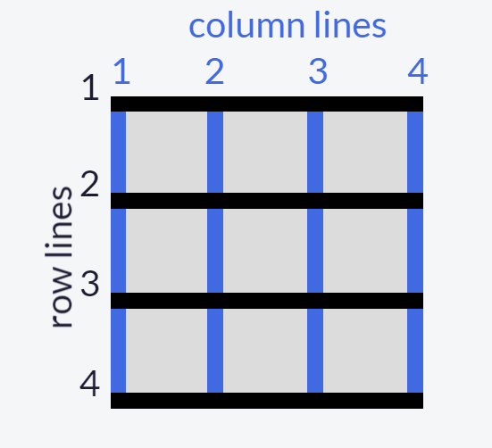

```css
/* 表示从序号2 开始合并好序号4 */
grid-column: 2/4;
```

动态创建一个区域：

```css
.item5 {
  background: PaleGreen;
  /* Only change code below this line */
  /* 网格区域：水平线起点/垂直线起点/水平线终点/垂直线终点； */
  grid-area: 1/1/2/4;

  /* Only change code above this line */
}
```

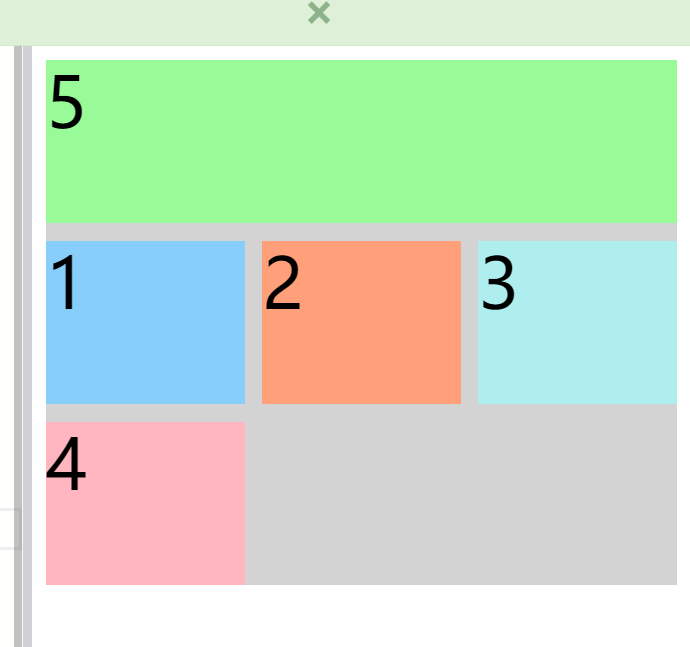

#### 9.横轴子项的对齐方式：justify-self，全部子项：justify-items

- stretch：【默认值】整个宽度
- start:靠左
- center:居中
- end:靠右

#### 10.竖轴子项的对齐方式：align-self，全部子项：align-items

#### 11.分区命名【区域模板】：容器属性 grid-template-areas

- 使用 **(.)**来代表空单元格

```css
grid-template-areas:
  "header header header"
  "advert content ."
  "footer footer footer";
```

#### 12.为分区命名的子项配置样式:

```css
.item5 {
  background: PaleGreen;
  /* 指定更改哪个命名的footer样式区域 */
  grid-area: footer;
}
```
