# CSS 中的布局

## 1.常用的布局方法

- table 表格布局
- float 浮动 + margin
- inline-block 布局
- flexbox 布局

## 2.table 布局

特点：

- 简单 方便 容易理解
- 横向 自动格格 天生就有的
- 文字默认垂直居中的

```html
<table>
  <tr>
    <td class="left">左</td>
    <td class="right">右</td>
  </tr>
</table>
```

```css
.left {
  background: red;
}
.right {
  background: blue;
}
table {
  width: 800px;
  height: 200px;
  border-collapse: collapse;
}
```

效果图：

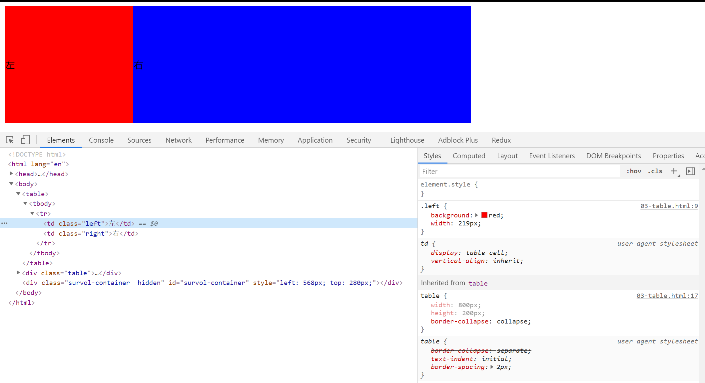

### 使用 div 伪装成表格

```html
<div class="table">
  <div class="table-row">
    <div class="left table-cell">左</div>
    <div class="right table-cell">右</div>
  </div>
</div>
```

```css
.table {
  margin-top: 20px;
  display: table;
  width: 800px;
  height: 200px;
}
.table-row {
  display: table-row;
}
.table-cell {
  vertical-align: center;
  display: table-cell;
}
```

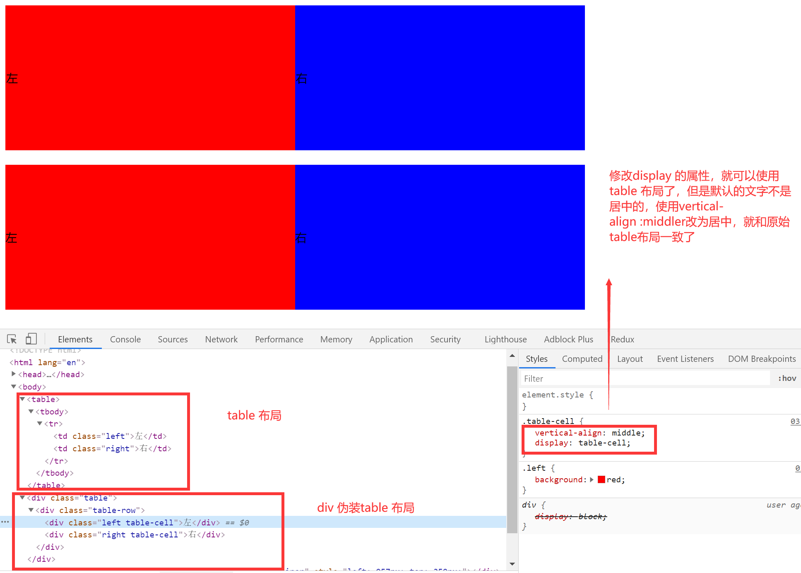

## 3. 一些布局属性

### 1.盒模型的分类：【box-sizing 属性】

#### W3C 盒模型【默认】：

元素的宽度是由 `content的宽 + padding + border `的和组成的。设置的宽度属性仅仅是`内容的宽度属性`。

#### IE 盒模型：

元素的宽度就是内容的宽度，设置的宽度属性是`border + padding + content`

### 2.display 和 position

#### 1.display：确定元素的显示类型

- block：独立宽高的，默认情况下占据一行
- inline：默认不会占据一行，不会被设置宽高的
- inline-block：对内表现的像一个 block 可以有宽高，对外像一个 inline 不会占据一行

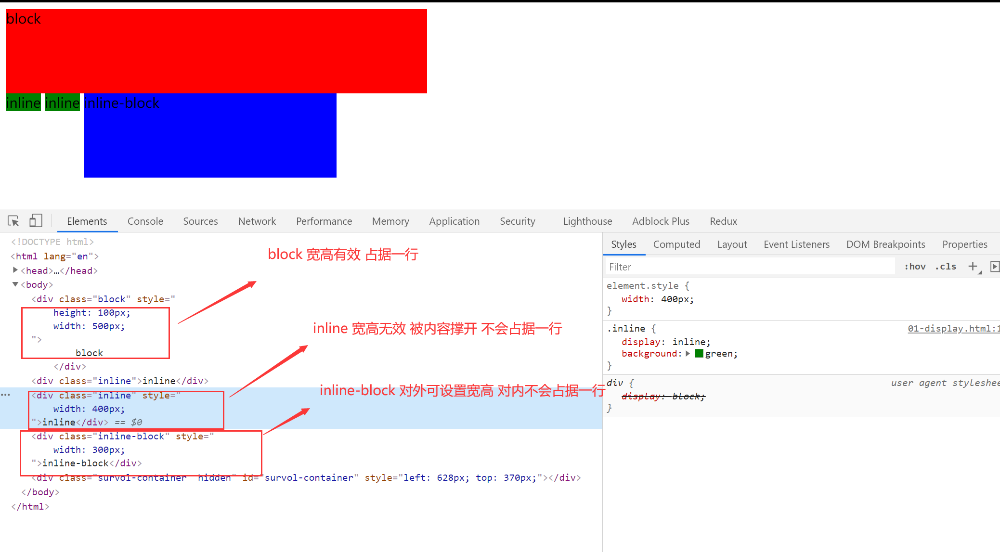

#### 2.【突然冒出来的想法】height 和 line-height

##### block 元素的测试

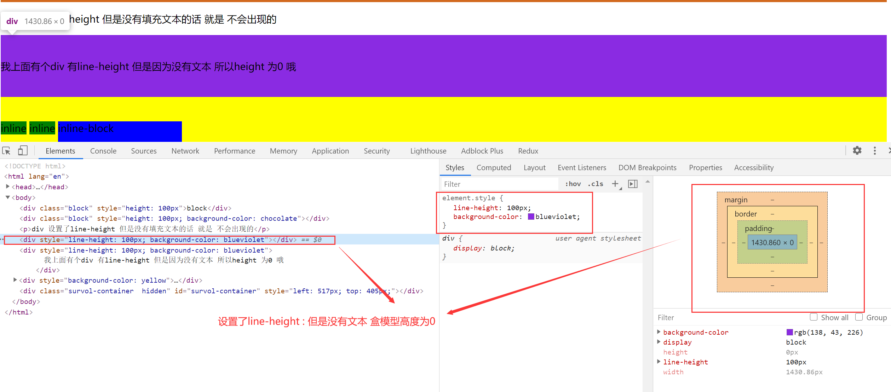

盒模型的高度 以 height 为主，如果没有设置 height 属性，设置了 line-height 属性，且标签里面有内容，盒模型的高度就是 line-height，如果设置了 height 属性 就以 height 为主。

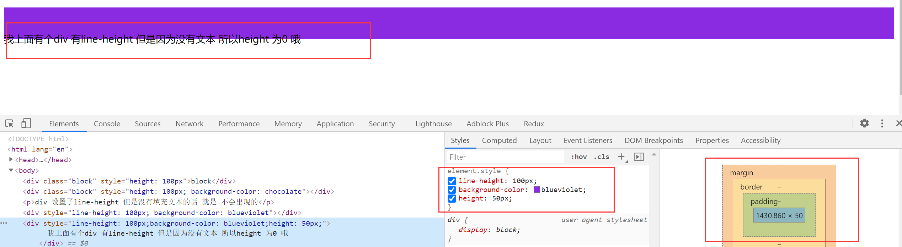

仅仅设置了 line-height 属性 就可以实现文本的垂直居中效果

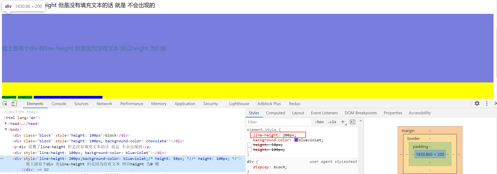

##### inline 元素的测试 设置宽高无用 但是 设置 line-height 有用

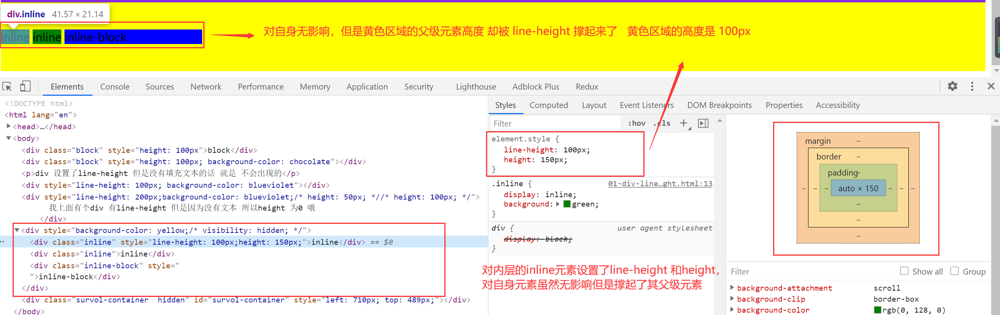

**div 元素会被子内容撑起来。**

#### 3.position: 确定元素的位置

- static：默认情况 按照文档流布局
- relative【相对的】：相对于元素本身偏移的，不会改变原有位置的占据的空间。保留原有的空间
- absolute【绝对的】：绝对定位，会脱离文档流，不会对别的元素造成影响。
- fixed：脱离文档流，是相对与可视区域的定位。

重点：absolute 的定位是相对于最近的 定位为 absolute 或者 relative ，fix 的元素【非 static 元素】进行定位的，都找不到的话就是基于 body 的。

效果图：【class="p3-3"的是黄色小方块】

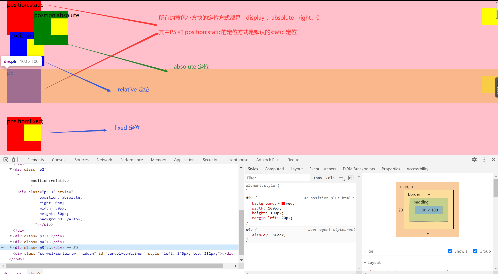

```html
<!DOCTYPE html>
<html lang="en">
  <head>
    <meta charset="UTF-8" />
    <meta name="viewport" content="width=device-width, initial-scale=1.0" />
    <meta http-equiv="X-UA-Compatible" content="ie=edge" />
    <title>Document</title>
    <style>
      div {
        background: red;
        width: 100px;
        height: 100px;
        margin-left: 20px;
      }
      .p2 {
        position: relative;
        left: 10px;
        top: -10px;
        background: blue;
        margin-left: 20px;
      }
      .p3 {
        position: absolute;
        left: 180px;
        top: 30px;
        background: green;
        margin-left: 20px;
      }
      .p4 {
        position: fixed;
        left: 0;
        bottom: 10px;
        margin-left: 20px;
      }
    </style>
  </head>
  <body style="background-color: pink; margin: 0; padding: 0">
    <div class="p1">
      position:static
      <div
        class="p3-3"
        style="
          position: absolute;
          right: 0px;
          width: 50px;
          height: 50px;
          background: yellow;
        "
      ></div>
    </div>
    <div class="p2">
      position:relative
      <div
        class="p3-3"
        style="
          position: absolute;
          right: 0px;
          width: 50px;
          height: 50px;
          background: yellow;
        "
      ></div>
    </div>
    <div class="p3">
      position:absolute
      <div
        class="p3-3"
        style="
          position: absolute;
          right: 0px;
          width: 50px;
          height: 50px;
          background: yellow;
        "
      ></div>
    </div>
    <div class="p4">
      position:fixed;
      <div
        class="p3-3"
        style="
          position: absolute;
          right: 0px;
          width: 50px;
          height: 50px;
          background: yellow;
        "
      ></div>
    </div>
    <div class="p5">
      p5
      <div
        class="p3-3"
        style="
          position: absolute;
          right: 0px;
          width: 50px;
          height: 50px;
          background: yellow;
        "
      ></div>
    </div>
  </body>
</html>
```

[十种水平居中的方法](https://www.jianshu.com/p/907f99004c3e)

#### 4.z-index 属性

想象屏幕到人眼的坐标轴，z-index 越高，层级越高，越不会被遮挡。z-index 进行定位元素(position:absolute, position:relative, or position:fixed)

不同元素放置不同的区间进行覆盖。

## 4.flexbox 布局【弹性盒模型】

- 盒子本来就是并列的
- 弹性盒子
- 指定宽度

## 5.float 原理【重点必须掌握】

- 元素浮动起来
- 脱离文档流
- 但不脱离文本流

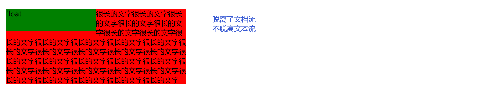

#### 自身的**影响**【重点】

- 形成"块"（BFC）
- 位置尽量靠上
- 位置尽量靠左

**BFC**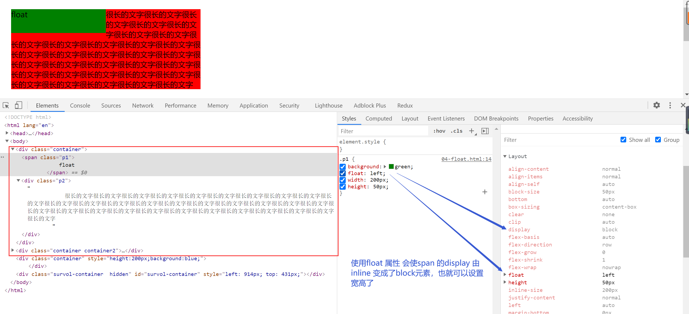

注释掉 float 属性

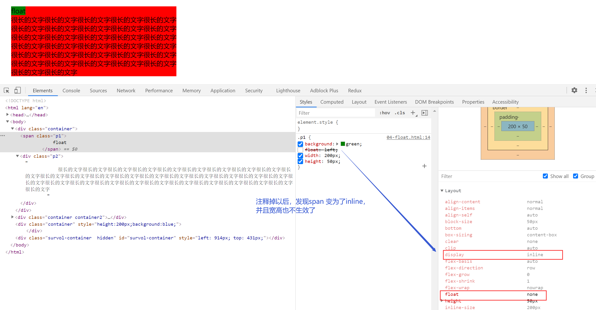

尽量靠上和 尽量靠左

父级宽度比较大的时候

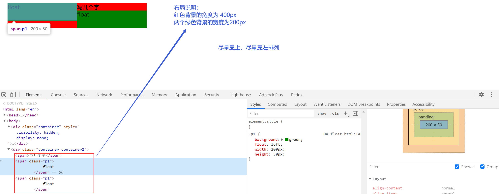

父级宽度不满足的时候

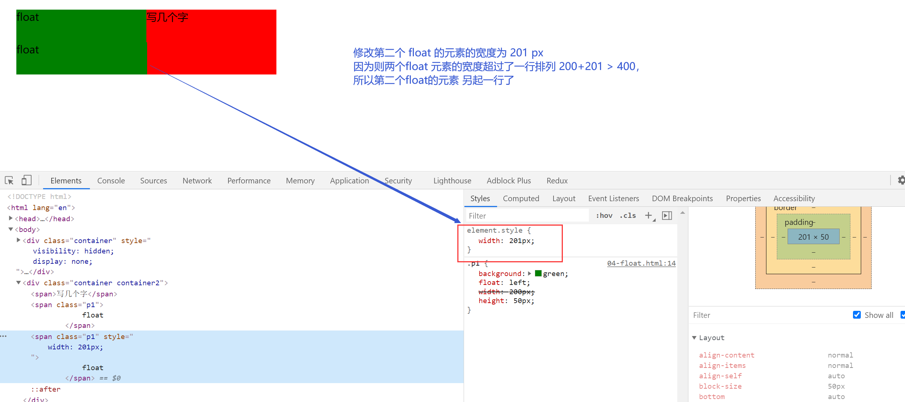

#### 对兄弟的影响

- 上面贴非 float 元素
- 旁边贴 float 元素
- 不影响其他的块级元素位置
- 影响其他块级元素的内部文本

#### 对父级元素的影响【重点】

- 从布局上“消失”
- 高度塌陷
- 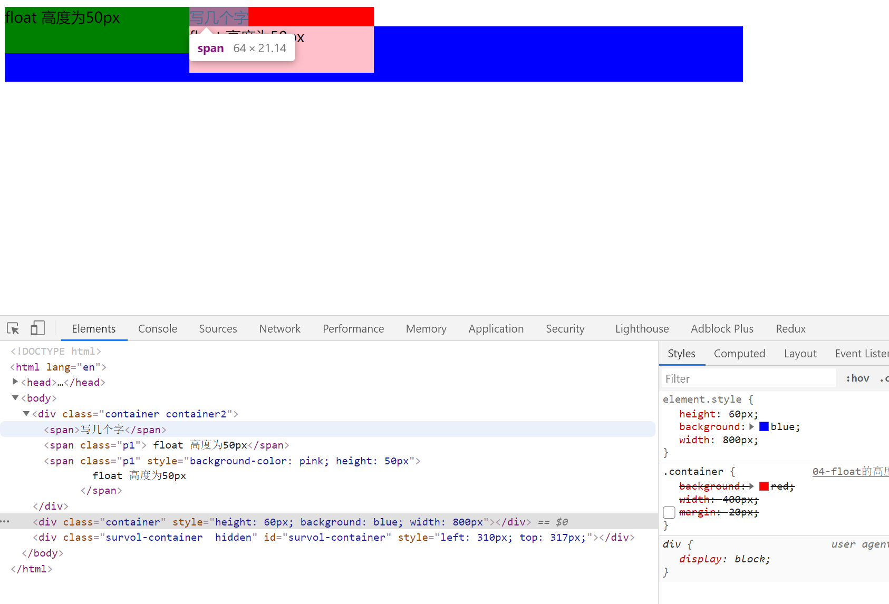

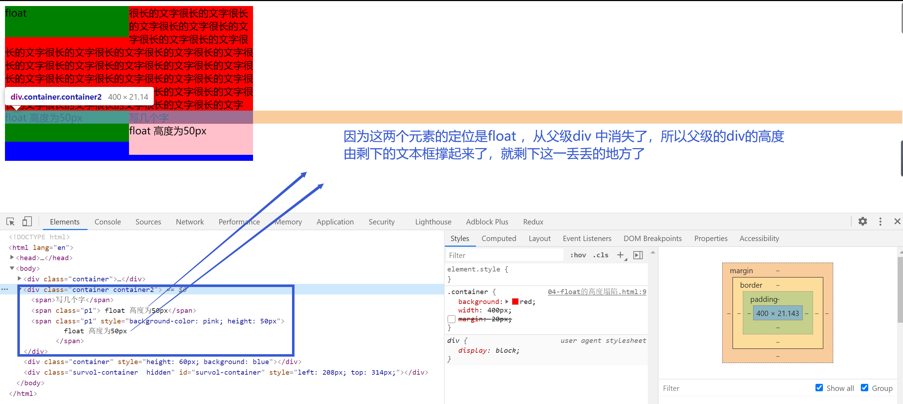

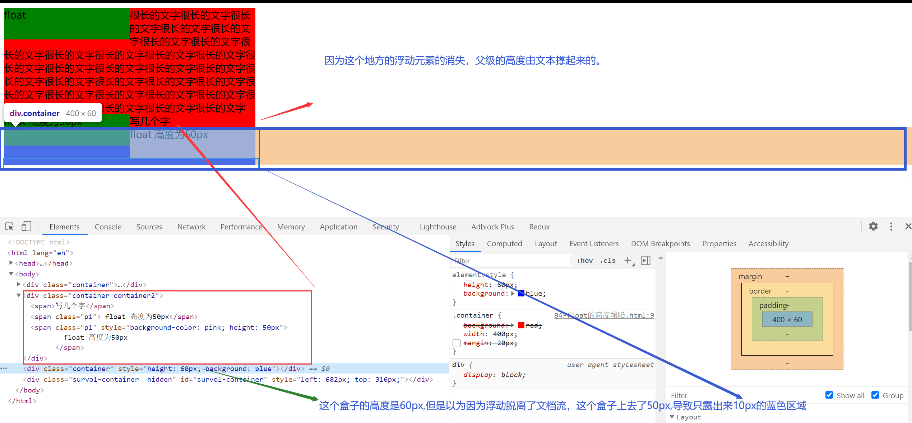

```html
<div class="container container2">
  <span>写几个字</span>
  <span class="p1"> float 高度为50px</span>
  <span class="p1" style="background-color: pink; height: 50px">
    float 高度为50px
  </span>
</div>
<div
  class="container"
  style="height: 60px; background: blue; width: 800px"
></div>
```

```css
.container {
  background: red;
  width: 400px;
  /* margin: 20px; */
}
.p1 {
  background: green;
  float: left;
  width: 200px;
  height: 50px;
}
```

#### 解决高度塌陷的两个方法

**方法一：父级变为 BFC 元素**

设置 float 的时候，会变成一个 BFC，BFC 会负责接管自己的宽高。如果父级元素也变成一个 BFC 就可以接管自己的宽高。

增加 overflow：auto 父级元素会关注自己的元素有没有超出

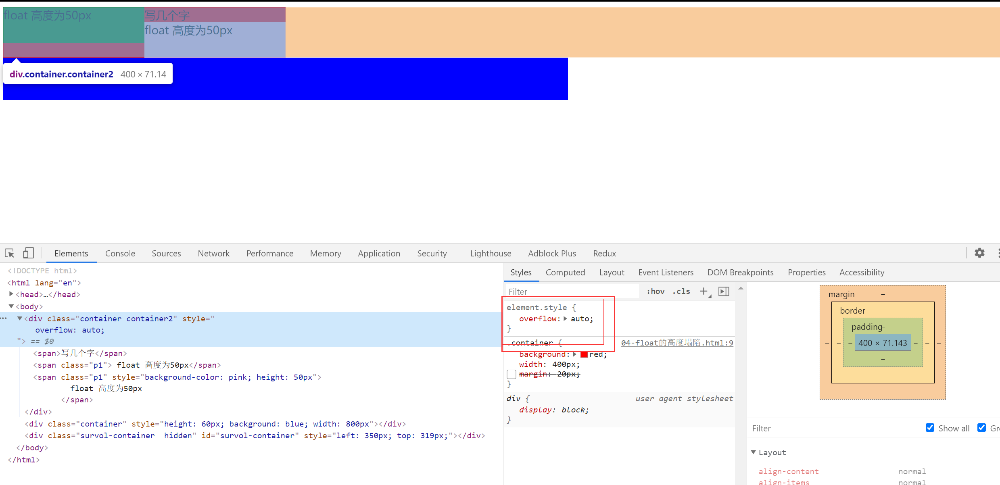

**方法二：给高度塌陷的元素增加一个看不见的伪元素，来撑起塌陷的高度**

```css
/* 解决高度塌陷 相当于再浮动元素的下方增加一个高度为0的块元素 这样下面的元素就会基于此进行排版*/
.container2::after {
  content: "aaa";
  clear: both; /* 保证这个元素的左右两边都没有浮动元素 */
  display: block; /* 伪元素after 默认是 inline 的需要改为block */
  /* visibility: hidden; */
  height: 0;
}
```

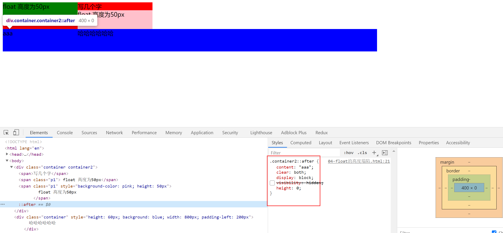

## 6.float 布局

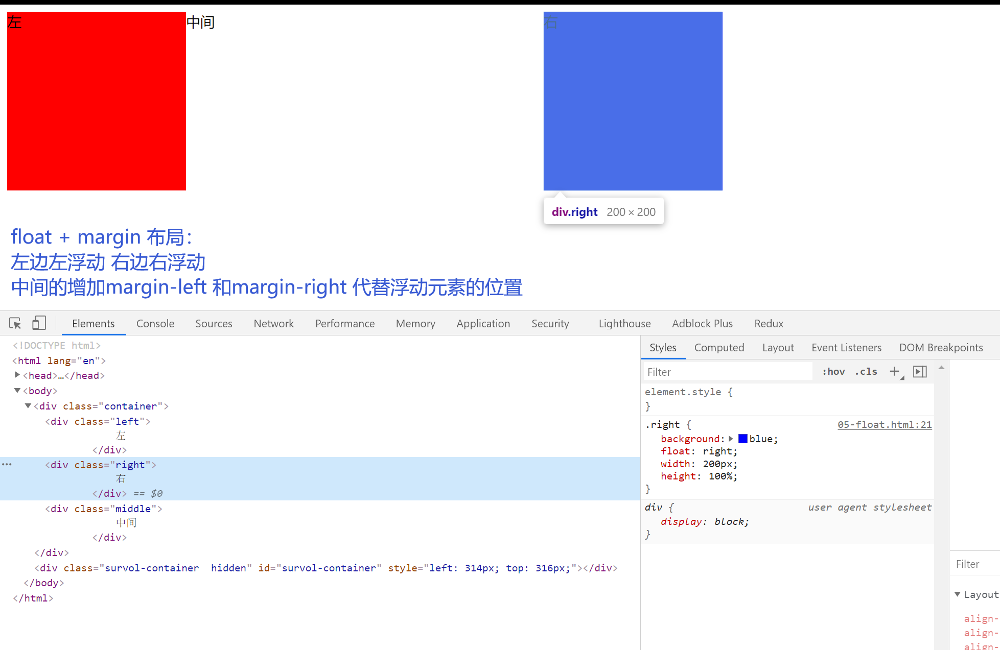

```html
<!DOCTYPE html>
<html lang="en">
  <head>
    <meta charset="UTF-8" />
    <meta name="viewport" content="width=device-width, initial-scale=1.0" />
    <meta http-equiv="X-UA-Compatible" content="ie=edge" />
    <title>Document</title>
    <style>
      .container {
        /* width: 800px; */
        height: 200px;
      }
      .left {
        background: red;
        /* float:left; */
        /* height:100%; */
        width: 200px;
        position: absolute;
        height: 200px;
      }
      .right {
        background: blue;
        float: right;
        width: 200px;
        height: 100%;
      }
      .middle {
        margin-left: 200px;
        margin-right: 200px;
      }
    </style>
  </head>
  <body>
    <div class="container">
      <div class="left">左</div>
      <!-- 中间元素写在最后 是因为会float 元素会尽量的居左 居上 中间元素的宽度 会阻碍右浮动元素 浮动到最顶上的位置 -->
      <div class="middle">中间</div>
      <div class="right">右</div>
    </div>
    <div style="height: 100px; background-color: pink">
      分割线分割线分割线分割线分割线分割线分割线分割线分割线分割线分割线分割线
    </div>

    <div class="container">
      <div class="left">左</div>
      <div class="right">右</div>
      <!-- 中间元素写在最后 是因为会float 元素会尽量的居左 居上 中间元素的宽度 会阻碍右浮动元素 浮动到最顶上的位置 -->
      <div class="middle">中间</div>
    </div>
  </body>
</html>
```

## 7.inline-block 【相当于文字，存在间隙问题】

布局的根本都是：把元素横向并列起来。【inline-block 属性会把元素变为类似与文字，元素之前存在间隙】

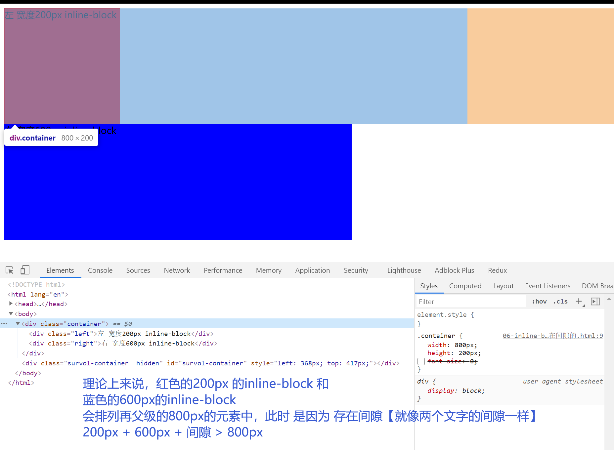

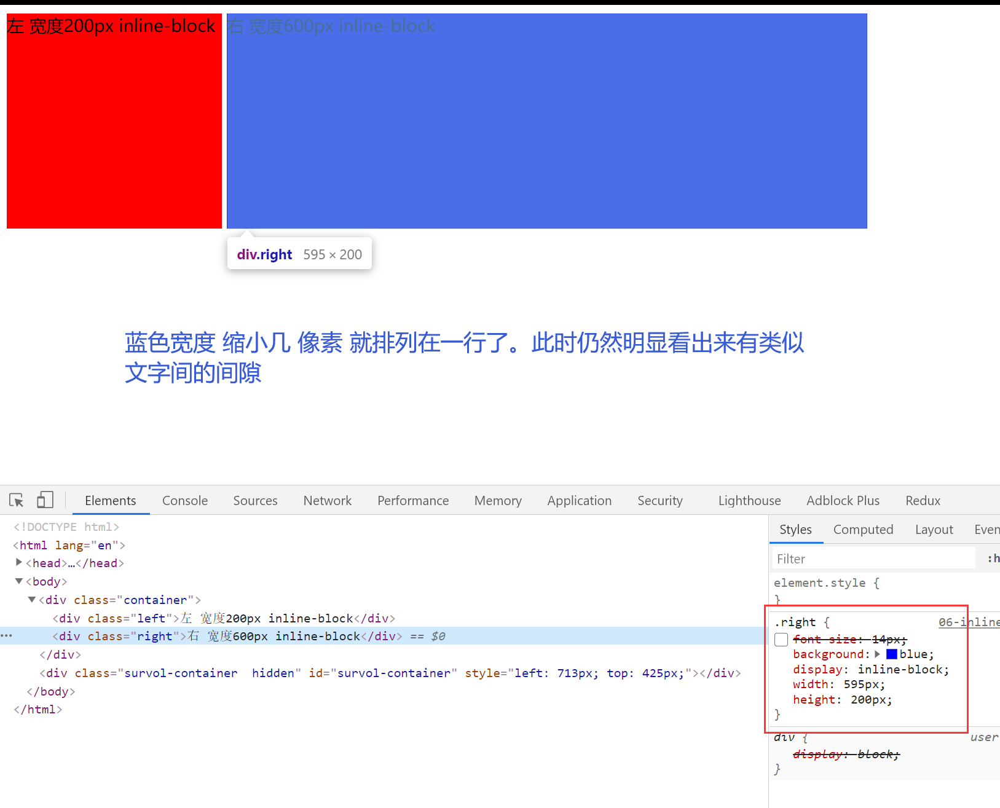

### 解决间隙：

1.设置字体大小

父级元素的字体大小设置为 0,子元素手动设置大小

```html
<!DOCTYPE html>
<html lang="en">
  <head>
    <meta charset="UTF-8" />
    <meta name="viewport" content="width=device-width, initial-scale=1.0" />
    <meta http-equiv="X-UA-Compatible" content="ie=edge" />
    <title>Document</title>
    <style>
      .container {
        width: 800px;
        height: 200px;
        /* font-size:0; */
      }
      .left {
        /* font-size:14px; */
        background: red;
        display: inline-block;
        width: 200px;
        height: 200px;
      }
      .right {
        /* font-size:14px; */
        background: blue;
        display: inline-block;
        width: 600px;
        height: 200px;
      }
    </style>
  </head>
  <body>
    <div class="container">
      <div class="left">左 宽度200px inline-block</div>
      <div class="right">右 宽度600px inline-block</div>
    </div>
  </body>
</html>
```

2.间隙的来源是因为元素中的间隔【不推荐】

删除代码元素间的间隔也可以解决

## 8.响应式布局

- 不同设备的使用
- 处理屏幕大小的问题
- 主要的方法：隐藏 + 折行 + 自适应的空间
- rem/viewport/media query

如果要在移动端：首先要加上`viewport`

```html
<meta name="viewport" content="width=device-width, initial-scale=1.0" />
```

### demo1

```html
<!DOCTYPE html>
<html lang="en">
  <head>
    <meta charset="UTF-8" />
    <meta name="viewport" content="width=device-width, initial-scale=1.0" />
    <meta http-equiv="X-UA-Compatible" content="ie=edge" />
    <title>responsive</title>
    <style>
      .container {
        margin: 0 auto;
        max-width: 800px;
        display: flex;
        border: 1px solid black;
      }
      .left {
        display: flex;
        width: 200px;
        background: red;
        margin: 5px;
      }
      @media (max-width: 640px) {
        .left {
          display: none;
        }
      }
      .right {
        display: flex;
        flex: 1;
        background: blue;
        margin: 5px;
      }
    </style>
  </head>
  <body>
    <div class="container">
      <div class="left">这里是一些不重要的内容，比如友情链接、广告</div>
      <div class="right">
        这里是一些重要的内容，比如一篇文章，文章是整个页面的核心内容。这里是一些重要的内容，比如一篇文章，文章是整个页面的核心内容。这里是一些重要的内容，比如一篇文章，文章是整个页面的核心内容。这里是一些重要的内容，比如一篇文章，文章是整个页面的核心内容。这里是一些重要的内容，比如一篇文章，文章是整个页面的核心内容。这里是一些重要的内容，比如一篇文章，文章是整个页面的核心内容。这里是一些重要的内容，比如一篇文章，文章是整个页面的核心内容。这里是一些重要的内容，比如一篇文章，文章是整个页面的核心内容。这里是一些重要的内容，比如一篇文章，文章是整个页面的核心内容。这里是一些重要的内容，比如一篇文章，文章是整个页面的核心内容。
      </div>
    </div>
  </body>
</html>
```

### demo2 固定使用 width 的值

```
<meta name="viewport" content="width=320">
```

### demo3 使用 rem 代替 px

```html
<!DOCTYPE html>
<html lang="en">
  <head>
    <meta charset="UTF-8" />
    <meta name="viewport" content="width=device-width, initial-scale=1.0" />
    <meta http-equiv="X-UA-Compatible" content="ie=edge" />
    <title>responsive</title>
    <style>
      html {
        font-size: 20px;
      }
      .container {
        margin: 0 auto;
        max-width: 800px;
        border: 1px solid black;
      }
      .intro {
        display: inline-block;
        width: 9rem;
        height: 9rem;
        line-height: 9rem;
        text-align: center;
        border-radius: 4.5rem;
        border: 1px solid red;
        margin: 0.3rem;
      }
      /* 对rem 进行适配 媒体查询 范围大的放在上面 范围小的放在下面 防止多次匹配 */
      @media (max-width: 375px) {
        html {
          font-size: 24px;
        }
      }
      @media (max-width: 320px) {
        html {
          font-size: 20px;
        }
      }
      @media (max-width: 640px) {
        .intro {
          margin: 0.3rem auto;
          display: block;
        }
      }
    </style>
  </head>
  <body>
    <div class="container">
      <div class="intro">介绍1</div>
      <div class="intro">介绍2</div>
      <div class="intro">介绍3</div>
      <div class="intro">介绍4</div>
    </div>
  </body>
</html>
```

## 9.国内网站的布局方式

腾讯 网易 百度 淘宝 苹果

## 10.常见的面试题

### 1.实现两栏或者三栏 布局的方法

- 表格布局
- float margin
- inline-block
- flex

### 2.position :absolute /fixed 区别

- 参照物不同
- absolute：相对于最近的 absolute relative fixed 进行定位
- fixed：相对于 屏幕进行定位【例如常见的滚动到顶部的按钮】

### 3.display:inline-block 为什么会有间隙

- 间隙的原因是空格字符
- 解决：消灭字符间距，或者改变字体大小

### 4.如何清除浮动

**浮动的原因：**浮动的元素不会占据父元素的空间，因此可能会对其他元素造成影响。

**清除浮动：**

- 让盒子负责自己的布局：overflow:hidden(auto)
- 使用 clear:both 【可采用增加伪元素的方法】

### 5.如何适配移动端页面

- 首先要增加`viewport`
- 使用 rem/viewport/media query
- 在设计上：进行隐藏 折行 自适应
