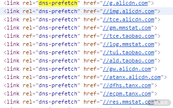

# 再次熟悉 html 标签

## 1.mete 标签：自动刷新/跳转

### 自动跳转：

5s 之后自动跳转到同域下的 page2.html 页面

```html
<meta http-equiv="Refresh" content="5; URL=page2.html" />
```

### 自动刷新：

每隔一分钟就需要刷新页面的大屏幕监控

```html
<meta http-equiv="Refresh" content="60" />
```

### 缺点是：

刷新和跳转操作是`不可取消的`，所以对刷新时间间隔或者需要手动取消的，还是推荐使用 JavaScript 定时器来实现。

## 2.title 标签实现消息提醒的功能

```js
let msgNum = 1; // 消息条数
let cnt = 0; // 计数器
const inerval = setInterval(() => {
  cnt = (cnt + 1) % 2;
  if (msgNum === 0) {
    // 通过DOM修改title
    document.title += `聊天页面`;
    clearInterval(interval);
    return;
  }
  const prefix = cnt % 2 ? `新消息(${msgNum})` : "";
  document.title = `${prefix}聊天页面`;
}, 1000);
```

**注意：**浏览器会对 title 标签实现去空格效果。

## 3.性能优化

性能问题无外乎两方面原因：渲染速度慢、请求时间长。

```js
window.addEventListener("load", () => {
  console.log("界面所有的元素加载完毕，包括图片");
});
document.addEventListener("DOMContentLoaded", () => {
  console.log("DOM渲染完了，此时图片或者视频还没有加载完");
});
```

简略版浏览器的渲染：

渲染引擎在解析 HTML 时候，遇到 script 标签，会暂停解析，通知网络线程加载文件，在文件加载完毕后，通知 JavaScript 引擎来执行对应的代码，代码执行结束以后 切换为渲染引擎继续渲染界面。

页面的首次渲染包含了请求文件和 执行文件的时间，但是页面的首次渲染可能并不依赖这些文件，这些请求和执行文件的动作反而延长了用户看到页面的时间，降低了用户的体验。

为了减少这些请求时间和执行文件的时间的损耗，借助`script`的 3 个属性来实现。

- async 属性：立即请求文件，但是不会阻塞渲染引擎，在`文件加载完毕后 阻塞渲染引擎 并 立即执行 文件内容`。
- defer 属性：立即请求文件，但是不阻塞渲染引擎，在`解析完HTML 之后再执行文件内容`。【推荐不涉及到 DOM 操作的使用这个】
- HTML5 标准的 type 属性：对应值为 “module”。让浏览器按照 ES6 标准把文件当作模块进行解析，默认阻塞效果同 defer ,也可以配合 async 在请求完成以后立即执行。


**绿色的线表示执行解析 HTML ，蓝色的线表示请求文件，红色的线表示执行文件。**

### 为什么要把 script 标签放在 body 的底部？

当渲染引擎执行到 body 底部时会先将已解析的内容渲染出来，然后再去请求相应的 JavaScript 文件。

## 4.link 标签 rel 属性：通过预处理 提升渲染速度

- **dns-prefetch**。当 link 标签的 rel 属性值为“dns-prefetch”时，浏览器会对某个域名预先进行 DNS 解析并缓存。这样，当浏览器在请求同域名资源的时候，能省去从域名查询 IP 的过程，从而减少时间损耗。下图是淘宝网设置的 DNS 预解析。



- **preconnect**。让浏览器在一个 HTTP 请求正式发给服务器前预先执行一些操作，这包括 DNS 解析、TLS 协商、TCP 握手，通过消除往返延迟来为用户节省时间。
- **prefetch/preload**。两个值都是让浏览器预先下载并缓存某个资源，但不同的是，prefetch 可能会在浏览器忙时被忽略，而 preload 则是一定会被预先下载。
- **prerender**。浏览器不仅会加载资源，还会解析执行页面，进行预渲染。
- 

## 5.搜索优化

### meta 标签：提取关键信息

```html
<meta
  content="拉勾,拉勾网,拉勾招聘,拉钩, 拉钩网 ,互联网招聘,拉勾互联网招聘, 移动互联网招聘, 垂直互联网招聘, 微信招聘, 微博招聘, 拉勾官网, 拉勾百科,跳槽, 高薪职位, 互联网圈子, IT招聘, 职场招聘, 猎头招聘,O2O招聘, LBS招聘, 社交招聘, 校园招聘, 校招,社会招聘,社招"
  name="keywords"
/>
```

### link 标签：减少重复

有时候为了用户访问方便或者出于历史原因，对于同一个页面会有多个网址，又或者存在某些重定向页面，比如：

- [https://lagou.com/a.html](https://edu.lagou.com/)
- [https://lagou.com/detail?id=](https://edu.lagou.com/)"abcd"

那么在这些页面中可以这样设置：

复制代码

```html
<link href="https://lagou.com/a.html" rel="canonical" />
```

这样可以让搜索引擎避免花费时间抓取重复网页。不过需要注意的是，它还有个限制条件，那就是指向的网站不允许跨域
