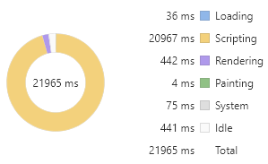

# 高效操作 DOM 元素

## 1.什么是 DOM

DOM（Document Object Model，文档对象模型）是 JavaScript 操作 HTML 的接口。

- 标签是 HTML 的基本单位，比如 p、div、input；
- 节点是 DOM 树的基本单位，有多种类型，比如`注释节点、文本节点`；
- 元素是节点中的一种，与 HTML 标签相对应，比如 `p 标签会对应 p 元素`。

在下面的代码中，“p” 是标签， 生成 DOM 树的时候会产生两个节点，一个是元素节点 p，另一个是字符串为“亚里士朱德”的文本节点。

```html
<p>亚里士朱德</p>
```

## 2.为什么说 DOM 耗时呢？

浏览器包含了·`渲染引擎【浏览器内核】`和`JavaScript 引擎`，它们都是单线程的运行的。

单线程的好处：

- 避免多线程下的死锁，竞争

劣势是失去了并发能力。

### 单线程的双引擎 互斥性 上下文切换

因为存在两个引擎，但是只有一个界面，为了保证两个引擎同时修改界面会导致出界面渲染 的结果不一致的情况下，增加了一个互斥机制，即则两个引擎具有`互斥性`，一个在工作的时候【修改界面】，另外一个必须歇着【阻塞状态】。而操作系统在进行`线程切换`的时候需要保存上一个线程执行时的状态信息【类似于存档，打游戏打了一半，想换个游戏打，先存档】，并且会去读取下一个线程的状态信息【读档另外一个游戏】，这个就叫做`上下文切换`，这个就是比较耗时的【游戏没有玩舒服，全在读档和存档了】。

测试读取耗时 和读取 json 对象的耗时

```js
// 测试次数：一百万次
const times = 1000000;
// 缓存body元素
console.time("object");
let body = document.body;
// 循环赋值对象作为对照参考
for (let i = 0; i < times; i++) {
  let tmp = body;
}
console.timeEnd("object"); // object: 1.77197265625ms
console.time("dom");
// 循环读取body元素引发线程切换
for (let i = 0; i < times; i++) {
  let tmp = document.body;
}
console.timeEnd("dom"); // dom: 18.302001953125ms
```

### 重绘 和 重排

元素及样式变化引起的再次渲染，而在渲染过程中 最耗时的 两个步骤是**重排**（Reflow）与**重绘**（Repaint）。

#### **浏览器的渲染机制：**

浏览器在渲染页面的时候，会把 HTML 和 css 分别解析成为`DOM树`和`CSSOM树`，然后合并进行排布，在绘制为可见的界面。如果操作 DOM 时涉及到元素和样式的修改，就会导致渲染引擎重新计算样式生成新的 CSSOM 树，同时还有可能触发对元素的`重新排布和重新绘制`。

#### 引起重排 继而会引发重绘：

- 修改元素的边距，大小
- 添加，删除元素
- 改变窗口的大小

#### 与之相反的就是重绘：

- 设置背景图片
- 修改字体颜色
- 改变 visibility 属性值

如果想了解更多关于重绘和重排的样式属性，可以参看这个网址：https://csstriggers.com/。

使用谷歌 性能分析工具来测试：重排和重绘

修改边距导致重排：

```js
const times = 100000;
let html = "";
for (let i = 0; i < times; i++) {
  html += `<div>${i}</div>`;
}
document.body.innerHTML += html;
const divs = document.querySelectorAll("div");
Array.prototype.forEach.call(divs, (div, i) => {
  div.style.margin = i % 2 ? "10px" : 0;
});
```

老师演示的效果：


我自己电脑跑的效果：


修改颜色导致重绘：

```js
const times = 100000;
let html = "";
for (let i = 0; i < times; i++) {
  html += `<div>${i}</div>`;
}
document.body.innerHTML += html;
const divs = document.querySelectorAll("div");
Array.prototype.forEach.call(divs, (div, i) => {
  div.style.color = i % 2 ? "red" : "green";
});
```

老师演示的效果：


我自己电脑跑的效果：


**疑问：我这个重绘时间都大于重排时间了。**

从两段测试代码中可以看出，重排渲染耗时明显高于重绘，同时两者的 Painting 事件耗时接近，也印证了`重排会导致重绘`。

## 3.高效操作 DOM

#### 在循环外操作元素

```js
const times = 10000;
console.time("switch");
for (let i = 0; i < times; i++) {
  document.body === 1 ? console.log(1) : void 0;
}
console.timeEnd("switch"); // 1.873046875ms
var body = JSON.stringify(document.body);
console.time("batch");
for (let i = 0; i < times; i++) {
  body === 1 ? console.log(1) : void 0;
}
console.timeEnd("batch"); // 0.846923828125ms
```

#### 批量操作元素

要创建 1 万个 div 元素，在循环中直接创建再添加到父元素上耗时会非常多。如果采用字符串拼接的形式，先将 1 万个 div 元素的 html 字符串拼接成一个完整字符串，然后赋值给 body 元素的 innerHTML 属性就可以明显减少耗时。

```js
const times = 10000;
console.time("createElement");
for (let i = 0; i < times; i++) {
  const div = document.createElement("div");
  document.body.appendChild(div);
}
console.timeEnd("createElement"); // 54.964111328125ms
console.time("innerHTML");
let html = "";
for (let i = 0; i < times; i++) {
  html += "<div></div>";
}
document.body.innerHTML += html; // 31.919921875ms
console.timeEnd("innerHTML");
```

使用 innerHTML 来实现批量操作效率高，但是在此基础上增加事件监听就略微麻烦，要么使用事件代理，要么重新选取元素单独绑定。

对一个 div 元素 应用两万次的样式

```js
const times = 20000;
let html = "";
for (let i = 0; i < times; i++) {
  html = `<div>${i}${html}</div>`;
}
document.body.innerHTML += html;
const div = document.querySelector("div");
for (let i = 0; i < times; i++) {
  div.style.fontSize = (i % 12) + 12 + "px";
  div.style.color = i % 2 ? "red" : "green";
  div.style.margin = (i % 12) + 12 + "px";
}
```

耗时如下：


计算两万次的结果仅进行一次样式调整

```js
const times = 20000;
let html = "";
for (let i = 0; i < times; i++) {
  html = `<div>${i}${html}</div>`;
}
document.body.innerHTML += html;

let queue = []; //  创建缓存样式的数组
let microTask; // 执行修改样式的微任务
const st = () => {
  console.log("任务队列的数量", queue.length); // 20000
  const div = document.querySelector("div");
  // 合并样式
  const style = queue.reduce((acc, cur) => ({ ...acc, ...cur }), {});
  console.log({ style });
  // color: "red"
  // fontSize: "19px";
  // margin: "19px";
  for (let prop in style) {
    div.style[prop] = style[prop];
  }
  queue = [];
  microTask = null;
};
const setStyle = (style) => {
  queue.push(style);
  // 创建微任务 当同步的循环执行完以后 异步开始执行
  if (!microTask) microTask = Promise.resolve().then(st);
};
for (let i = 0; i < times; i++) {
  const style = {
    fontSize: (i % 12) + 12 + "px",
    color: i % 2 ? "red" : "green",
    margin: (i % 12) + 12 + "px",
  };
  setStyle(style);
}
```

耗时如下：


这里有一个微任务：先解释一下，js 引擎的循环机制，只有当同步的循环结束以后，才开始执行异步的代码。【后面会有细讲】

virtualDOM 之所以号称高性能，其实现原理就与此类似【把最后计算出来的结果赋值给 DOM,减少操作 DOM 的次数】。

#### 缓存元素集合【减少使用选择器的时间】

将通过选择器函数获取到的 DOM 元素赋值给变量，之后通过变量操作而不是再次使用选择器函数来获取。

假设我们现在要将上面代码所创建的 1 万个 div 元素的文本内容进行修改。每次重复使用获取选择器函数来获取元素，代码以及时间消耗如下所示。

```js
for (let i = 0; i < document.querySelectorAll("div").length; i++) {
  document.querySelectorAll(`div`)[i].innerText = i;
}
```



如果能够将`元素集合赋值给 JavaScript 变量`，每次通过变量去修改元素，那么性能将会得到不小的提升

```js
const divs = document.querySelectorAll("div");
for (let i = 0; i < divs.length; i++) {
  divs[i].innerText = i;
}
```


除了这些方法之外，还有一些原则也可能帮助我们提升渲染性能，比如：

- 尽量不要使用复杂的匹配规则和复杂的样式，从而减少渲染引擎计算样式规则生成 CSSOM 树的时间；【不要为难浏览器，浏览器也不为难你】
- 尽量减少重排和重绘影响的区域；
- 使用 CSS3 特性来实现动画效果。
