# 变量类型和计算汇总

## 面试题：

- typeof 能判断哪些类型？ 扩展【几种判断类型的方案】
- 何时使用 `===` 何时使用 `==`
- 值类型和引用类型的区别
- 手写深拷贝
- 有几种形式的数据类型【字符串，数字，布尔】
- 什么是显式转换和隐式转换
- 有几种数据类型

## 1.值类型

```js
let a = 100;
let b = a; // a 赋值给b
console.log(b); // 100
```

值类型是在栈中存储的。

原理图解：

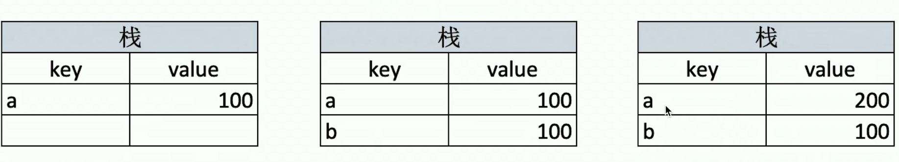

### 常见值类型

```js
let a; // undefined
const s = "an"; //string
const m = 100; // number
const b = true; // boolean
const s = Symbol("s"); //Symbol 提示 创建Symbol 是使用构造函数
```

## 2.引用类型【内存地址】

```js
let a = { age: 20 };
let b = a; // a 赋值给b
a.age = 21;
console.log(b.age); // 21
```

原理图解：

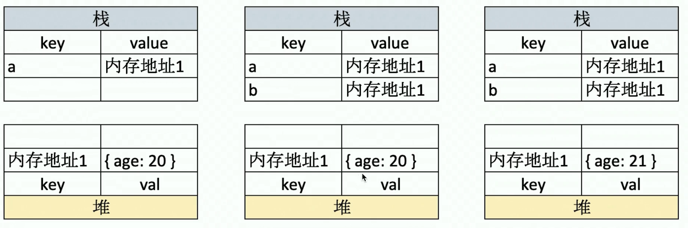

### 为什么要使用内存地址呢？

- 怕 内存中存储的数据太多，完整拷贝减少损耗，提高性能，才使用指向同一个内存地址的方法。【类似于快捷方式】

### 常见引用类型：

```js
const obj = { age: 90 }; // 对象
const array = [1, 2, 3]; // 数组
const n = null; // 特殊引用类型 指针指向为空地址

function fn() {} // 特殊引用类型，但不用于存储数据，没有拷贝 复制函数这一说法
```

## 3.typeof 可判断的类型

### 可判断所有的简单类型【值类型】

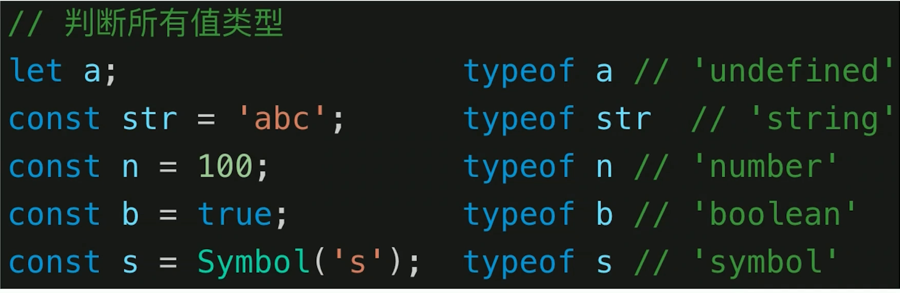

### 所有的引用类型全是 object 【null 是特殊引用类型】

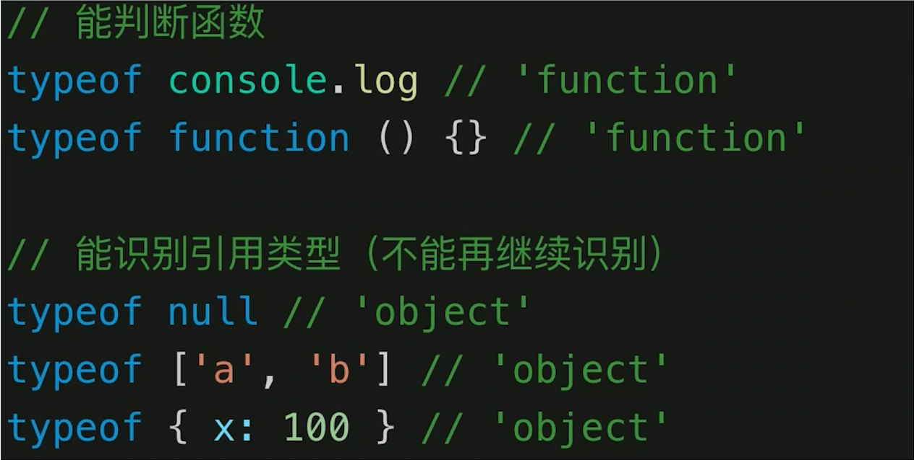

## 4.深拷贝

```js
function deepClone(obj = {}) {
  if (typeof obj !== "object" || obj == null) {
    // obj 是 null 或者 是简单类型
    return obj;
  }
  let result;
  //   判断是不是数组
  if (obj instanceof Array) {
    result = [];
  } else {
    result = {};
  }
  for (const key in obj) {
    if (Object.hasOwnProperty.call(obj, key)) {
      const element = obj[key];
      result[key] = deepClone(element);
    }
  }
  return result;
}

const obj1 = {
  a: "aaa",
  b: true,
  c: 12,
  d: ["1", 2, 4],
  e: {
    age: 40,
  },
  f: {
    g: {
      h: {
        i: {
          k: [444],
          l: 22,
        },
      },
    },
  },
};

const obj2 = deepClone(obj1);

obj1.a = "bbb";
obj1.f = ["ssssssssss"];
console.table(obj1);
console.table(obj2);
```

## 5.变量计算和类型转换

- 字符串拼接
- ==
- if 语句和逻辑运算

### 字符串拼接

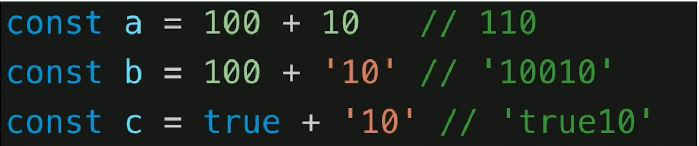

### == 运算符

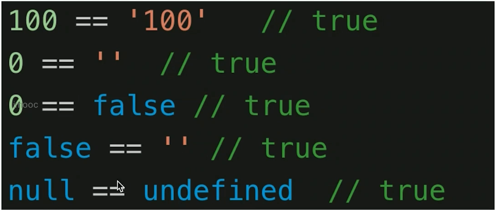

### 何时用 == 判断 对象的属性是否存在的时候

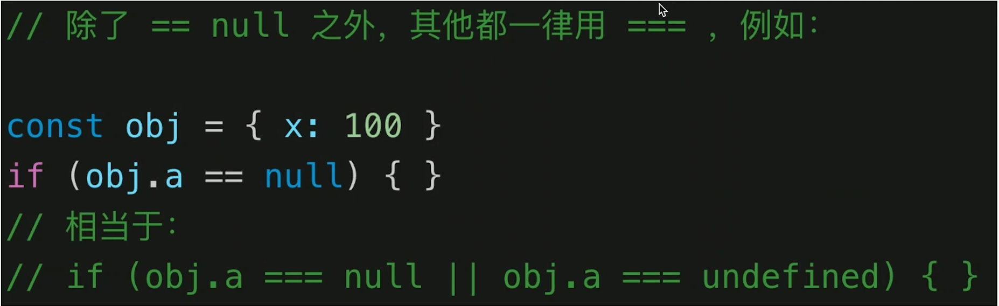

### if 语句和逻辑运算

强转为布尔类型的

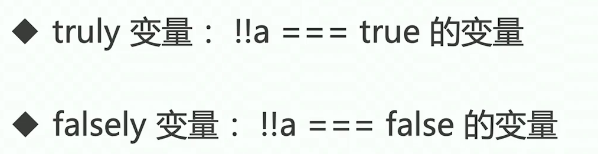

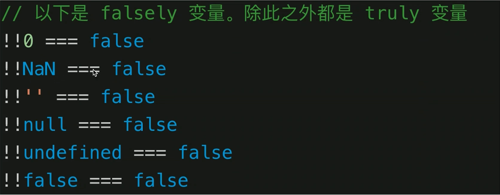

### 逻辑判断 `与或非`

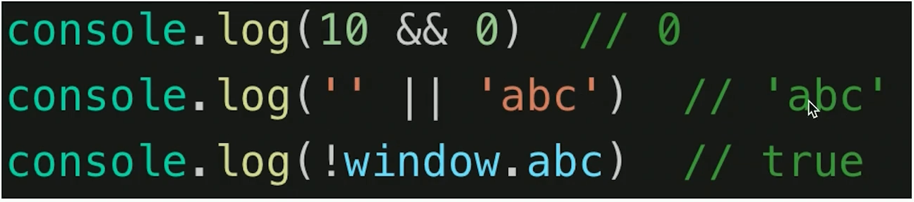

## 6.问题解答

### 1.typeof 可以判断的值类型


### 2.何时使用 == 何时使用 ===

除了判断对象中属性值是否存在使用`==`，其他的全是 `===`

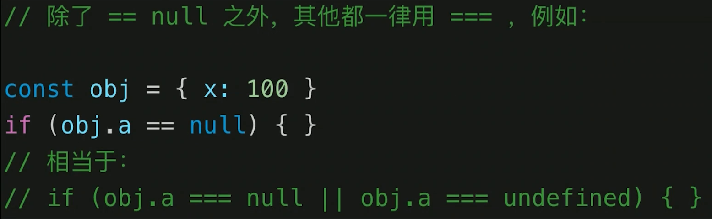

### 3.值类型 和 引用类型的区别

值类型的赋值是直接成功的。

而引用类型的赋值是 仅仅指向了同一片内存地址，所以内存地址中数据的改变，会导致所有指向该地址的变量的值都发生改变。

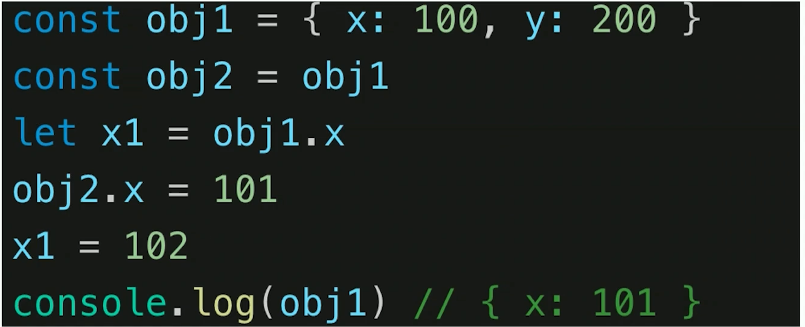

### 4.手写深拷贝


### 5.小结

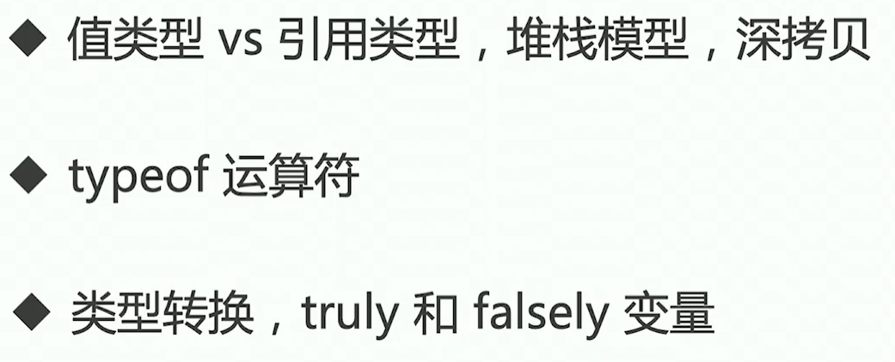

### 6.数组的长度特性

- 此处数组的长度是数组元素的个数 ，不要和数组的索引号混淆。
- 当数组里面的元素个数发生了变化，这个 length 属性跟着一起变化
- **数组的 length 属性可以被修改：**【清空数组的正确操作 应该是 length = 0】
- 如果设置的 length 属性值**大于**数组的元素个数，则会在数组末尾出现空白元素；
- 如果设置的 length 属性值小于数组的元素个数，则会把超过该值的数组元素删除
