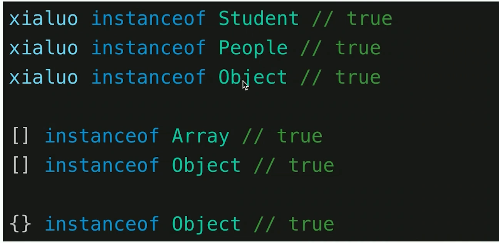
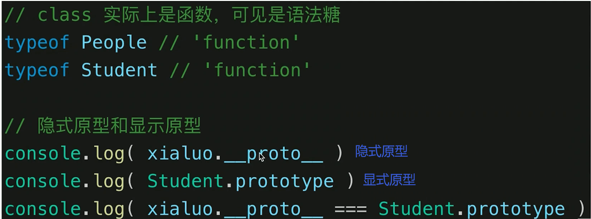
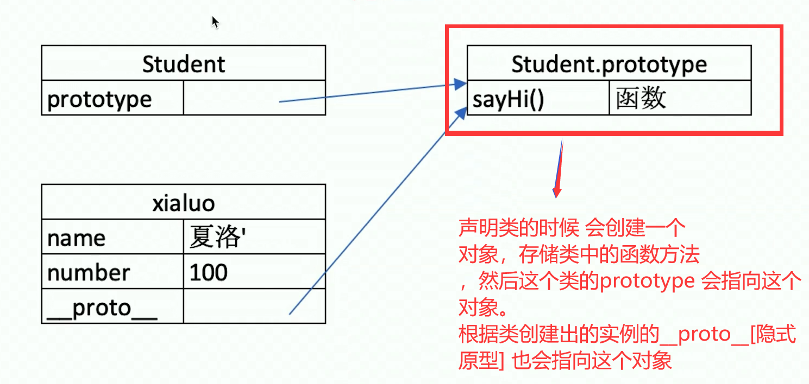
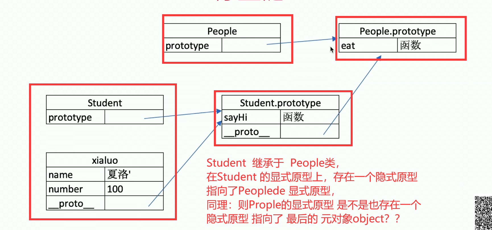
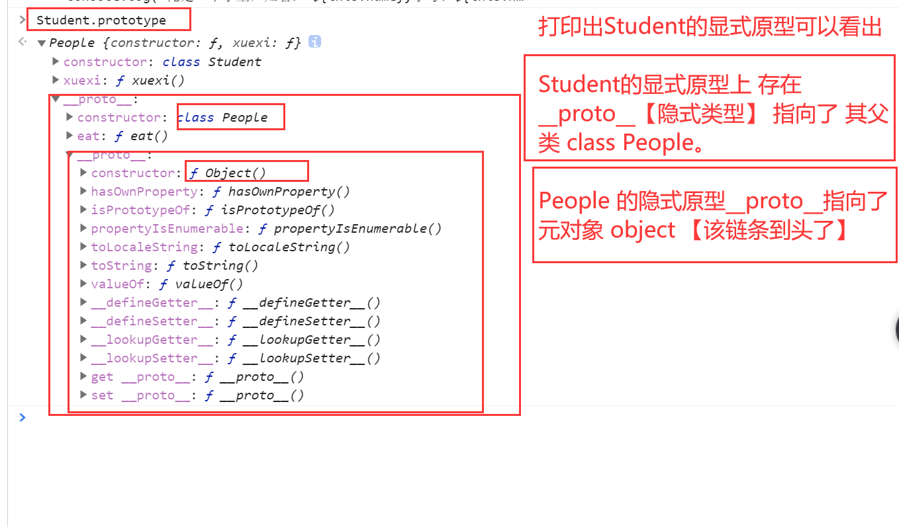
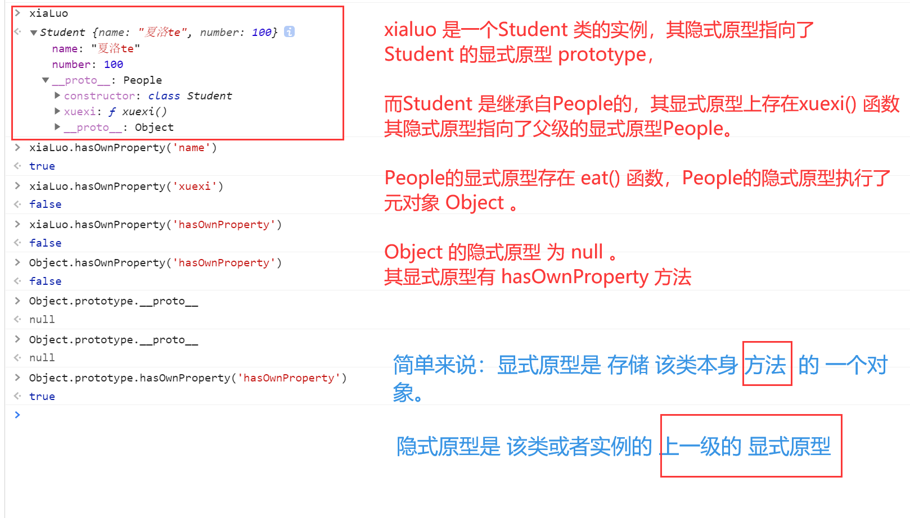
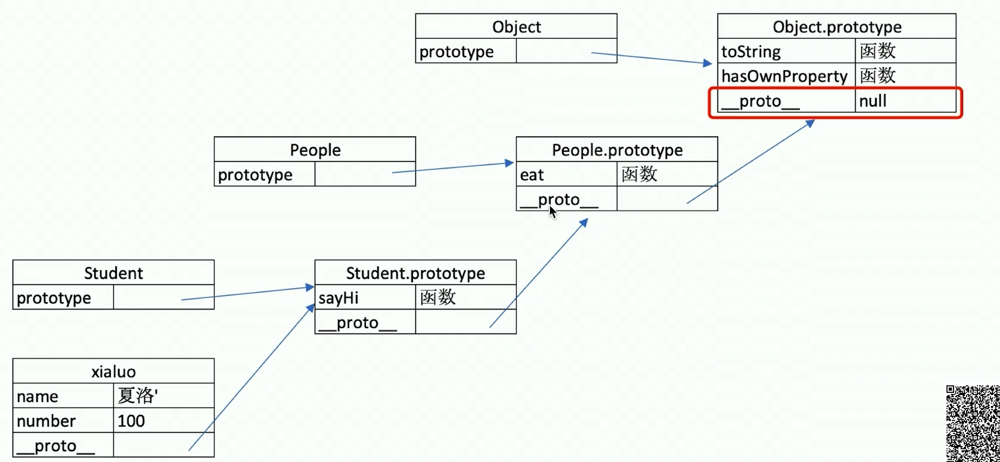
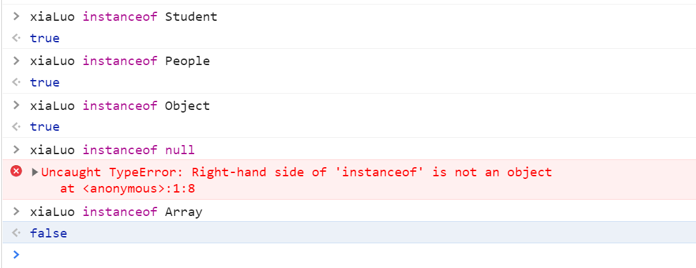

# 原型和原型链

**js 本身是基于`原型`继承的语言**

## 0.面试题

- 如何准确判断一个变量是不是数组
- 手写一个简易的 jQuery,考虑插件和扩展性
- class 的原型本质，怎么理解

## 1.class 和继承

### class

```js
class People {
  constructor(name) {
    this.name = name;
  }
  eat() {
    console.log(`${this.name} eating`);
  }
}
class Student extends People {
  constructor(name, number) {
    // this.name = name;
    super(name);
    this.number = number;
  }
  xuexi() {
    console.log(`俺是一个学生，姓名： ${this.name},学号: ${this.number}`);
  }
}

class Teacher extends People {
  constructor(name, major) {
    super(name);
    this.major = major;
  }
  teach() {
    console.log(`老师：俺是${this.name}:教的是${this.major}`);
  }
}

// 创建一个实例
const xiaLuo = new Student("夏洛te", 100);
console.log(xiaLuo); // Student {name: "夏洛te", number: 100}
console.log(xiaLuo.name); // "夏洛te
console.log(xiaLuo.number); // 100
console.log(xiaLuo.eat()); // 夏洛te eating
console.log(xiaLuo.xuexi()); // 俺是一个学生，姓名： 夏洛te,学号: 100

const wang = new Teacher("王老师", "语文");
console.log(wang);
console.log(wang.name);
console.log(wang.major);
console.log(wang.eat());
console.log(wang.teach());
```

### 继承

- 通过`extends`来继承的
- 通过`super`调用父级的构造函数
- 可以扩展和重写父类方法

### 类型判断——instanceof



### 原型 【隐式原型和显式原型】





**总结**：当声明一个类[Student]的时候，会创建一个对象，存储类中的方法，然后这个类的`prototype` 【`显式原型`】会指向这个对象。

当使用该类创建出一个实例的时候[xialuo]，该实例的`__proto__`【`隐式原型`】会指向同一个存储类方法的对象。

### 原型关系【类和实例的关系】

- 每个`class`都有显示原型 `prototype`
- 每个实例都有隐式原型 `__proto__`
- 实例的 `__proto__` 指向对应 class 的 `prototype`

### 基于原型的执行规则

- 获取属性 `xialuo.name` 或执行方法 `xiaoluo.sayHi()`的时候
- 首先在自身属性和方法中寻找
- 如果找不到的话 会自动去 `__proto__`中寻找

### 原型链 【类和类的继承关系】

Student 继承自 People。


图解：



通过继承的方法，导致子类的显式原型中，即存在隐式原型 指向了继承的父类，

也存在显式原型 被该类的 实例所引用。



```js
People.prototype.__proto__ === Object.prototype; // true

Student.prototype.__proto__ === Object.prototype; // false
Student.prototype.__proto__ === People.prototype; // true
```

### 判断该对象本身是否存在某个属性 `hasOwnProperty`

xialuo 是一个 Student 的实例



包含元对象 Object 的原型链





## 2.手写 JQuery 简易版

```js
class JQuery {
  constructor(selector) {
    const elems = document.querySelectorAll(selector);
    const length = elems.length;
    for (let i = 0; i < length; i++) {
      this[i] = elems[i];
    }
    //    类数组 类似于数组 但是不是数组
    this.length = length;
  }
  get(index) {
    return this[index];
  }
  each(fn) {
    for (let i = 0; i < this.length; i++) {
      fn(this[i], i);
    }
  }
  on(type, fn) {
    return this.each((elem, index) => {
      elem.addEventListener(type, fn, false);
    });
  }
}

// 扩展的话
JQuery.prototype.dialog = (info) => {
  alert(info);
};

class MyJQuery extends JQuery {
  constructor(selector) {
    super(selector);
  }
  me() {
    console.log("继承");
  }
}
```
