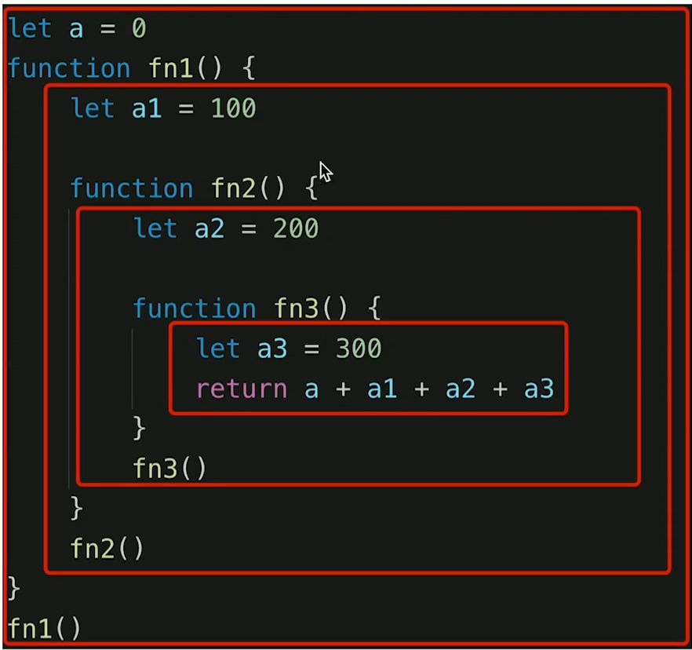
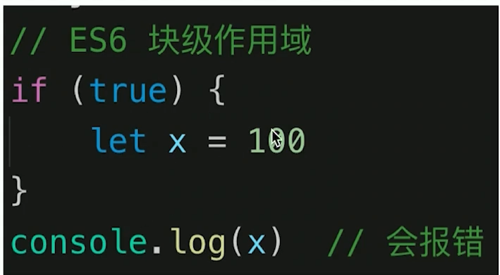
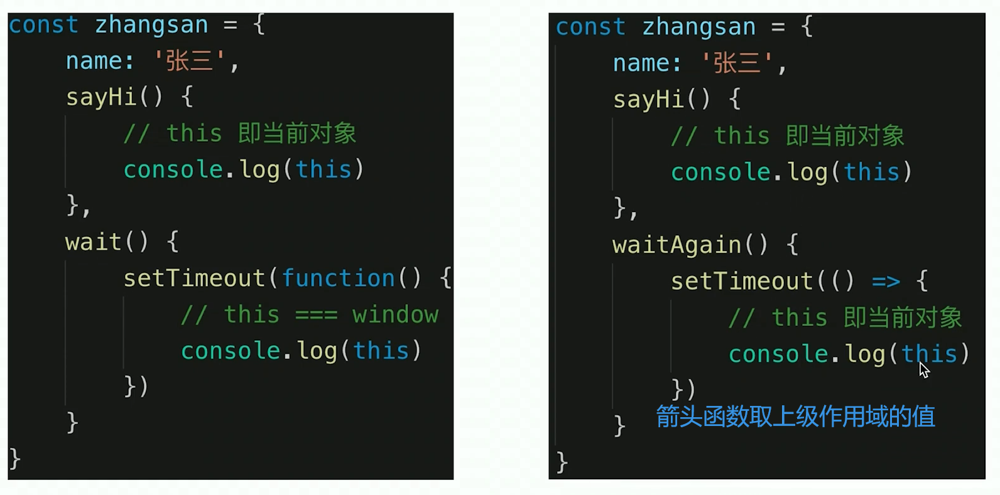
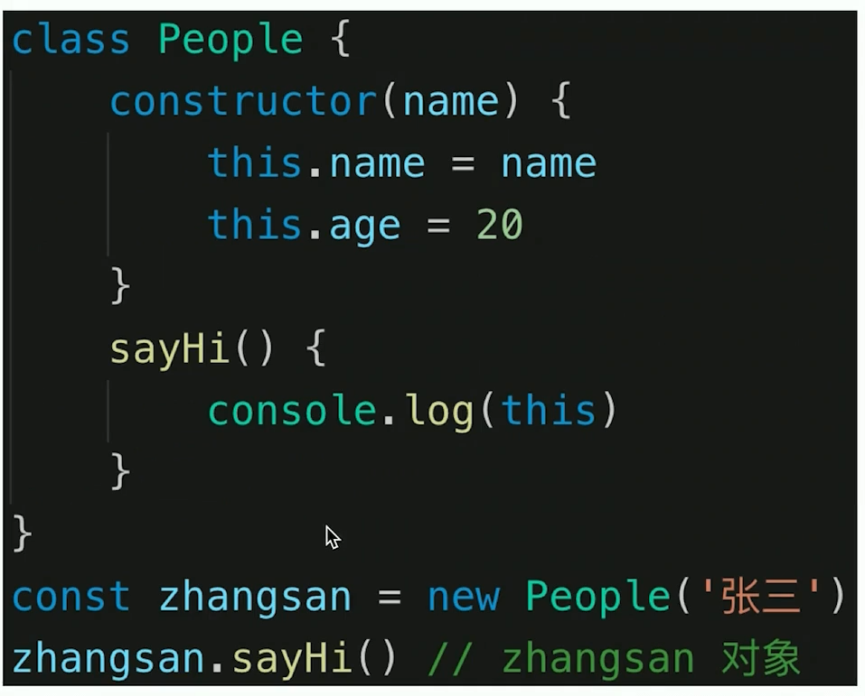

# 作用域和闭包

## 0.面试题和知识点

- this 的不同应用场景，如何取值
- 手写 bind 函数
- 实际开发中闭包的应用场景，举例说明
- 创建 10 个 a 标签，点击时候弹出来对应的序号
- 作用域和作用域链，和变量在作用域的查找规则
- 什么是预解析？
- 创建对象的几种方式？

### 知识点：

- 作用域 和只有变量
- 闭包
- this

## 1.作用域



作用域就是变量的合法的使用范围

### 作用域的分类

- 全局作用域：作用于所有代码执行的环境(整个 script 标签内部)或者一个独立的 js 文件。
- 局部作用域 ：作用于函数内的代码环境，就是局部作用域。 因为跟函数有关系，所以也称为函数作用域。
- 块级作用域：通过`var`声明的变量或者非严格模式下(non-strict mode)创建的函数声明**没有**块级作用域。相比之下，使用 [`let`](https://developer.mozilla.org/zh-CN/docs/Web/JavaScript/Reference/Statements/let)和[`const`](https://developer.mozilla.org/zh-CN/docs/Web/JavaScript/Reference/Statements/const)声明的变量是**有**块级作用域的。



### 自由变量的查找规则【就近原则】【作用域链】

- 一个变量在当前作用域没有定义，但是被使用了
- 会向上级作用域，一层一层的依次寻找，直至找到为止
- 如果全局作用域还没有找到，则报错 xx is not defined

## 2.闭包

- 作用域应用的特殊情况，有两种表现
- 函数作为参数被传递
- 函数作为返回值被返回

**所有的自由变量的查找，是在函数定义的地方，向上级作用域查找，不是在执行的地方**

```js
console.log("函数作为返回值");
function create() {
  let a = 100;
  return function () {
    console.log(a);
  };
}

let fn = create();
let a = 200;
fn(); //100
```

```js
console.log("函数作为参数");

function print(fn2) {
  let b = 200;
  fn2();
}

let b = 300;
function fn2() {
  console.log(b);
}
print(fn2); // 300
```

## 3.this

#### 应用场景

- 作为普通函数调用 // 返回 window
- 使用 call apply bind // 改变 this 指向 传入什么绑定什么
- 作为对象方法被调用 // 当前实例本身
- 在 class 中被调用 //当前实例本身
- 箭头函数 // 找他上级作用域的 this 的值

### 规则：

**this 的取值 是在函数执行时候确定的，不是在函数定义时候确定的**

```js
function fn1() {
  console.log(this);
}

fn1(); // window 对象

fn1.call({ x: 100 }); // { x: 100 }
const fn2 = fn1.bind({ y: 200 }); // bind 返回一个新的函数
fn2(); // { y: 200 }
```





## 4.手写 bind 函数

```js
Function.prototype.bind2 = function () {
  console.log("arguments", arguments);
  // 取出所有的参数
  const args = Array.prototype.slice.call(arguments);
  console.log(args);

  //   要被 bind 的对象 位于参数的第一位
  const t = args.shift();

  // 原来的this 对象  fn1.bind() 中的 fn1
  const self = this;

  return function () {
    return self.apply(t, args);
  };
};

function fn1(a, b, c) {
  console.log("this", this);
  console.log(a, b, c);
  return "this is fn1 hh";
}

// const fn2 = fn1.bind({ x: 100 }, 10, 20, 30);
// fn2();

const fn3 = fn1.bind2({ x: 100 }, 10, 20, 30);
console.log(fn3());
```

## 5.闭包的应用场景

利用闭包隐藏数据，防止数据轻易被篡改

```js
const zhangshan = {
  name: "张三",
  sayHi() {
    //   zhangshan
    console.log(this);
  },
  wait() {
    setTimeout(function () {
      // this === window
      console.log(this);
    });
  },
  waitAgain() {
    setTimeout(() => {
      //zhangshan
      console.log("箭头函数", this);
    });
  },
  get: function () {
    console.log("get", this); // zhangshan
  },
};

zhangshan.sayHi();
zhangshan.wait();
zhangshan.waitAgain();
zhangshan.get();
```

## 6.部分题解答

### 1.什么是预解析？

1.1 预解析的相关概念

    JavaScript 代码是由浏览器中的 JavaScript 解析器来执行的。JavaScript 解析器在运行 JavaScript 代码的时候分为两步：预解析和代码执行。

- 预解析概念：在当前作用域下, JS 代码执行之前，浏览器会默认把带有`var 和 function`声明的变量在内存中进行提前声明或者定义。【**只是把变量提到前面，等号后面的内容等到执行到当前行的时候才会进行赋值**】

- 代码执行： 从上到下执行 JS 语句。

  **预解析会把变量和函数的声明在代码执行之前执行完成。**

  1.2 变量预解析

**预解析也叫做变量、函数提升。**
变量提升（变量预解析）： 变量的声明会被提升到当前作用域的最上面，变量的赋值不会提升。

```js
console.log(num); // 结果是多少？
var num = 10; // ？
```

结果：undefined

注意：**变量提升只提升声明，不提升赋值**

1.3 函数预解析

    函数提升： 函数的声明会被提升到当前作用域的最上面，但是不会调用函数。

```js
fn();
function fn() {
  console.log("打印");
}
```

    结果：控制台打印字符串 --- ”打印“

    注意：函数声明代表函数整体，所以函数提升后，函数名代表整个函数，但是函数并没有被调用！

1.4 函数表达式声明函数问题

```js
// 函数表达式创建函数，会执行变量提升，此时接收函数的变量名无法正确的调用：【等号 后的内容 执行到的时候才会进行赋值】
fn();
var fn = function () {
  console.log("想不到吧");
};
```

    结果：报错提示 ”fn is not a function" // undefined

    解释：该段代码执行之前，会做变量声明提升，fn在提升之后的值是undefined；而fn调用是在fn被赋值为函数体之前，此时fn的值是undefined，所以无法正确调用

### 2.创建对象的几种方式？

#### 1.使用{} 字面量创建对象

```js
var star = {
  name: "pink",
  age: 18,
  sex: "男",
  sayHi: function () {
    alert("大家好啊~");
  },
};
```

#### 2.利用 new Object 创建对象

```js
var andy = new Obect();
andy.name = "pink";
andy.age = 18;
andy.sex = "男";
andy.sayHi = function () {
  alert("大家好啊~");
};
```

#### 3.使用构造函数

```js
function 构造函数名(形参1,形参2,形参3) {
     this.属性名1 = 参数1;
     this.属性名2 = 参数2;
     this.属性名3 = 参数3;
     this.方法名 = 函数体;
}

var obj = new 构造函数名(实参1，实参2，实参3)
```

#### 4.new 关键字的作用和如何手写实现 new

1. 在构造函数代码开始执行之前，创建一个空对象；
2. 修改 this 的指向，把 this 指向创建出来的空对象；
3. 执行函数的代码
4. 在函数完成之后，返回 this---即创建出来的对象
