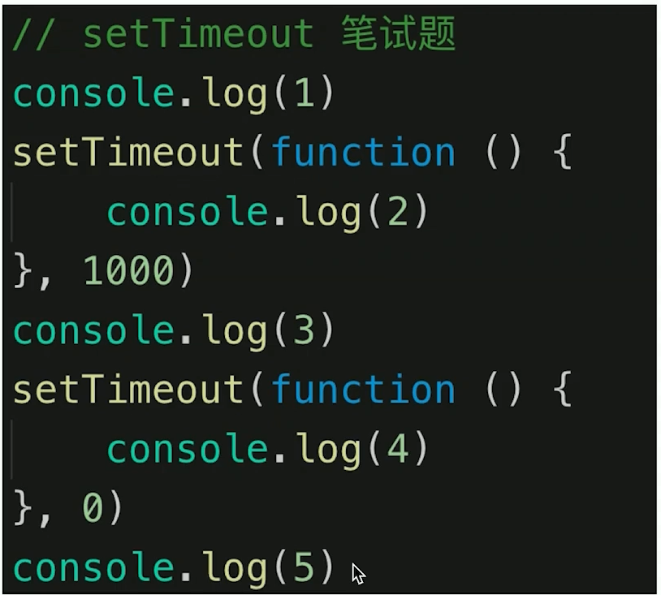
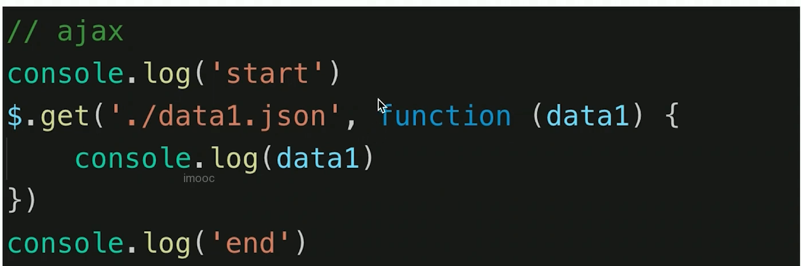
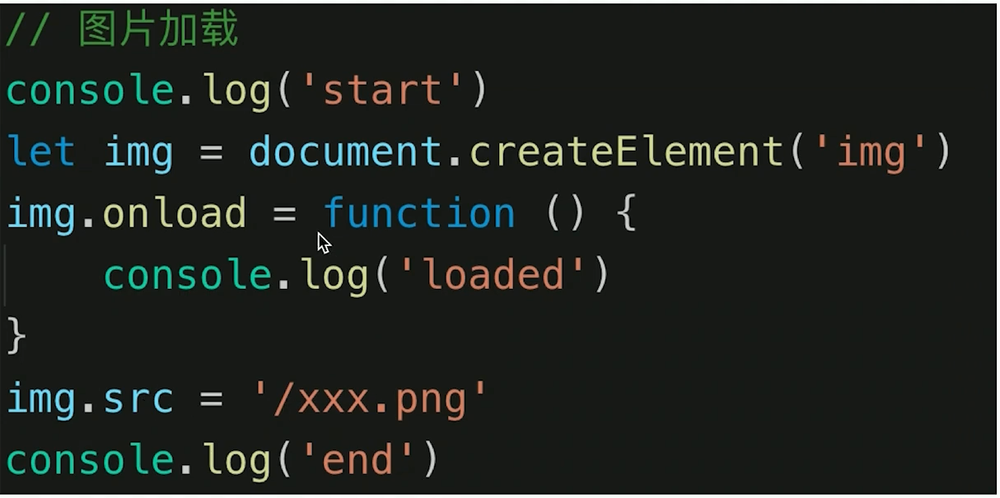
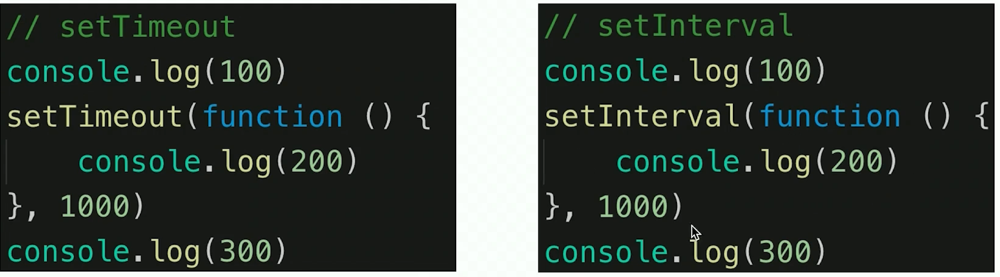
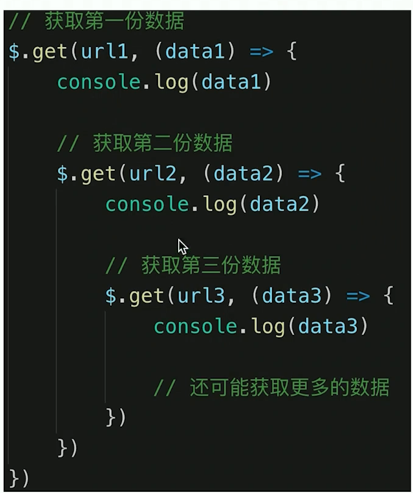
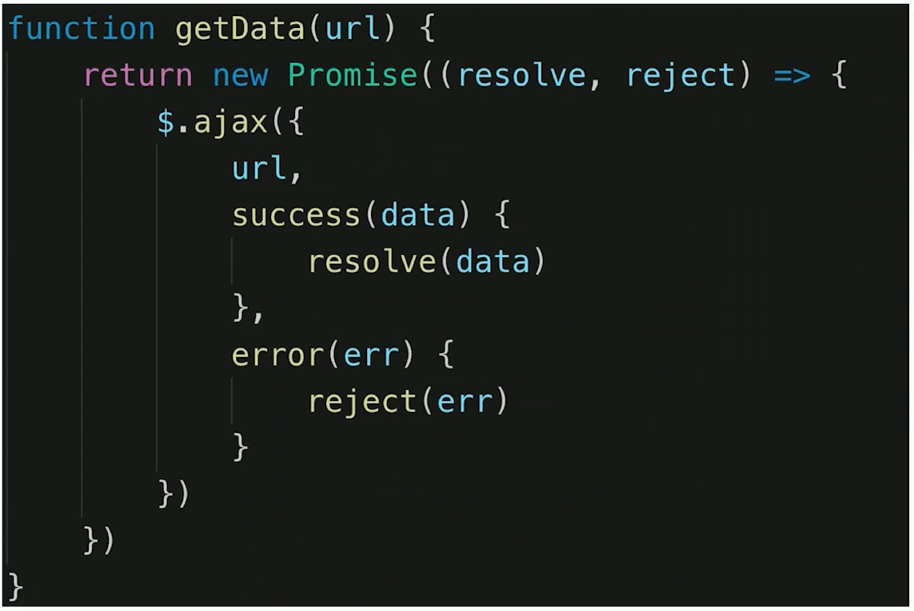
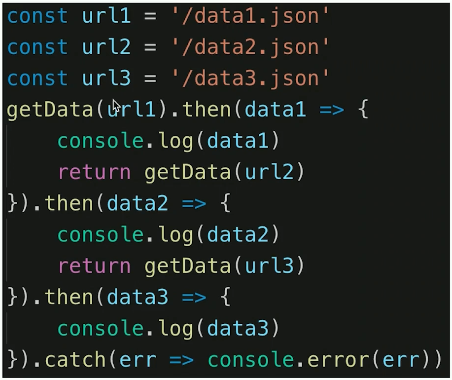

# 异步和单线程

## 0.题目

- 同步和异步的区别是什么？
- 手写用 Promise 加载一张图片
- 前端使用异步的场景有哪些？
- 如下图的打印顺序
- 

### 知识点

- 单线程和异步
- 应用场景
- callback hell 和 Promise

## 1.单线程和异步

- js 是一个单线程的语言，同时只能做一件事
- 浏览器和 node js 已支持 js 启动进程，如 web worker
- js 和 DOM 渲染 共用 同一个线程，因为 JS 可修改 DOM 结构
- 遇到等待（网络请求，定时任务）不能卡住
- 需要异步
- 回调 callback 形式

## 2.异步应用场景

- 网络请求，如 ajax
- 定时任务，如 setTimeout







## 3.Promise 解决回调地狱







## 4.手写 Promise 加载一个图片

```js
function loadImg(src) {
  return new Promise((resolve, reject) => {
    const img = document.createElement("img");
    img.onload = () => {
      resolve(img);
    };
    img.onerror = () => {
      const err = new Error(`img faild ${src}`);
      reject(err);
    };
    img.src = src;
  });
}

const url1 =
  "https://fanyi-cdn.cdn.bcebos.com/static/translation/img/header/logo_40c4f13.svg";
const url2 = "https://scpic.chinaz.net/files/pic/pic9/202101/apic30496.jpg";
loadImg(url1)
  .then((img) => {
    console.log(img.width);
    return { hh: "111" }; // 可以返回一个常量
  })
  .then((obj) => {
    console.log(obj);
    return loadImg(url2); // 返回新的Promise对象
  })
  .then((img2) => {
    console.log(img2.width);
  });
```
