# JS Web API

## 后续内容介绍：

- DOM
- BOM
- 事件绑定
- ajax
- 存储

## 1.DOM 操作（Document Object Modal）

vue 和 react 封装了 DOM 操作，DOM 操作是基础。

详见 MDN 文档：https://developer.mozilla.org/zh-CN/docs/Web/API/Document_Object_Model

## 2.题目和知识点

### 题目：

- DOM 属于那种数据结构？
- DOM 操作的常用 API
- `attribute`和`property`的区别
- 一次性插入多个 DOM 节点，考虑性能

### 知识点：

- DOM 本质：HTML 解析出来的一个 `树结构`
- DOM 节点操作
- DOM 数据结构
- DOM 的性能

## 3.DOM 节点的操作

### 1.获取元素的方法

**Element 获取的是单个的元素，Elements 获取的是一组元素**

- 通过 ID
- 通过 TagName
- 通过 ClassName
- 通过选择器 querySelectorAll("[接受选择器]")

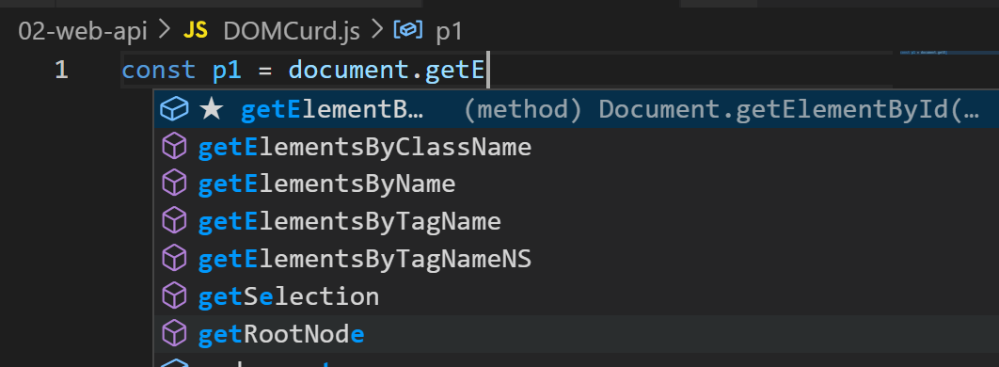

```html
<button>按钮</button>
<div class="div1" id="div1">
  <p class="p-cls" id="p1">p1</p>
  <p class="p-cls">p2</p>
  <p class="p-cls">p3</p>
</div>
<div class="div2">
  <p id="p2">div p1</p>
</div>
```

```js
console.log("获取元素的N中方式");
// 通过id
const p1 = document.getElementById("p1");
console.log("p1变红", p1);
p1.style.color = "red";

// 通过类名获取
console.log("通过类名获取");
const ps = document.getElementsByClassName("p-cls");
console.log(ps);

// 通过标签名 获取所有的 p 元素
console.log("通过标签名 获取所有的 p 元素");
const tagEles = document.getElementsByTagName("p");
console.log(tagEles);

// 通过CSS选择器来获取 p2
console.log("通过CSS选择器来获取 p2");
const p2 = document.querySelector(".div2 #p2");
console.log("p2", p2);

// 通过CSS选择器取多个元素
console.log("通过CSS选择器取多个元素");
const divPList = document.querySelectorAll(".div1 .p-cls");
console.log(divPList);

console.log("获取元素的N中方式 ==== 结束");
```

### 2.节点的 property 修改对象属性

一种 js 操作属性的形式

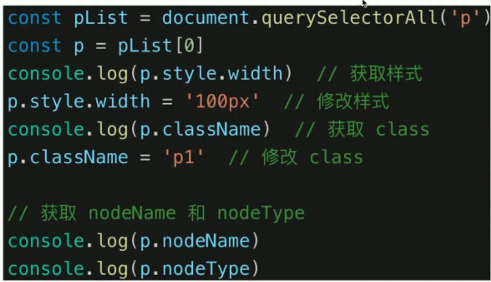

### 3.节点的 attribute 修改的是标签的属性

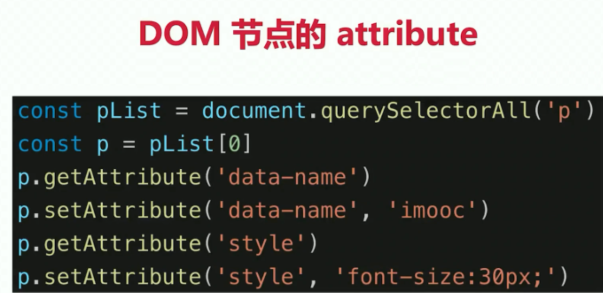

### 4.attribute 和 property 的区别

- property：修改对象属性，不会体现在 HTML 中
- attribute：修改 HTML 属性，会改变 HTML 的结构
- 引起 DOM 重新渲染，尽量使用 property 的操作

## 4.DOM 结构的操作

### 1.新增/插入节点

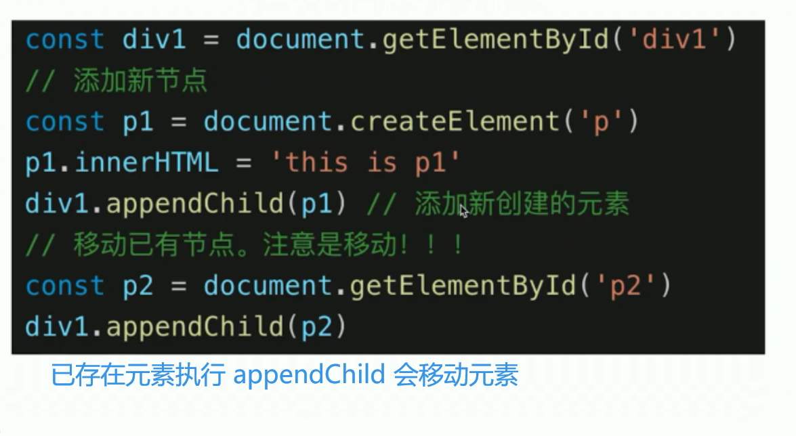

```js
console.log("新增DOM元素开始");
const div1 = document.getElementById("div1");
// 创建新节点
const p = document.createElement("p");
p.innerHTML = "俺是一个新节点";
// 然后放入 div容器
div1.appendChild(p);

// 直接 向容器中 添加已存在元素
const p2 = document.getElementById("p2");
div1.appendChild(p2);
```

结果如图：

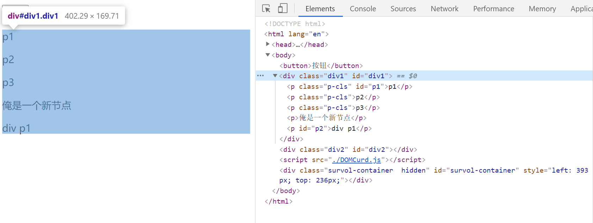

### 2.获取子/父元素

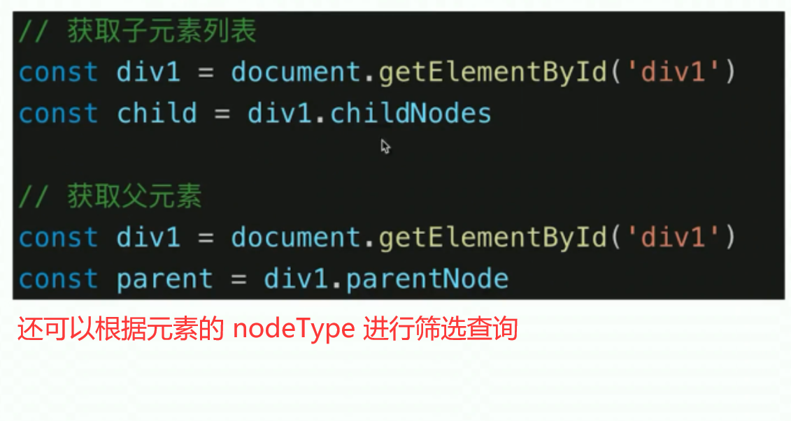

#### 获取子元素的 API 详解【重要】

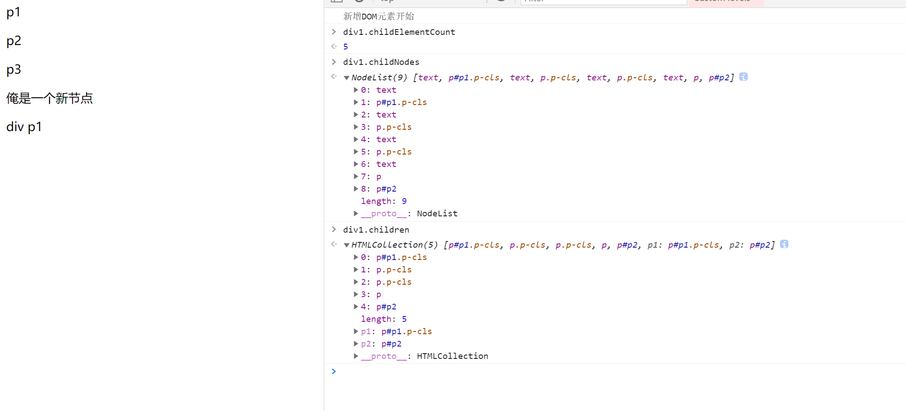

#### childNodes 【子元素的节点的集合】

**Node.childNodes 返回包含指定节点的子节点的集合，该集合为即时更新的集合（live collection）**

https://developer.mozilla.org/zh-CN/docs/Web/API/Node/childNodes

#### children 【返回的是一个动态更新子元素的集合】

**`**ParentNode.children** `是一个只读属性，返回 一个Node的子[`elements`](https://developer.mozilla.org/zh-CN/docs/Web/API/Element) ，是一个动态更新的 [`HTMLCollection`](https://developer.mozilla.org/zh-CN/docs/Web/API/HTMLCollection)。**

https://developer.mozilla.org/zh-CN/docs/Web/API/ParentNode/children

### 3.删除节点【是节点属性】

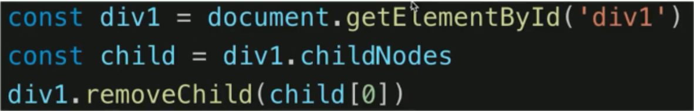

```js
console.log("DOM元素的删除");
const div2 = document.getElementById("div2");
const delEle = div2.removeChild(div2.childNodes[1]);
console.log("被删除的元素", delEle);
```

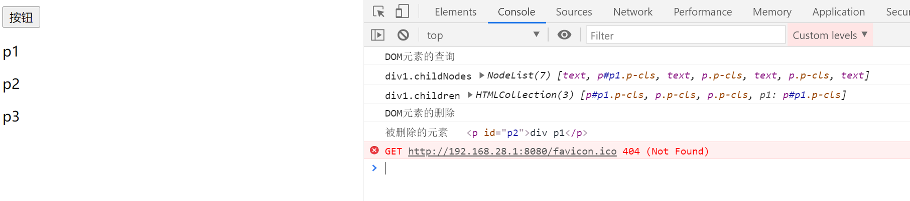

## 5.DOM 的性能【重点】

### 1.原因及优化

- DOM 操作非常 昂贵，耗费 CPU 啥的，避免频繁的 DOM 操作
- 对 DOM 查询进行缓存
- 将频繁操作合并为一次性操作

### 2. 查询结果进行缓存

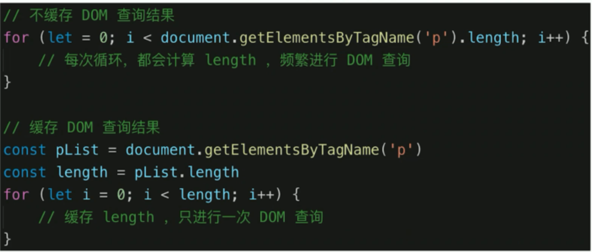

### 3.将频繁操作改为一次性操作

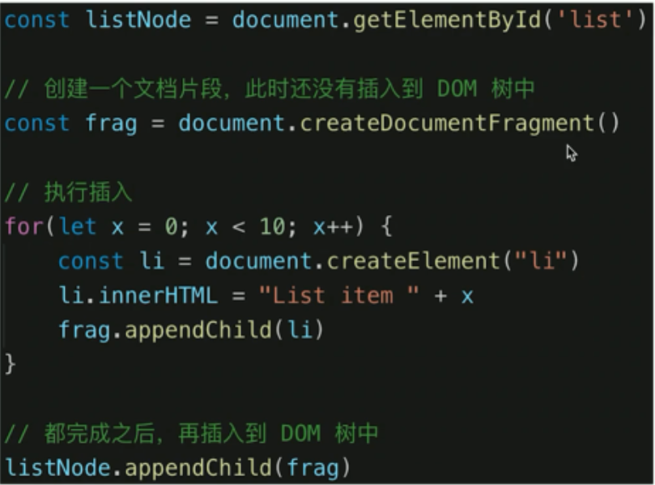

文档片段相当于一个缓存区，存储在内存中，并没有直接执行 DOM 的操作。

## 6.解答

- DOM 属于那种数据结构？【树结构】
- DOM 操作的常用 API。【增删改查】
- `attribute`和`property`的区别。【会不会改变 HTML 的结构】
- 一次性插入多个 DOM 节点，考虑性能
