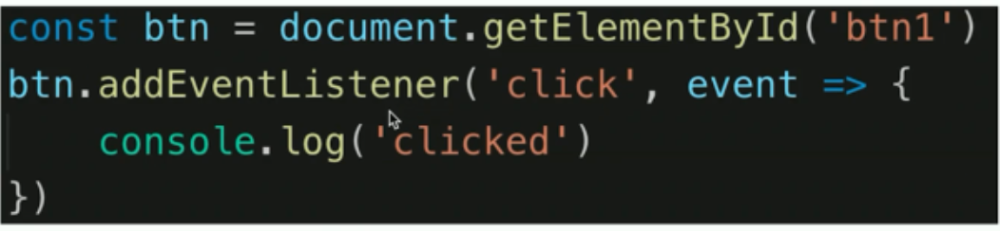
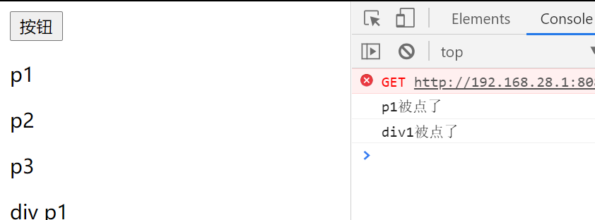
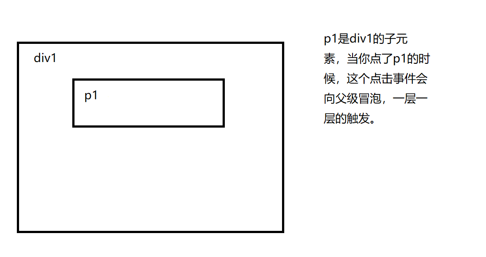
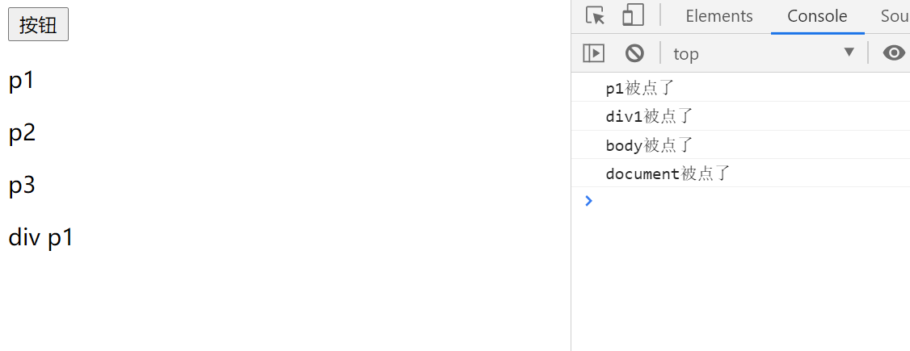
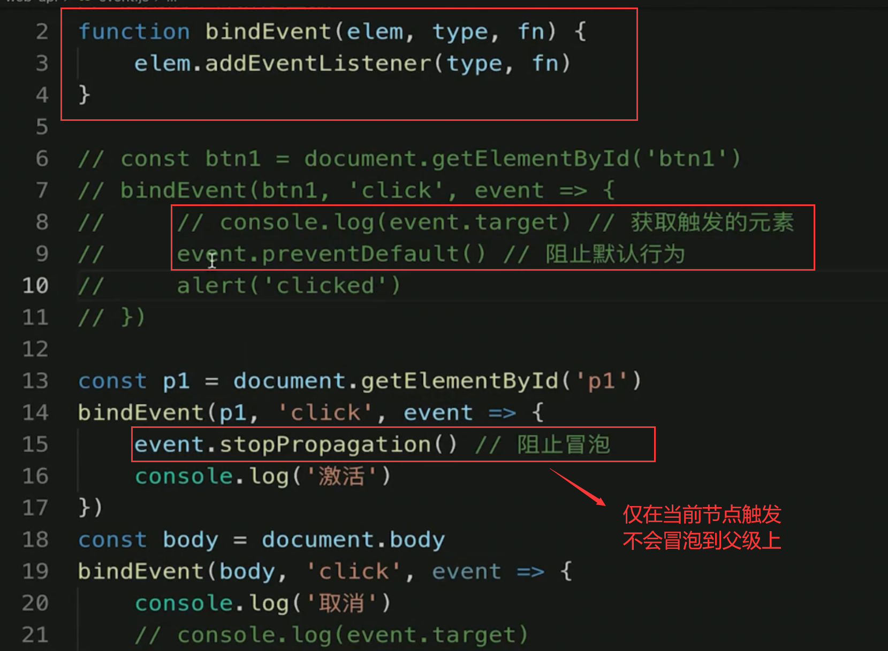
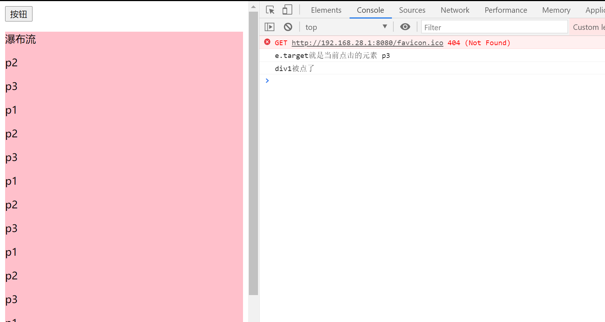
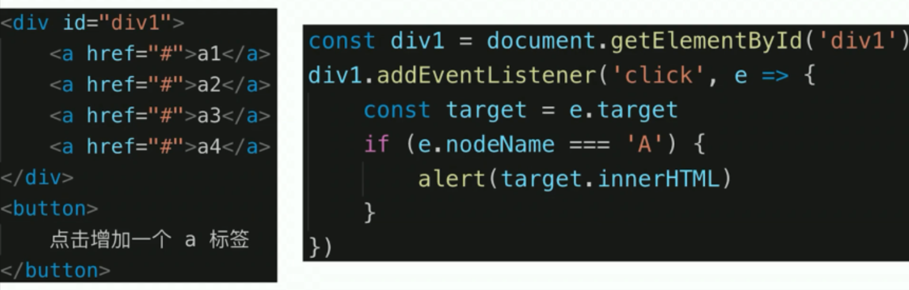

# 事件

## 1.题目和知识点

### 题目：

- 编写一个通用的事件监听函数
- 描述事件冒泡的流程
- 无限下拉的图片列表，如何监听每个图片的点击

### 知识点

- 事件绑定
- 事件冒泡
- 事件代理

## 2.事件绑定



```js
//给元素添加绑定事件的
const p1 = document.getElementById("p1");
p1.addEventListener("click", (event) => {
  console.log(event);
  console.log("p1 被点击了");
});
```

通用事件绑定函数 ：就是给某个 DOM 元素在执行某个事件的时候执行某个功能

```js
/**
 * 给元素绑定事件
 * @param {*} elem 被绑定的元素
 * @param {*} type 事件的类型
 * @param {*} fn 执行的回调函数
 */
function bindEvent(elem, type, fn) {
  elem.addEventListener(type, fn);
}
```

## 3.事件冒泡

### 冒泡泡

**div1 和 p1 都绑定事件，仅仅点击 p1 时候**

```js
const div1 = document.getElementById("div1");
const p1 = document.getElementById("p1");
bindEvent(div1, "click", (e) => {
  console.log("div1被点了");
});
bindEvent(p1, "click", (e) => {
  console.log("p1被点了");
});
```



会发现 点击 p1 也会触发到 div1 的点击事件，因为 p1 是在 div1 内部，不可能不经过 div1 的盒子。



给 html 和 body 加上点击事件

```js
bindEvent(document.body, "click", (e) => {
  console.log("body被点了");
});
bindEvent(document, "click", (e) => {
  console.log("document被点了");
});
```

### 阻止冒泡行为





## 4.事件代理 【利用子元素的冒泡机制】

假设有一个瀑布流：无限下拉的图片列表，如何监听每个图片的点击。

利用冒泡机制，来获取被点击的事件

```js
bindEvent(div1, "click", (e) => {
  console.log("e.target就是当前点击的元素", e.target.innerHTML);
  console.log("div1被点了");
});
```





### 优点：

- 代码简洁
- 减少浏览器的内存占用
- 不要滥用，要分析适合的场景

## 5.升级事件绑定

```js
/**
 *
 * @param {*} elem 元素
 * @param {*} type 事件类型
 * @param {*} selector 选择器
 * @param {*} fn 回调函数
 */
function bindEventComplex(elem, type, selector, fn) {
  // 传了3个参数
  if (fn == null) {
    fn = selector;
    selector = null;
  }
  elem.addEventListener(type, (event) => {
    const { target } = event;
    if (selector) {
      //   有代理
      //   该元素是否符合 该 selector 选择器
      if (target.matches(selector)) {
        fn.call(target, event);
      }
    } else {
      fn.call(target, event);
    }
  });
}
```
