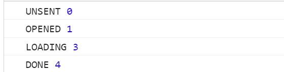

# Ajax

## 1.题目和知识点

https://developer.mozilla.org/zh-CN/docs/Glossary/AJAX

### 题目：

- 手写一个简单的 Ajax
- 什么是跨域，如何解决

### 知识点：

- XMLHttpRequest
- 状态码
- 跨域：同源策略，跨域解决方案

## 2.XMLHttpRequest

### 1.准备工作 MOCK 数据

使用 json-server：https://www.npmjs.com/package/json-server

### 2.创建 XMLHttpRequest 对象 并发送`GET`请求

open 方法详解：https://developer.mozilla.org/zh-CN/docs/Web/API/XMLHttpRequest/open

```js
const xhr = new XMLHttpRequest();
// 使用get 请求
// 第三个参数一个可选的布尔参数，表示是否异步执行操作，默认为true。如果值为false，send()方法直到收到答复前不会返回。如果true，已完成事务的通知可供事件监听器使用。如果multipart属性为true则这个必须为true，否则将引发异常。
// true 为异步请求
xhr.open("GET", "http://localhost:3000/comments", true);
xhr.onreadystatechange = function () {
  // 这里是异步执行的
  if (xhr.readyState === 4) {
    if (xhr.status === 200) {
      console.log(xhr.responseText);
    } else {
      console.log(xhr.status);
    }
  }
};
xhr.send(null);
```

### 3.发送`POST`请求

```js
function postData() {
  xhr.open("POST", "http://localhost:3000/comments", true);
  xhr.onreadystatechange = function () {
    // 这里是异步执行的
    if (xhr.readyState === 4) {
      if (xhr.status === 200) {
        console.log(xhr.responseText);
      } else {
        console.log(xhr.status);
      }
    }
  };
  const data = {
    body: "hahahh",
    postId: 1,
  };
  xhr.send(JSON.stringify(data));
}
```

## 3.**XMLHttpRequest.readyState**详解

**XMLHttpRequest.readyState** 属性返回一个 XMLHttpRequest 代理当前所处的状态。一个 XHR 代理总是处于下列状态中的一个：

| 值  | 状态               | 描述                                                                                                                                                                                                                                                                                             |
| --- | ------------------ | ------------------------------------------------------------------------------------------------------------------------------------------------------------------------------------------------------------------------------------------------------------------------------------------------ |
| `0` | `UNSENT`           | 【未初始化】代理被创建，但尚未调用 open() 方法。                                                                                                                                                                                                                                                 |
| `1` | `OPENED`           | 【发起请求】open() 方法已经被触发。在这个状态中，可以通过 [setRequestHeader()](https://developer.mozilla.org/en-US/docs/Web/API/XMLHttpRequest/setRequestHeader) 方法来设置请求的头部， 可以调用 [send()](https://developer.mozilla.org/en-US/docs/Web/API/XMLHttpRequest/send) 方法来发起请求。 |
| `2` | `HEADERS_RECEIVED` | 【请求完成了，开始接受服务端响应】`send()` 方法已经被调用，并且头部和状态已经可获得。                                                                                                                                                                                                            |
| `3` | `LOADING`          | 【和服务端交互中】响应体部分正在被接收。如果 `responseType` 属性是“text”或空字符串， `responseText` 将会在载入的过程中拥有部分响应数据。                                                                                                                                                         |
| `4` | `DONE`             | 【交互完成】请求操作已经完成。这意味着数据传输已经彻底完成或失败。                                                                                                                                                                                                                               |

```js
function readyState() {
  console.log("UNSENT", xhr.readyState); // readyState 为 0

  xhr.open("GET", "http://localhost:3000/comments", true);
  console.log("OPENED", xhr.readyState); // readyState 为 1

  xhr.onprogress = function () {
    console.log("LOADING", xhr.readyState); // readyState 为 3
  };

  xhr.onload = function () {
    console.log("DONE", xhr.readyState); // readyState 为 4
  };

  xhr.send(null);
}
```



## 4.xhr.status

https://developer.mozilla.org/zh-CN/docs/Web/HTTP/Status

### 2xx: 表示成功了，如 200

### 3xx:

需要重定向，浏览器直接跳转：

- 301：永久重定向
- 302：临时重定向
- 304：资源未改变，服务端未返回资源，浏览器使用已缓存的资源

### 4xx：客户端请求错误，404，403

### 5xx: 服务端问题
