# CORS

https://developer.mozilla.org/zh-CN/docs/Web/HTTP/%E8%B7%A8%E5%9F%9F%E8%B5%84%E6%BA%90%E5%85%B1%E4%BA%AB(CORS)_

## 1.同源策略

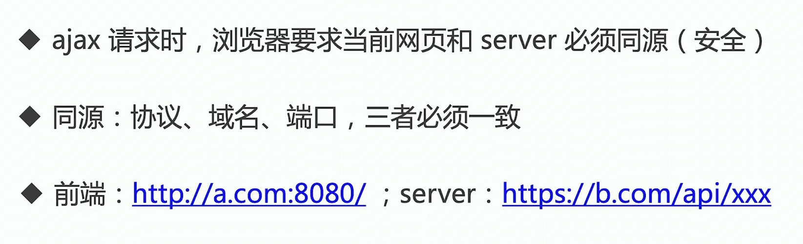

## 2.加载 图片 css js 是无视同源策略的

例如：cdn 加速，

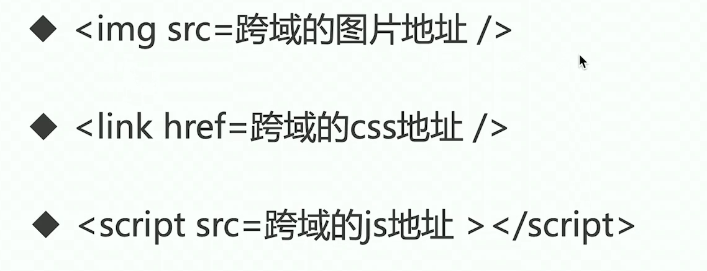

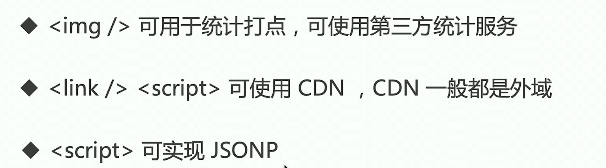

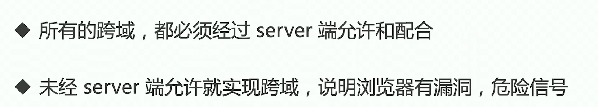

## 3.JSONP 解决跨域

- `<script>` 标签是可以绕过跨域限制的
- 服务器是可以任意动态拼接数据返回的
- `<script>`就可以获取跨域的数据，只要服务端愿意返回

简单来说 就是服务器端知道你要调用的哪个方法名，在返回 js 文件的时候 执行含有参数的该方法。

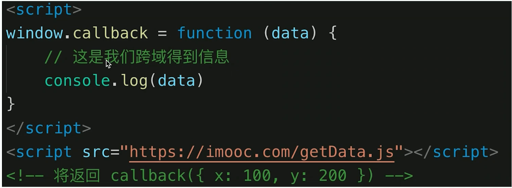

### 代码演示：

原理就是 一个 JS 文件声明方法和参数，另外一个 js 文件通过 src 可以使用跨域请求，取执行这个方法，而服务端将需要的参数已经拼接到这个方法里了。

```js
//JSONP.js

window.callback = function (data) {
  console.log("JSONP", data);
};
```

```js
//getData.js

callback({ x: 100, y: 100 });
```

```js
//index.html

    <script src="./JSONP.js"></script>
    <script src="https://xxx.com/demo/getData.js"></script>
```

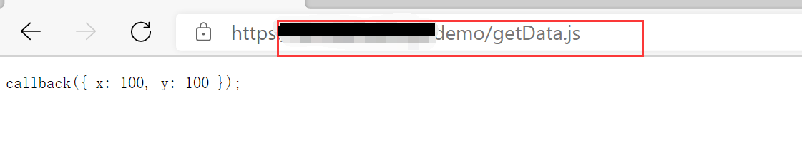

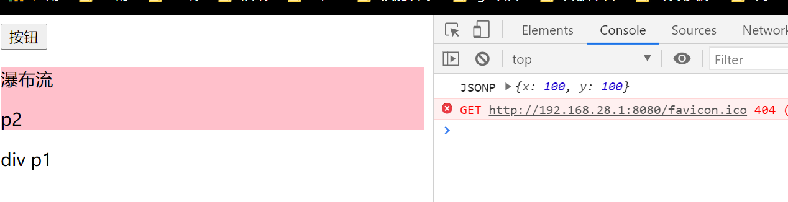

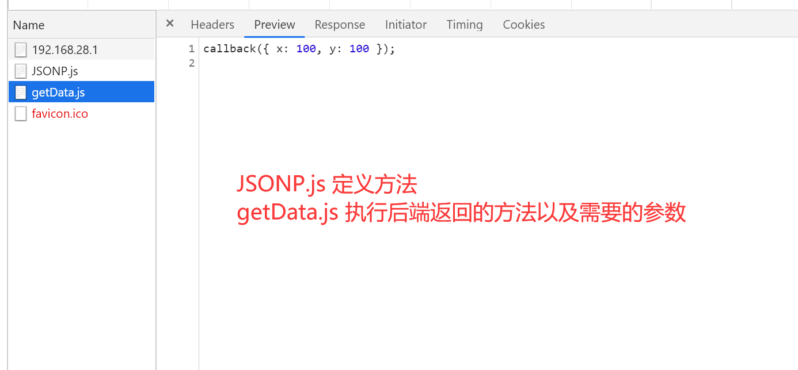

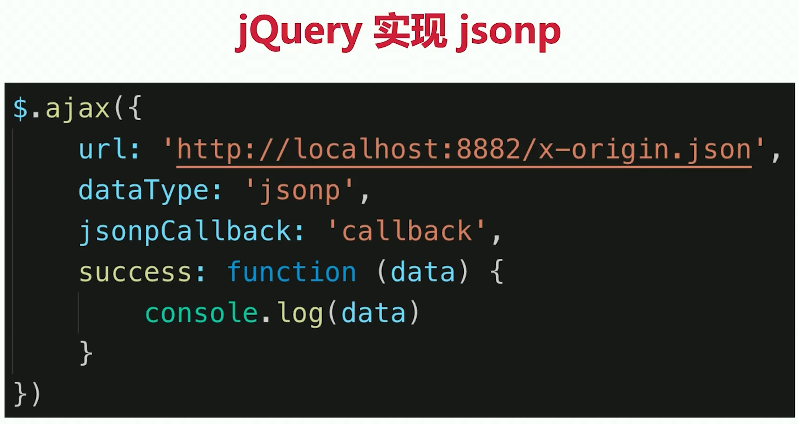

## 4.CORS-服务器端设置允许跨域

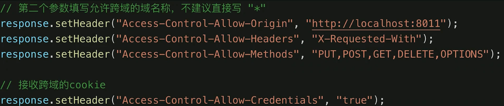

## 5.问题答疑

#### 1.手写一个简单的 promise

```js
function ajax(method, url, params = null) {
  const p = new Promise((resolve, reject) => {
    const xhr = new XMLHttpRequest();
    xhr.open(method, url, true);
    // 回调的名字 全是小写 监控 状态改变时候执行
    xhr.onreadystatechange = function () {
      // 请求结束了
      if (xhr.readyState === 4) {
        //   判断状态码是不是 2 开头的
        if (String(xhr.status).startsWith("2")) {
          resolve(xhr.responseText);
        } else {
          reject(new Error("status faild"));
        }
      }
    };
    xhr.send(params);
  });
  return p;
}

ajax("GET", "http://localhost:3000/comments")
  .then((res) => {
    console.log("查询", res);
    return ajax("POST", "http://localhost:3000/comments", { body: "555" });
  })
  .then((res) => {
    console.log("增加的结果", res);
    return ajax("GET", "http://localhost:3000/comments");
  })
  .then((res) => {
    console.log("再次查询", res);
  });
```

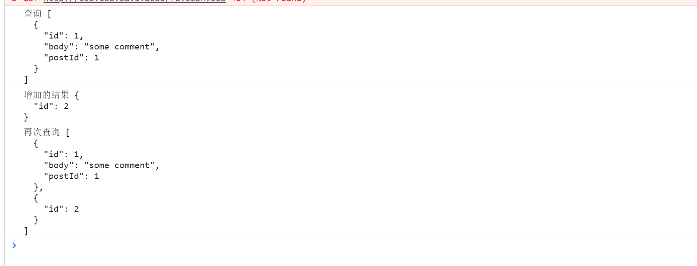

#### 2.跨域的实现方式

- jsonp
- cors【服务端】

## 6.已经封装了 Ajax 的工具

- jQuery
- fetch https://developer.mozilla.org/zh-CN/docs/Web/API/Fetch_API
- axios 库 http://www.axios-js.com/zh-cn/docs/
