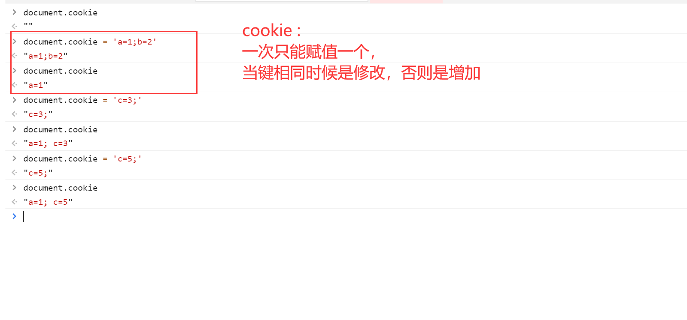
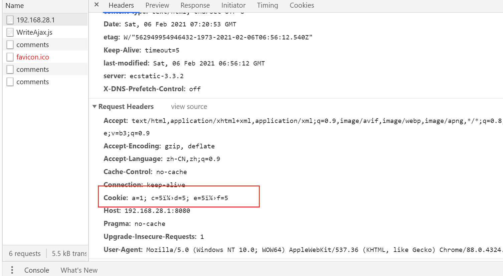

# 存储

## 1.题目和知识点

### 题目：

- cookie sessionStorage localStorage 的区别

知识点：

- cookie
- sessionStorage
- localStorage

## 2.cookie

- 本身是`用于浏览器和后端 通讯`
- 被`借用`到本地存储
- document.cookie = ''来修改
- 使用`;`【英文】分隔的键值结构 的形式
- `h5`以前的存储形式

请求时候默认携带

#### cookie 的缺点：

- 存储最大只能是 4kb
- 每次请求都会发送到服务端，增加请求数据量
- API 不是很友好

## 3.localStorage 和 sessionStorage

- H5 专门为存储而设计的，最大可存 5M
- API 简单 使用 `setItem 和 getItem`，存储形式为 `键值`形式
- 不会随着 `http`请求发送出去【5M 要是发 也比较难受】

### 区别：

- localStorage ：数据会永久存储，除非代码或手动删除
- sessionStorage:是会话级别的，当浏览器关闭时候会清空
- 一般用`localStorage`比较多一些

## 4.解答：

### 1.cookie localStorage 和 sessionStorage 的区别

- 容量大小：cookie 为 4kb,其他为 5MB
- API 易用性：cookie 是`document.cookie`而其他两个可以用 setItem 和 getItem
- 是否可跟随 http 发送出去：cookie 可以，其他两个不行
