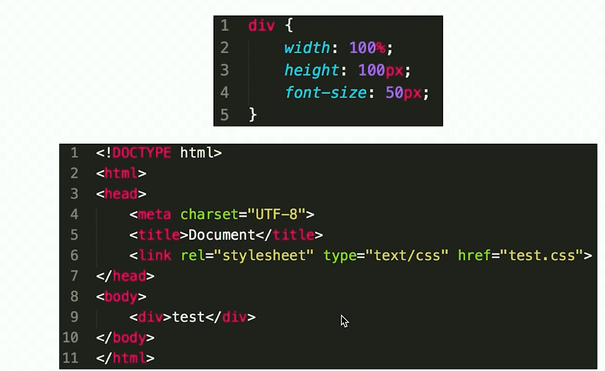
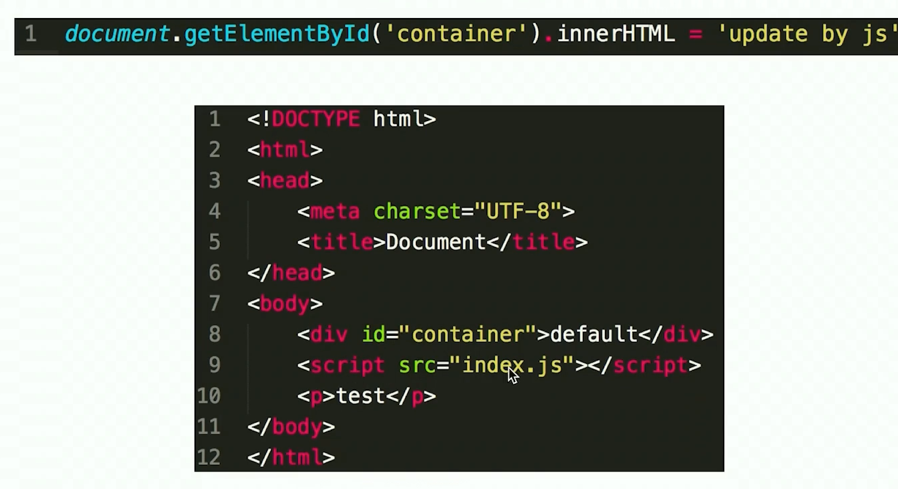
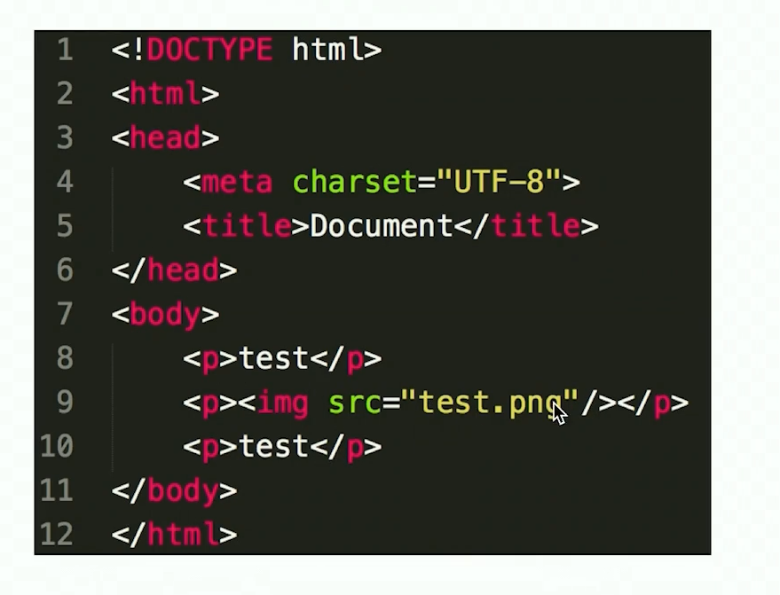
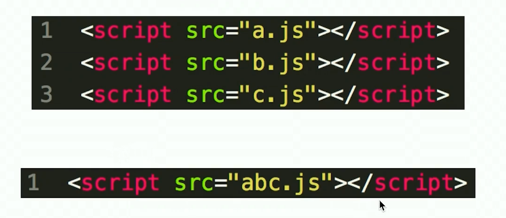
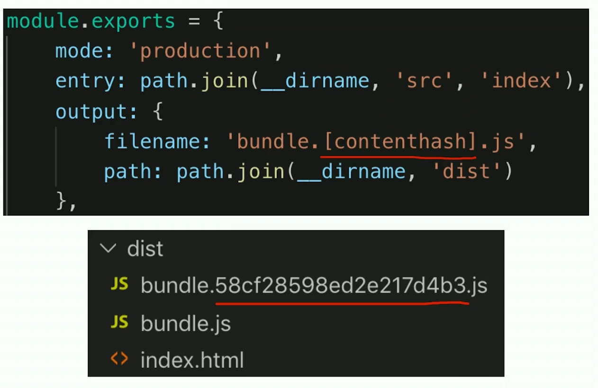
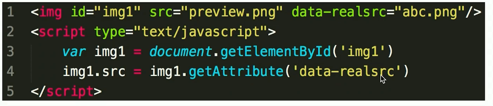
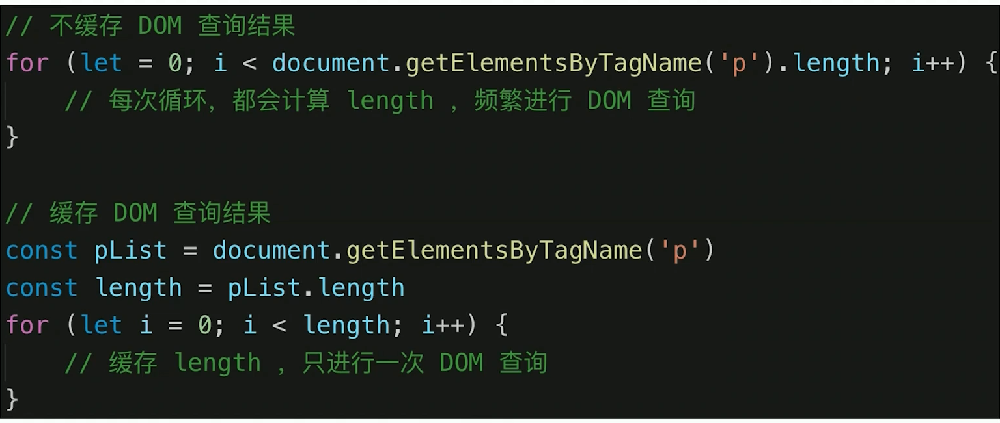

# 1.运行环境和性能优化

## 运行环境

# 2.网页加载过程

## 1.题目和知识点：

### 题目：

- 从输入 url 到渲染出页面的整个过程
- window.onload 和 DOMContentLoaded 的区别

### 知识点：

- 加载资源的形式
- 加载资源的过程
- 渲染页面的过程

## 2.加载资源的形式

- html 代码
- 媒体文件
- js 和 css

## 3.加载过程

- DNS 解析【本地 都可以自己解析】：域名 -> IP 地址
- 浏览器根据 IP 地址 向服务器 发起 http 请求
- 服务器 处理 http 请求，并返回给 浏览器

## 4.渲染过程 -1

- 根据 HTML 代码生成一个 DOM Tree
- 根据 CSS 代码 生成 CSSOM
- 将　 DOM Tree 和 CSSOM 整合形成一个 Render Tree

## 5.渲染过程 -2

- 根据 Render Tree 渲染界面
- 遇到 `<script>`则暂停渲染，优先加载并执行 js 代码 ，【因为 script 可能存在更改 dom 的情况】完成以后在继续
- 直至把 Render Tree 渲染完成

### 渲染场景 1：

1. 先把 css 加载完，因为在 head 里面，加载完以后生成 CSSOM【CSS Object Model】
2. 然后根据 HTML 结构，开始渲染 DOM 树。
3. 最后 两个整合成 Render Tree

## 6.为什么把 CSS 放在 头部

反过来想，如果把 css 放在底部，浏览器会从头开始渲染，使用浏览器的默认样式进行渲染，当 加载到 link 标签的时候，需要对已经渲染的样式 进行应用 css，可能会重新渲染，如果性能过低 会发现肉眼可见的变化。

## 7.渲染场景含有 js 的 渲染过程

1. 拿到 HTML 以后 根据 内容渲染出 DOM Tree ，遇到了 `script `标签，暂停渲染，
2. 加载 js 时候 发现改变了 container 的 属性，js 代码执行完成以后 ，才继续渲染 p 标签
3. 为什么要暂停渲染，是因为浏览器不知道 js 中是否会更改 DOM 元素，如果不暂停渲染，浏览器不知道 以 HTML 标签为准还是以 js 更改的结果为准。

## 8.为什么把 js 放在最后

先把可以渲染出来的 DOM 进行展示，然后最后在进行更改

## 9.含有 图片的渲染过程

1. 含有 img 标签的渲染，如果图片资源比较大，会先把这个地方空着。
2. 因为 图片不会改变其他元素，可以先渲染其他的元素，不会阻塞渲染过程

## 10.window.onload 和 DOMContentLoaded 的区别

- window.onload 是页面级别的 当页面的所有的资源加载完成以后，才会执行
- DOMContentLoaded 是 DOM 级别的，此时 DOM 渲染已经完成了，但是 图片和视频可能还没有加载完毕

## 11.解答

### 1.从输入 url 到显示出页面的整个过程

- 下载资源：各个资源类型，下载过程
- 渲染页面：结合 HTML css JavaScript 图片等渲染出界面

### 2.window.onload 和 DOMContentLoaded 的区别

- window.onload 资源全部加载完才能执行 包括图片
- DOMContentLoaded DOM 渲染完成即可，图片可能尚未加载完毕

# 3.性能优化

## 1.性能优化的原则

- 多使用内存、缓存 或其他方法
- 减少 CPU 的计算量，减少网络加载耗时
- （适用于所有编程的性能优化——空间换时间）

## 2.从何入手

- 让加载更快
- 让渲染更快

## 3.让加载更快

- 减少资源体积，压缩代码
- 减少访问次数：合并代码，SSR 服务端渲染，缓存。
- 使用更快的网络：CDN

## 4.让渲染更快

- CSS 放在 head ，JS 放在 body 的最下面
- 尽早开始执行 JS，用 DOMContentLoaded 触发
- 懒加载（图片懒加载，上滑加载更多）
- 对 DOM 查询进行缓存
- 频繁操作 DOM 时候，合并到一次插入 DOM 结构
- 节流 throttle 防抖 debounce

## 5.资源合并

## 6.缓存

- 静态资源加 hash 后缀，根据文件内容 计算 hash
- 文件内容不变，则 hash 不变，则 url 不变
- url 和文件都不变，则会`自动触发` http 缓存机制，返回 304。

## 7.CDN

## 8.SSR

- 服务端渲染【SSR】:将网页和数据一起加载，一起渲染
- 非 SSR【前后端分离】：先加载网页，然后加载数据，在渲染数据
- 早先的 JSP 和 django 的模板引擎，使用的就是 SSR。

## 9.图片懒加载

- 真实的地址放在 另外一个属性中
- 然后判断 该 DOM 元素是不是 露出屏幕
- 然后再进行渲染真正的数据

## 10.缓存 DOM 操作 【NICE】

## 11.多个 DOM 批量插入 DOM 结构

- 先搞一个空标签，将待插入的数据放在其中
- 然后把这个空标签一次插入即可

## 12.尽快开始 JS 执行

