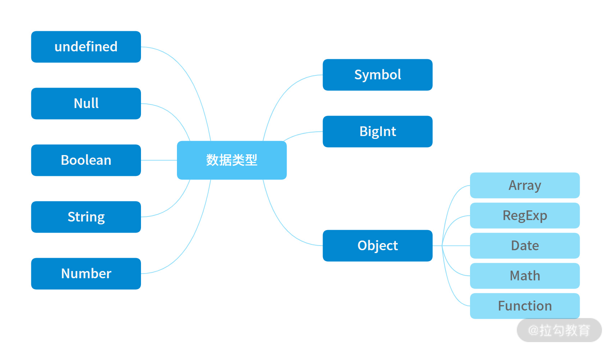

# 面试题

## 1.var let const 的区别

- var 是 ES5 语法，let const 是 ES6 语法，var 有`变量提升`
- var 和 let 声明的是可修改的变量，而 const 声明的是常量，不可修改
- let const 有`块级作用域`，var 没有

### 代码演示：

**变量提升：**

```js
// 变量提升 会先把var 声明的变量提到最前面
// 然后运行到 变量赋值的时候再赋值

// console.log(a); // undefined
// var a = 100;

// 上面的代码类似于
//01 提取var 声明的变量
var a;
console.log(a);
a = 100;
```

**块级作用域：**https://www.cnblogs.com/aisowe/p/11553398.html

```js
// 块级作用域开始

// i++ 和 ++i
// i++ 返回原值 以后再自增
// ++i 返回自增以后的值

// for (var i = 0; i < 10; i++) {
//   var j = i + 1;
// }
// console.log({ i, j }); // {i: 10, j: 10}

// 使用 let 声明的 变量 只在 {} 中有效
// https://www.cnblogs.com/aisowe/p/11553398.html
for (let i = 0; i < 10; i++) {
  let j = i + 1;
}
// 会报错
console.log({ i, j }); // Uncaught ReferenceError: i is not defined

// 块级作用域 结束
```

## 2.typeof 会返回哪些类型 【返回的全是小写的字母】



- 基础类型：bigint number string undefined boolean symbol
- 对象：object 【null 属于基础类型，但是返回的是 object 类型】
- 函数：function

```js
typeof 1; // 'number'

typeof "1"; // 'string'

typeof undefined; // 'undefined'

typeof true; // 'boolean'

typeof Symbol(); // 'symbol'
// 注意 null 是基础类型，难道因为 Object.prototype.__proto__ = null 就返回是 object吗？
typeof null; // 'object'

typeof []; // 'object'

typeof {}; // 'object'

typeof console; // 'object'

typeof console.log; // 'function'
```


## 3.列举强制类型转换和隐式类型转换

https://blog.csdn.net/DCX_abc/article/details/78137047?utm_medium=distribute.pc_relevant_t0.none-task-blog-BlogCommendFromMachineLearnPai2-1.control&depth_1-utm_source=distribute.pc_relevant_t0.none-task-blog-BlogCommendFromMachineLearnPai2-1.control

### 强制类型转换：

- 使用构造函数：Boolean() Number() String()
- parseInt，parseFloat，Object.prototype.toString

### 隐式类型转换：

- if、逻辑运算、==、+ 拼接字符串

## 4.手写深度比较 模拟 loadsh 的 isEqual

```js
function isObject(obj) {
  return typeof obj === "object" && obj != null;
}

function isEqual(obj1, obj2) {
  // 1.首先判断是不是基础类型 或 null
  if (!isObject(obj1) || !isObject(obj2)) {
    return obj1 === obj2;
  }
  //   1.1 判断是不是 自己和自己对比
  if (obj1 === obj2) {
    return true;
  }
  // 2.如果不是基础类型 那就是 对象 或者数组了
  // 3.判断对象的键或者数组的长度 是不是一样的
  const obj1KeyList = Object.keys(obj1);
  const obj2KeyList = Object.keys(obj2);
  if (obj1KeyList.length !== obj2KeyList.length) {
    return false;
  }
  // 4.如果是一样的。判断所有键的其值 是不是一样的
  for (let i in obj1) {
    const res = isEqual(obj1[i], obj2[i]);
    if (!res) {
      return false;
    }
  }
  // 5.满足上述所有条件 返回 true 否则一律返回 false
  return true;
}

const obj1 = {
  a: 100,
  b: {
    c: 200,
    d: [1, 2, 3],
  },
  e: [2, 3, 4],
};

const obj2 = {
  a: 100,
  b: {
    c: 200,
    d: [1, 2, 3],
  },
  e: [2, 3, 4],
};

console.log(isEqual(obj1, obj2));
console.log(isEqual(obj1, obj1));
```

## 5.split() 和 join() 的区别

- split 拆分数组
- join 合并字符串

## 6.数组的 pop push unshift shift 分别做什么？【数组常见的 api】


```js
const arr = ["a", "b", "c", "d"];

// const popResult = arr.pop();
// console.log(popResult, arr); // d [ 'a', 'b', 'c' ]

// const pushResult = arr.push("f"); // 返回push  以后数组的长度
// console.log(pushResult, arr); // 5 [ 'a', 'b', 'c', 'd', 'f' ]

// const shiftResult = arr.shift();
// console.log(shiftResult, arr); // a [ 'b', 'c', 'd' ]

// const unshiftResult = arr.unshift("first");
// console.log(unshiftResult, arr); // 5 [ 'first', 'a', 'b', 'c', 'd' ]
```

## 7.数组的哪些 API 是纯函数【不改变原数组（没有副作用），返回新数组】【cmfs】【吃米饭噻】

```
// 1.不改变原数组的api 2.会返回一个新的数组

const arr = ["a", "b", "c", "d"];

// concat
// const arr1 = arr.concat(["ff", "gg"]);
// console.log("change", arr.push("change"));
// console.log(arr, arr1); // [ 'a', 'b', 'c', 'd', 'change' ] [ 'a', 'b', 'c', 'd', 'ff', 'gg' ]

// map
// const mapArr = arr.map((item) => item + "map");
// console.log("change", arr.push("change"));
// console.log(arr); // [ 'a', 'b', 'c', 'd', 'change' ]
// console.log(mapArr); // [ 'amap', 'bmap', 'cmap', 'dmap' ]

// filter
// const filterArr = arr.filter((item) => item === "a" || item === "change");
// console.log("change", arr.push("change"));
// console.log(arr); // [ 'a', 'b', 'c', 'd', 'change' ]
// console.log(filterArr); // ['a']

// slice
// const sliceArr = arr.slice();
// console.log("change", arr.push("change"));
// console.log(arr); // [ 'a', 'b', 'c', 'd', 'change' ]
// console.log(sliceArr); // [ 'a', 'b', 'c', 'd' ]
```

## 8.数组 slice 和 splice 的区别

```js
// ## 数组slice 和 splice 的区别 start

// slice 切片 splice 剪接

// const arr = ["a", "b", "c", "d", "e"];

// const sliceArr = arr.slice();
// const sliceArr1 = arr.slice(1, 3); // 最后一位不要
// const sliceArr2 = arr.slice(1);
// const sliceArr3 = arr.slice(-3);
// console.log({ sliceArr }); // [ 'a', 'b', 'c', 'd', 'e' ]
// console.log({ sliceArr1 }); // [ 'b', 'c' ]
// console.log({ sliceArr2 }); // [ 'b', 'c', 'd', 'e' ]
// console.log({ sliceArr3 }); // [ 'c', 'd', 'e' ]

// // splice 可以进行增删改
// const arr = ["a", "b", "c", "d", "e"];
// // https://developer.mozilla.org/zh-CN/docs/Web/JavaScript/Reference/Global_Objects/Array/splice
// const spliceResult = arr.splice(1, 2, "1", "2");
// console.log({ arr }); // [ 'a', '1', '2', 'd', 'e' ]
// console.log(spliceResult); // [ 'b', 'c' ]
```

## 9.[10,20,30].map(parseIne)返回的结果是什么？【网红题】

```js
// 拆解
[(10, 20, 30)].map((item, index) => {
  return parseInt(item, index);
});
```

**parseInt 的返回值说明**

从给定的字符串中解析出的一个整数。

或者 [`NaN`](https://developer.mozilla.org/zh-CN/docs/Web/JavaScript/Reference/Global_Objects/NaN)，当

- `radix` 大于 `36` 或 `为1`，或
- 第一个非空格字符不能转换为数字。

```js
parseInt("123", 5); // 将'123'看作5进制数，返回十进制数38 => 1*5^2 + 2*5^1 + 3*5^0 = 38
```

以下例子均返回 `NaN`:

```js
parseInt("Hello", 8); // 根本就不是数值
parseInt("546", 2); // 除了“0、1”外，其它数字都不是有效二进制数字
```

如果 `radix` 是 `undefined`、`0`或未指定的，JavaScript 会假定以下情况：

1. 如果输入的 `string`以 "`0x`"或 "`0x`"（一个 0，后面是小写或大写的 X）开头，那么 radix 被假定为 16，字符串的其余部分被当做十六进制数去解析。
2. 如果输入的 `string`以 "`0`"（0）开头， `radix`被假定为`8`（八进制）或`10`（十进制）。具体选择哪一个 radix 取决于实现。ECMAScript 5 澄清了应该使用 10 (十进制)，但不是所有的浏览器都支持。**因此，在使用 `parseInt` 时，一定要指定一个 radix**。
3. 如果输入的 `string` 以任何其他值开头， `radix` 是 `10` (十进制)。

| 参数   | 描述                                                                                                                                                                                                           |
| ------ | -------------------------------------------------------------------------------------------------------------------------------------------------------------------------------------------------------------- |
| string | 必需。要被解析的字符串。                                                                                                                                                                                       |
| radix  | 可选。表示要解析的数字的基数。该值介于 2 ~ 36 之间。如果省略该参数或其值为 0，则数字将以 10 为基础来解析。如果它以 “0x” 或 “0X” 开头，将以 16 为基数。如果该参数小于 2 或者大于 36，则 parseInt() 将返回 NaN。 |

## 10.Ajax 的 get 和 post 的请求的区别？

https://blog.csdn.net/qq_38182125/article/details/89071899

- get 一般用于查询操作，post 用于提交操作
- get 参数是 拼接在 url 上的，post 是放在请求体内的【数据体积可更大】
- post 易于防止被 CSRF
- get 可以被缓存【一般加上时间戳或者随机数】，而 post 不会被缓存
- post 请求必须设置 Content-Type 值为`application/x-form-www-urlencoded`

## 11.函数 call 和 apply ，bind 的区别

- 共同点 : 都可以改变 this 指向
- 不同点:

  - call 和 apply 会调用函数, 并且改变函数内部 this 指向.
  - call 和 apply 传递的参数不一样,`call传递参数使用逗号隔开,apply使用数组传递`
  - bind 不会调用函数, 可以改变函数内部 this 指向，返回一个新的函数.

- 应用场景
  1. call 经常做继承.
  2. apply 经常跟数组有关系. 比如借助于数学对象实现数组最大值最小值
  3. bind 不调用函数,但是还想改变 this 指向. 比如改变定时器内部的 this 指向.

## 12. 事件代理（委托）是什么？

## 13.闭包是什么？有什么特性？有什么负面影响？

- 闭包应用场景：作为参数被传入，作为返回值被返回
- 自由变量的查找，是再函数定义的地方，不是执行的地方。
- 影响：变量常驻内存，得不到释放，闭包不要乱用。

## 14.如何阻止事件冒泡和默认行为？

- event.stopPropagation()
- event.preventDefault()

## 15.查找、添加、删除和移动 DOM 节点的方法？

## 16.如何减少 DOM 的操作？【性能优化】

## 17.解释 jsonp 的原理，为何 它不是真正的 Ajax？

- 浏览器的同源策略（服务端没有同源策略）和跨域
- 哪些标签是可以绕过跨域的？

**通过上面两条推断出 jsonp 的原理：**

- jsonp 是为了解决跨域的问题
- script 的 src 属性中没有跨域问题
- 相当于 src 分别引用两个脚本，
- 服务端返回的是 js 代码的执行， 执行并把需要的参数传入

## 18.document load 和 ready 的区别


## 19. == 和 === 的区别，以及使用的场景

- == 会进行类型转换
- === 是完全相等 ，值和类型都完全相等
- 只有一个情况才是 ===

## 20.函数声明和函数表达式的区别？

- 函数声明：`function fn(){...}`
- 函数表达式：`const fn = function(){...}`
- 函数声明 会在代码执行前进行`预加载`，就是先提取出来，然后再执行代码逻辑，而函数表达式不会

**函数声明可以类比 变量提升**

## 21.new Object() 和 Object.create 的区别

- {} 等同于 new Object()，原型是 Object.prototype
- Object.create(null) 是没有原型的
- Object.create({...}) 可指定原型
- Object.create 是创建一个空对象，把此对象的原型指向了其参数。

## 22.关于 this 的场景题


## 23.关于作用域和自由变量的场景题 【两个】


- 此类型的题目记住一个重点【之前 python 学的】：变量的指向，`=`会改变变量的指向。

**第二题解答：**

- 因为函数声明，会先定义函数 test() 【只是复习一下前面的内容】
- 然后第一行开始：声明一个变量 a ，把 100 赋值给这个变量 a
- 然后执行 test 方法，首先 alter(a)，此时的变量 a 是 100 的赋值
- 然后又把 10 赋值给变量 a，弹出 alert(a)，a 为 10
- test()函数执行完毕，执行 alert(a)，此时 变量 a 的赋值还是 10
- 最后结果：依次弹出 100， 10， 10

## 24.判断字符串以字母开头，后面字母数字下划线，长度 6-30

```js
const reg = /^[a-zA-Z]\w{5,29}$/;
```

https://deerchao.cn/tutorials/regex/regex.htm

## 25.手写字符串的 trim 方法，保证浏览器的兼容性

```js
String.prototype.trim = function () {
  console.log("trim");
  return this.replace(/^\s+/, "").replace(/\s+$/, "");
};

console.log("   aaa  ".trim().length);
```

## 26.如何获取多个数字中的最大值

```js
function(){
	const nums = Array.prototype.slice.call(arguments)
    let max = 0
    nums.forEach(n => {
        if(n>max){
            max = n
        }
    })
    return max
}
// 或者使用 Math 对象的Math.max(10,20,30)
```

## 27.如何用 JS 实现继承？

- class 继承
- 原型继承

## 28.如何捕获 js 程序中的异常


## 29.什么是 json？

- json 是一种数据格式，本质是一段字符串
- json 格式和 js 对象结构一致，对 js 语言友好
- window.JSON 是一个全局对象

## 30.获取当前页面的 url 参数

- 传统方式：location.search
- URLSearchParams


## 31.将 url 参数解析为 js 对象


## 32.手写数组 flatern，考虑多层级【考过】


## 33.数组去重

- 传统方式：遍历元素挨个比较，去重
- 使用 Set
- 考虑计算效率


## 34.手写深拷贝


- Object.assign 不是深拷贝 是一个浅层拷贝

## 35.介绍一下 RAF requestAnimationFrame

## 36.前端性能优化？一般从哪几个方面考虑？


