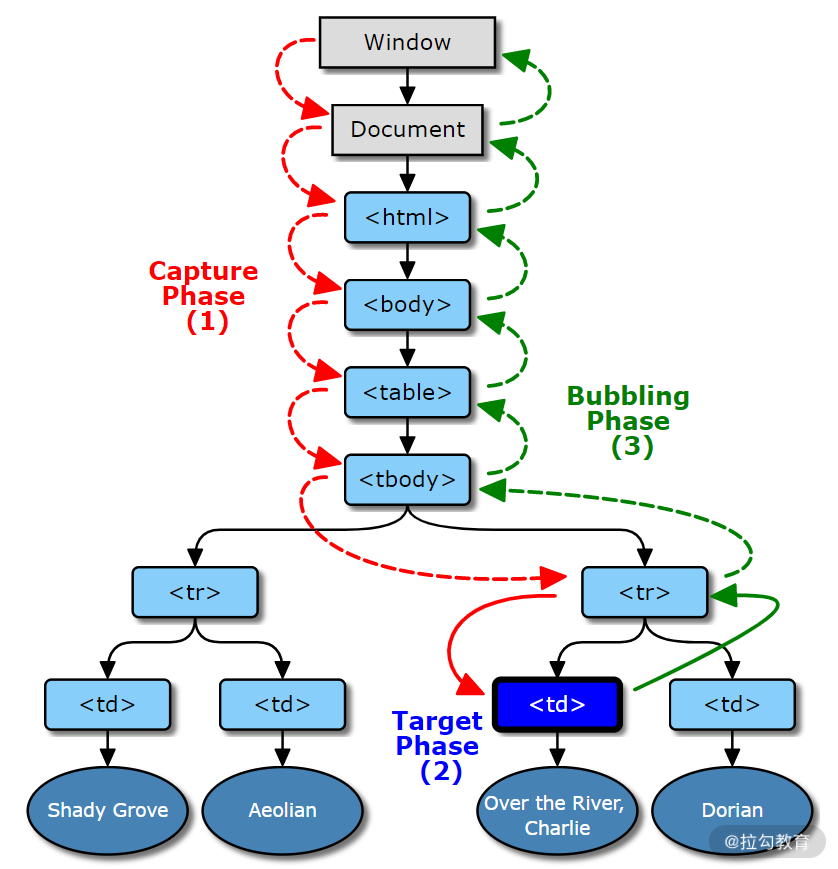

# DOM 事件的深入

## 1.基础版本请看：

[性能优化之防抖和节流](https://lhwz666.gitee.io/2021/02/08/js/jsBase/JS%E5%9F%BA%E7%A1%8015-JS-%E6%80%A7%E8%83%BD%E4%BC%98%E5%8C%96%E4%B9%8B%E9%98%B2%E6%8A%96/)

## 2.防抖升级版本：

- 参数和返回值的传递
- 防抖化以后的函数是否可以立即执行
- 防抖化的函数是否可以取消

```js
const input1 = document.getElementById("input1");
const fetchAPI = (e) => console.log("发起请求：", e.target.value);
// 基础版本的
// let timer = null;
// input1.addEventListener("input", (e) => {
//   if (timer) {
//     clearTimeout(timer);
//   }
//   timer = setTimeout(() => {
//     fetchAPI(e);
//      timer = null
//   }, 500);
// });

// 封装成公共方法的
// function debounce(fn, deplay = 500) {
//   let timer = null;
//   return function () {
//     if (timer) {
//       clearTimeout(timer);
//     }
//     timer = setTimeout(() => {
//       fn.apply(this, arguments);
//       timer = null;
//     }, deplay);
//   };
// }

// input1.addEventListener(
//   "input",
//   debounce(function (e) {
//     fetchAPI(e);
//   }, 1000)
// );

// 带有 立刻执行和 取消的 高阶版本
const debounce = (func, wait = 0) => {
  let timeout = null;
  let args;
  function debounced(...arg) {
    args = arg;
    if (timeout) {
      clearTimeout(timeout);
      timeout = null;
    }
    // 以 Promise 形式 返回函数执行结果
    return new Promise((res, rej) => {
      timeout = setTimeout(async () => {
        try {
          const result = await func.apply(this, args);
          res(result);
        } catch (e) {
          rej(e);
        }
      }, wait);
    });
  }
  function cancel() {
    clearTimeout(timeout);
    timeout = null;
  }
  function flush() {
    cancel();
    return func.apply(this, args);
  }
  //   可以在函数身上绑定函数？？ 老铁 6666
  debounced.cancel = cancel;
  debounced.flush = flush;
  return debounced;
};
```

## 3.节流的升级版本

**节流场景二：**现在来考虑另外一个场景，一个左右两列布局的查看文章页面，左侧为文章大纲结构，右侧为文章内容。现在需要添加一个功能，就是当用户滚动阅读右侧文章内容时，左侧大纲相对应部分高亮显示，提示用户当前阅读位置。

这个功能的实现思路比较简单，滚动前先记录大纲中各个章节的垂直距离，然后监听 scroll 事件的滚动距离，根据距离的比较来判断需要高亮的章节。

```js
// 监听scroll事件
wrap.addEventListener("scroll", (e) => {
  let highlightId = "";
  // 遍历大纲章节位置，与滚动距离比较，得到当前高亮章节id
  for (let id in offsetMap) {
    if (e.target.scrollTop <= offsetMap[id].offsetTop) {
      highlightId = id;
      break;
    }
  }
  const lastDom = document.querySelector(".highlight");
  const currentElem = document.querySelector(`a[href="#${highlightId}"]`);
  // 修改高亮样式
  if (lastDom && lastDom.id !== highlightId) {
    lastDom.classList.remove("highlight");
    currentElem.classList.add("highlight");
  } else {
    currentElem.classList.add("highlight");
  }
});
```

功能是实现了，但这并不是最优方法，因为滚动事件的触发频率是很高的，持续调用判断函数很可能会影响渲染性能。实际上也不需要过于频繁地调用，因为当鼠标滚动 1 像素的时候，很有可能当前章节的阅读并没有发生变化。所以我们可以设置在指定一段时间内只调用一次函数，从而降低函数调用频率，这种方式我们称之为“**节流**”【定时性的触发】。

```js
// 高阶版
const throttle = (func,wait = 0,execFirstCall) => {
    let timeout = null;
    let args;
    let firstCallTimstamp

    function throttled(...arg) {
        if(!firstCallTimstamp)firstCallTimstamp = new Date().getTime()
        if(!execFirstCall || !args){
            console.log("set args",arg);
            args = arg
        }
        if(timeout){
            clearTimeout(timeout)
            timeout = null
        }
        // 以promise 返回
        return new Promise((res,rej)=>{
            if(new Date().getTime() - firstCallTimstamp >= wait){
                try {
                    const result = await func.apply(this,args)
                    res(result)
                } catch (e) {
                    rej(e)
                }finally {
                    cancel()
                }
            }
        },firstCallTimstamp+wait-new Date().getTime())
    }

    function cancel(){
        clearTimeout(timeout)
        args = null
        timeout = null
        firstCallTimestamp = null
    }
    function flush() {
        cancel()
        return func.apply(this,args)
    }

    throttled.cancel = cancel
    throttled.flush = flush
    return throttled
}
```

## 4.事件代理

仿佛把一块石头丢入水中，会先被水面捕获到，然后沉入水底，最后开始冒泡。

DOM 事件触发的流程：

- **捕获**，事件对象 Window 【水面】传播到目标的父对象，图 1 的红色过程；
- **目标**，事件对象到达事件对象的事件目标【沉入水底】，图 1 的蓝色过程；
- **冒泡**，事件对象从目标的父节点开始传播到 Window【冒泡】，图 1 的绿色过程。



```js
<body>
  <button>click</button>
</body>
<script>
document.querySelector('button').addEventListener('click', function () {
  console.log('bubble')
})
document.querySelector('button').addEventListener('click', function () {
  console.log('capture')
}, true)
// 执行结果
// buble
// capture
</script>
```

addEventListener 的第三个参数为 true 的时候 表示捕获阶段。理论上来说上面的代码应该是先捕获，后冒泡。但是真实的执行顺序是按照绑定事件的顺序来执行的。

```html
<ul class="list">
  <li class="item" id="item1">
    项目1<span class="edit">编辑</span><span class="delete">删除</span>
  </li>
  <li class="item" id="item2">
    项目2<span class="edit">编辑</span><span class="delete">删除</span>
  </li>
  <li class="item" id="item3">
    项目3<span class="edit">编辑</span><span class="delete">删除</span>
  </li>
  ...
</ul>
```

```js
const ul = document.querySelector(".list");
ul.addEventListener("click", (e) => {
  const t = e.target || e.srcElement;
  if (t.classList.contains("item")) {
    getInfo(t.id);
  } else {
    id = t.parentElement.id;
    if (t.classList.contains("edit")) {
      edit(id);
    } else if (t.classList.contains("delete")) {
      del(id);
    }
  }
});
```

## 5.关于 DOM 事件标准

```html
// 方式1
<input type="text" onclick="click()" />
// 方式2 document.querySelector('input').onClick = function(e) { // ... } //
方式3 document.querySelector('input').addEventListener('click', function(e) {
//... })
```

方式 1 和方式 2 同属于 DOM0 标准，通过这种方式进行事件监听会`覆盖之前的事件监听函数`。

方式 3 属于 DOM2 标准，推荐使用这种方式。`同一元素上的事件监听函数互不影响，而且可以独立取消，调用顺序和监听顺序一致`
