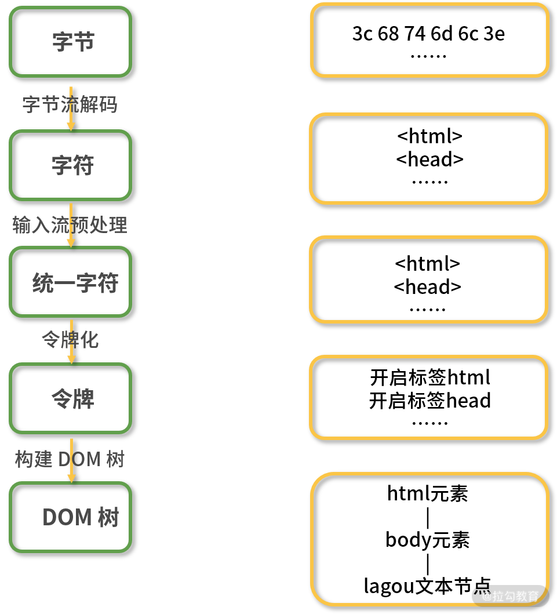

# 浏览器渲染界面的过程

## 0.从输入 URL 到浏览器渲染出页面的过程

## 0.1 输入 URL 到获取到 HTML 的过程

## 1.得到 HTML 文件以后的操作【细节还有——输入 URL 以后到浏览器渲染出界面的过程】

### 0.得到的 HTML 内容如下

```html
<!DOCTYPE html>
<html>
  <head> </head>
  <body>
    lagou
  </body>
</html>
```

### 1.将请求到的字节数据进行解码 =》字节流（字符数据）

浏览器通过 HTTP 协议请求到的内容是字节数据，当浏览器得到字节数据，然后解码【[编码嗅探算法](https://html.spec.whatwg.org/multipage/parsing.html#encoding-sniffing-algorithm)】成我们编写的 HTML 代码。我们通过浏览器抓包能直接看到 HTML 数据也是经过了字节流解码。

### 2.字节流预处理 =》规范化字节流

对解码以后的字节流数据进行预处理，最终生成规范化的字节流数据。

### 3.将规范化的字符数据 进行解析

解析分为两步：

1. 将字符数据转换为令牌【Token】
2. 解析 HTML 生成 DOM 树

#### 令牌化：根据不同的状态使用不同的解析方法

其过程是使用了一种类似状态机的算法，即每次接收一个或多个输入流中的字符；然后根据当前状态和这些字符来更新下一个状态，也就是说在不同的状态下接收同样的字符数据可能会产生不同的结果，比如当接收到“body”字符串时，在标签打开状态会解析成标签，在标签关闭状态则会解析成文本节点。

1. ```
   1. 初始化为“数据状态”（Data State）；
   2. 匹配到字符 <，状态切换到 “标签打开状态”（Tag Open State）；
   3. 匹配到字符 !，状态切换至 “标签声明打开状态”（Markup Declaration Open State），后续 7 个字符可以组成字符串 DOCTYPE，跳转到 “DOCTYPE 状态”（DOCTYPE State）；
   4. 匹配到字符为空格，当前状态切换至 “DOCTYPE 名称之前状态”（Before DOCTYPE Name State）；
   5. 匹配到字符串 html，创建一个新的 DOCTYPE 标记，标记的名字为 “html” ，然后当前状态切换至 “DOCTYPE 名字状态”（DOCTYPE Name State）；
   6. 匹配到字符 >，跳转到 “数据状态” 并且释放当前的 DOCTYPE 标记；
   7. 匹配到字符 <，切换到 “标签打开状态”；
   8. 匹配到字符 h，创建一个新的起始标签标记，设置标记的标签名为空，当前状态切换至 “标签名称状态”（Tag Name State）；
   9. 从字符 h 开始解析，将解析的字符一个一个添加到创建的起始标签标记的标签名中，直到匹配到字符 >，此时当前状态切换至 “数据状态” 并释放当前标记，当前标记的标签名为 “html” 。
   10. 解析后续的 的方式与 一致，创建并释放对应的起始标签标记，解析完毕后，当前状态处于 “数据状态” ；
   11. 匹配到字符串 “标记” ，针对每一个字符，创建并释放一个对应的字符标记，解析完毕后，当前状态仍然处于 “数据状态” ；
   12. 匹配到字符 <，进入 “标签打开状态” ；
   13. 匹配到字符 /，进入 “结束标签打开状态”（End Tag Open State）；
   14. 匹配到字符 b，创建一个新的结束标签标记，设置标记的标签名为空，当前状态切换至“标签名称状态”（Tag Name State）；
   15. 重新从字符 b 开始解析，将解析的字符一个一个添加到创建的结束标签标记的标签名中，直到匹配到字符 >，此时当前状态切换至 “数据状态” 并释放当前标记，当前标记的标签名为 “body”；
   16. 解析 的方式与 一样；
   17. 所有的 html 标签和文本解析完成后，状态切换至 “数据状态” ，一旦匹配到文件结束标志符（EOF），则释放 EOF 标记。
   ```

   最终生成类似下面的令牌结构：

   ```xml
   开始标签:html
     开始标签:head
     结束标签:head
     开始标签:body
       字符串:lagou
     结束标签:body
   结束标签:html
   ```

#### 补充 1：遇到 script 标签时的处理

如果在 HTML 解析过程中遇到 script 标签，则会发生一些变化。

如果遇到的是内联代码，也就是在 script 标签中直接写代码，那么解析过程会暂停，执行权限会转给 JavaScript 脚本引擎，待 JavaScript 脚本执行完成之后再交由渲染引擎继续解析。有一种情况例外，那就是脚本内容中调用了改变 DOM 结构的`document.write()`函数，此时渲染引擎会回到第二步，将这些代码加入字符流，重新进行解析。

如果遇到的是外链脚本，那么渲染引擎会按照我们在第 01 课时中所述的，根据标签属性来执行对应的操作。

#### DOM 树生成

浏览器在创建解析器的同时会创建一个 Document 对象。在树构建阶段，Document 会作为根节点被不断地修改和扩充。标记步骤产生的令牌会被送到树构建器进行处理。HTML 5 标准中定义了每类令牌对应的 DOM 元素，当树构建器接收到某个令牌时就会创建该令牌对应的 DOM 元素并将该元素插入到 DOM 树中。

为了纠正元素标签嵌套错位的问题和处理未关闭的元素标签，树构建器创建的新 DOM 元素还会被插入到一个开放元素栈中。

树构建算法也可以采用状态机的方式来描述，具体我们以步骤 1 的 HTML 代码为例进行举例说明。

1. ```
   1. 进入初始状态 “initial” 模式；
   2. 树构建器接收到 DOCTYPE 令牌后，树构建器会创建一个 DocumentType 节点附加到 Document 节点上，DocumentType 节点的 name 属性为 DOCTYPE 令牌的名称，切换到 “before html” 模式；
   3. 接收到令牌 html 后，树构建器创建一个 html 元素并将该元素作为 Document 的子节点插入到 DOM 树中和开放元素栈中，切换为 “before head” 模式；
   4. 虽然没有接收到 head 令牌，但仍然会隐式地创建 head 元素并加到 DOM 树和开放元素栈中，切换到“in head”模式；
   5. 将开放元素栈中的 head 元素弹出，进入 “after head”模式；
   6. 接收到 body 令牌后，会创建一个 body 元素插入到 DOM 树中同时压入开放元素栈中，当前状态切换为 “in body” 模式；
   7. 接收到字符令牌，创建 Text 节点，节点值为字符内容“标记”，将 Text 节点作为 body 元素节点插入到 DOM 树中；
   8. 接收到结束令牌 body，将开放元素栈中的 body 元素弹出，切换至 “after body” 模式；
   9. 接收到结束令牌 html，将开放元素栈中的 html 元素弹出，切换至 “after after body” 模式；
   10. 接收到 EOF 令牌，树构建器停止构建，html 文档解析过程完成。
   ```

   DOM 树结构如下

   ```
                 Document
                /        \
   DocumentType           HTMLHtmlElement
                         /               \
          HTMLHeadElement                 HTMLBodyElement
                                                 |
                                             TextNode
   ```



#### 解析 CSS 生成 CSSOM 树

### 4.将解析好的 DOM 和 CSSOM 树 合并为渲染树【应用样式】

从 DOM 树的根节点开始遍历，然后在 CSSOM 树上找到每个节点对应的样式。

遍历过程中会自动忽略那些不需要渲染的节点（比如脚本标记、元标记等）以及不可见的节点（比如设置了“display:none”样式）。同时也会将一些需要显示的伪类元素加到渲染树中。

### 5.根据渲染树先布局【生成蓝图】

生成了渲染树之后，就可以进入布局阶段了，布局就是计算元素的大小及位置。

计算元素布局是一个比较复杂的操作，因为需要考虑的因素有很多，包括字体大小、换行位置等，这些因素会影响段落的大小和形状，进而影响下一个段落的位置。

布局完成后会输出对应的“盒模型”，它会精确地捕获每个元素的确切位置和大小，将所有相对值都转换为屏幕上的绝对像素。

### 6.布局确定以后，开始绘制【蓝图实体化】

绘制就是将渲染树中的每个节点转换成屏幕上的实际像素的过程。得到布局树这份“施工图”之后，渲染引擎并不能立即绘制，因为还不知道绘制顺序，如果没有弄清楚绘制顺序，那么很可能会导致页面被错误地渲染。

例如，对于使用 z-index 属性的元素（如遮罩层）如果未按照正确的顺序绘制，则将导致渲染结果和预期不符（失去遮罩作用）。

所以绘制过程中的第一步就是`遍历布局树，生成绘制记录`，然后渲染引擎会根据绘制记录去绘制相应的内容。

对于无动画效果的情况，只需要考虑空间维度，生成不同的图层，然后再把这些图层进行合成，最终成为我们看到的页面。当然这个绘制过程并不是静态不变的，会随着页面滚动不断合成新的图形

### 7.总结

以`数据变化`为线索，具体来说数据的变化过程为：

```
字节 → 字符 → 令牌 → 树 → 页面
```


