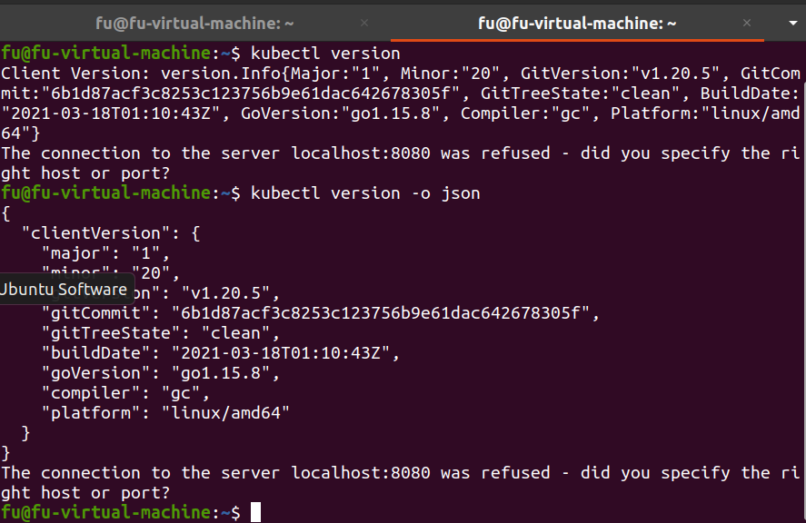
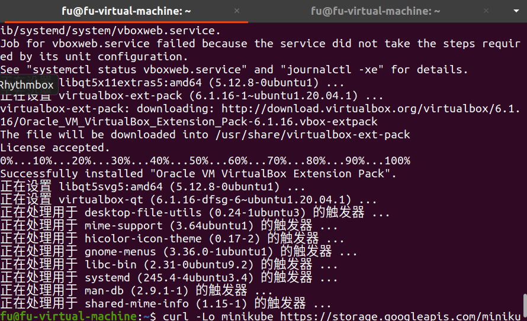
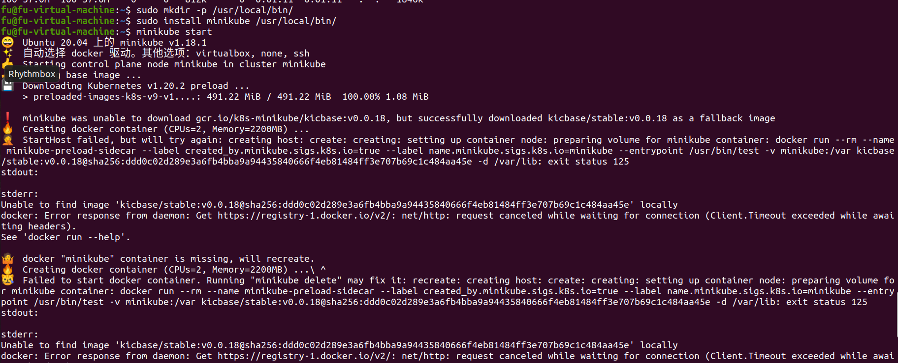
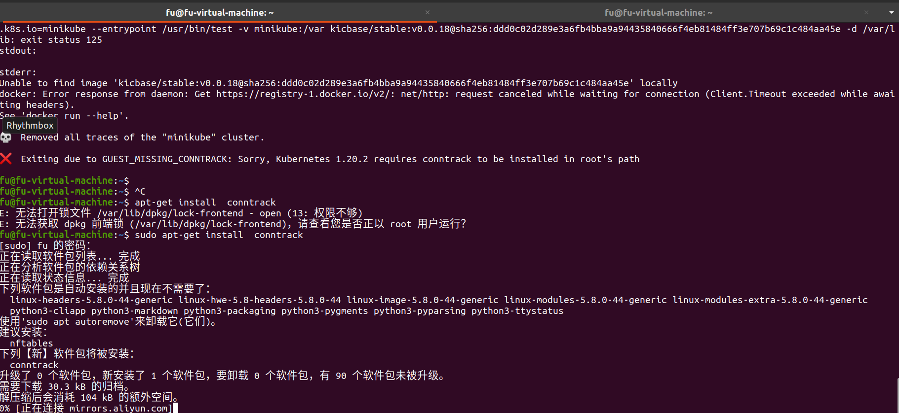
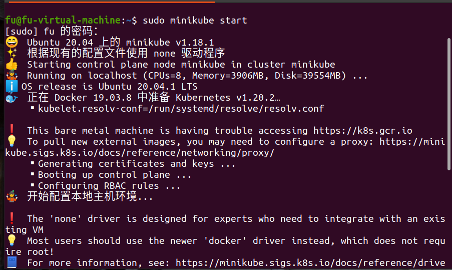
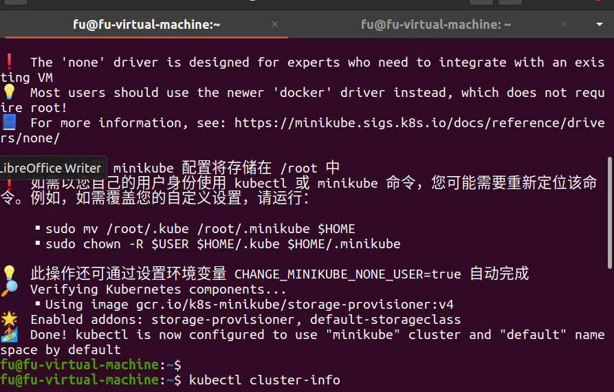
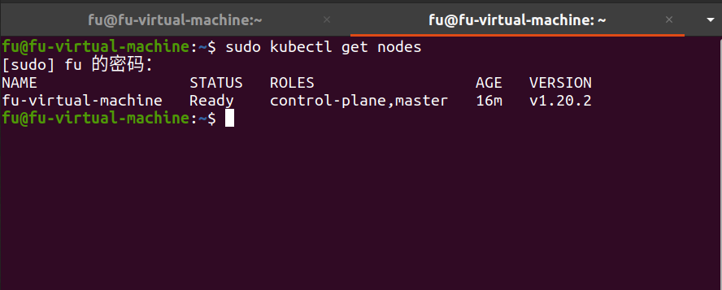
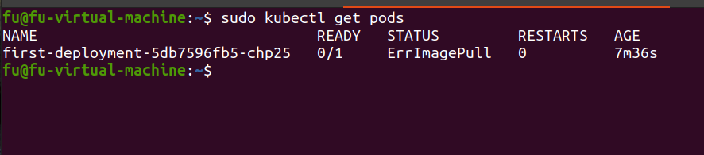
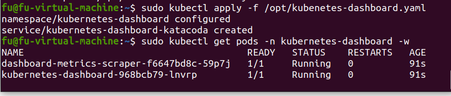
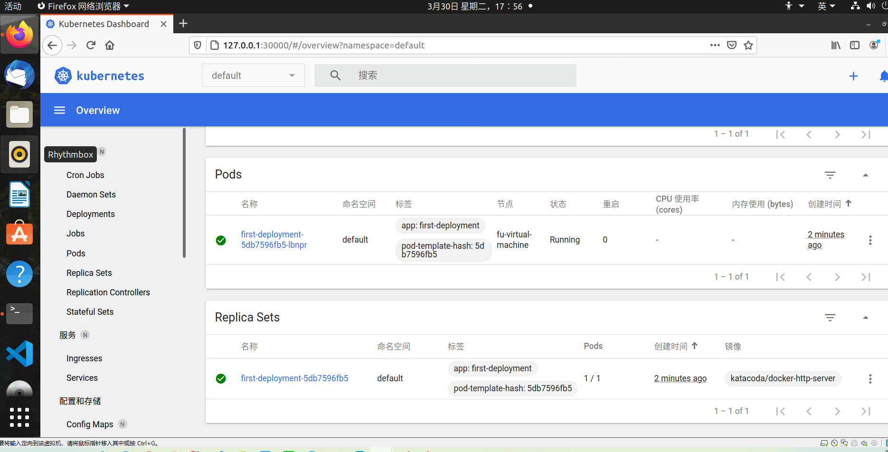

# ubuntu20 下 minikube 进行 k8s 单节点的搭建

**在线版的 minikube：**https://www.katacoda.com/courses/kubernetes

## 1.安装 kubectl【可能会被墙】

### 下载最新版本的 kubectl

```bash
curl -LO https://storage.googleapis.com/kubernetes-release/release/`curl -s https://storage.googleapis.com/kubernetes-release/release/stable.txt`/bin/linux/amd64/kubectl

```

### 下载指定版本的 kubectl

```bash
curl -LO https://storage.googleapis.com/kubernetes-release/release/v1.16.0/bin/linux/amd64/kubectl

```

### 增加可执行权限

```bash
chmod +x ./kubectl
```

### 移动到 bin 目录下并测试是否成功

```bash
sudo mv ./kubectl /usr/local/bin/kubectl

kubectl version

```



## 2.安装 virtualbox

```bash
sudo apt install virtualbox virtualbox-ext-pack
```

如下图即成功



## 3.安装 minikube

```bash
curl -Lo minikube https://storage.googleapis.com/minikube/releases/latest/minikube-linux-amd64 \
  && chmod +x minikube

sudo mkdir -p /usr/local/bin/
sudo install minikube /usr/local/bin/

```

### 检查版本

```bash
minikube version
```

### 启动

```bash
minikube start --wait=false
```







### 启动成功界面



## 4.查询集群信息

```bash
kubectl cluster-info
```

[报错及解决办法](https://blog.csdn.net/CEVERY/article/details/108753379)

### 测试集群启动成功

```bash
kubectl get nodes
```



### 将容器部署到集群中

```bash
kubectl create deployment first-deployment --image=katacoda/docker-http-server
```

### 结果

```bash
deployment.apps/first-deployment created
```

其中，`kubectrl create deployment`表示创建具有指定名称的 deployment 部署。

```bash
deployment NAME --image=image [--dry-run]
```

部署的状态可以从运行的 Pods 中被查看

```bash
kubectl get pods
```



[什么是 pod](https://zhuanlan.zhihu.com/p/60905652)

## 5.启用仪表盘

```bash
minikube addons enable dashboard
```

通过`/opt/kubenretes-dashboard.yaml`文件部署 dashboard（可以看到 yaml 是一种很好的部署方式）

```yaml
apiVersion: v1
kind: Namespace
metadata:
  labels:
    addonmanager.kubernetes.io/mode: Reconcile
    kubernetes.io/minikube-addons: dashboard
  name: kubernetes-dashboard
  selfLink: /api/v1/namespaces/kubernetes-dashboard
spec:
  finalizers:
    - kubernetes
status:
  phase: Active
---
apiVersion: v1
kind: Service
metadata:
  labels:
    app: kubernetes-dashboard
  name: kubernetes-dashboard-katacoda
  namespace: kubernetes-dashboard
spec:
  ports:
    - port: 80
      protocol: TCP
      targetPort: 9090
      nodePort: 30000
  selector:
    k8s-app: kubernetes-dashboard
  type: NodePort
```

使用 yaml 文件

```bash
kubectl apply -f /opt/kubernetes-dashboard.yaml
```

查看仪表盘的启动状态

```bash
kubectl get pods -n kubernetes-dashboard -w
```



然后访问 30000 端口



## 6.中文官方的部署和更新教程

[k8s 部署 NodeJs](http://docs.kubernetes.org.cn/126.html)
