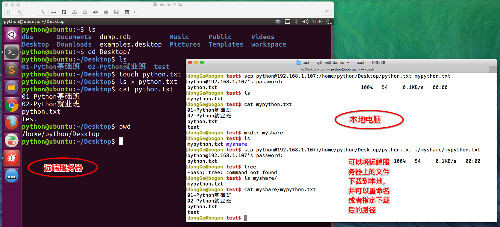

# ssh 和 scp 远程连接和远程拷贝

**Linux 常用服务器构建-ssh 和 scp**

**1.ssh**

**<1>ssh 介绍**

SSH 为 Secure Shell 的缩写，由 IETF 的网络工作小组（Network Working Group）所制定；SSH 为建立在应用层和传输层基础上的安全协议。

SSH 是目前较可靠，专为远程登录会话和其他网络服务提供安全性的协议。常用于远程登录，以及用户之间进行资料拷贝。

利用 SSH 协议可以有效防止远程管理过程中的信息泄露问题。SSH 最初是 UNIX 系统上的一个程序，后来又迅速扩展到其他操作平台。SSH 在正确使用时可弥补网络中的漏洞。SSH 客户端适用于多种平台。几乎所有 UNIX 平台—包括 HP-UX、Linux、AIX、Solaris、Digital UNIX、Irix，以及其他平台，都可运行 SSH。

使用 SSH 服务，需要安装相应的服务器和客户端。客户端和服务器的关系：如果，A 机器想被 B 机器远程控制，那么，A 机器需要安装 SSH 服务器，B 机器需要安装 SSH 客户端。

**<2>安装 ssh**

A.安装 ssh 服务器

```
sudo apt-get install openssh-server
```

B.远程登陆

```
ssh 用户名@IP
```

使用 ssh 访问，如访问出现错误。可查看是否有该文件 ～/.ssh/known_ssh 尝试删除该文件解决。

**<3>使用 ssh 连接服务器**

SSH 告知用户，这个主机不能识别，这时键入"yes"，SSH 就会将相关信息，写入" ~/.ssh/know_hosts" 中，再次访问，就不会有这些信息了。然后输入完口令,就可以登录到主机了。


**2.scp**

远程拷贝文件,scp -r 的常用方法：

1.使用该命令的前提条件要求目标主机已经成功安装 openssh-server

如没有安装使用 `sudo apt-get install openssh-server `来安装

2.使用格式：

scp -r 目标用户名@目标主机 IP 地址：/目标文件的绝对路径 /保存到本机的绝对/相对路径举例：scp -r itcast@192.168.1.100:/home/itcast/QQ_dir/ ./mytest/lisi 在后续会提示输入“yes”此时，只能输“yes”而不能简单输入“Y”

拷贝单个文件可以不加 -r 参数，拷贝目录必须要加。

本地文件复制到远程：

```
scp FileName RemoteUserName@RemoteHostIp:RemoteFilescp FileName RemoteHostIp:RemoteFolderscp FileName RemoteHostIp:RemoteFile
```

本地目录复制到远程：

```
scp -r FolderName RemoteUserName@RemoteHostIp:RemoteFolderscp -r FolderName RemoteHostIp:RemoteFolder
```

远程文件复制到本地：

```
scp RemoteUserName@RemoteHostIp:RemoteFile FileNamescp RemoteHostIp:RemoteFolder FileNamescp RemoteHostIp:RemoteFile FileName
```

远程目录复制到本地：

```
scp -r RemoteUserName@RemoteHostIp:RemoteFolder FolderNamescp -r RemoteHostIp:RemoteFolder FolderName
```


