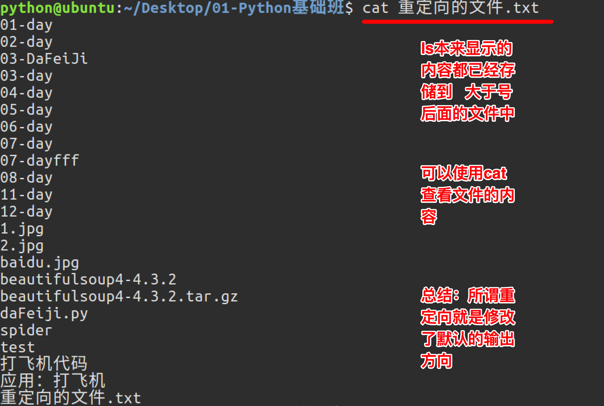
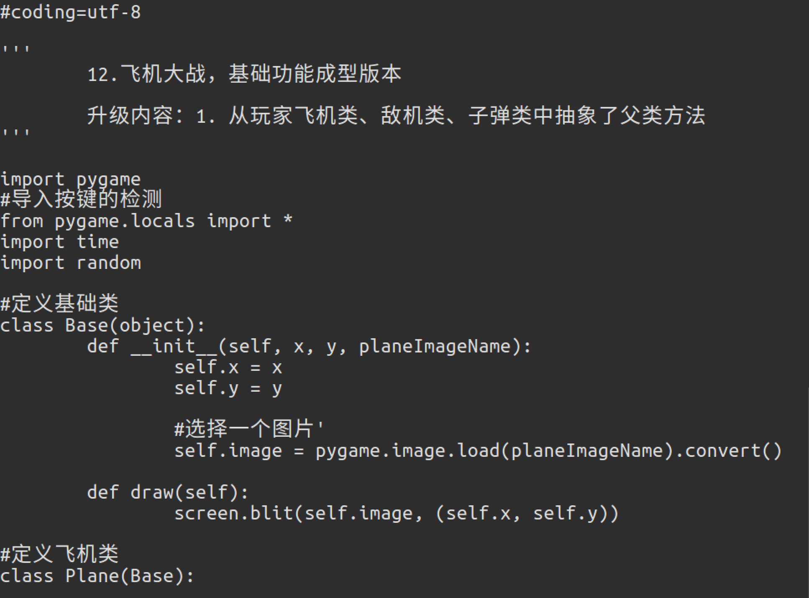
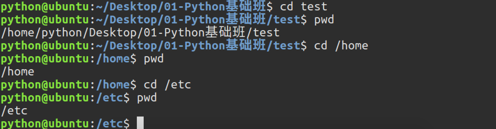
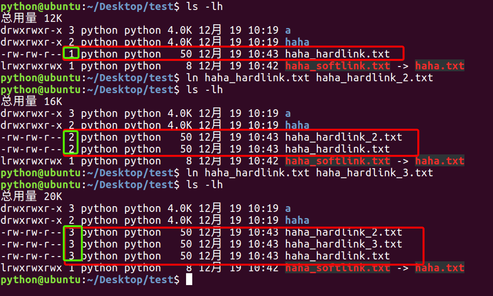
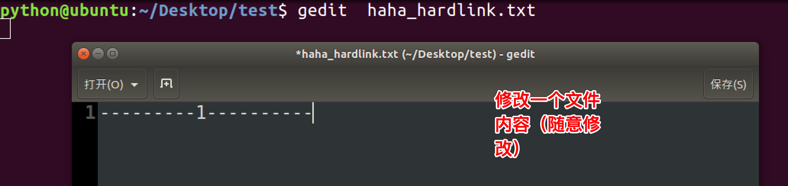
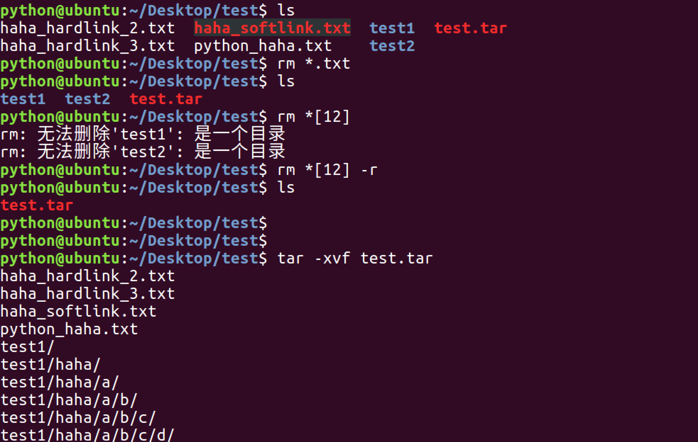
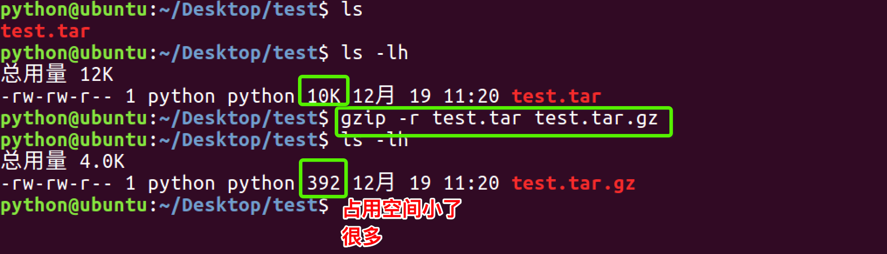
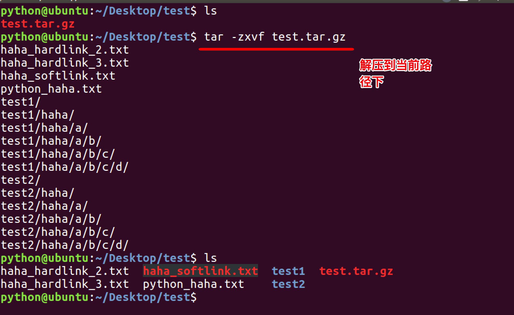

# 文件、磁盘管理

**Linux 命令-文件、磁盘管理**

**1.文件管理**

**<1>查看文件信息：ls**

ls 是英文单词 list 的简写，其功能为列出目录的内容，是用户最常用的命令之一，它类似于 DOS 下的 dir 命令。

Linux 文件或者目录名称最长可以有 265 个字符，“.”代表当前目录，“..”代表上一级目录，以“.”开头的文件为隐藏文件，需要用 -a 参数才能显示。

ls 常用参数：

| 参数 | 含义                                         |
| ---- | -------------------------------------------- |
| -a   | 显示指定目录下所有子目录与文件，包括隐藏文件 |
| -l   | 以列表方式显示文件的详细信息                 |
| -h   | 配合 -l 以人性化的方式显示文件大小           |

图中列出的信息含义如下图所示：

与 DOS 下的文件操作类似，在 Unix/Linux 系统中，也同样允许使用特殊字符来同时引用多个文件名，这些特殊字符被称为通配符。

| 通配符     | 含义                                                                                                                  |
| ---------- | --------------------------------------------------------------------------------------------------------------------- |
| \*         | 文件代表文件名中所有字符                                                                                              |
| ls te\*    | 查找以 te 开头的文件                                                                                                  |
| ls \*html  | 查找结尾为 html 的文件                                                                                                |
| ？         | 代表文件名中任意一个字符                                                                                              |
| ls ?.c     | 只找第一个字符任意，后缀为.c 的文件                                                                                   |
| ls a.?     | 只找只有 3 个字符，前 2 字符为 a.，最后一个字符任意的文件                                                             |
| []         | [”和“]”将字符组括起来，表示可以匹配字符组中的任意一个。“-”用于表示字符范围。                                          |
| [abc]      | 匹配 a、b、c 中的任意一个                                                                                             |
| [a-f]      | 匹配从 a 到 f 范围内的的任意一个字符                                                                                  |
| ls [a-f]\* | 找到从 a 到 f 范围内的的任意一个字符开头的文件                                                                        |
| ls a-f     | 查找文件名为 a-f 的文件,当“-”处于方括号之外失去通配符的作用                                                           |
| \          | 如果要使通配符作为普通字符使用，可以在其前面加上转义字符。“?”和“\*”处于方括号内时不用使用转义字符就失去通配符的作用。 |
| ls \*a     | 查找文件名为\*a 的文件                                                                                                |

**Linux 命令-文件、磁盘管理**

**1.文件管理**

**<1>查看文件信息：ls**

ls 是英文单词 list 的简写，其功能为列出目录的内容，是用户最常用的命令之一，它类似于 DOS 下的 dir 命令。

Linux 文件或者目录名称最长可以有 265 个字符，“.”代表当前目录，“..”代表上一级目录，以“.”开头的文件为隐藏文件，需要用 -a 参数才能显示。

ls 常用参数：

| 参数 | 含义                                         |
| ---- | -------------------------------------------- |
| -a   | 显示指定目录下所有子目录与文件，包括隐藏文件 |
| -l   | 以列表方式显示文件的详细信息                 |
| -h   | 配合 -l 以人性化的方式显示文件大小           |

图中列出的信息含义如下图所示：

与 DOS 下的文件操作类似，在 Unix/Linux 系统中，也同样允许使用特殊字符来同时引用多个文件名，这些特殊字符被称为通配符。

| 通配符     | 含义                                                                                                                  |
| ---------- | --------------------------------------------------------------------------------------------------------------------- |
| \*         | 文件代表文件名中所有字符                                                                                              |
| ls te\*    | 查找以 te 开头的文件                                                                                                  |
| ls \*html  | 查找结尾为 html 的文件                                                                                                |
| ？         | 代表文件名中任意一个字符                                                                                              |
| ls ?.c     | 只找第一个字符任意，后缀为.c 的文件                                                                                   |
| ls a.?     | 只找只有 3 个字符，前 2 字符为 a.，最后一个字符任意的文件                                                             |
| []         | [”和“]”将字符组括起来，表示可以匹配字符组中的任意一个。“-”用于表示字符范围。                                          |
| [abc]      | 匹配 a、b、c 中的任意一个                                                                                             |
| [a-f]      | 匹配从 a 到 f 范围内的的任意一个字符                                                                                  |
| ls [a-f]\* | 找到从 a 到 f 范围内的的任意一个字符开头的文件                                                                        |
| ls a-f     | 查找文件名为 a-f 的文件,当“-”处于方括号之外失去通配符的作用                                                           |
| \          | 如果要使通配符作为普通字符使用，可以在其前面加上转义字符。“?”和“\*”处于方括号内时不用使用转义字符就失去通配符的作用。 |
| ls \*a     | 查找文件名为\*a 的文件                                                                                                |

**<2>输出重定向命令：>**

Linux 允许将命令执行结果重定向到一个文件，本应显示在终端上的内容保存到指定文件中。

如：ls > test.txt ( test.txt 如果不存在，则创建，存在则覆盖其内容 )

注意：>输出重定向会覆盖原来的内容，>>输出重定向则会追加到文件的尾部。

**<3>分屏显示：more**

查看内容时，在信息过长无法在一屏上显示时，会出现快速滚屏，使得用户无法看清文件的内容，此时可以使用 more 命令，每次只显示一页，按下空格键可以显示下一页，按下 q 键退出显示，按下 h 键可以获取帮助。

**<4>管道：|**

管道：一个命令的输出可以通过管道做为另一个命令的输入。

管道我们可以理解现实生活中的管子，管子的一头塞东西进去，另一头取出来，这里“ | ”的左右分为两端，左端塞东西(写)，右端取东西(读)。

**<5>清屏：clear**

clear 作用为清除终端上的显示(类似于 DOS 的 cls 清屏功能)，也可使用快捷键：Ctrl + l ( “l” 为字母 )。

**<6>切换工作目录： cd**

在使用 Unix/Linux 的时候，经常需要更换工作目录。cd 命令可以帮助用户切换工作目录。Linux 所有的目录和文件名大小写敏感

cd 后面可跟绝对路径，也可以跟相对路径。如果省略目录，则默认切换到当前用户的主目录。

| 命令  | 含义                                                                                 |
| ----- | ------------------------------------------------------------------------------------ |
| cd    | 切换到当前用户的主目录(/home/用户目录)，用户登陆的时候，默认的目录就是用户的主目录。 |
| cd ~  | 切换到当前用户的主目录(/home/用户目录)                                               |
| cd .  | 切换到当前目录                                                                       |
| cd .. | 切换到上级目录                                                                       |
| cd -  | 可进入上次所在的目录                                                                 |

注意：

- 如果路径是从根路径开始的，则路径的前面需要加上 “ / ”，如 “ /mnt ”，通常进入某个目录里的文件夹，前面不用加 “ / ”。

**<7>显示当前路径：pwd**

使用 pwd 命令可以显示当前的工作目录，该命令很简单，直接输入 pwd 即可，后面不带参数。

**<8>创建目录：mkdir**

通过 mkdir 命令可以创建一个新的目录。参数-p 可递归创建目录。

需要注意的是新建目录的名称不能与当前目录中已有的目录或文件同名，并且目录创建者必须对当前目录具有写权限。

**<9>删除目录：rmdir**

可使用 rmdir 命令删除一个目录。必须离开目录，并且目录必须为空目录，不然提示删除失败。

**<10>删除文件：rm**

可通过 rm 删除文件或目录。使用 rm 命令要小心，因为文件删除后不能恢复。为了防止文件误删，可以在 rm 后使用-i 参数以逐个确认要删除的文件。

常用参数及含义如下表所示：

| 参数 | 含义                                             |
| ---- | ------------------------------------------------ |
| -i   | 以进行交互式方式执行                             |
| -f   | 强制删除，忽略不存在的文件，无需提示             |
| -r   | 递归地删除目录下的内容，删除文件夹时必须加此参数 |

**<11>建立链接文件：ln**

Linux 链接文件类似于 Windows 下的快捷方式。

链接文件分为软链接和硬链接。

软链接：软链接不占用磁盘空间，源文件删除则软链接失效。

硬链接：硬链接只能链接普通文件，不能链接目录。

使用格式：

ln 源文件 链接文件 ln -s 源文件 链接文件

如果没有-s 选项代表建立一个硬链接文件，两个文件占用相同大小的硬盘空间，即使删除了源文件，链接文件还是存在，所以-s 选项是更常见的形式。

注意：如果软链接文件和源文件不在同一个目录，源文件要使用绝对路径，不能使用相对路径。

**<12>查看或者合并文件内容：cat**

**<13>文本搜索：grep**

Linux 系统中 grep 命令是一种强大的文本搜索工具，grep 允许对文本文件进行模式查找。如果找到匹配模式， grep 打印包含模式的所有行。

grep 一般格式为：

grep [-选项] ‘搜索内容串’文件名

在 grep 命令中输入字符串参数时，最好引号或双引号括起来。例如：grep‘a ’1.txt。

常用选项说明：

| 选项 | 含义                                     |
| ---- | ---------------------------------------- |
| -v   | 显示不包含匹配文本的所有行（相当于求反） |
| -n   | 显示匹配行及行号                         |
| -i   | 忽略大小写                               |

grep 搜索内容串可以是正则表达式。

正则表达式是对字符串操作的一种逻辑公式，就是用事先定义好的一些特定字符、及这些特定字符的组合，组成一个“规则字符串”，这个“规则字符串”用来表达对字符串的一种过滤逻辑。

grep 常用正则表达式：

| 参数         | 含义                                                                                                                         |
| ------------ | ---------------------------------------------------------------------------------------------------------------------------- |
| ^a           | 行首,搜寻以 m 开头的行；grep -n '^a' 1.txt                                                                                   |
| ke$          | 行尾,搜寻以 ke 结束的行；grep -n 'ke$' 1.txt                                                                                 |
| [Ss]igna[Ll] | 匹配 [] 里中一系列字符中的一个；搜寻匹配单词 signal、signaL、Signal、SignaL 的行；grep -n '[Ss]igna[Ll]' 1.txt               |
| .            | (点)匹配一个非换行符的字符；匹配 e 和 e 之间有任意一个字符，可以匹配 eee，eae，eve，但是不匹配 ee，eaae；grep -n 'e.e' 1.txt |

**<14>查找文件：find**

find 命令功能非常强大，通常用来在特定的目录下搜索符合条件的文件，也可以用来搜索特定用户属主的文件。

常用用法：

| 命令                        | 含义                                   |
| --------------------------- | -------------------------------------- |
| find ./ -name test.sh       | 查找当前目录下所有名为 test.sh 的文件  |
| find ./ -name '\*.sh'       | 查找当前目录下所有后缀为.sh 的文件     |
| find ./ -name "[A-Z]\*"     | 查找当前目录下所有以大写字母开头的文件 |
| find /tmp -size 2M          | 查找在/tmp 目录下等于 2M 的文件        |
| find /tmp -size +2M         | 查找在/tmp 目录下大于 2M 的文件        |
| find /tmp -size -2M         | 查找在/tmp 目录下小于 2M 的文件        |
| find ./ -size +4k -size -5M | 查找当前目录下大于 4k，小于 5M 的文件  |
| find ./ -perm 0777          | 查找当前目录下权限为 777 的文件或目录  |

**<15>拷贝文件：cp**

cp 命令的功能是将给出的文件或目录复制到另一个文件或目录中，相当于 DOS 下的 copy 命令。

常用选项说明：

| 选项 | 含义                                                                                             |
| ---- | ------------------------------------------------------------------------------------------------ |
| -a   | 该选项通常在复制目录时使用，它保留链接、文件属性，并递归地复制目录，简单而言，保持文件原有属性。 |
| -f   | 已经存在的目标文件而不提示                                                                       |
| -i   | 交互式复制，在覆盖目标文件之前将给出提示要求用户确认                                             |
| -r   | 若给出的源文件是目录文件，则 cp 将递归复制该目录下的所有子目录和文件，目标文件必须为一个目录名。 |
| -v   | 显示拷贝进度                                                                                     |

**<16>移动文件：mv**

用户可以使用 mv 命令来移动文件或目录，也可以给文件或目录重命名。

常用选项说明：

| 选项 | 含义                                                                                                           |
| ---- | -------------------------------------------------------------------------------------------------------------- |
| -f   | 禁止交互式操作，如有覆盖也不会给出提示                                                                         |
| -i   | 确认交互方式操作，如果 mv 操作将导致对已存在的目标文件的覆盖，系统会询问是否重写，要求用户回答以避免误覆盖文件 |
| -v   | 显示移动进度                                                                                                   |

**<17>归档管理：tar**

计算机中的数据经常需要备份，tar 是 Unix/Linux 中最常用的备份工具，此命令可以把一系列文件归档到一个大文件中，也可以把档案文件解开以恢复数据。

tar 使用格式 tar [参数] 打包文件名 文件

tar 命令很特殊，其参数前面可以使用“-”，也可以不使用。

常用参数：

| 参数 | 含义                                                        |
| ---- | ----------------------------------------------------------- |
| -c   | 生成档案文件，创建打包文件                                  |
| -v   | 列出归档解档的详细过程，显示进度                            |
| -f   | 指定档案文件名称，f 后面一定是.tar 文件，所以必须放选项最后 |
| -t   | 列出档案中包含的文件                                        |
| -x   | 解开档案文件                                                |

注意：除了 f 需要放在参数的最后，其它参数的顺序任意。

**<18>文件压缩解压：gzip**

tar 与 gzip 命令结合使用实现文件打包、压缩。tar 只负责打包文件，但不压缩，用 gzip 压缩 tar 打包后的文件，其扩展名一般用 xxxx.tar.gz。

gzip 使用格式如下：

gzip [选项] 被压缩文件

常用选项：

| 选项 | 含义           |
| ---- | -------------- |
| -d   | 解压           |
| -r   | 压缩所有子目录 |

tar 这个命令并没有压缩的功能，它只是一个打包的命令，但是在 tar 命令中增加一个选项(-z)可以调用 gzip 实现了一个压缩的功能，实行一个先打包后压缩的过程。

压缩用法：tar cvzf 压缩包包名 文件 1 文件 2 ...

-z ：指定压缩包的格式为：file.tar.gz

解压用法： tar zxvf 压缩包包名

-z:指定压缩包的格式为：file.tar.gz

解压到指定目录：-C （大写字母“C”）

**<19>文件压缩解压：bzip2**

tar 与 bzip2 命令结合使用实现文件打包、压缩(用法和 gzip 一样)。

tar 只负责打包文件，但不压缩，用 bzip2 压缩 tar 打包后的文件，其扩展名一般用 xxxx.tar.gz2。

在 tar 命令中增加一个选项(-j)可以调用 bzip2 实现了一个压缩的功能，实行一个先打包后压缩的过程。

压缩用法：tar -jcvf 压缩包包名 文件...(tar jcvf bk.tar.bz2 \*.c)

解压用法：tar -jxvf 压缩包包名 (tar jxvf bk.tar.bz2)

**<20>文件压缩解压：zip、unzip**

通过 zip 压缩文件的目标文件不需要指定扩展名，默认扩展名为 zip。

压缩文件：zip [-r] 目标文件(没有扩展名) 源文件

解压文件：unzip -d 解压后目录文件 压缩文件

**<21>查看命令位置：which**

