# Linux

**Linux 命令-用户、权限管理**

用户是 Unix/Linux 系统工作中重要的一环，用户管理包括用户与组账号的管理。

在 Unix/Linux 系统中，不论是由本机或是远程登录系统，每个系统都必须拥有一个账号，并且对于不同的系统资源拥有不同的使用权限。

Unix/Linux 系统中的 root 账号通常用于系统的维护和管理，它对 Unix/Linux 操作系统的所有部分具有不受限制的访问权限。

在 Unix/Linux 安装的过程中，系统会自动创建许多用户账号，而这些默认的用户就称为“标准用户”。

在大多数版本的 Unix/Linux 中，都不推荐直接使用 root 账号登录系统。

**<1>查看当前用户：whoami**

whoami 该命令用户查看当前系统当前账号的用户名。可通过 cat /etc/passwd 查看系统用户信息。

由于系统管理员通常需要使用多种身份登录系统，例如通常使用普通用户登录系统，然后再以 su 命令切换到 root 身份对传统进行管理。这时候就可以使用 whoami 来查看当前用户的身份。

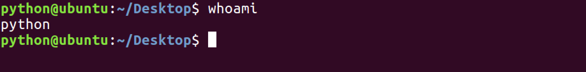

**<2>查看登录用户：who**

who 命令用于查看当前所有登录系统的用户信息。

常用选项：

| 选项           | 含义                                            |
| -------------- | ----------------------------------------------- |
| -m 或 am I     | 只显示运行 who 命令的用户名、登录终端和登录时间 |
| -q 或--count   | 只显示用户的登录账号和登录用户的数量            |
| -u 或--heading | 显示列标题                                      |

**<3>退出登录账户： exit**

如果是图形界面，退出当前终端；

如果是使用 ssh 远程登录，退出登陆账户；

如果是切换后的登陆用户，退出则返回上一个登陆账号。

**<4>添加用户账号：useradd**

在 Unix/Linux 中添加用户账号可以使用 adduser 或 useradd 命令，因为 adduser 命令是指向 useradd 命令的一个链接，因此，这两个命令的使用格式完全一样。

useradd 命令的使用格式如下：useradd [参数] 新建用户账号

| 参数 | 含义                                                                                             |
| ---- | ------------------------------------------------------------------------------------------------ |
| -d   | 指定用户登录系统时的主目录，如果不使用该参数，系统自动在/home 目录下建立与用户名同名目录为主目录 |
| -m   | 自动建立目录                                                                                     |
| -g   | 指定组名称                                                                                       |

相关说明：

- Linux 每个用户都要有一个主目录，主目录就是第一次登陆系统，用户的默认当前目录(/home/用户)；
- 每一个用户必须有一个主目录，所以用 useradd 创建用户的时候，一定给用户指定一个主目录；
- 用户的主目录一般要放到根目录的 home 目录下，用户的主目录和用户名是相同的；
- 如果创建用户的时候，不指定组名，那么系统会自动创建一个和用户名一样的组名。

| 命令                            | 含义                                                                                            |
| ------------------------------- | ----------------------------------------------------------------------------------------------- |
| useradd -d /home/abc abc -m     | 创建 abc 用户，如果/home/abc 目录不存在，就自动创建这个目录，同时用户属于 abc 组                |
| useradd -d /home/a a -g test -m | 创建一个用户名字叫 a，主目录在/home/a，如果主目录不存在，就自动创建主目录，同时用户属于 test 组 |
| cat /etc/passwd                 | 查看系统当前用户名                                                                              |

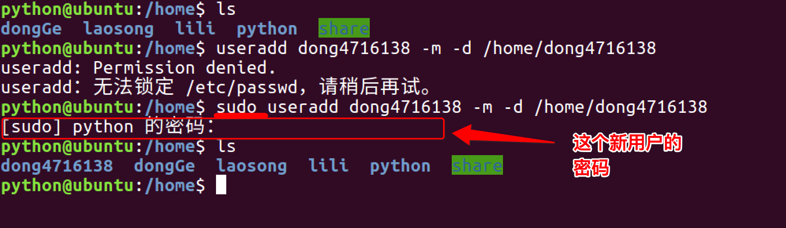

**<5>设置用户密码：passwd**

在 Unix/Linux 中，超级用户可以使用 passwd 命令为普通用户设置或修改用户口令。用户也可以直接使用该命令来修改自己的口令，而无需在命令后面使用用户名。

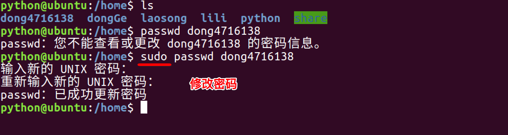

**<6>删除用户：userdel**

| 命令                   | 含义                                      |
| ---------------------- | ----------------------------------------- |
| userdel abc(用户名)    | 删除 abc 用户，但不会自动删除用户的主目录 |
| userdel -r abc(用户名) | 删除用户，同时删除用户的主目录            |

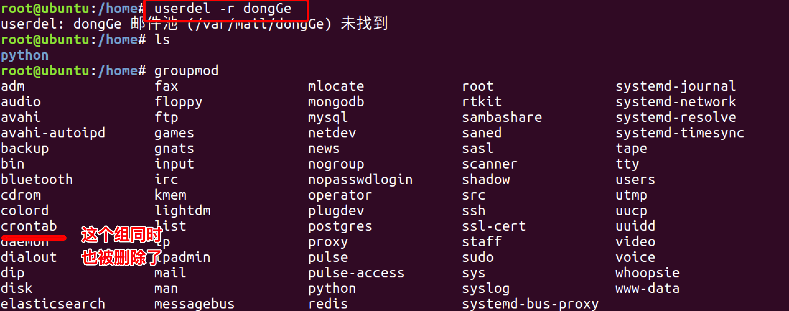

**<7>切换用户：su**

可以通过 su 命令切换用户，su 后面可以加“-”。su 和 su –命令不同之处在于，su -切换到对应的用户时会将当前的工作目录自动转换到切换后的用户主目录：

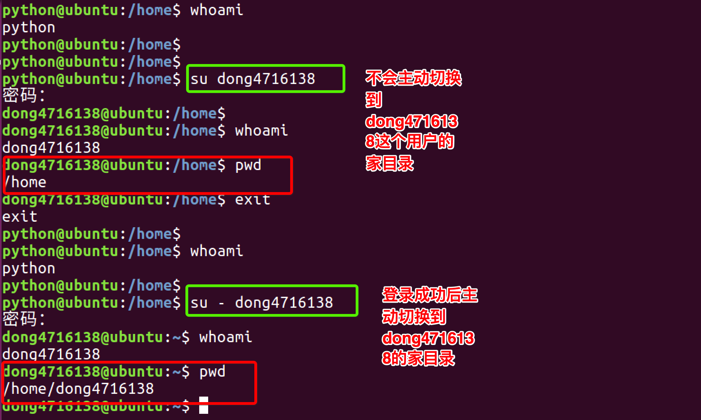

注意：如果是 ubuntu 平台，需要在命令前加“sudo”，如果在某些操作需要管理员才能操作，ubuntu 无需切换到 root 用户即可操作，只需加“sudo”即可。sudo 是 ubuntu 平台下允许系统管理员让普通用户执行一些或者全部的 root 命令的一个工具，减少了 root 用户的登陆和管理时间，提高了安全性。

| 命令          | 含义                                       |
| ------------- | ------------------------------------------ |
| su            | 切换到 root 用户                           |
| su root       | 切换到 root 用户                           |
| su -          | 切换到 root 用户，同时切换目录到/root      |
| su - root     | 切换到 root 用户，同时切换目录到/root      |
| su 普通用户   | 切换到普通用户                             |
| su - 普通用户 | 切换到普通用户，同时切换普通用户所在的目录 |

Ubuntu 下切换到 root 的简单命令:

**<8>查看有哪些用户组**

方法一:

cat /etc/group

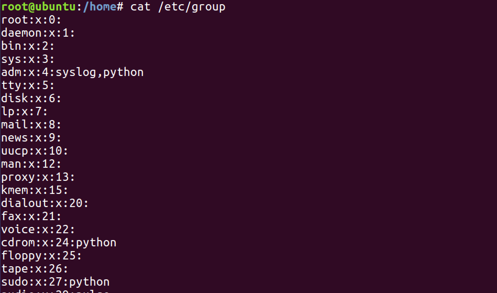

方法二:

groupmod +三次 tab 键

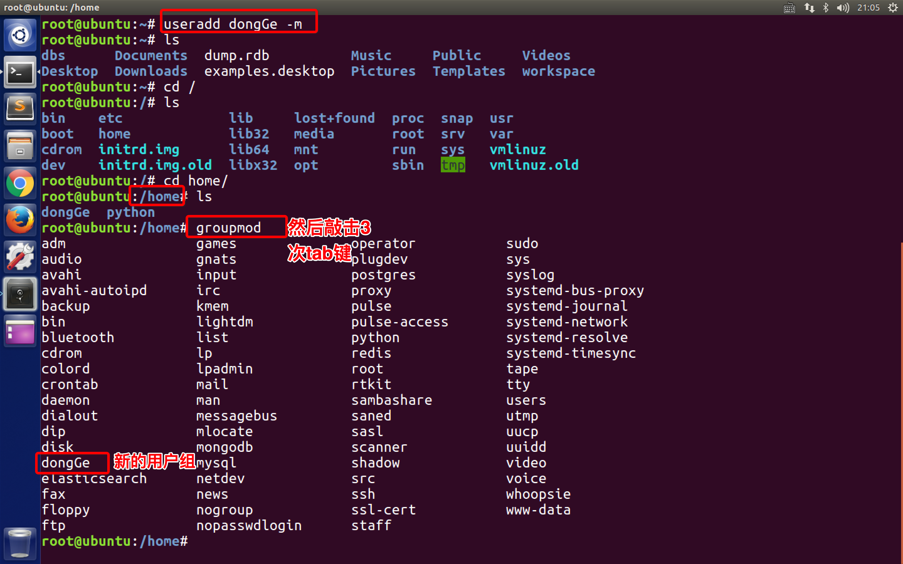

**<9>添加、删除组账号：groupadd、groupdel**

groupadd 新建组账号 groupdel 组账号 cat /etc/group 查看用户组

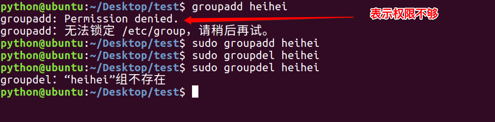

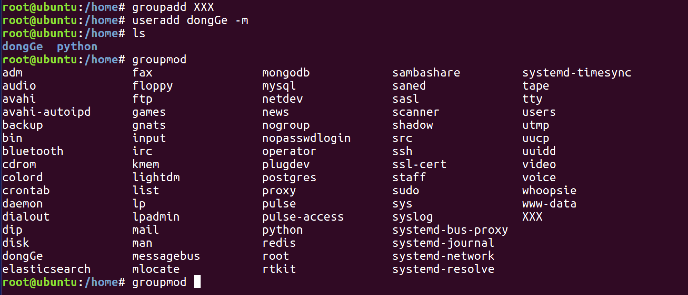

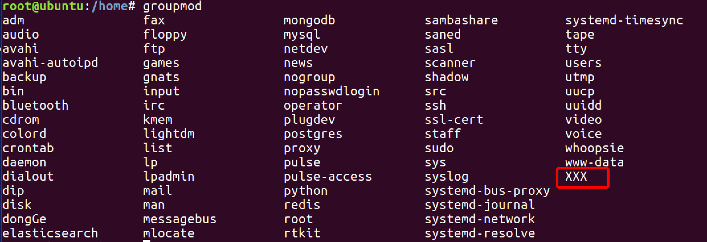

**<10>修改用户所在组：usermod**

使用方法：usermod -g 用户组 用户名

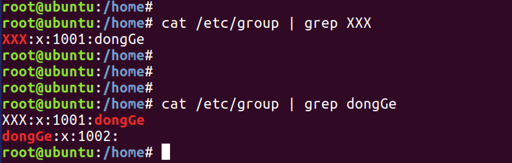

**<11>查看用户在哪些组**

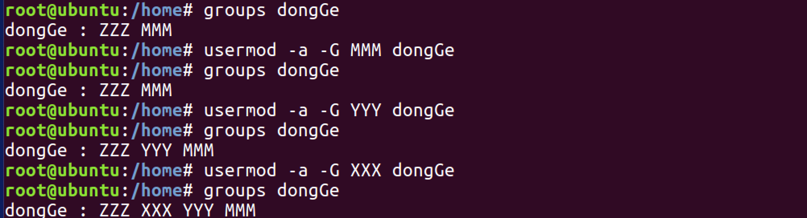

**<12>为创建的普通用户添加 sudo 权限**

新创建的用户，默认不能 sudo，需要进行一下操作

sudo usermod -a -G adm 用户名 sudo usermod -a -G sudo 用户名

**<13>usermod -g 与 -G 的区别**

-g 用来制定这个用户默认的用户组

-G 一般配合'-a'来完成向其它组添加

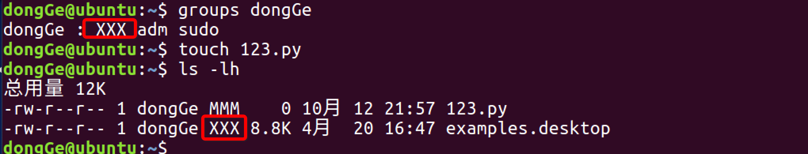

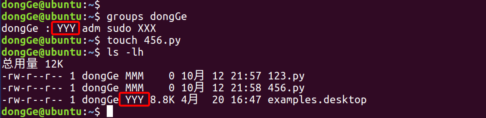

**<14>修改文件权限：chmod**

chmod 修改文件权限有两种使用格式：字母法与数字法。

字母法：chmod u/g/o/a +/-/= rwx 文件

| [ u/g/o/a ] | 含义                                                      |
| ----------- | --------------------------------------------------------- |
| u           | user 表示该文件的所有者                                   |
| g           | group 表示与该文件的所有者属于同一组( group )者，即用户组 |
| o           | other 表示其他以外的人                                    |
| a           | all 表示这三者皆是                                        |

| [ +-= ] | 含义     |
| ------- | -------- |
| +       | 增加权限 |
| -       | 撤销权限 |
| =       | 设定权限 |

| rwx | 含义                                                                                         |
| --- | -------------------------------------------------------------------------------------------- |
| r   | read 表示可读取，对于一个目录，如果没有 r 权限，那么就意味着不能通过 ls 查看这个目录的内容。 |
| w   | write 表示可写入，对于一个目录，如果没有 w 权限，那么就意味着不能在目录下创建新的文件。      |
| x   | excute 表示可执行，对于一个目录，如果没有 x 权限，那么就意味着不能通过 cd 进入这个目录。     |

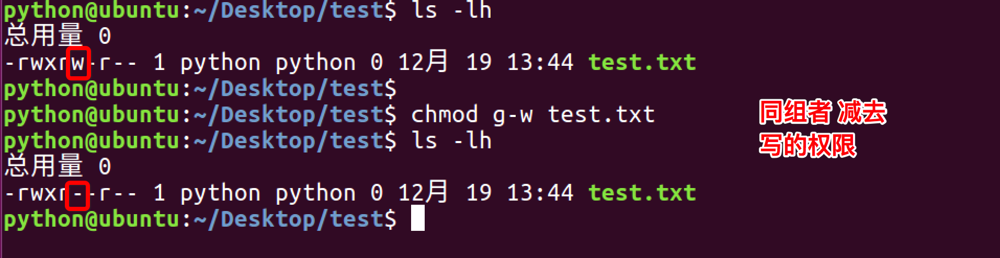

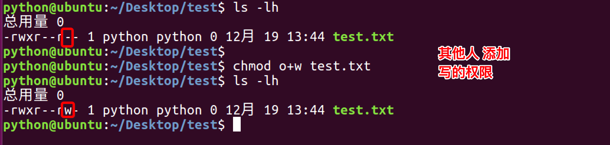

如果需要同时进行设定拥有者、同组者以及其他人的权限，参考如下：

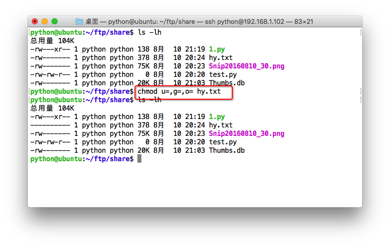

数字法：“rwx” 这些权限也可以用数字来代替

| 字母 | 说明                         |
| ---- | ---------------------------- |
| r    | 读取权限，数字代号为 "4"     |
| w    | 写入权限，数字代号为 "2"     |
| x    | 执行权限，数字代号为 "1"     |
| -    | 不具任何权限，数字代号为 "0" |

如执行：chmod u=rwx,g=rx,o=r filename 就等同于：chmod u=7,g=5,o=4 filename

chmod 751 file：

- 文件所有者：读、写、执行权限
- 同组用户：读、执行的权限
- 其它用户：执行的权限

注意：如果想递归所有目录加上相同权限，需要加上参数“ -R ”。如：chmod 777 test/ -R 递归 test 目录下所有文件加 777 权限

**<15>修改文件所有者：chown**

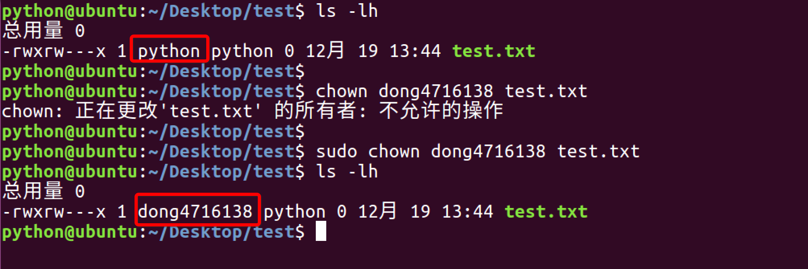

**<16>修改文件所属组：chgrp**

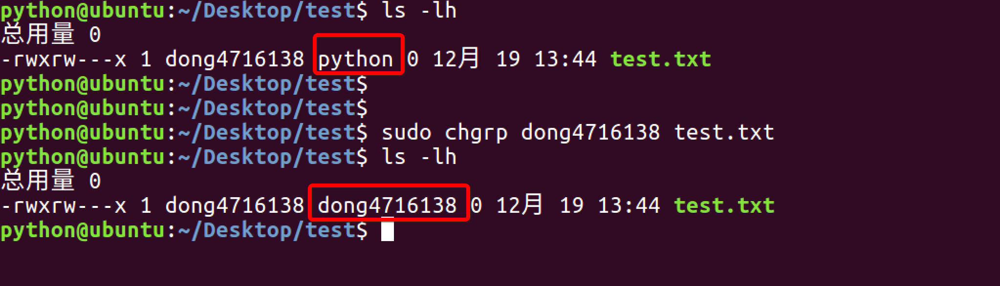
