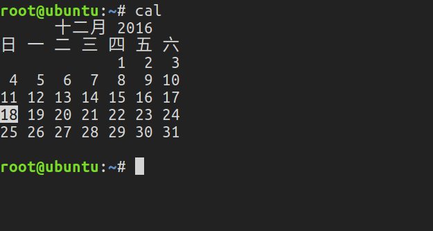
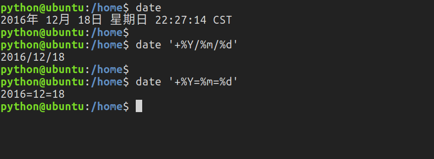
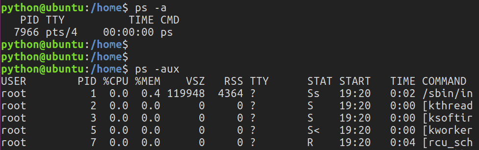
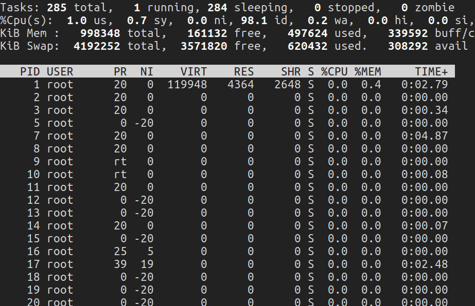
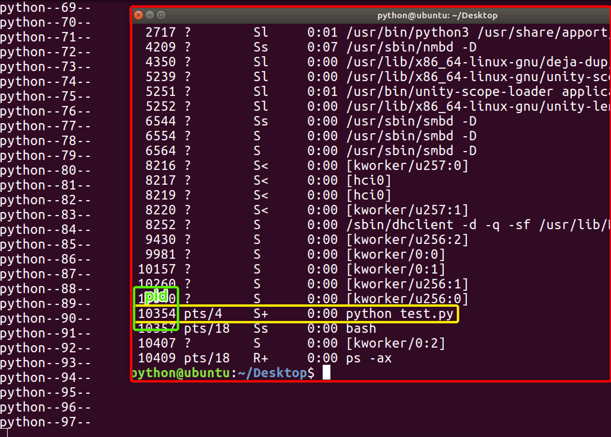
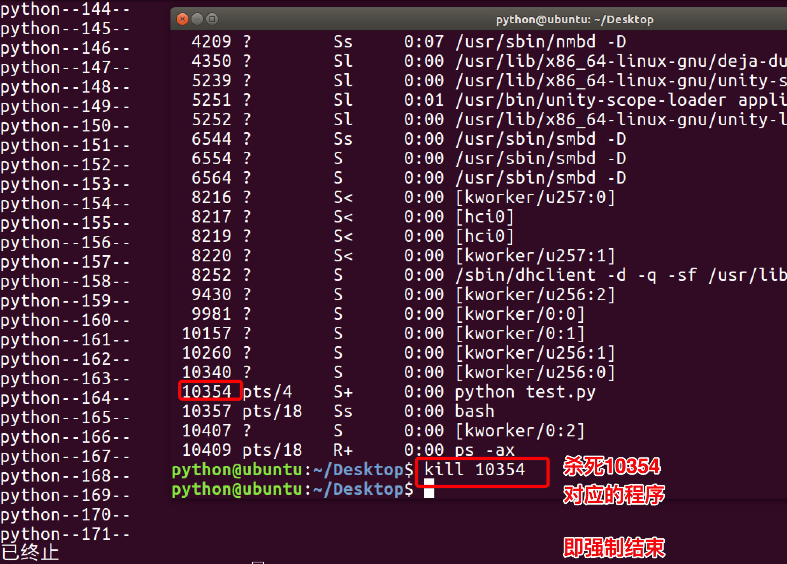
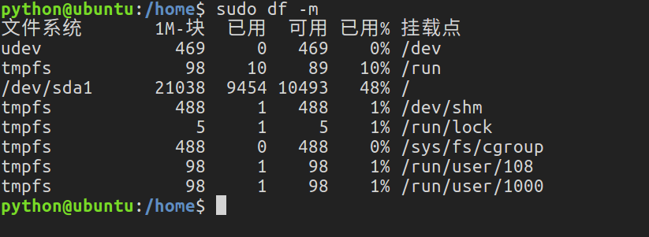
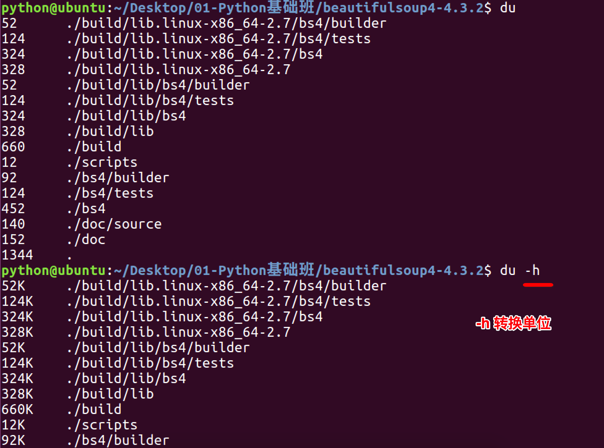

# 系统管理

**Linux 命令-系统管理**

**<1>查看当前日历：cal**

cal 命令用于查看当前日历，-y 显示整年日历：

**<2>显示或设置时间：date**

设置时间格式（需要管理员权限）：

date [MMDDhhmm[[CC]YY][.ss]] +format

CC 为年前两位 yy 为年的后两位，前两位的 mm 为月，后两位的 mm 为分钟，dd 为天，hh 为小时，ss 为秒。如： date 010203042016.55。

显示时间格式（date '+%y,%m,%d,%H,%M,%S'）：

| format 格式 | 含义 |
| ----------- | ---- |
| %Y，%y      | 年   |
| %m          | 月   |
| %d          | 日   |
| %H          | 时   |
| %M          | 分   |
| %S          | 秒   |

**<3>查看进程信息：ps**

进程是一个具有一定独立功能的程序，它是操作系统动态执行的基本单元。

ps 命令可以查看进程的详细状况，常用选项(选项可以不加“-”)如下：

| 选项 | 含义                                     |
| ---- | ---------------------------------------- |
| -a   | 显示终端上的所有进程，包括其他用户的进程 |
| -u   | 显示进程的详细状态                       |
| -x   | 显示没有控制终端的进程                   |
| -w   | 显示加宽，以便显示更多的信息             |
| -r   | 只显示正在运行的进程                     |

**<4>动态显示进程：top**

top 命令用来动态显示运行中的进程。top 命令能够在运行后，在指定的时间间隔更新显示信息。可以在使用 top 命令时加上-d 来指定显示信息更新的时间间隔。

在 top 命令执行后，可以按下按键得到对显示的结果进行排序：

| 按键 | 含义                                |
| ---- | ----------------------------------- |
| M    | 根据内存使用量来排序                |
| P    | 根据 CPU 占有率来排序               |
| T    | 根据进程运行时间的长短来排序        |
| U    | 可以根据后面输入的用户名来筛选进程  |
| K    | 可以根据后面输入的 PID 来杀死进程。 |
| q    | 退出                                |
| h    | 获得帮助                            |

**<5>终止进程：kill**

kill 命令指定进程号的进程，需要配合 ps 使用。

使用格式：

kill [-signal] pid

信号值从 0 到 15，其中 9 为绝对终止，可以处理一般信号无法终止的进程。

kill 9133 ：9133 为应用程序所对应的进程号

有些进程不能直接杀死，这时候我们需要加一个参数“ -9 ”，“ -9 ” 代表强制结束：

**<6>关机重启：reboot、shutdown、init**

| 命令              | 含义                                        |
| ----------------- | ------------------------------------------- |
| reboot            | 重新启动操作系统                            |
| shutdown –r now   | 重新启动操作系统，shutdown 会给别的用户提示 |
| shutdown -h now   | 立刻关机，其中 now 相当于时间为 0 的状态    |
| shutdown -h 20:25 | 系统在今天的 20:25 会关机                   |
| shutdown -h +10   | 系统再过十分钟后自动关机                    |
| init 0            | 关机                                        |
| init 6            | 重启                                        |

**<7>检测磁盘空间：df**

df 命令用于检测文件系统的磁盘空间占用和空余情况，可以显示所有文件系统对节点和磁盘块的使用情况。

| 选项 | 含义                                 |
| ---- | ------------------------------------ |
| -a   | 显示所有文件系统的磁盘使用情况       |
| -m   | 以 1024 字节为单位显示               |
| -t   | 显示各指定文件系统的磁盘空间使用情况 |
| -T   | 显示文件系统                         |

**<8>检测目录所占磁盘空间：du**

du 命令用于统计目录或文件所占磁盘空间的大小，该命令的执行结果与 df 类似，du 更侧重于磁盘的使用状况。

du 命令的使用格式如下：du [选项] 目录或文件名

| 选项 | 含义                                               |
| ---- | -------------------------------------------------- |
| -a   | 递归显示指定目录中各文件和子目录中文件占用的数据块 |
| -s   | 显示指定文件或目录占用的数据块                     |
| -b   | 以字节为单位显示磁盘占用情况                       |
| -l   | 计算所有文件大小，对硬链接文件计算多次             |

**<9>查看或配置网卡信息：ifconfig**

如果，我们只是敲：ifconfig，它会显示所有网卡的信息：

**<10>测试远程主机连通性：ping**
