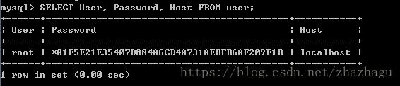

# mysql

新安装的数据库只能 localhost 访问？？是不是很苦逼

下面介绍如何允许远程访问 root

\1. “试一下”能否远程登录

```sql
> mysql -u root -p -h 10.0.42.180
```


答案是否定的。那就开始进行设置吧

\2. 登录数据库,默认本地访问

```sql
> mysql -u root -p
```


3.切换 mysql 数据库

```sql
mysql> use mysql
```


4.执行查询，查看数据库当前有访问权限的信息

```sql
mysql> SELECT User, Password, Host FROM user;
```



只有 localhost 才能访问

5.设置访问权限

```sql
mysql> GRANT ALL PRIVILEGES ON *.* TO 'root'@'%' IDENTIFIED BY 'root' WITH GRANT OPTION;
```


其中"_._"代表所有资源所有权限， “'root'@%”其中 root 代表账户名，%代表所有的访问地址，也可以使用一个唯一的地址进行替换，只有一个地址能够访问。如果是某个网段的可以使用地址与%结合的方式，如 10.0.42.%。IDENTIFIED BY 'root'，这个 root 是指访问密码。WITH GRANT OPTION 允许级联授权。

6.刷新访问权限表（不要忘了）

```sql
mysql> FLUSH PRIVILEGES;
```


7. 重新查看用户表

```sql
mysql> SELECT User, Password, Host FROM user;
```


8.验证远程访问

```sql
> mysql -u root -p -h 10.0.42.180
```


OK，登录成功
