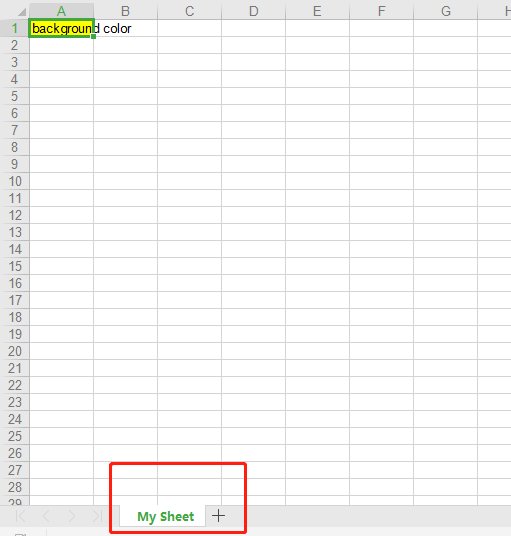
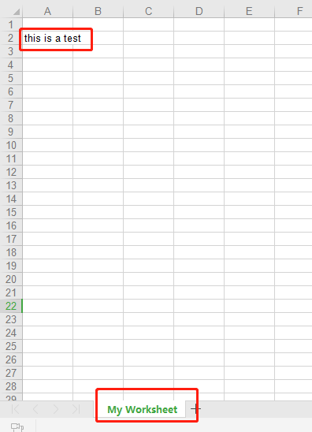
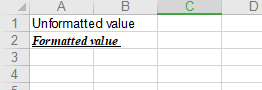
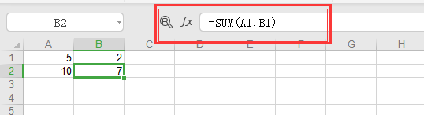
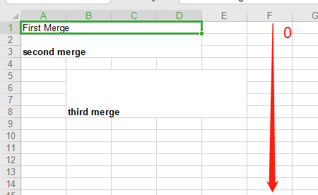
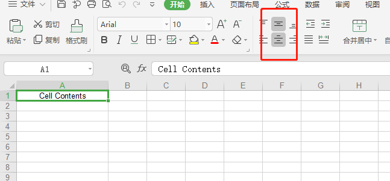
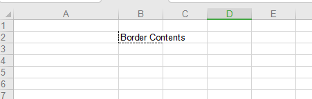

# xlwt 操作 XLS 报表

安装 xlwt

```shell
pip install xlwt
```

**和操作文件过程一样：\*\***打开——》操作——》保存\*\*

**1.实例化一个 Excel 工作本**

```
workbook= xlwt.Woekbook(encoding = 'utf-8')
```

**2.每个工作本 对应的可以创建多个表格**

```
worksheet = workbook.add_sheet('My Woeksheet')
```



**3.向表格写入内容，样式等**

**添加的内容也都是对象。**

```
1，创建样式对象
2，样式对象中属性的添加
3，将该样式对象应用于表格
```

**3.1 写入内容**

```
# 写入Excel
# 参数对应 行 列 值 worksheet.write(1,0,label='this is a test')
```



**3.2 更改写入字体**

**创建样式对象并且增加属性**

```
# 创建一个样式 实例
style = xlwt.XFStyle()
# 创建一个字体实例
font = xlwt.Font()
font.name = 'Times New Roman'
# 字体加粗
font.bold = True
# 下划线
font.underline = True
# 斜体字
font.italic = True
```

**将样式应用于表格**

```
# 字体应用于样式
style.font = font
# 不带样式的写入
worksheet.write(0,0,'Unformatted value')
# 带样式的写入
worksheet.write(1,0,'Formatted value',style)
```



**3.3 设置单元格宽度**

```
worksheet.col(0).width = 3333
```

**3.4 应用日期到表格**

```python
import datetime
style = xlwt.XFStyle()
style.num_format_str = 'M/D/YY'
# 可选项: D-MMM-YY, D-MMM, MMM-YY, h:mm, h:mm:ss, h:mm, h:mm:ss,
# M/D/YY h:mm, mm:ss, [h]:mm:ss, mm:ss.0

worksheet.write(0, 0, datetime.datetime.now(), style)
```

**3.5 单元格使用函数公式**

```python
worksheet.write(1, 0, xlwt.Formula('A1*B1'))
# Should output "10" (A1[5] * A2[2])
worksheet.write(1, 1, xlwt.Formula('SUM(A1,B1)'))
# Should output "7" (A1[5] + A2[2])
```



**3.6 单元格添加超链接**

```
worksheet.write(0, 0, xlwt.Formula('HYPERLINK("http://www.google.com";"Google")'))
 # Outputs the text "Google" linking to http://www.google.com
```

**3.7 合并列和行**

```
worksheet.write_merge(0,0,0,3,'First Merge')
worksheet.write_merge(1,2,0,3,'second merge',style)
# 表单的行从0 开始的 ，宽度合并从第4行到第7行，长度合并 从第1列到第4列
worksheet.write_merge(4,7,1,4,'third merge',style)
```



**3.8 设置单元格的对齐方式**

```python
# 创建单个样式对象并修改属性
alignment = xlwt.Alignment()
alignment.horz = xlwt.Alignment.HORZ_CENTER
alignment.vert = xlwt.Alignment.VERT_CENTER
# 将样式对象应用于 总样式
style = xlwt.XFStyle()

style.alignment = alignment
# 写入的时候 使用总样式
worksheet.col(0).width = 5555
worksheet.write(0,0,'Cell Contents',style)
```



**3.9 为单元格添加边框**

```
borders = xlwt.Borders()
# DASHED 虚线 NO_LINE 没有 THIN 实线
borders.left = xlwt.Borders.DASHED
borders.right = xlwt.Borders.DASHED
borders.bottom = xlwt.Borders.DASHED
borders.left_colour = 0x40
borders.right_colour = 0x40
borders.top_colour = 0x40
borders.bottom_colour = 0x40

style = xlwt.XFStyle()
style.borders = borders
worksheet.col(0).width = 5555
worksheet.write(1,1,'Border Contents',style)
```



**3.10 为单元格设置背景色**

```python
pattern = xlwt.Pattern()
pattern.pattern = xlwt.Pattern.SOLID_PATTERN
pattern.pattern_fore_colour = 5

style = xlwt.XFStyle()
style.pattern = pattern

worksheet.write(0,0,'background color',style)
```

**颜色可选项：**

```
# May be: 8 through 63. 0 = Black, 1 = White, 2 = Red, 3 = Green, 4 = Blue, 5 = Yellow, 6 = Magenta, 7 = Cyan, 16 = Maroon, 17 = Dark Green, 18 = Dark Blue, 19 = Dark Yellow , almost brown), 20 = Dark Magenta, 21 = Teal, 22 = Light Gray, 23 = Dark Gray, the list goes on...
```
