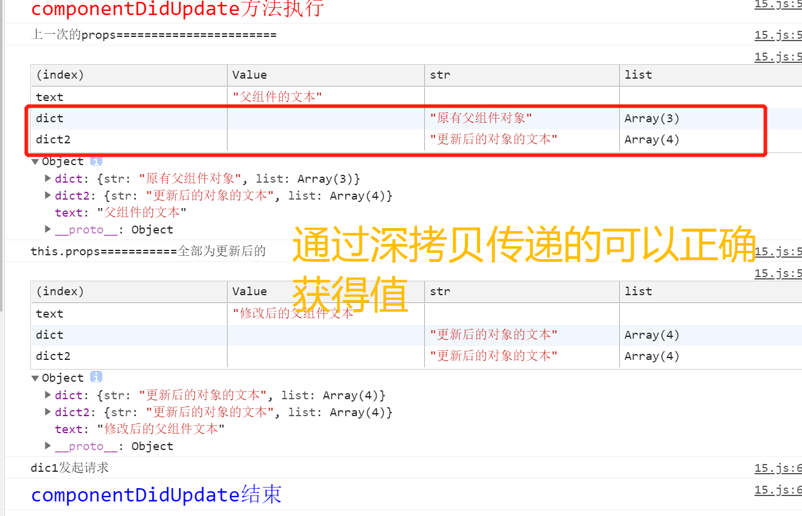

# react 中的引用对象的 BUG

## 1.利用 componentDidUpdate 进行新旧 props 对比渲染

想使用 react 的 componentDidUpdate 的生命周期根据新旧 props 的不同来进行渲染或者数据处理之类的。代码如下：

```js
// father.js
state = {
     dict: {
      str: "原有父组件对象",
      list: ["a", "b", "c"],
    },
}

// 通过props 传递给子组件
// dict使用深拷贝 dict2不使用深拷贝
          <Children
            text={this.state.text}
            dict={JSON.parse(JSON.stringify(this.state.dict))}
            dict2={this.state.dict}
          />
```

```js
// children.js
  componentDidUpdate(prevProps, prevState) {
    console.log("%ccomponentDidUpdate方法执行", "color:red;font-size:20px");
    console.log("上一次的props=======================");
    console.table(prevProps);
    console.log("this.props==========");
    console.table(this.props);
    if (prevProps.dict2.list.length !== this.props.dict2.list.length) {
      console.log("dict2发起请求");
    }
    if (prevProps.dict.list.length !== this.props.dict.list.length) {
      console.log("dic1发起请求");
    }
    console.log("%ccomponentDidUpdate结束", "color:blue;font-size:20px");
  }
```

## 2.运行结果：



- dict 是使用深拷贝传递的，可以正确获取到上一次的 props、
- dict2 是直接引用传递的，直接获取到的就是更新后的 props，无法进行 if 判断

## **父组件向子组件传递引用类型的时候，要使用深拷贝，否则传递过去的是对象的引用，无法做出正确的判断**
