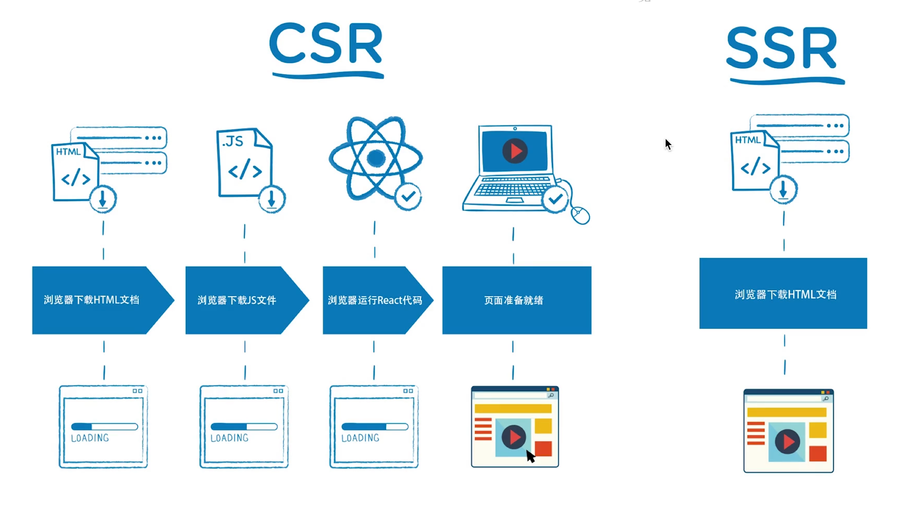
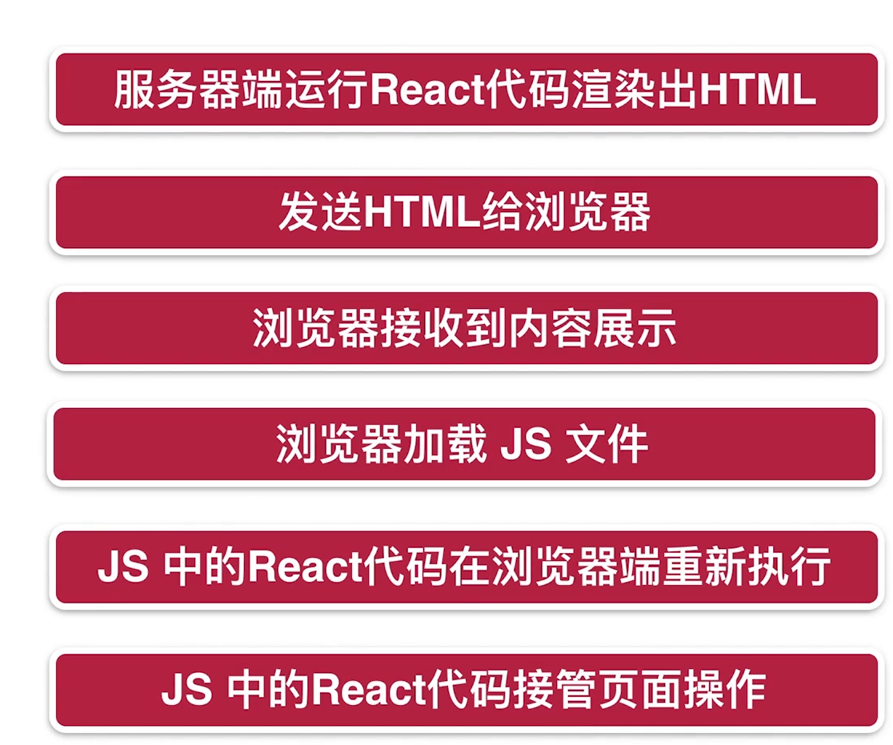

# React 服务端渲染

## 1.SSR 简介

### 1.服务端渲染 SSR 和客户端渲染 CSR



### 2.SEO 优化必须使用 SSR【Python 爬虫不认识 JS 文件，只认识 HTML 标签等】

### 3.客户端渲染的流程


### 4.服务端渲染流程


### 5.性能对比

#### 客户端渲染

客户端渲染是 React 代码在 浏览器上执行的，占用的是用户浏览器的性能

#### 服务器端渲染

React 代码在服务器上执行，把虚拟 DOM 变为字符串一类的，消耗的是服务器端的性能

### 6.同构 解决服务器端事件绑定问题



## 2.SSR 开始

### 1.安装`express`，编写服务端代码

```bash
yarn add express
```

开启一个简单的服务器

```js
const express = require("express");
const app = express();
app.get("/", function (req, res) {
  res.send(
    `<html>
      <head>
        <title>ssr</title>
      </head>
      <body>
      <div id='root'>helloworld</div>
      <script src='index.js'></script>
      </body>
    </html>`
  );
});

const server = app.listen(3000, () => {
  console.log("http://localhost:3000");
});
```
