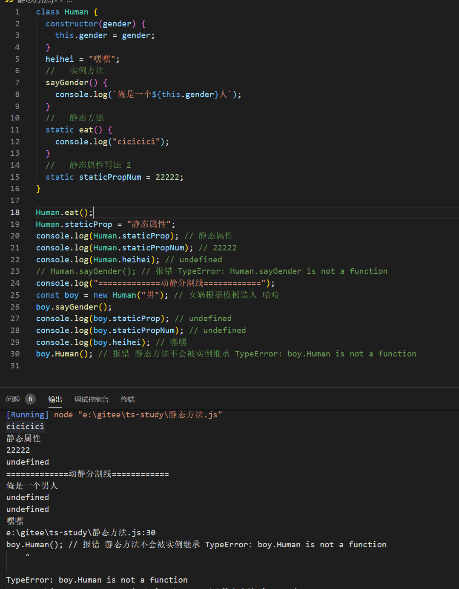
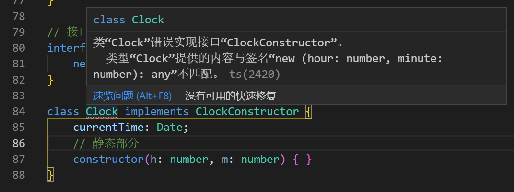

## 接口

### 1.概念

手机有 type-C 充电接口，电脑有 USB 接口等。
IT 意义：由一套陈述、功能、选项、其它表达程序结构的形式、以及程序师使用的程序或者`程序语言提供的数据`组成。【提前定义好了该有的数据格式，键值对应关系】

手机充电接口是 type-C 的则充电器的接口也是 type-C 的才能给手机充上电。

TypeScript 的核心原则之一是对值所具有的*结构*进行类型检查。 它有时被称做“鸭式辨型法”或“结构性子类型化”。 在 TypeScript 里，接口的作用就是为这些类型命名和为你的代码或第三方代码定义契约。

**鸭式辨型法：**鸭式辨型：像鸭子一样走路、游泳和嘎嘎叫的鸟就是鸭子

### 2.接口初探

某函数接受一个对象作为参数，对象中需要包含一个键为 label 的值的类型为字符串的数据。

```typescript
function printLabel(labelledObj: { label: string }) {
  console.log(labelledObj.label);
}

let myObj = { size: 10, label: "Size 10 Object" };
printLabel(myObj);
```

我们传入的 myObj 对象不仅仅只有类型检查要求的一个 label 键属性，但是编译器只会检查必需的属性和其对应的类型是否匹配。PS:某些时候 typescript 也不会这么宽松。使用接口实现上面的需求。

```typescript
interface LabelledValue {
  label: string;
}

function printLabel(labelObj: LabelledValue) {
  console.log(labelObj.label);
}

let myObj = { size: 10, label: "111", age: 22 };
let errObj = { size: 10, age: 22 };
printLabel(myObj);
printLabel(errObj); // 会报错 因为 缺少必需键 label
```

类型检查器不会去检查属性的顺序，只要相应的属性存在并且类型也是对的就可以。

### 3.可选属性 `?`

带有可选属性的接口与普通的接口定义差不多，只是在可选属性名字定义的后面加一个`?`符号。

**好处**

- 对可能存在的属性进行预定义
- 可以捕获到引用不存在属性时的错误

```typescript
// 可选属性
interface SquareConfig {
  color?: string;
  width?: number;
}

function createSquare(config: SquareConfig): { color: string; area: number } {
  let newSquare = { color: "white", area: 100 };
  // 拼错时候会有错误提示 clor
  if (config.color) {
    newSquare.color = config.color;
  }
  if (config.width) {
    newSquare.area = config.width * config.width;
  }
  return newSquare;
}
```

### 4.只读属性 `readonly`

对象属性创建以后无法更改。

```typescript
interface Point {
  readonly x: number;
  readonly y: number;
}

let p1: Point = { x: 10, y: 20 };
p1.x = 5; // error!
```

#### 扩展：只读数组

TypeScript 具有`ReadonlyArray<T>`类型，它与`Array<T>`相似，只是把所有可变方法去掉了，因此可以确保数组创建后再也不能被修改：

```typescript
let a: number[] = [1, 2, 3, 4];
let ro: ReadonlyArray<number> = a;
ro[0] = 12; // error!
ro.push(5); // error!
ro.length = 100; // error!
a = ro; // error!
```

是不是去掉了 setter 子保留了 getter？

使用断言更改只读数组的类型，把只读数组赋值给普通数组

```typescript
a = ro as number[];
```

#### `readonly` vs `const`

- 变量的话使用`const`
- 作为属性的话 使用 readonly

### 5.额外的属性检查 【俺没有完全理解这个意思】

**直接照抄了**

某函数的参数只需要对象的`label` 属性，而传入`{ size: number; label: string; }`的属性是没得问题的。

然后结合可选属性

```typescript
interface SquareConfig {
  color?: string;
  width?: number;
}

function createSquare(config: SquareConfig): { color: string; area: number } {
  // ...
}
// 不是使用的color
let mySquare = createSquare({ colour: "red", width: 100 });
```

你可能会争辩这个程序已经正确地类型化了，因为`width`属性是兼容的，不存在`color`属性，而且额外的`colour`属性是无意义的。

然而，TypeScript 会认为这段代码可能存在 bug。 对象字面量会被特殊对待而且会经过 _额外属性检查_，当将它们赋值给变量或作为参数传递的时候。 如果一个对象字面量存在任何“目标类型”不包含的属性时，你会得到一个错误。

```ts
// error: 'colour' not expected in type 'SquareConfig'
let mySquare = createSquare({ colour: "red", width: 100 });
```

绕开这些检查非常简单。 最简便的方法是使用类型断言：

```ts
let mySquare = createSquare({ width: 100, opacity: 0.5 } as SquareConfig);
```

然而，最佳的方式是能够添加一个字符串索引签名，前提是你能够确定这个对象可能具有某些做为特殊用途使用的额外属性。 如果 `SquareConfig`带有上面定义的类型的`color`和`width`属性，并且*还会*带有任意数量的其它属性，那么我们可以这样定义它：

```ts
interface SquareConfig {
  color?: string;
  width?: number;
  [propName: string]: any;
}
```

我们稍后会讲到索引签名，但在这我们要表示的是`SquareConfig`可以有任意数量的属性，并且只要它们不是`color`和`width`，那么就无所谓它们的类型是什么。

还有最后一种跳过这些检查的方式，这可能会让你感到惊讶，它就是将这个对象赋值给一个另一个变量： 因为 `squareOptions`不会经过额外属性检查，所以编译器不会报错。

```ts
let squareOptions = { colour: "red", width: 100 };
let mySquare = createSquare(squareOptions);
```

要留意，在像上面一样的简单代码里，你可能不应该去绕开这些检查。 对于包含方法和内部状态的复杂对象字面量来讲，你可能需要使用这些技巧，但是大部额外属性检查错误是真正的 bug。 就是说你遇到了额外类型检查出的错误，比如“option bags”，你应该去审查一下你的类型声明。 在这里，如果支持传入 `color`或`colour`属性到`createSquare`，你应该修改`SquareConfig`定义来体现出这一点。

### 6.函数类型

参数列表和返回值类型的函数定义。参数列表里的每个参数都需要名字和类型。就像是定义函数参数类型一样

```typescript
interface SearchFunc {
  (source: string, subString: string): boolean;
}
```

**使用**

```typescript
let mySearch: SearchFunc;
mySearch = function (source: string, subString: string) {
  let result = source.search(subString);
  return result > -1;
};
```

#### 函数的参数名可以不与接口定义的一致

```typescript
let mySearch: SearchFunc;
mySearch = function (src: string, sub: string): boolean {
  let result = src.search(sub);
  return result > -1;
};
```

ts 会根据接口定义逐个检查函数的参数，要求对应位置上的参数类型是兼容的。如果未指定类型，ts 将推断出参数类型。

ts 的返回值类型也会根据函数返回值类型进行推断。如果和接口定义的返回类型不匹配，ts 会警告。

```typescript
let mySearch: SearchFunc;
mySearch = function (src, sub) {
  let result = src.search(sub);
  return result > -1;
};
```

### 7.可索引的类型

类比函数类型的接口定义，键定义了可索引的类型，值定义了相应索引的返回值类型。

```typescript
// 可索引的类型 数组啥的
interface StringArray {
  // 使用number进行索引
  [index: number]: string;
}

const myArray: StringArray = ["1", "2"];
const myArray2: StringArray = ["1", 2]; //警告报错
let myStr = myArray[1];
```

#### ts 支持两种索引签名：

- 字符串
- 数字

也可以同时使用两种类型的索引，`数字索引返回值`必须是`字符串索引返回值`的`子类型`。

原因：当使用 number 作为索引的时候，ts 会先把 number 转换为字符串 string 类型，然后再去索引对象。

```typescript
class Animals {
  name: string;
}
// Dog 类是 Animals 的子项
class Dog extends Animals {
  breed: string;
}

interface AnimaildInt {
  // 正确写法
  // [x:string]:Animals,
  // [x:number]:Dog,
  // 错误写法
  [x: number]: Animals;
  [x: string]: Dog;
}
```

#### 描述`dictionary`模式【暂时未理解】

确保所有属性与其返回值类型相匹配。 因为字符串索引声明了 `obj.property`和`obj["property"]`两种形式都可以。 下面的例子里， `name`的类型与字符串索引类型不匹配，所以类型检查器给出一个错误提示：

```typescript
interface NumberDictionary {
  [index: string]: number;
  length: number; // 可以，length是number类型
  name: string; // 错误，`name`的类型与索引类型返回值的类型不匹配
}
```

#### 只读的索引签名

```typescript
interface ReadonlyStringArray {
  readonly [index: number]: string;
}
let myArray: ReadonlyStringArray = ["Alice", "Bob"];
myArray[2] = "Mallory"; // error!
```

### 8.class 类型 【类比 Java】

#### class 中的静态方法、静态属性和实例属性方法

class 相当于创建实例的原型模板，所有在类中定义的方法，都会在创建实例的时候被实例所继承，但是有些方法不涉及到 class 内部的属性的使用，无需创建一个实例来使用这个方法，这种类型的方法就是静态方法，静态方法的创建在方法名前使用 static 关键字进行修饰。

- 静态方法不会被实例继承，通过类名可以直接调用
- 静态方法前有 static 关键字

**静态属性：**是定义在 Class 上的属性，例如：Class.staticProp 而不是实例上的，或者使用 static 关键词

**实例属性：**可以通过实例访问的属性，定义在 Class 中的，使用等号创建的

```JavaScript
class Human {
  constructor(gender) {
    this.gender = gender;
  }
  heihei = "嘿嘿";
  //   实例方法
  sayGender() {
    console.log(`俺是一个${this.gender}人`);
  }
  //   静态方法
  static eat() {
    console.log("cicicici");
  }
  //   静态属性写法 2
  static staticPropNum = 22222;
}

Human.eat();
Human.staticProp = "静态属性";
console.log(Human.staticProp); // 静态属性
console.log(Human.staticPropNum); // 22222
console.log(Human.heihei); // undefined
// Human.sayGender(); // 报错 TypeError: Human.sayGender is not a function
console.log("=============动静分割线============");
const boy = new Human("男"); // 女娲根据模板造人 哈哈
boy.sayGender();
console.log(boy.staticProp); // undefined
console.log(boy.staticPropNum); // undefined
console.log(boy.heihei); // 嘿嘿
boy.Human(); // 报错 静态方法不会被实例继承 TypeError: boy.Human is not a function
```



接口描述了类的公共部分，而不是公共和私有两部分。

```typescript
interface ClockInterface {
  currentTime: Date;
  setTime(d: Date);
}

class Clock implements ClockInterface {
  currentTime: Date;
  setTime(d: Date) {
    this.currentTime = d;
  }
  constructor(h: number, m: number) {}
}
```

#### 类的静态部分和实例部分

定义一个接口并试图定义一个类来实现这个接口的时候会得到一个错误

```typescript
interface ClockConstructor {
  new (hour: number, minute: number);
}

class Clock implements ClockConstructor {
  currentTime: Date;
  constructor(h: number, m: number) {}
}
```



当一个类使用了接口以后，只会对其`实例部分`进行类型检查，`constructor`属于类的构造方法，是静态的，constructor 存在于类的静态部分，所以不在检查的范围内。

正常情况使用接口定义 class

```typescript
interface ClockInterface {
  tick(): void;
  // constructor(h:number,m:number):any
  // constructor2(n:number,m:number):any
  // method2(),
}
class DigitalClock implements ClockInterface {
  // 静态方法
  constructor(h: number, m: number) {}
  tick() {
    console.log("beep beep");
  }
}
```

存在静态方法无法检查。

增加一层校验：校验构造函数，对已存在的接口进行二次包装，并且创建一个工厂函数，生成对应的实例对象。

```typescript
interface ClockInterface {
  tick(): void; // 类原始接口
}
interface ClockConstructor {
  // 构造器 接口
  // ClockInterface 是含有 tick() 方法的接口 而 ClockConstructor 是ClockInterface类型的构造函数则需要包含tick()方法
  new (hour: number, minute: number): ClockInterface; // 在用接口进行包装一下
}
class DigitalClock implements ClockInterface {
  // 静态方法 无法校验
  constructor(h: number, m: number) {}
  tick() {
    console.log("beep beep");
  }
}
// 构造器函数 传入 构造器接口类型的构造器对象 和 类需要的参数 返回生成的对象
function createClock(
  ctor: ClockConstructor,
  hour: number,
  minute: number
): ClockInterface {
  return new ctor(hour, minute);
}

let digital = createClock(DigitalClock, 12, 17);
```

### 9.接口的继承 【和类一样】

#### 单个继承

接口就是`类的抽象`，和类一样，也是可以继承的,从一个接口里复制成员到另一个接口里，可以更灵活地将接口分割到可重用的模块里。

```typescript
interface Shape {
  color: string;
}
interface Square extends Shape {
  sideLength: number;
}
let square = <Square>{};
square.color = "blue";
square.sideLength = 10;
```

#### 接口的多继承

```typescript
interface Shape {
  color: string;
}

interface PenStroke {
  penWidth: number;
}

interface Square extends Shape, PenStroke {
  sideLength: number;
}

let square = <Square>{};
square.color = "blue";
square.sideLength = 10;
square.penWidth = 5.0;
```

### 10.混合类型 函数和类的混合体

对象可以同时做为函数和对象使用，并带有额外的属性。

#### JS 版本

```JavaScript
function getCounter() {
  let counter = function (start) {
    console.log("创造了", start);
  };
  counter.interval = 123;
  counter.reset = function () {
    console.log("reset");
  };
  return counter;
}
let c = getCounter();
c(10); // 创造了 10
c.reset(); // reset
c.interval = 5;

getCounter.hh = 123;
console.log(getCounter.hh); // 123

```

#### TS 版本

```typescript
interface Counter {
  (start: number): string;
  interval: number;
  reset(): void;
}

function getCounter(): Counter {
  let counter = <Counter>function (start: number) {};
  counter.interval = 123;
  counter.reset = function () {};
  return counter;
}

let c = getCounter();
c(10);
c.reset();
c.interval = 5.0;
```

### 11.接口继承类

当接口继承了一个 class 类型时，它会继承 class 的成员但不包括其实现。 就好像接口声明了所有 class 中存在的成员，但并没有提供具体实现一样。【接口接管了这个模板的属性和方法】 ，接口同样会继承到类的 private 和 protected 成员【私有化的话，理论上只能自己的实例或者其继承者才能使用，但是 js 还没有实现私有化保护】。 这意味着当你创建了一个接口继承了一个拥有私有或受保护的成员的类时，这个接口类型只能被这个类或其子类所实现（implement）。

当你有一个庞大的继承结构时这很有用，但要指出的是你的代码只在子类拥有特定属性时起作用。 这个子类除了继承至基类外与基类没有任何关系。 例：

```ts
class Control {
  private state: string;
  private hh() {}
  static staticState: string;
  testFunc = () => {};
}
// SelectabControl 继承类 也会默认继承其 属性 并且可更改非私有化的属性的类型
interface SelectabControl extends Control {
  select(): void;
  staticState: number; // 复写 类属性 字符串变为 数字
  state2: any;
}

// 继承 Control 类 实现 SelectabControl
class Button extends Control implements SelectabControl {
  select() {
    console.log("select");
  }
}
// 继承 Control 则有了 private state属性
class TextBox extends Control {
  select() {}
}

// 报错提示 类型“ImageTest”缺少类型“SelectabControl”中的以下属性:
// state, hh, testFunc
class ImageTest implements SelectabControl {
  select() {}
  staticState = 222;
}
```

在上面的例子里，`SelectableControl`包含了`Control`的所有成员，包括私有成员`state`。 因为 `state`是私有成员，所以只能够是`Control`的子类们才能实现`SelectableControl`接口。 因为只有 `Control`的子类才能够拥有一个声明于`Control`的私有成员`state`，这对私有成员的兼容性是必需的。

在`Control`类内部，是允许通过`SelectableControl`的实例来访问私有成员`state`的。 实际上， `SelectableControl`接口和拥有`select`方法的`Control`类是一样的。 `Button`和`TextBox`类是`SelectableControl`的子类（因为它们都继承自`Control`并有`select`方法），但`Image`和`Location`类并不是这样的。
