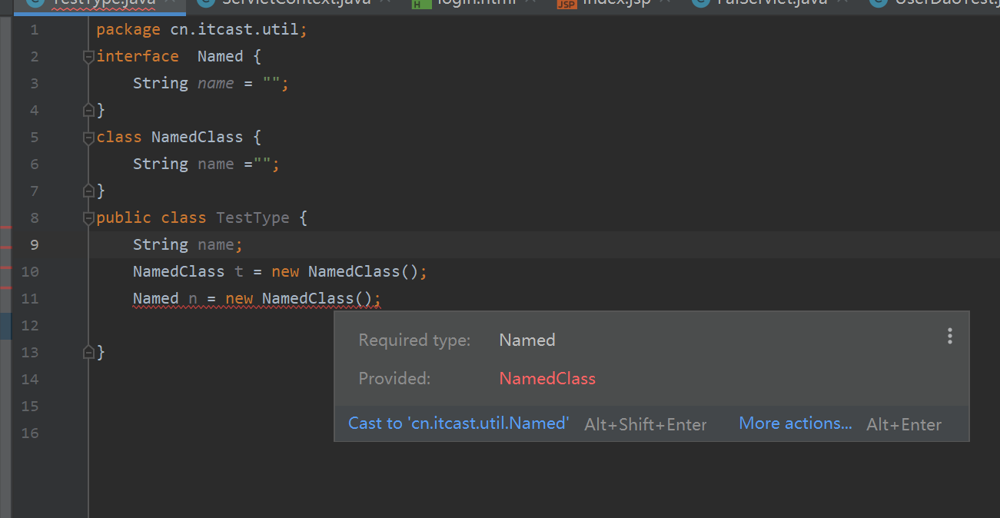
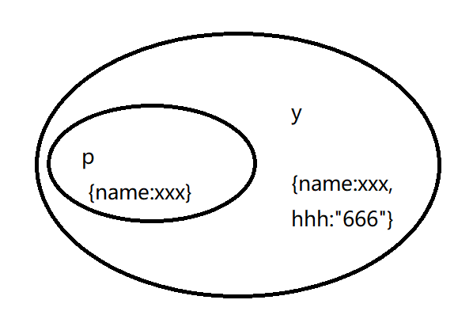

## 类型推论和类型兼容性

### 1.类型推论

**概念:**类型是在哪里如何被推断的。

#### 1.基础推论

在没有明确指定类型的时候, ts 会在初始化变量或者成员,设置默认参数值和决定函数返回值的时候自动进行推断

```typescript
let x = 3;
```

#### 2.最佳通用类型 [多类型的推论]

```typescript
let x = [0, 1, null];
```

假设 x 为数组,包含了`number`和`null`类型,ts 会考虑所有的候选类型,并给出一个兼容所有候选类型的类型.

候选类型为其父类的情况下.

```typescript
let zoo = [new Rhino(), new Elephant(), new Snake()];
```

理论上 `zoo`应该被推断为`Animal[]`类的,但是只会从候选类中进行选择,此时需要我们进行断言.明确的指出类型.

```typescript
let zoo: Animal[] = [new Rhino(), new Elephant(), new Snake()];
```

如果没有最佳通用类型的话，类型推断的结果为联合数组类型，`(Rhino | Elephant | Snake)[]`

#### 3.上下文类型[反向推论]

```typescript
window.onmousedown = function (mouseEvent) {
  console.log(mouseEvent.button);
};
```

比如上面的例子中:会根据`window.onmousedown`的函数的类型来推出等号右边的参数的类型.从结果进行反向推论出参数的类型.

如果函数表达式有明显的类型注解,以类型注解为准,忽略上下文类型类型.

**上下文 的应用场景**:通常包含函数的参数，赋值表达式的右边，类型断言，对象成员和数组字面量和返回值语句。

上下文类型也会做为最佳通用类型的候选类型。

```typescript
interface Animal {}
class Rhino implements Animal {}
class Elephant implements Animal {}
class Snake implements Animal {}
function createZoo(): Animal[] {
  return [new Rhino(), new Elephant(), new Snake()];
}
```

这个例子里，最佳通用类型有 4 个候选者：`Animal`，`Rhino`，`Elephant`和`Snake`。 当然， `Animal`会被做为最佳通用类型。

### 2.类型兼容性

#### 1.概念

上代码说概念

```typescript
interface Named {
  name: string;
}

class Person {
  name: string;
}

let p: Named;
p = new Person();
```

**以上代码不会报错**

ts 的类型兼容性是结构性类型系统的:是基于系统的组成结构的,但是不要求明确地声明.

**原因:**js 中可以使用匿名对象,例如函数表达式和对象的字面量,所以只能通过校验数据类型的结构来判断,而不能同时校验其类型定义的名字.

而 Java 是名义类型的类型系统:数据类型的兼容性或等价性是通过明确的声明和类型的名称来决定的.

JAVA 中相同含义的代码

```java
package cn.itcast.util;
interface  Named {
    String name = "";
}
class NamedClass {
    String name ="";
}
public class TestType {
    String name;
    NamedClass t = new NamedClass();
    Named n = new NamedClass(); // 报错

}
```



#### 2.类型检查的可靠性注意事项

如果`p`要兼容`y`,那么`y`至少要有全部的`x`的属性

```typescript
interface Named {
  name: string;
}

class Person {
  name: string;
}

let p: Named;
p = new Person();

let y = { name: "aaa", hhh: "666" };
p = y;
```



这个例子中,编译器会检查`p`中的每个属性是不是在`y`中存在,如果`y`中包含了所有的`p`的属性,则说明`y`高于`p`,`y`是可以变成`p`的,所以赋值没毛病.

在当作参数时候也是一样的逻辑,只要包含了所需要的`键`和`其值类型相同`就可以校验通过.校验的过程是 递归进行的,检查每个成员及子成员

```typescript
let y = { name: "aaa", hhh: "666" };
let z = { name: 444, hhh: "666" };
let w = { namedd: 444, hhh: "666" };
p = y;

function greet(n: Named) {
  console.log("hhhh" + n.name);
}

greet(y);
greet(z); // 报错 类型不兼容
greet(w); // 报错 键name 和 namedd不兼容
```

#### 3.比较两个函数

**比较参数**

```typescript
let x = (a: number) => 0;

let xx = (b: number, s: string) => 0;

let xxx = (c: number) => 0;

// 大的可以兼容小的 小的无法兼容大的,x是xx的子项，所以可以赋值为xx
xx = x;
// 只看对应的类型 参数名称相同无所谓
x = xxx;
x = xx; // 赋值错误，因为xx有个必需的第二个参数，但是x并没有，所以不允许赋值。
```

**比较返回值**

```typescript
let returnX = () => ({ name: "Alice" });
let returnY = () => ({ name: "Alice", location: "Seattle" });

// 类型系统强制源函数的返回值类型必须是目标函数返回值类型的子类型
returnX = returnY; // OK
returnY = returnX; // Error, because x() lacks a location property
```

#### 4.可选参数和剩余参数

`当一个函数有剩余参数时候，会被当作无限个可选参数`，对于类型系统来说是不稳定的，从运行时的角度来看，可选参数的不是强制传入的，默认情况下的可选参数的相当于向函数传递了`undefinded`

```typescript
function invokeLater(args: any[], callback: (...args: any[]) => void) {
  console.log("参数", args); // [1,2]
  callback(...args);
}

invokeLater([1, 2], (x, y) => console.log(x + "," + y)); // 1,2

invokeLater([1, 2], (x?, y?, z?) => console.log("可选参数", x + "," + y + z)); // 1,2undefined
```

#### 5.枚举类型和数字的兼容

```typescript
enum Status {
  Ready,
  Waiting,
}

enum Color {
  Red,
  Blue,
  Green,
}

let statu = Status.Ready;
statu = 2; // 枚举类型与数字类型兼容，并且数字类型与枚举类型兼容
statu = "2222"; // 枚举类型和字符串不兼容
statu = Color.Green; // 失败 不同枚举类型之间是不兼容的。
```

#### 6.类的比较

类和对象和接口差不多，但是类有静态部分和实例部分，在赋值比较类型检查的时候只有实例成员才会被比较，静态成员和构造函数不在比较的范围内

```typescript
class BigAnimal {
  feet: number;
  constructor(name: string, numFeet: number) {}
}

class BigSize {
  feet: number;
  constructor(numFeet: number) {}
}

let a: BigAnimal;
let s: BigSize;
// 类 有静态部分和 实力部分
// 赋值比较时候 只有 实例成员会被比较【可以使用点 访问的 比如s.feet】，
// 静态 成员和 构造函数不在比较的范围内
a = s;
s = a;
```

#### 7.泛型

把泛型当作正常的参数类型 来使用就行，不要想太多，泛型中的类型参数就是记录类型的变量而已

```typescript
interface Empty<T> {}

let x: Empty<number>;
let y: Empty<string>;

x = y;
y = x;

interface NotEmpty<T> {
  data: T;
}

let x2: NotEmpty<number>;
let y2: NotEmpty<string>;
x2 = y2; // string 和 number 类型不匹配

// 不指定泛型参数的时候 默认把泛型参数 当作 any 比较 然后用结果类型进行比较，就像上面第一个例子。
let identity = function <T>(x: T): T {
  return x;
};

let reverse = function <U>(y: U): U {
  return y;
};

identity = reverse; // OK, because (x: any) => any matches (y: any) => any
```
