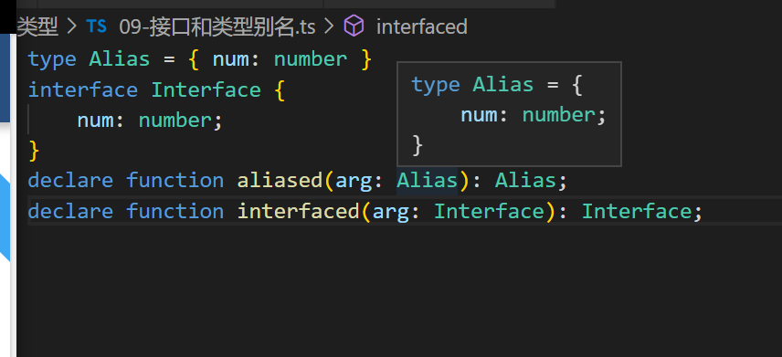
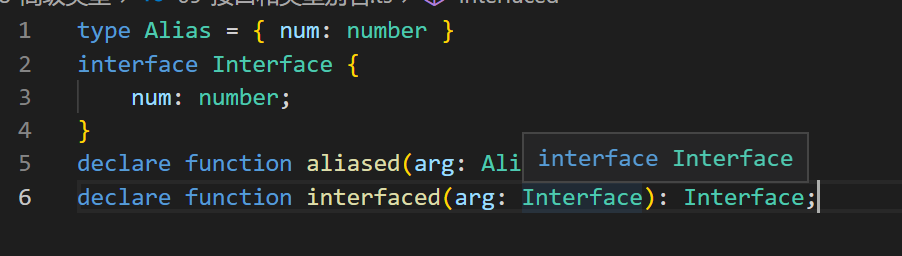
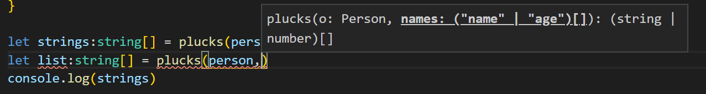

## TS 中的高级类型

### 1.交叉类型

#### 1.概念

交叉类型可以将多个类型混合为一个类型，这有助于我们使用现有的类型创造出一个复合类型。例如， `Person & Serializable & Loggable`同时是 `Person` _和_ `Serializable` _和_ `Loggable`。 就是说这个类型的对象同时拥有了这三种类型的成员。

```typescript
function extend<T, U>(first: T, second: U): T & U {
  let result = <T & U>{};
  for (let id in first) {
    (<any>result)[id] = (<any>first)[id];
  }
  for (let id in second) {
    if (!result.hasOwnProperty(id)) {
      (<any>result)[id] = (<any>second)[id];
    }
  }
  return result;
}

class Person {
  constructor(public name: string) {}
}

interface Loggable {
  log(): void;
}

class ConsoleLogger implements Loggable {
  log() {
    console.log("log");
  }
}

let jim = extend(new Person("Jim"), new ConsoleLogger());

let myName = jim.name;
console.log({ myName });
jim.log();
```

### 2.用`|`连接的联合类型

```typescript
// 此处的padding 参数需要的类型 为 number 或者 string
// 但是却 用any 不严谨
function padLeft(value: string, padding: any) {
  if (typeof padding === "number") {
    return Array(padding + 1).join(" ") + value;
  }
  if (typeof padding === "string") {
    return padding + value;
  }
  throw new Error(`Expected string or number, got '${padding}'.`);
}

padLeft("Hello world", 4); // returns "    Hello world"
// 传入 Boolean 类型 时候 程序会运行出错
padLeft("Hello world", true); // returns "    Hello world"

// 使用联合类型
function padRight(value: string, padding: number | string) {
  if (typeof padding === "number") {
    return Array(padding + 1).join(" ") + value;
  }
  if (typeof padding === "string") {
    return padding + value;
  }
  throw new Error(`Expected string or number, got '${padding}'.`);
}

padRight("Hello world", 4); // returns "    Hello world"
// 传入 Boolean 类型 时候 程序会运行出错
padRight("Hello world", true); // 此时会报错
```

#### 1.ts 只会使用联合类型中 的公共部分

```typescript
interface Bird {
  fly();
  layEggs();
}

interface Fish {
  swim();
  layEggs();
}

function getSmallPet(): Fish | Bird {
  return {
    layEggs: () => {},
    // swim:()=>{}
    fly: () => {},
  };
}

let pet = getSmallPet();
// ts 也是 稳如老狗 只会返回 这个联合属性中都有的属性
pet.layEggs;
pet.fly(); // 不存在公共的 fly 方法 不确定性
```

#### 2.对返回的联合类型 进行类型断言 增强稳定性

```typescript
let pet2 = getSmallPet();
pet2.layEggs;
// 使用断言 来判断到底会返回那种类型的数据结构
if ((<Fish>pet2).swim) {
  (<Fish>pet2).swim();
} else {
  (<Bird>pet2).fly();
}
```

#### 3.对断言进行封装 【用户自定义的类型保护 】

```typescript
function isFish(pet: Fish | Bird): pet is Fish {
  // pet is Fish就是类型谓词。 谓词为 parameterName is Type这种形式，
  // parameterName必须是来自于当前函数签名里的一个参数名。
  return (<Fish>pet).swim !== undefined; // 真正发挥作用的
}
if (isFish(pet2)) {
  pet2.swim();
} else {
  pet2.fly();
}
```

编译后的 js 【笑死】

```typescript
function isFish(pet) {
  // pet is Fish就是类型谓词。 谓词为 parameterName is Type这种形式，
  // parameterName必须是来自于当前函数签名里的一个参数名。
  return pet.swim !== undefined;
}
if (isFish(pet2)) {
  pet2.swim();
} else {
  pet2.fly();
}
```

#### 4.利用 js 中的类型判断方法

##### 1.typeof

```typescript
// 使用 类型断言 抽象
function isNumber(x: any): x is number {
  return typeof x === "number";
}

function isString(x: any): x is string {
  return typeof x === "string";
}

function padLeft(value: string, padding: string | number) {
  if (isNumber(padding)) {
    return Array(padding + 1).join(" ") + value;
  }
  if (isString(padding)) {
    return padding + value;
  }
  throw new Error(`Expected string or number, got '${padding}'.`);
}

// 简易版 直接通过 typeof 判断传入的参数类型
// 【这在JS 中判断类型也是这样做的啊，这里应该属于正常操作】
function padLeft(value: string, padding: string | number) {
  if (typeof padding === "number") {
    return Array(padding + 1).join(" ") + value;
  }
  if (typeof padding === "string") {
    return padding + value;
  }
  throw new Error(`Expected string or number, got '${padding}'.`);
}
```

##### 2.instanceof

```typescript
// instanceof类型保护 构造函数来细化类型的一种方式
interface Padder {
  getPaddingString(): string;
}

class SpaceRepeatingPadder implements Padder {
  constructor(private numSpaces: number) {}
  getPaddingString() {
    return Array(this.numSpaces + 1).join(" ");
  }
  getNum() {
    return this.numSpaces;
  }
}
class StringPadder implements Padder {
  constructor(private value: string) {}
  getPaddingString() {
    return this.value;
  }
  getString() {
    return this.value;
  }
}

function getRandomPadder() {
  return Math.random() < 0.5
    ? new SpaceRepeatingPadder(4)
    : new StringPadder("   ");
}
// 类型为SpaceRepeatingPadder | StringPadder
let padder: Padder = getRandomPadder();

// 通过原型链 继承判断
if (padder instanceof SpaceRepeatingPadder) {
  padder.getNum; // 类型细化为'SpaceRepeatingPadder'
}
if (padder instanceof StringPadder) {
  padder.getString; // 类型细化为'StringPadder'
}
```

### 3.`null`和联合类型

默认情况下，类型检查器认为 `null`与 `undefined`可以赋值给任何类型。 `null`与 `undefined`是所有其它类型的一个有效值。

`--strictNullChecks`标记可以解决此错误：当你声明一个变量时，它不会自动地包含 `null`或 `undefined`。 你可以使用联合类型明确的包含它们：

```typescript
let sss = "foo";
sss = null; // 错误, 'null'不能赋值给'string'
let sn: string | null = "bar";
sn = null; // 可以

sn = undefined; // error, 'undefined'不能赋值给'string | null'
```

注意，按照 JavaScript 的语义，TypeScript 会把 `null`和 `undefined`区别对待。 `string | null`， `string | undefined`和 `string | undefined | null`是不同的类型。

### 4.可选参数和可选属性

使用了 `--strictNullChecks`，可选参数会被自动地加上 `| undefined`:

```typescript
function f(x: number, y?: number) {
  return x + (y || 0);
}
f(1, 2);
f(1);
f(1, undefined);
f(1, null); // error, 'null' is not assignable to 'number | undefined'
```

可选属性：

```typescript
class C {
  a: number;
  b?: number;
}
let c = new C();
c.a = 12;
c.a = undefined; // error, 'undefined' is not assignable to 'number'
c.b = 13;
c.b = undefined; // ok
c.b = null; // error, 'null' is not assignable to 'number | undefined'
```

### 5.去除`null`

联合类型可以增加可以为`null`的类型，当然也可以通过类型保护，类型判断来去除`null`类型

```typescript
function f(sn: string | null): string {
  if (sn == null) {
    return "default";
  } else {
    return sn;
  }
}
```

**使用短路运算符**

```typescript
function f(sn: string | null): string {
  return sn || "default";
}
```

**使用`!`**

如果编译器不能够去除 `null`或 `undefined`，你可以使用类型断言手动去除。 语法是添加 `!`后缀： `identifier!`从 `identifier`的类型里去除了 `null`和 `undefined`：

```typescript
function broken(name: string | null): string {
  function postfix(epithet: string) {
    return name.charAt(0) + ".  the " + epithet; // error, 'name' is possibly null
  }
  name = name || "Bob";
  return postfix("great");
}

function fixed(name: string | null): string {
  function postfix(epithet: string) {
    return name!.charAt(0) + ".  the " + epithet; // ok
  }
  name = name || "Bob";
  return postfix("great");
}
```

### 6.类型别名`type`

**概念**

自定义你自己的类型以及类型的名字

起别名不会新建一个类型 - 它创建了一个新 **名字**来引用那个类型。 给原始类型起别名通常没什么用，尽管可以做为文档的一种形式使用。

```typescript
type Name = string; // string 类型 变为 Name
type NameResolver = () => string; // 返回字符串的函数变为 NameResolver
type NameOrNameResolver = Name | NameResolver;

function getName(n: NameOrNameResolver): Name {
  if (typeof n === "string") {
    return n; // 类型为 string
  } else {
    return n(); // 类型为 NameResolver
  }
}
// 类型 别名为 泛型
type Container<T> = { value: T };

// 类型 别用的 递归使用
type Tree<T> = {
  value: T;
  left: Tree<T>;
  right: Tree<T>;
};
// 类型别名的交叉使用
type LinkedList<T> = T & { next: LinkedList<T> };

interface Person {
  name: string;
}

var people: LinkedList<Person>;
var ssss = people.name;
var ssss = people.next.name;
var ssss = people.next.next.name;
var ssss = people.next.next.next.name;
```

### 7.接口和类型别名的异同

类型别名和接口一样虽然也自定义了类型，但是接口创建了一个新的名字，可以在其他地方使用，直接在错误信息中展示出接口名字，而错误信息不会展示 类型别名。

```typescript
type Alias = { num: number };
interface Interface {
  num: number;
}
declare function aliased(arg: Alias): Alias;
declare function interfaced(arg: Interface): Interface;
```





1. 接口创建了新的名字，鼠标悬停的时候会显示新创建的名字，而类型别名是把类型直接展示出来【对象字面量类型】
2. 类型别名 不能被 `extends`和`implements`【继承和实现】，类型别名也不能自己去继承和实现其他类型
3. 如果你无法通过接口来描述一个类型并且需要使用联合类型或元组类型，这时通常会使用类型别名。

### 8.类型别名和字符串字面量的应用

字符串字面量类型允许你指定字符串必须的固定值。 在实际应用中，字符串字面量类型可以与联合类型，类型保护和类型别名很好的配合。 通过结合使用这些特性，你可以实现类似`枚举类型`的字符串。

```typescript
type Easing = "a" | "b" | "c";
class UIEle {
  animate(stringType: Easing) {
    if (stringType === "a") {
    } else if (stringType === "b") {
    } else if (stringType === "c") {
    } else {
      return "aa";
    }
  }
}

let AUI = new UIEle();
AUI.animate("a");
AUI.animate("b");
AUI.animate("c");
AUI.animate("d"); // 报错 不存在

// 函数重载
// function createElement(tagName: "img"): HTMLImageElement;
// function createElement(tagName: "input"): HTMLInputElement;
// // ... more overloads ...
// function createElement(tagName: string) {
//     // ... code goes here ...
// }
```

### 9.可辨识联合【可以通过那个特征类型来分辨】

```typescript
interface Square {
  kind: "square";
  size: number;
}
interface Rectangle {
  kind: "rectangle";
  width: number;
  height: number;
}
interface Circle {
  kind: "circle";
  radius: number;
}
// 3个接口中 都有共有的键 kind 但是 该键的值 都不一样
// 可以用这个字段类分辨是那个接口类型
type Shape = Square | Rectangle | Circle;

function area(s: Shape) {
  switch (s.kind) {
    case "square":
      return s.size * s.size;
    case "rectangle":
      return s.height * s.width;
    case "circle":
      return Math.PI * s.radius ** 2;
  }
}
```

声明了将要联合的接口。 每个接口都有 `kind`属性但有不同的字符串字面量类型。 `kind`属性称做 *可辨识的特征*或 _标签_。

#### 完整性检查 【用户遗漏了所有可能的情况】

```typescript
type Shape = Square | Rectangle | Circle;

function area(s: Shape) {
  switch (s.kind) {
    case "square":
      return s.size * s.size;
    case "rectangle":
      return s.height * s.width;
  }
}
```

`Shape`可能为 3 中情况，但是在 switch 中却只有两种情况，此时需要编译器提醒我们报错

有两种方式可以实现。 首先是启用 `--strictNullChecks`并且指定一个返回值类型：

```typescript
function area(s: Shape): number {
  switch (s.kind) {
    case "square":
      return s.size * s.size;
    case "rectangle":
      return s.height * s.width;
  }
}
```

因为 `switch`没有包涵所有情况，所以 TypeScript 认为这个函数有时候会返回 `undefined`。 如果你明确地指定了返回值类型为 `number`，那么你会看到一个错误，因为实际上返回值的类型为 `number | undefined`。 然而，这种方法存在些微妙之处且 `--strictNullChecks`对旧代码支持不好。

第二种方法使用 `never`类型，编译器用它来进行完整性检查：

```typescript
function assertNever(x: never): never {
  throw new Error("Unexpected object: " + x);
}
// 3个接口中 都有共有的键 kind 但是 该键的值 都不一样
// 可以用这个字段类分辨是那个接口类型
type Shape = Square | Rectangle | Circle;

function area(s: Shape): number {
  switch (s.kind) {
    case "square":
      return s.size * s.size;
    case "rectangle":
      return s.height * s.width;
    // case "circle":return s.radius
    default:
      return assertNever(s);
  }
}
```

这里， `assertNever`检查 `s`是否为 `never`类型—即为除去所有可能情况后剩下的类型。 如果你忘记了某个 case，那么 `s`将具有一个真实的类型并且你会得到一个错误。 这种方式需要你定义一个额外的函数，但是在你忘记某个 case 的时候也更加明显。

### 10.`this`类型

类的方法返回 this,代表当前的实例对象，可以使用链式结构

```typescript
class BasicCalcution {
  public constructor(protected value: number = 0) {}
  public currentValue(): number {
    return this.value;
  }
  // 此处返回的是 this 实例
  public add(operand: number): this {
    this.value += operand;
    return this;
  }
  public multiply(operand: number): this {
    this.value *= operand;
    return this;
  }
}
// 方法执行后返回的当前实例 可以链式调用
let v = new BasicCalcution(1).add(2).multiply(3).currentValue();
```

### 11.索引类型

```typescript
// 获取是索引类型的 所有的属性
function pluck(o, names) {
  return names.map((n) => o[n]);
}

// 使用ts 写法
function plucks<T, K extends keyof T>(o: T, names: K[]): T[K][] {
  return names.map((n) => o[n]);
}

interface Person {
  name: string;
  age: number;
}

let person: Person = {
  name: "hhh",
  age: 18,
};

let strings: string[] = plucks(person, ["name"]);
// 此时报错的原因，因为第二个参数不确定，是 name 就是 string [] 是age 就是 number[]
// 所以这个list 有两个返回类型
let list: string[] = plucks(person); // 还有自动补全的校验提示
console.log(strings);
```



#### `keyof`关键字

**索引属性查询操作符**：会返回被查询的类型（比如：T），上已知的`公共属性名的联合类型`

```typescript
let personProps: keyof Person; // 'name' | 'age'
```

#### `T[K]`索引访问操作符 【和对象数组一样的使用方法】

则就相当于是 对象数组的索引访问的语法，只不过是用在类型变量上了。

```typescript
function getProperty<T, K extends keyof T>(o: T, name: K): T[K] {
  return o[name]; // o[name] is of type T[K]
}
```

需要保证类型变量 K 是类型变量 T 的索引属性，即：`K extends keyof T`

#### 索引类型和字符串索引签名

```typescript
interface Maps<T> {
  [key: string]: T;
}

// 键值结构中的 键
let keys: keyof Maps<number>; // string
// 键值结构中的 值
let valus: Maps<number>; // number

interface NewMaps<T, U> {
  [BigKey: U]: T; // 索引签名的参数只能为 string 或者 number [数组的为数字，对象的为字符串或者number]
}

type numberString = number | string | boolean;

interface NumberMaps<U extends numberString> {
  [NumberKey: number]: U;
}

let numberKeys: keyof Maps<string>; // number 属于 string的子集 此处既可以是number 或者 string

let numberValues: NumberMaps<number>;

let numObj: NumberMaps<boolean> = {
  "1": true,
  "2": false,
};
numberValues = numObj["1"];

let stringValues: NumberMaps<string>;
stringValues = numObj["2"];
```

### 12.映射类型 【对已知的类型 进行再修饰操作】

对已知的确定的类型进行再修饰操作，类似于 继承 啊，函数的装饰器啊。

从`旧类型`中创建出一个基于旧类型的`新类型`就叫`映射类型`

`旧类型`:

```typescript
interface PersonPartial {
  name: string;
  age: number;
}
```

已知的类型每个属性都变为可选的：

```typescript
interface Person {
  name?: string;
  age?: number;
}
```

变为只读的：

```typescript
interface PersonReadonly {
  readonly name: string;
  readonly age: number;
}
```

假设现有类型有几十个属性呢？要一个一个的改太麻烦了。使用映射类型来修饰

映射类型的工厂修饰

```typescript
type Readonly<T> = {
  readonly [P in keyof T]: T[P];
};
type Partial<T> = {
  [P in keyof T]?: T[P];
};
```

使用方法：

```typescript
type PersonPartial = Partial<Person>;
type ReadonlyPerson = Readonly<Person>;
```

#### 最简单的映射类型的 DEMO

```typescript
type Keys = "option1" | "option2";
type Flags = { [K in Keys]: boolean };

// 上面的 Flags 等同于
type FlagsEqual = {
  option1: boolean;
  option2: boolean;
};
```

它的语法与索引签名的语法类型，内部使用了 `for .. in`。 具有三个部分：

1. 类型变量 `K`，它会依次绑定到每个属性。
2. 字符串字面量联合的 `Keys`，它包含了要迭代的属性名的集合。
3. 属性的结果类型。

#### 真实场景下：按照一定的方式转换字段

```typescript
type NullablePerson = { [P in keyof Person]: Person[P] | null }; // 可以为 null
type PartialPerson = { [P in keyof Person]?: Person[P] }; // 变为可选字段
```

#### 使用泛型

```typescript
type Nullable<T> = { [P in keyof T]: T[P] | null };
type Partial<T> = { [P in keyof T]?: T[P] };
```

#### 【重点】

映射只作用于 `T`的属性而没有其它的。 编译器知道在`添加任何新属性之前可以拷贝所有存在的属性修饰符`。 例如，假设 `Person.name`是只读的，那么 `Partial<Person>.name`也将是只读的且为可选的。

#### 再来一个 DEMO

```typescript
// 基础类型
type Proxy<T> = {
  get(): T;
  set(value: T): void;
};
// 进行修饰
type Proxify<T> = {
  [P in keyof T]: Proxy<T[P]>;
};
function proxify<T>(o: T): Proxify<T> {
  // ... wrap proxies ...
  return;
}
let proxyProps = proxify({ aaa: "bbb" });
```

#### 由映射类型进行推断

```typescript
function unproxify<T>(t: Proxify<T>): T {
  let result = {} as T;
  for (const k in t) {
    result[k] = t[k].get();
  }
  return result;
}

let originalProps = unproxify(proxyProps);
```

注意这个拆包推断只适用于同态的映射类型。 如果映射类型不是同态的，那么需要给拆包函数一个明确的类型参数。

### 13.预定义的有条件类型

ts2.8 版本

- `Exclude<T, U>` -- 从`T`中剔除可以赋值给`U`的类型。
- `Extract<T, U>` -- 提取`T`中可以赋值给`U`的类型。
- `NonNullable<T>` -- 从`T`中剔除`null`和`undefined`。
- `ReturnType<T>` -- 获取函数返回值类型。
- `InstanceType<T>` -- 获取构造函数类型的实例类型

```typescript
type T00 = Exclude<"a" | "b" | "c" | "d", "a" | "c" | "f">; // "b" | "d"
type T01 = Extract<"a" | "b" | "c" | "d", "a" | "c" | "f">; // "a" | "c"

type T02 = Exclude<string | number | (() => void), Function>; // string | number
type T03 = Extract<string | number | (() => void), Function>; // () => void

type T04 = NonNullable<string | number | undefined>; // string | number
type T05 = NonNullable<(() => string) | string[] | null | undefined>; // (() => string) | string[]

function f1(s: string) {
  return { a: 1, b: s };
}

class C {
  x = 0;
  y = 0;
}

type T10 = ReturnType<() => string>; // string
type T11 = ReturnType<(s: string) => void>; // void
type T12 = ReturnType<<T>() => T>; // {}
type T13 = ReturnType<<T extends U, U extends number[]>() => T>; // number[]
type T14 = ReturnType<typeof f1>; // { a: number, b: string }
type T15 = ReturnType<any>; // any
type T16 = ReturnType<never>; // any
type T17 = ReturnType<string>; // Error
type T18 = ReturnType<Function>; // Error

type T20 = InstanceType<typeof C>; // C
type T21 = InstanceType<any>; // any
type T22 = InstanceType<never>; // any
type T23 = InstanceType<string>; // Error
type T24 = InstanceType<Function>; // Error
```
