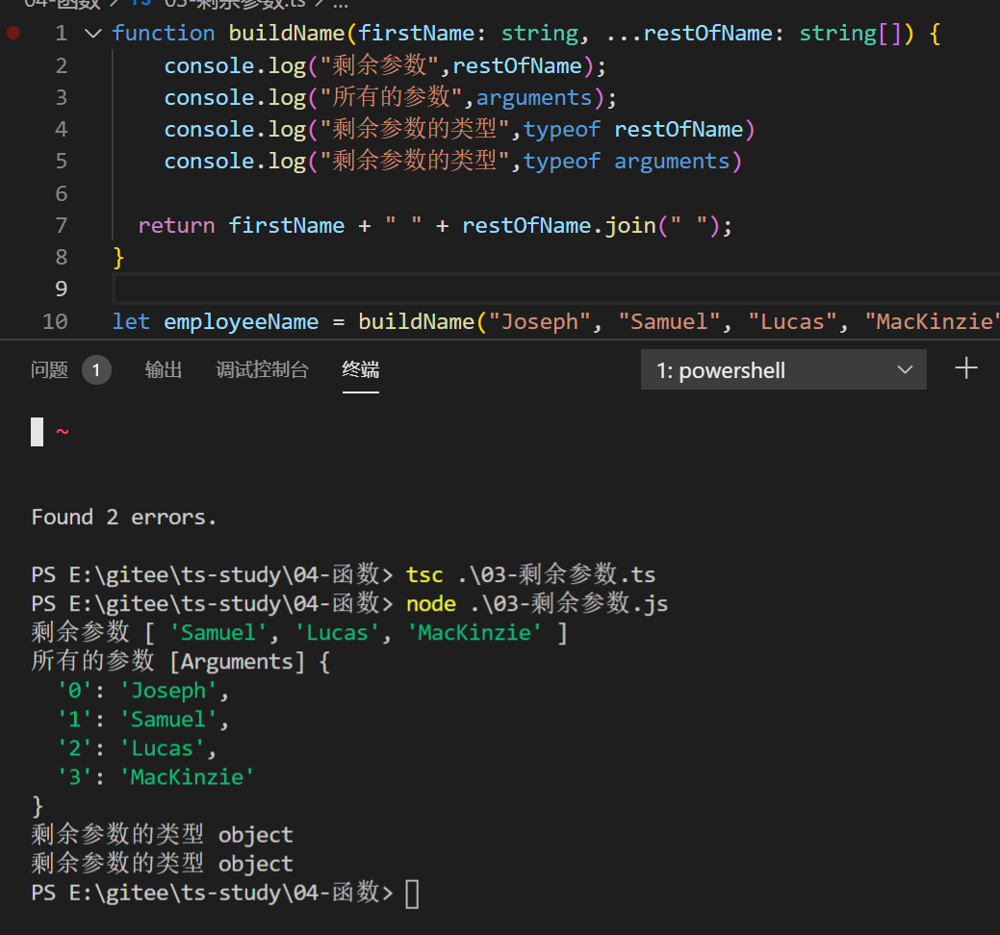
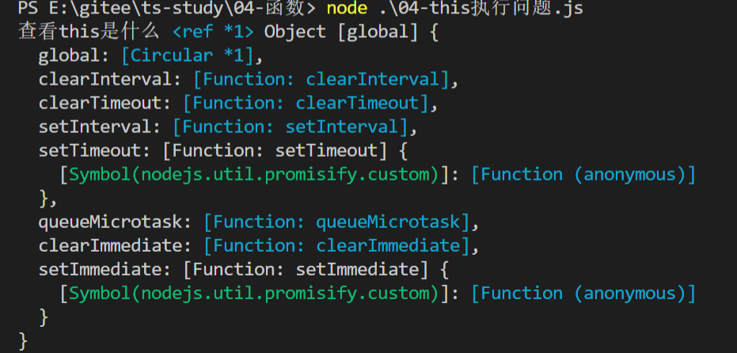
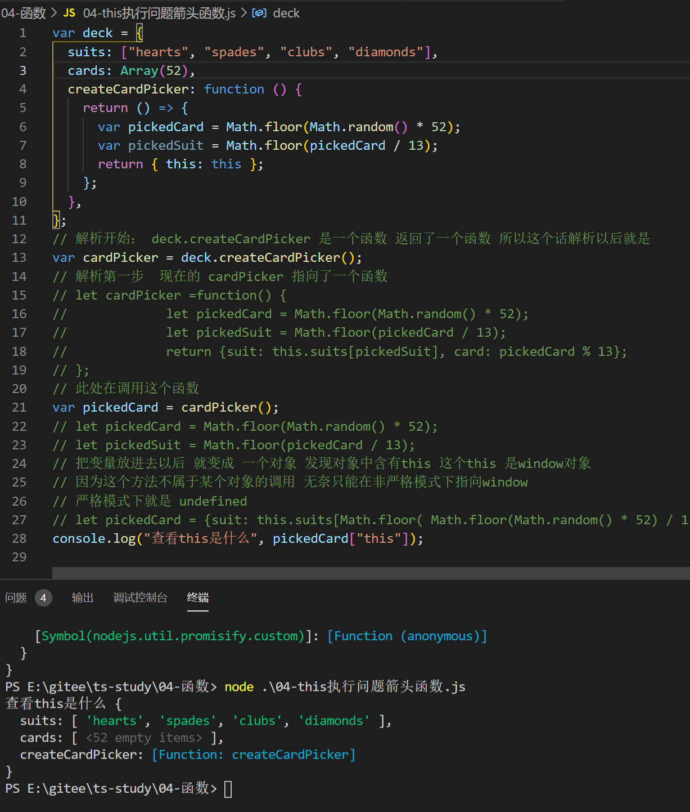

# 一等公民——函数

**一等公民：**函数和其他类型一样，处于平等地位，`可以赋值给其他变量，也可以作为参数，传入另外一个函数，或者作为其他函数的返回值`

## 1.TS 中的函数

也是可以创建`具名函数`和`匿名函数`两部分的。

```typescript
// 有名字的函数
function namedFunc(x: string, y: string) {
  return x + y;
}

// 匿名函数 赋值给其他变量
const noNameFunc = function (x: string, y: string): string {
  return x + y;
};
// 箭头函数的
const arrowFunc = (x: string, y: number) => y + x;
```

## 2.函数类型

### 函数的类型推断

当传入的函数参数每个都具有类型的时候，某些时候可以不指定返回值类型，因为 ts 会根据语句自动推断出返回值的类型。

```typescript
const arrowFunc = (x: string, y: number) => y + x;
```

### 完整函数类型

写全参数类型和返回值类型

```typescript
//完整函数的两部分： 参数类型 和返回值类型
const fullFunc: (x: number, y: number) => number = (x, y) => x + y;

// 参数类型的 名字只是为了增加可读性
// 只要参数类型是匹配的，那么就认为它是有效的函数类型，而不在乎参数名是否正确。
const easyReadFunc: (baseValue: number, increment: number) => number =
  function (x, y): number {
    return x + y;
  };
```

## 3，可选参数和默认参数

### 函数传参的规则

ts 中的每个函数都是必须的，不能传递`null`和`undefined`作为参数，编译器会检查每个参数是否都传入了值，还会假设只有这些参数被传递进函数，总的来说，传递给一个函数的参数个数必须和函数期望参数的个数一致【`多了吃不下，少了不够吃`】

```typescript
function buildName(firstName: string, lastName: string) {
  return firstName + " " + lastName;
}

let result1 = buildName("Bob"); // error, too few parameters
let result2 = buildName("Bob", "Adams", "Sr."); // error, too many parameters
let result3 = buildName("Bob", "Adams"); // ah, just right
```

### 可选参数 `?`

和之前文章的规则一样，增加`?`代表该参数不是必传的。`lastName`变为可选的

```typescript
function buildName(firstName: string, lastName?: string) {
  if (lastName) return firstName + " " + lastName;
  else return firstName;
}

let result1 = buildName("Bob"); // works correctly now
let result2 = buildName("Bob", "Adams", "Sr."); // error, too many parameters
let result3 = buildName("Bob", "Adams"); // ah, just right
```

### 默认值

当用户没有传递这个参数或者这个参数的值是 undefined 的时候，函数会使用该默认值。

```typescript
function buildName(firstName: string, lastName = "Smith") {
  return firstName + " " + lastName;
}

let result1 = buildName("Bob"); // works correctly now, returns "Bob Smith"
let result2 = buildName("Bob", undefined); // still works, also returns "Bob Smith"
let result3 = buildName("Bob", "Adams", "Sr."); // error, too many parameters
let result4 = buildName("Bob", "Adams"); // ah, just right
```

### 默认值的参数的位置

带默认值的参数不需要放在必须参数的后面。 如果带默认值的参数出现在必须参数前面，用户必须明确的传入 `undefined`值来获得默认值

```typescript
function buildName(firstName = "Will", lastName: string) {
  return firstName + " " + lastName;
}

let result4 = buildName(undefined, "Adams"); // okay and returns "Will Adams"
```

## 4.剩余参数 `...`

在 JS 中可以使用关键字`arguments`来访问所有传入的参数，也可以使用剩余参数符，来接受多个参数。

```typescript
function buildName(firstName: string, ...restOfName: string[]) {
  console.log("剩余参数", restOfName);
  console.log("所有的参数", arguments);
  console.log("剩余参数的类型", typeof restOfName);
  console.log("剩余参数的类型", typeof arguments);

  return firstName + " " + restOfName.join(" ");
}

let employeeName = buildName("Joseph", "Samuel", "Lucas", "MacKinzie");
```



## 5.`this`JS 中的成年礼

JS 中`this`只有在函数被调用的时候才会指定。

```js
var deck = {
  suits: ["hearts", "spades", "clubs", "diamonds"],
  cards: Array(52),
  createCardPicker: function () {
    return function () {
      var pickedCard = Math.floor(Math.random() * 52);
      var pickedSuit = Math.floor(pickedCard / 13);
      return { this: this };
    };
  },
};
// 解析开始： deck.createCardPicker 是一个函数 返回了一个函数 所以这个话解析以后就是
var cardPicker = deck.createCardPicker();
// 解析第一步  现在的 cardPicker 指向了一个函数
// let cardPicker =function() {
//             let pickedCard = Math.floor(Math.random() * 52);
//             let pickedSuit = Math.floor(pickedCard / 13);
//             return {suit: this.suits[pickedSuit], card: pickedCard % 13};
// };
// 此处在调用这个函数
var pickedCard = cardPicker();
// let pickedCard = Math.floor(Math.random() * 52);
// let pickedSuit = Math.floor(pickedCard / 13);
// 把变量放进去以后 就变成 一个对象 发现对象中含有this 这个this 是window对象
// 因为这个方法不属于某个对象的调用 无奈只能在非严格模式下指向window
// 严格模式下就是 undefined
// let pickedCard = {suit: this.suits[Math.floor( Math.floor(Math.random() * 52) / 13)], card:  Math.floor(Math.random() * 52) % 13};
console.log("查看this是什么", pickedCard["this"]);
```



查找 this 的调用者 需要一层一层的拨开迷雾，才能找到真正的调用者。

**注意**：在严格模式下， `this`为`undefined`而不是`window`）。

为了解决这个问题，我们可以在函数被返回时就绑好正确的`this`。 这样的话，无论之后怎么使用它，都会引用绑定的‘deck’对象。 我们需要改变函数表达式来使用 ECMAScript 6 箭头语法。` 箭头函数能保存函数创建时的 this值，而不是调用时的值`：

```js
let deck = {
  suits: ["hearts", "spades", "clubs", "diamonds"],
  cards: Array(52),
  createCardPicker: function () {
    // NOTE: the line below is now an arrow function, allowing us to capture 'this' right here
    return () => {
      let pickedCard = Math.floor(Math.random() * 52);
      let pickedSuit = Math.floor(pickedCard / 13);

      return { suit: this.suits[pickedSuit], card: pickedCard % 13 };
    };
  },
};

let cardPicker = deck.createCardPicker();
let pickedCard = cardPicker();

alert("card: " + pickedCard.card + " of " + pickedCard.suit);
```



此时的`this`虽然指向了 deck，但是此时的 this 没有任何的类型校验，脱离了 ts 的类型掌控。所以你需要手动的对`this`变成一个参数传入函数，因此就可以获取到类型校验。鸡贼 ts，管的真宽哦。

### this 参数

```typescript
interface Card {
  suit: string;
  card: number;
}

interface Deck {
  suits: string[];
  cards: Array<number>;
  // 手动传入了this 对象 并且类型为Deck
  createCardPicker(this: Deck): () => Card;
}

let deck: Deck = {
  suits: ["1", "2"],
  cards: Array[52],
  createCardPicker: function (this) {
    return () => {
      let pickedCard = Math.floor(Math.random() * 52);
      let pickedSuit = Math.floor(pickedCard / 13);

      return { suit: this.suits[pickedSuit], card: pickedCard % 13 };
    };
  },
};

let cardPicker = deck.createCardPicker();
let pickedCard = cardPicker();

alert("card: " + pickedCard.card + " of " + pickedCard.suit);
```

### `this`参数在回调函数里 【疑问】

你可以也看到过在回调函数里的`this`报错，当你将一个函数传递到某个库函数里稍后会被调用时。 因为当回调被调用的时候，它们会被当成一个普通函数调用， `this`将为`undefined`。 稍做改动，你就可以通过 `this`参数来避免错误。 首先，库函数的作者要指定 `this`的类型：

```ts
interface UIElement {
  addClickListener(onclick: (this: void, e: Event) => void): void;
}
```

`this: void` means that `addClickListener` expects `onclick` to be a function that does not require a `this` type. Second, annotate your calling code with `this`:

```ts
class Handler {
  info: string;
  onClickBad(this: Handler, e: Event) {
    // oops, used this here. using this callback would crash at runtime
    this.info = e.message;
  }
}
let h = new Handler();
uiElement.addClickListener(h.onClickBad); // error!
```

指定了`this`类型后，你显式声明`onClickBad`必须在`Handler`的实例上调用。 然后 TypeScript 会检测到 `addClickListener`要求函数带有`this: void`。 改变 `this`类型来修复这个错误：

```ts
class Handler {
  info: string;
  onClickGood(this: void, e: Event) {
    // can't use this here because it's of type void!
    console.log("clicked!");
  }
}
let h = new Handler();
uiElement.addClickListener(h.onClickGood);
```

因为`onClickGood`指定了`this`类型为`void`，因此传递`addClickListener`是合法的。 当然了，这也意味着不能使用 `this.info`. 如果你两者都想要，你不得不使用箭头函数了：

```ts
class Handler {
  info: string;
  onClickGood = (e: Event) => {
    this.info = e.message;
  };
}
```

这是可行的因为箭头函数不会捕获`this`，所以你总是可以把它们传给期望`this: void`的函数。 缺点是每个 `Handler`对象都会创建一个箭头函数。 另一方面，方法只会被创建一次，添加到 `Handler`的原型链上。 它们在不同 `Handler`对象间是共享的。

## 6.函数的重载【Java 中也有重载】

重载：学过 Java 的都知道，在 Java 中虽然是统一函数名称，但是会根据传入参数的类型的不同，需要调用不同的业务逻辑。

看看 js 中的重载：【和 Java 有好大的差别呢】

起因：JavaScript 本身是个动态语言。 JavaScript 里函数根据传入不同的参数而返回不同类型的数据是很常见的。

```typescript
let suitsDemo = ["header", "spades"];

function pickCard(x): any {
  if (typeof x == "object") {
    let pickedCard = Math.floor(Math.random() * x.length);
    return pickedCard;
  } else if (typeof x == "number") {
    let pickedSuit = Math.floor(x / 13);
    return { suit: suitsDemo[pickedSuit], card: x % 13 };
  }
}
```

此时还没有重载发生，这个`pickCard`函数会根据参数的类型的不同，来返回不同类型的值。

使用 ts 中的重载

```typescript
let suits = ["hearts", "spades", "clubs", "diamonds"];
// 重载检查1
function pickCard(x: { suit: string; card: number }[]): number;
// 重载检查2
function pickCard(x: number): { suit: string; card: number };
// 实际的方法：被检查的方法
function pickCard(x): any {
  if (typeof x == "object") {
    let pickedCard = Math.floor(Math.random() * x.length);
    return pickedCard;
  } else if (typeof x == "number") {
    let pickedSuit = Math.floor(x / 13);
    return { suit: suits[pickedSuit], card: x % 13 };
  }
}

let myDeck = [
  { suit: "diamonds", card: 2 },
  { suit: "spades", card: 10 },
  { suit: "hearts", card: 4 },
];
let pickedCard1 = myDeck[pickCard(myDeck)];
alert("card: " + pickedCard1.card + " of " + pickedCard1.suit);

let pickedCard2 = pickCard(15);
alert("card: " + pickedCard2.card + " of " + pickedCard2.suit);
```

这样改变后，重载的`pickCard`函数在调用的时候会进行正确的类型检查。

`为了让编译器能够选择正确的检查类型，它与JavaScript里的处理流程相似。 它查找重载列表，尝试使用第一个重载定义。 如果匹配的话就使用这个。 因此，在定义重载的时候，一定要把最精确的定义放在最前面。`

注意，`function pickCard(x): any`并不是重载列表的一部分，因此这里只有两个重载：一个是接收对象另一个接收数字。 以其它参数调用 `pickCard`会产生错误。
