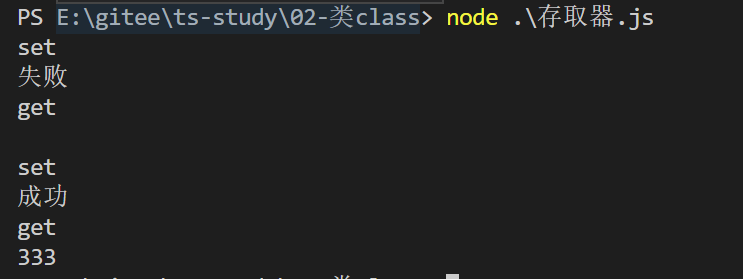

# TS 中的类

## 类的特性

- 封装性
- 继承性
- 多态性

## 1.基础类

```typescript
class Greeter {
  // 类属性
  greeting: string;
  // 构造方法
  constructor(message: string) {
    this.greeting = message;
  }
  // 类方法
  greet() {
    return "Hello " + this.greeting;
  }
  getThis() {
    return this;
  }
}

let greeter = new Greeter("世界");
console.log(greeter.greet());
```

## 2.类的继承

创建一个动物的基类，狗狗属于动物，可以由动物类派生出来。并且会继承动物的已有的方法和属性，而且狗狗还会有自己的专属技能。

```typescript
class Animal {
  move(distanceInMeters: number = 0) {
    console.log(`移动了${distanceInMeters}`);
  }
}

class Dog extends Animal {
  bark() {
    console.log("wang wang");
  }
}

const dog = new Dog();
dog.bark();
dog.move(100);
dog.bark();
```

## 3.父类方法的复写

不同动物的移动方式不同,马是奔跑，🐍 是爬行

```typescript
class Animal {
  name: string;
  constructor(theName: string) {
    this.name = theName;
  }
  move(distanceInMeters: number = 0) {
    console.log(`${this.name} moved ${distanceInMeters}m.`);
  }
}

class Snake extends Animal {
  constructor(name: string) {
    super(name);
  }
  move(distanceInMeters = 5) {
    console.log("Slithering...");
    super.move(distanceInMeters);
  }
}

class Horse extends Animal {
  constructor(name: string) {
    super(name);
  }
  move(distanceInMeters = 45) {
    console.log("Galloping...");
    super.move(distanceInMeters);
  }
}

let sam = new Snake("Sammy the Python");
let tom: Animal = new Horse("Tommy the Palomino");

sam.move();
tom.move(34);
```

子类也包含了一个构造函数，必须调用`super()`,这个 super()会将父类的方法和属性传递给子类。在子类构造函数里访问 `this`的属性之前，我们 *一定*要调用 `super()`。 这个是 TypeScript 强制执行的一条重要规则。

## 4.类的公共私有和受保护的修饰符

### 默认为`public`

**public**只有的访问程序里定义的成员

```typescript
class Animal {
  public name: string;
  public constructor(theName: string) {
    this.name = theName;
  }
  public move(distanceInMeters: number) {
    console.log(`${this.name} moved ${distanceInMeters}m.`);
  }
}
```

### `private`父类的私有化变量

只能在当前类中使用，不能外部访问，子类也不可访问

```typescript
class Animal {
  private name: string;
  constructor(theName: string) {
    this.name = theName;
  }
}

new Animal("Cat").name; // 错误: 'name' 是私有的.
```

### `protected`可以让子类使用的修饰符

使用 protected 修饰的变量，虽然不能在外部直接访问，但是可以在子类中创建方法 返回 其值

```typescript
class Animal2 {
  private name: string; // 私有属性 只能自己用
  protected gender: string = "boy"; // 比private 宽松一点 可以让子类用
  public hh: string; // 谁都可以用
  constructor(theName: string) {
    this.name = theName;
  }
}

// new Animal2("Cat").name // 报错
// new Animal2("Cat").gender // 报错
new Animal2("Cat").hh; //
class Dog2 extends Animal2 {
  constructor(childrenName: string) {
    super(childrenName);
    // this.name // 报错
    this.gender = "girl"; // 可以访问 修改 父级 protected修饰的变量
    this.hh;
  }
  brak() {
    console.log("www");
  }
  // 可以增加方法暴露 父级的 protected 的变量
  getGender() {
    return this.gender;
  }
}
console.log(new Dog2("hsq").getGender());
```

### 构造函数被`protected`修饰

构造函数也可以被标记成 `protected`。 这意味着这个类不能被`实例化`，但是能被继承。

```typescript
class Person {
  protected name: string;
  protected constructor(theName: string) {
    this.name = theName;
  }
}

// Employee 能够继承 Person
class Employee extends Person {
  private department: string;

  constructor(name: string, department: string) {
    super(name);
    this.department = department;
  }

  public getElevatorPitch() {
    return `Hello, my name is ${this.name} and I work in ${this.department}.`;
  }
}

let howard = new Employee("Howard", "Sales");
let john = new Person("John"); // 错误: 'Person' 的构造函数是被保护的.
```

## 5.类型兼容 【神奇的思维】

TypeScript 使用的是结构性类型系统。 当我们比较两种不同的类型时，并不在乎它们从何处而来，如果所有成员的类型都是兼容的，我们就认为它们的类型是兼容的。

然而，当我们比较带有 `private`或 `protected`成员的类型的时候，情况就不同了。 如果其中一个类型里包含一个 `private`成员，那么只有当另外一个类型中也存在这样一个 `private`成员， 并且它们都是来自同一处声明时，我们才认为这两个类型是兼容的。 对于 `protected`成员也使用这个规则。

```typescript
class AnimalTest {
  private name: string;
  constructor(theName: string) {
    this.name = theName;
  }
}

class Rhino extends AnimalTest {
  constructor() {
    super("Rhino");
  }
}

class EmployeeTest {
  private name: string;
  constructor(theName: string) {
    this.name = theName;
  }
}

let animal = new AnimalTest("Goat");
let rhino = new Rhino();
let employee = new EmployeeTest("Bob");

animal = rhino;
animal = employee; // 错误: Animal 与 Employee 不兼容.
```

这个例子中有 `Animal`和 `Rhino`两个类， `Rhino`是 `Animal`类的子类。 还有一个 `Employee`类，其类型看上去与 `Animal`是相同的。 我们创建了几个这些类的实例，并相互赋值来看看会发生什么。 因为 `Animal`和 `Rhino`共享了来自 `Animal`里的私有成员定义 `private name: string`，因此它们是兼容的。 然而 `Employee`却不是这样。当把 `Employee`赋值给 `Animal`的时候，得到一个错误，说它们的类型不兼容。 尽管 `Employee`里也有一个私有成员 `name`，但它明显不是 `Animal`里面定义的那个。

## 6.readonly 修饰符

只读属性的初始化值 只能在声明时候或者构造函数时候进行赋值

```typescript
class Octopus {
  readonly name: string;
  readonly numberOfLegs: number = 8;
  constructor(theName: string) {
    this.name = theName;
  }
}
let dad = new Octopus("Man with the 8 strong legs");
dad.name = "Man with the 3-piece suit"; // 错误! name 是只读的.
```

### 参数属性

上面情况的简易版写法。直接在构造函数里面，把类属性 name 变为只读属性

```typescript
class Octopus {
    readonly num:number = 9;
    constructor(readonly name:string){}
}

const a = new Octopus('hh')
a.name = "123" // 只读属性报错
a.num = // 使用等号的时候已经报错
```

## 7.存取器 getter 和 setter

不适用存取器版本，随意读取和更改值

```typescript
class Employee {
  fullName: string;
}

let employee = new Employee();
employee.fullName = "Bob Smith";
if (employee.fullName) {
  console.log(employee.fullName);
}
```

使用存取器，在用户存取以前进行校验检查是否可以更改

```typescript
// 此代码 需要指定编译到版本ES5或以上
// 运行   tsc  xxx.ts  -t  es5
class BookManager {
  password: string;
  private _fullName: string = "";
  get fullName(): string {
    console.log("get");

    return this._fullName;
  }
  set fullName(name: string) {
    console.log("set");

    if (this.password === "123") {
      this._fullName = name;
      console.log("成功");
    } else {
      console.log("失败");
    }
  }
}

const mn = new BookManager();
// 没有设置密码
mn.fullName = "333";
console.log(mn.fullName);

// 设置密码
mn.password = "123";
mn.fullName = "333";
console.log(mn.fullName);
```

编译运行结果如下：



## 8.静态方法和静态属性

使用 static 关键字声明的变量和方法叫做静态方法，不需要创建实例就可以访问。

```typescript
class Grid {
  static origin = { x: 0, y: 0 };
  calculateDistanceFromOrigin(point: { x: number; y: number }) {
    let xDist = point.x - Grid.origin.x;
    let yDist = point.y - Grid.origin.y;
    return Math.sqrt(xDist * xDist + yDist * yDist) / this.scale;
  }
  constructor(public scale: number) {}
}

let grid1 = new Grid(1.0); // 1x scale
let grid2 = new Grid(5.0); // 5x scale

console.log(grid1.calculateDistanceFromOrigin({ x: 10, y: 10 }));
console.log(grid2.calculateDistanceFromOrigin({ x: 10, y: 10 }));
```

[详情见此文章的第八节](https://lhwz666.gitee.io/2020/12/29/ts/ts%E4%B8%AD%E7%9A%84%E6%8E%A5%E5%8F%A3/)

## 9.抽象类 `abstract` 【class 的抽象形态】

本来类就是一个创造实例的模板，这个抽象类规定了这个 模板的样子，有哪些接口，方法，属性等。

抽象类做为其它派生类的基类使用。 它们一般不会直接被实例化。 不同于接口，抽象类可以包含成员的实现细节。 `abstract`关键字是用于定义抽象类和在抽象类内部定义抽象方法。

抽象类中的抽象方法必须在派生类中进行实现。

```typescript
abstract class Animal {
  abstract eat(): void; // 必须在 class中实现
  move(): void {
    console.log("roaming the earch...");
  }
}
```

```typescript
abstract class Computer {
  constructor(readonly name: string) {}
  abstract playMusic(): void;
  abstract hasUSBNumber(num: number): boolean;
}

class Lenovo extends Computer {
  constructor(name: string) {
    super(name);
  }
  playMusic() {
    console.log("大音响");
  }
  hasUSBNumber(num = 4) {
    console.log(`俺有${num}个插口`);

    return num > 0;
  }
}

const xin = new Lenovo("联想小新pro13");
xin.hasUSBNumber(5); // 俺有5个插口
xin.playMusic(); // 大音响

// 创建抽象类的实例
// const abs = new Computer("hh") // 报错
```

## 10.高级技巧

### 构造函数

ts 的写法

```typescript
class Greeter {
  greeting: string;
  constructor(message: string) {
    this.greeting = message;
  }
  greet() {
    return "Hello, " + this.greeting;
  }
}
// 声明了类的实例类型
let greeter: Greeter;
greeter = new Greeter("world");
console.log(greeter.greet());
```

编译为 js 以后，创造了一个`构造函数`并且在此构造函数的原型链上实现类的一些方法

```javascript
// 包含了一个立即执行函数 返回了一个 Greeter 的构造函数
var Greeter = /** @class */ (function () {
  function Greeter(message) {
    this.greeting = message;
  }
  // 构造函数的 原型链 https://blog.csdn.net/boonyaxnn/article/details/89339796
  Greeter.prototype.greet = function () {
    return "Hello, " + this.greeting;
  };
  return Greeter;
})();
var greeter;
greeter = new Greeter("world");
console.log(greeter.greet());
```

[原型链 prototype 的介绍](https://blog.csdn.net/boonyaxnn/article/details/89339796)

增加静态属性

```typescript
class Greeter {
  static standardGreeting = "Hello, there";
  greeting: string;
  greet() {
    if (this.greeting) {
      return "Hello, " + this.greeting;
    } else {
      return Greeter.standardGreeting;
    }
  }
}

let greeter1: Greeter;
greeter1 = new Greeter();
console.log(greeter1.greet());

// typeof Greeter，意思是取Greeter类的类型，而不是实例的类型。
// 或者更确切的说，"告诉我 Greeter标识符的类型"，也就是构造函数的类型。
// 这个类型包含了类的所有静态成员和构造函数。
// 之后，就和前面一样，我们在 greeterMaker上使用 new，创建 Greeter的实例。
let greeterMaker: typeof Greeter = Greeter;
greeterMaker.standardGreeting = "Hey there!";

let greeter2: Greeter = new greeterMaker();
console.log(greeter2.greet());
```

编译后的 js

```JavaScript
var Greeter = /** @class */ (function () {
  function Greeter() {}
  Greeter.prototype.greet = function () {
    if (this.greeting) {
      return "Hello, " + this.greeting;
    } else {
      return Greeter.standardGreeting;
    }
  };
  Greeter.standardGreeting = "Hello, there";
  return Greeter;
})();
var greeter1;
greeter1 = new Greeter();
console.log(greeter1.greet()); // Hello, there
console.log(typeof greeter1); // object

var greeterMaker = Greeter;
console.log(typeof Greeter); // function
console.log(typeof greeterMaker); // function

greeterMaker.standardGreeting = "Hey there!";
var greeter2 = new greeterMaker();
console.log(greeter2.greet()); // Hey there!

console.log(typeof greeter2); //object

```

### 类当作接口使用

```typescript
class Point {
  x: number;
  y: number;
}
// 接口继承类
interface Point3d extends Point {
  z: number;
}

let point3d: Point3d = { x: 1, y: 2, z: 3 };
```
