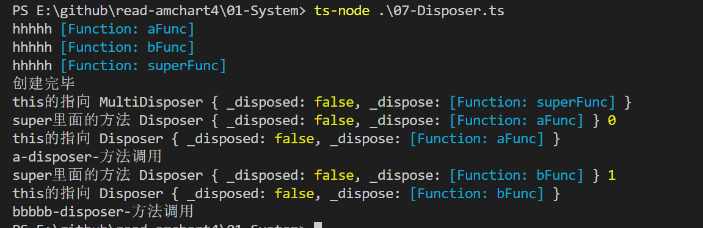
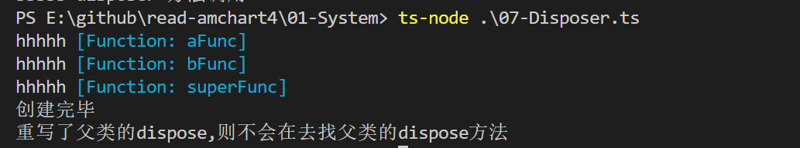

## 小 demo

### 1.子类中没有复写父类的方法

```tsx
export interface IDisposer {
  isDisposed(): boolean;
  dispose(): void;
}

export class Disposer implements IDisposer {
  private _disposed: boolean;

  private _dispose: () => void;

  constructor(dispose: () => void) {
    // console.log(dispose());
    console.log("hhhhh", dispose);
    this._disposed = false;
    this._dispose = dispose;
  }
  public dispose(): void {
    console.log("this的指向", this);
    if (!this._disposed) {
      this._disposed = true;
      this._dispose();
    }
  }
  public isDisposed(): boolean {
    return this._disposed;
  }
}
// super 是什么 https://www.jianshu.com/p/2a5a7352f4e5
export class MultiDisposer extends Disposer {
  constructor(disposer: Array<IDisposer>) {
    //   super 相当于 父级的构造函数 将父级所拥有的属性和方法 通过该方法继承给子类
    const superFunc = () => {
      disposer.forEach((x, index) => {
        console.log("super里面的方法", x, index);
        x.dispose();
      });
    };
    super(superFunc);
  }
  //   原型链的 寻找规律
  //   dispose() {
  //     console.log("重写了父类的dispose,则不会在去找父类的dispose方法");
  //   }
}

const aFunc = () => console.log("a-disposer-方法调用");
const bFunc = () => console.log("bbbbb-disposer-方法调用");
const aDisposer = new Disposer(aFunc);
// console.log("a", aDisposer.isDisposed());
const bDisposer = new Disposer(bFunc);
// console.log("b", bDisposer.isDisposed());

const bMulList = new MultiDisposer([aDisposer, bDisposer]);
console.log("创建完毕");
// aDisposer.dispose();
bMulList.dispose();
```

**输出：**



### 2.子类中复写了父类的方法

```tsx
// super 是什么 https://www.jianshu.com/p/2a5a7352f4e5
export class MultiDisposer extends Disposer {
  constructor(disposer: Array<IDisposer>) {
    //   super 相当于 父级的构造函数 将父级所拥有的属性和方法 通过该方法继承给子类
    const superFunc = () => {
      disposer.forEach((x, index) => {
        console.log("super里面的方法", x, index);
        x.dispose();
      });
    };
    super(superFunc);
  }
  //   原型链的 寻找规律
  dispose() {
    console.log("重写了父类的dispose,则不会在去找父类的dispose方法");
  }
}
```

**结果：**


