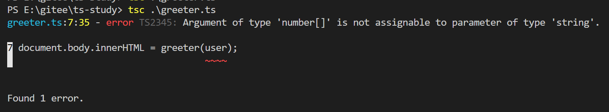

https://www.tslang.cn/docs/handbook/typescript-in-5-minutes.html

## 环境搭建

```bash
npm install -g typescript
```

## 测试环境是否成功

新建 greeter.ts

```typescript
function greeter(person) {
  return "Hello, " + person;
}

let user = "Jane User";

document.body.innerHTML = greeter(user);
```

编译一下 会生成同名的但是结尾是 js 的文件

```bash
tsc greeter.ts
```

## 1.添加类型注解 【和 java 一样】

```typescript
function greeter(person: string) {
  return "Hello, " + person;
}

let user = "Jane User";

document.body.innerHTML = greeter(user);
```

现在把 user 改为数组：

```typescript
let user = [1, 2, 3];
```

再次编译就报错了：



虽然编译报错了，但是 js 文件还是生成了。

`TypeScript提供了静态的代码分析，它可以分析代码结构和提供的类型注解。`

## 2.使用接口

接口描述对象，指明对象里面有哪些键

```typescript
interface Person {
  firstName: string;
  lastName: string;
}

function greeter(person: Person) {
  return "Hello, " + person.firstName + " " + person.lastName;
}

let user = { firstName: "Jane", lastName: "User" };

document.body.innerHTML = greeter(user);
```

## 3.接口描述类

```typescript
class Student {
  fullName: string;
  constructor(public firstName, public middleInitial, public lastName) {
    this.fullName = firstName + " " + middleInitial + " " + lastName;
  }
}

interface Person {
  firstName: string;
  lastName: string;
}

function greeter(person: Person) {
  return "Hello, " + person.firstName + " " + person.lastName;
}

let user = new Student("Jane", "M.", "User");

document.body.innerHTML = greeter(user);
```
