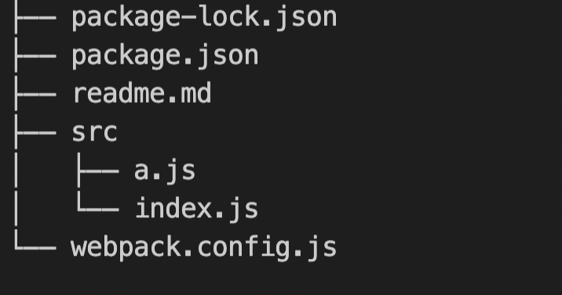
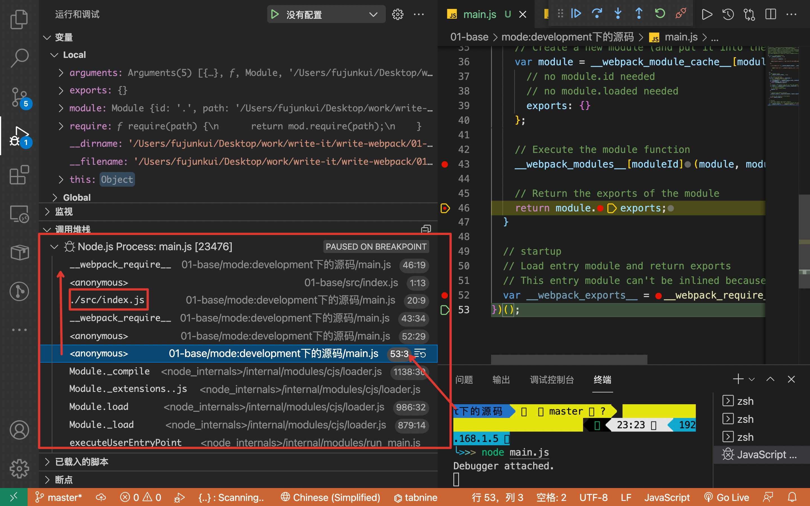

# Webpack 打包原理

本文适合于有一点点的 webpack 的基础，和 js 模块的基础的人群

## 1. 示例代码的项目结构

```bash
// 创建目录 安装依赖
mkdir 01-base
npm init -y
npm i webpack webpack-cli
mkdir src
```

**Src**新建文件结构如下

```js
// src/index.js

const str = require("./a");
console.log("hello" + str);

// src/a.js
module.exports = "aaa";

// webpack.config.js [webpack 默认读取的配置]
module.exports = {
  entry: "./src/index.js",
  mode: "development",
};
```



## 2.打包结果在 dist 目录

main.js 经过删除注释以后的代码如下

```js
/*
 *注意：已经使用了“eval”devtool（默认情况下可能是在“开发”模式下）。
 *此devtool既不用于生产，也不用于可读的输出文件。
 *它使用“eval（）”调用在浏览器devtools中创建单独的源文件。
 *如果试图读取输出文件，请选择其他devtool(https://webpack.js.org/configuration/devtool/)
 *或者使用“devtool:false”禁用默认devtool。
 *如果要查找生产就绪输出文件，请参阅模式：“生产”(https://webpack.js.org/configuration/mode/).
 */
(() => {
  // webpackBootstrap
  var __webpack_modules__ = {
    "./src/a.js": (module) => {
      eval(
        "module.exports = 'aaa'\n\n//# sourceURL=webpack://01-base/./src/a.js?"
      );
    },

    "./src/index.js": (
      __unused_webpack_module,
      __unused_webpack_exports,
      __webpack_require__
    ) => {
      eval(
        "const str = __webpack_require__(/*! ./a */ \"./src/a.js\")\nconsole.log('hello' + str);\n\n//# sourceURL=webpack://01-base/./src/index.js?"
      );
    },
  };
  // The module cache
  var __webpack_module_cache__ = {};

  // The require function
  function __webpack_require__(moduleId) {
    // Check if module is in cache
    var cachedModule = __webpack_module_cache__[moduleId];
    if (cachedModule !== undefined) {
      return cachedModule.exports;
    }
    // Create a new module (and put it into the cache)
    var module = (__webpack_module_cache__[moduleId] = {
      // no module.id needed
      // no module.loaded needed
      exports: {},
    });

    // Execute the module function
    __webpack_modules__[moduleId](module, module.exports, __webpack_require__);

    // Return the exports of the module
    return module.exports;
  }

  // startup
  // Load entry module and return exports
  // This entry module can't be inlined because the eval devtool is used.
  var __webpack_exports__ = __webpack_require__("./src/index.js");
})();
```

### a.整体分析 匿名函数自执行

- 避免了变量的污染详见文章：https://www.cnblogs.com/CurryLi/p/11652540.html

### b.函数代码入口处在最下方

```js
// startup
// Load entry module and return exports
// This entry module can't be inlined because the eval devtool is used.
var __webpack_exports__ = __webpack_require__("./src/index.js");
```

### c.’webpack_require 分析

```js
// The module cache
var __webpack_module_cache__ = {};

// The require function 见名知意 模拟的 require 函数
function __webpack_require__(moduleId) {
  // moduleId 取值为 ./src/index.js
  // Check if module is in cache 理论是 Memoization 空间换时间
  var cachedModule = __webpack_module_cache__[moduleId];
  if (cachedModule !== undefined) {
    // 找到模块的缓存 返回该模块 缓存的 exports 属性
    return cachedModule.exports;
  }
  // 之前没有加载过 该模块
  // Create a new module (and put it into the cache)
  var module = (__webpack_module_cache__[moduleId] = {
    // no module.id needed
    // no module.loaded needed
    exports: {},
  });

  // Execute the module function 读取变量 __webpack_modules__ 里的 ./src/index  【见下一个分析 d 位置 】
  __webpack_modules__[moduleId](module, module.exports, __webpack_require__);
  // 解析__webpack_modules__[moduleId] 的值是一个函数  (module, module.exports, __webpack_require__) 是函数的参数
  // Return the exports of the module
  return module.exports;
}
```

### d.变量 webpack_modules：**存储文件和代码的信息**

将依赖 进行**数据化对象存储** 方便读取 各模块的代码信息

```js
var __webpack_modules__ = {
  "./src/a.js": (module) => {
    eval("module.exports = 'aaa'");
  },

  "./src/index.js": (
    __unused_webpack_module,
    __unused_webpack_exports,
    __webpack_require__
  ) => {
    eval(
      "const str = __webpack_require__(\"./src/a.js\")\nconsole.log('hello' + str);"
    );
  },
};
```

### e:最后可以通过 node js 的调试功能 来断点查看 webpack 的运行原理



## 3.关键词

- webpack
- eval 函数
- 模块和代码的存储关系
- 使用缓存 Memoization
- 递归调用
