## 0. 食用本文的文档说明：

本篇文章 耗时 `7个小时`左右才完工，篇幅涉及到`大量的源码及其分析的过程图解和数据`，阅读前，请保证自己有充分的时间，尽情的去享受`吸收知识进入脑子的过程`。

因为篇幅有限，希望你掌握以下前置知识：

1. 已经学习过 `enhanced-resolve 工作流程和插拔式插件机制`，[点这里复习：webpack 核心库 enhanced-resolve 工作流程和插拔式插件机制](https://juejin.cn/post/7167978104881676319)
2. 了解 `tabaple` 是一个`订阅发布`的设计模式（知道啥是订阅发布即可）
3. 大致了解 node 中的模块查找机制，如：

```
require(‘./xxx.js’);
require('./xxx');
require('xxx');
```

通过本文你将学到如下内容（或者带着如下疑问去学习）：

1. `enhance-resolve`是如何在复杂的插件调用之间传递数据的？
2. `Resolver 和 ResolverFactory`的关系是什么？
3. `Resolver`是如何设计实现的？
4. `软链接和硬链接`是什么？区别在哪里？
5. 如何开发一个`enhance-resolve`的插件应用到 webpack 中？
6. 如何去一步步的 `debug` 一个开源库？

## 1 webpack 和 enhance-resolve 的关系是什么？

webpack 作为一个强大的打包工具，其强大的不仅仅是插件机制，还有其核心包`enhance-resolve`来实现模块的路径查找。功能上来说它可以`增强Webpack的模块解析能力`，使其更容易找到所需的模块，从而提高 Webpack 的`性能和可维护性`。从配置上来说它可以为 Webpack 解析器添加额外的搜索路径以及解析规则，让 Webpack`更好地解释路径和文件`，进而让 webpack 更加专心的做模块打包相关的事情。

了解完背景和需求以后，如果让我们去实现一个 enhance-resolve 呢？

功能点：

1. 首先解析器满足模块查找中的所有的规则 [模块：通用 JS 模块 |节点.js v14.21.3 文档 (nodejs.org)](https://nodejs.org/docs/latest-v14.x/api/modules.html#modules_all_together)
2. 要和 webpack 一样，有强大的`插件加载机制和良好的配置功能`。

自己可以心中默默的想一下如何实现上述功能点呢？

## 2. 接下来就根据上述功能点通过代码去了解一下 `enhance-resolve`

咱们上回[太强了，3000 字图文并茂的解析 webpack 核心库 enhanced-resolve 工作流程和插拔式插件机制，真香 - 掘金 (juejin.cn)](https://juejin.cn/post/7167978104881676319)说到：

1. ResolverFactory.createResolver 根据 `Resolver` 类创建实例： `myResolve` (吃了配置，吐出对象`myResolve`)
2. `myResolve 上 注册并订阅` 大量的 hook （枪支弹药贮备好，一刻激发）
3. 调用 `myResolver.resolve` 方法开始进行 文件解析 的主流程
4. 内部通过 `resolve.doResolve`方法，开始调用第一个 hook: `this.hooks.resolve`
5. 找到之前 订阅 hook 的 plugin：`ParsePlugin`
6. `ParsePlugin` 进行初步解析，然后 通过`doResolve` 执行下一个 hook `parsed-resolve`，前期准备工作结束，链式调用开始，`真正的解析文件的流程`也开始。

从上面的第 2 步开始整起，第 2 步注册了哪些 hook 呢？接下来开始瞅瞅

### 2.1 细细回顾 `myResolve` 上注册的 hooks

代码跳转到 `lib/ResolverFactory.js`的 `295` 行左右，代码如下：

```
//// pipeline ////

resolver.ensureHook("resolve");
resolver.ensureHook("internalResolve");
resolver.ensureHook("newInternalResolve");
resolver.ensureHook("parsedResolve");
resolver.ensureHook("describedResolve");
resolver.ensureHook("rawResolve");
resolver.ensureHook("normalResolve");
resolver.ensureHook("internal");
resolver.ensureHook("rawModule");
resolver.ensureHook("module");
resolver.ensureHook("resolveAsModule");
resolver.ensureHook("undescribedResolveInPackage");
resolver.ensureHook("resolveInPackage");
resolver.ensureHook("resolveInExistingDirectory");
resolver.ensureHook("relative");
resolver.ensureHook("describedRelative");
resolver.ensureHook("directory");
resolver.ensureHook("undescribedExistingDirectory");
resolver.ensureHook("existingDirectory");
resolver.ensureHook("undescribedRawFile");
resolver.ensureHook("rawFile");
resolver.ensureHook("file");
resolver.ensureHook("finalFile");
resolver.ensureHook("existingFile");
resolver.ensureHook("resolved");
```

为了便于理解，放出 `ensureHook`的部分核心代码，其主要作用就是创建一个 `AsyncSeriesBailHook` 异步串行保险型的 hook，（所谓的`保险`你可以想象成流浪星球 2 中的`饱和式救援`，1 个任务派出多个救援队【订阅多个 hook】，只要一个救援队成功了【一个 hook 存在返回值】这次救援就算成功了【这个订阅事件就算结束了】）

```
ensureHook(name) {
 if (typeof name !== "string") {
  return name;
 }
 name = toCamelCase(name);
 const hook = this.hooks[name];
 if (!hook) {
  return (this.hooks[name] = new AsyncSeriesBailHook(
   ["request", "resolveContext"],
   name
  ));
 }
 return hook;
}
```

PS: `ensureHook`的作用是

可以看到作者在头部特意写了一个简短的注释 `//// pipeline ////`，翻译过来也就是流水线。

流水线是一种工业生产方式，它将`一个大型工程分解成若干个小步骤`，每个步骤都有`专门的工人或机器`来完成，从而提高生产效率。流水线的优势在于可以`提高生产效率，减少生产成本，提高产品质量，并且可以更快地完成大型工程`。在 IT 界就可以认为是`模块间解耦，提高代码可读性和可维护性`。

到这里流水线流程组装完毕【可理解成为每个工种分配了相关的任务】，那下一步就是要开始组装每部分流程用到的`工具集（plugins）`，【然后再为每个工种分配不同的工具】。部分核心代码如下：

```
// resolve
for (const { source, resolveOptions } of [
 { source: "resolve", resolveOptions: { fullySpecified } },
 { source: "internal-resolve", resolveOptions: { fullySpecified: false } }
]) {
 if (unsafeCache) {
  plugins.push(
   new UnsafeCachePlugin(
    source,
    cachePredicate,
    unsafeCache,
    cacheWithContext,
    `new-${source}`
   )
  );
  plugins.push(
   new ParsePlugin(`new-${source}`, resolveOptions, "parsed-resolve")
  );
 } else {
  plugins.push(new ParsePlugin(source, resolveOptions, "parsed-resolve"));
 }
}

// parsed-resolve
plugins.push(
 new DescriptionFilePlugin(
  "parsed-resolve",
  descriptionFiles,
  false,
  "described-resolve"
 )
);
plugins.push(new NextPlugin("after-parsed-resolve", "described-resolve"));

...... 此处省略部分注册插件逻辑

//// RESOLVER ////

for (const plugin of plugins) {
 if (typeof plugin === "function") {
  plugin.call(resolver, resolver);
 } else {
  plugin.apply(resolver);
 }
}
```

一直到最后把根据用户配置生成的相关的插件列表`plugins`给注册到 `resolver` 上，整个的`resolver` 的 hook 和 plugin 的绑定才成功结束。

本次调试代码绑定的 总的插件的数量为 `41个`:

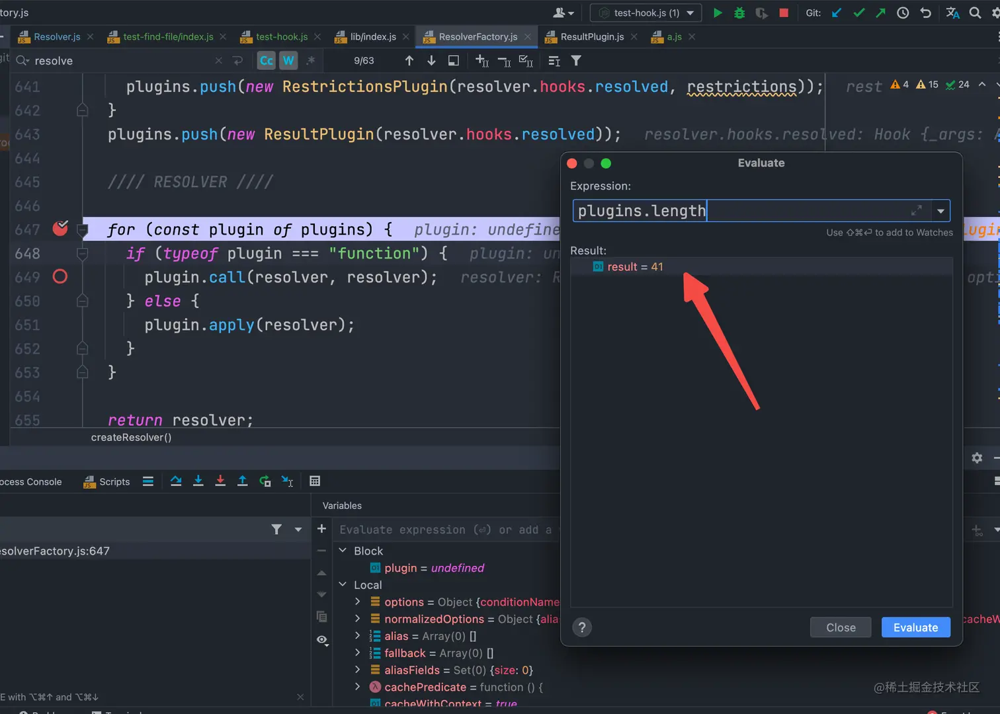

其中因为`NextPlugin`是流程推动性插件和业务逻辑无关，就过滤掉，还剩下 `32个`：

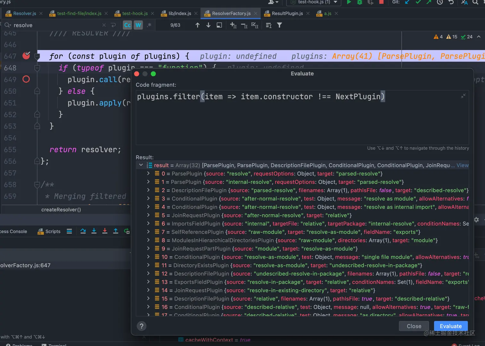

### 2.2 开始调试正式流程吧 （流水线打开电源，跑起来了）

在 `lib/Resolver.js` 的 `resolve` 方法中是查找路径开始的起点，首先就是把 用户传入的 路径 `path` 和 要查找文件的路径 `request` 赋值给 obj 对象 【此 obj 是核心对象，将在各个插件中流转修改】。

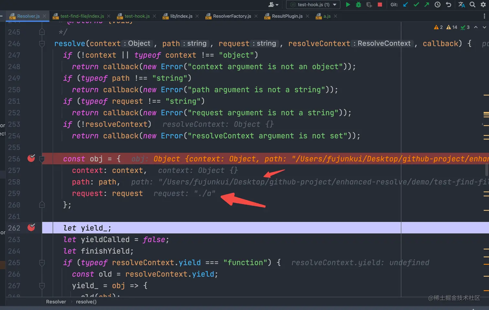

然后就开始调用自身的 `doResolve` 方法，正式开始流程了。

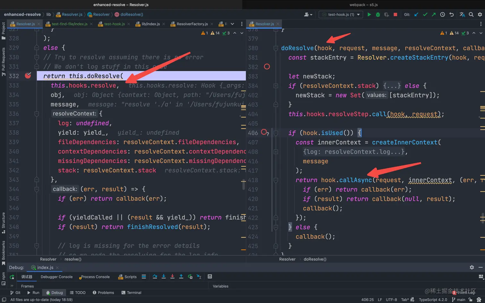

## 3. 从 `resolve` hook 开始的流程，到结束

断点到 `doResolve`方法的 `hook.callAsync` 部分，看下相关的参数。

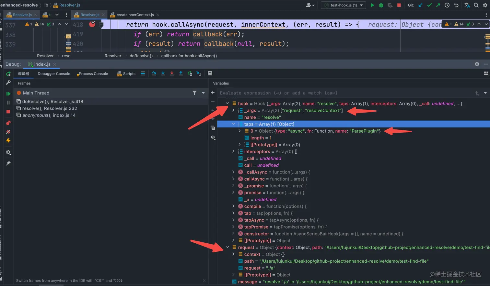

从图中可以看出，此 hook 名为 `resolve`，入参有两个：`Array(2)[request,resolveContext]`，绑定此 hook 的插件只有一个 `ParsePlugin` 的插件，传递下去的参数是 `request` 对象：`path`和 `request`是重要的数据。

下一步就开始进入 `ParsePlugin` 插件看看它究竟做了什么。

### 3.1 视察 `ParsePlugin`工种的工作

`ParsePlugin` 其核心 `apply` 代码如下：

```
apply(resolver) {
 const target = resolver.ensureHook(this.target);
 resolver
  .getHook(this.source)
  .tapAsync("ParsePlugin", (request, resolveContext, callback) => {
   // 调用 resolver 中的 parse 方法初步解析
   const parsed = resolver.parse(/** @type {string} */ (request.request));
   // 合并成新的 obj 对象
   const obj = { ...request, ...parsed, ...this.requestOptions };
   if (request.query && !parsed.query) {
    obj.query = request.query;
   }
   if (request.fragment && !parsed.fragment) {
    obj.fragment = request.fragment;
   }
   if (parsed && resolveContext.log) {
    if (parsed.module) resolveContext.log("Parsed request is a module");
    if (parsed.directory)
     resolveContext.log("Parsed request is a directory");
   }
   // There is an edge-case where a request with ## can be a path or a fragment -> try both
   if (obj.request && !obj.query && obj.fragment) {
    const directory = obj.fragment.endsWith("/");
    const alternative = {
     ...obj,
     directory,
     request:
      obj.request +
      (obj.directory ? "/" : "") +
      (directory ? obj.fragment.slice(0, -1) : obj.fragment),
     fragment: ""
    };
    resolver.doResolve(
     target,
     alternative,
     null,
     resolveContext,
     (err, result) => {
      if (err) return callback(err);
      if (result) return callback(null, result);
      resolver.doResolve(target, obj, null, resolveContext, callback);
     }
    );
    return;
   }
   resolver.doResolve(target, obj, null, resolveContext, callback);
  });
}
```

经过断点发现，`obj` 对象第一次进入这个 `plugin`逛了一圈，然后最终走到了 `resolver.doResolve(target, obj, null, resolveContext, callback);` 这里，处理完的数据如下：【思考一下吃了啥数据，吐出了啥数据？】

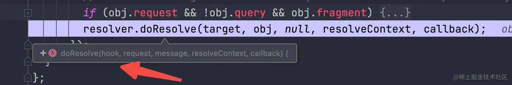

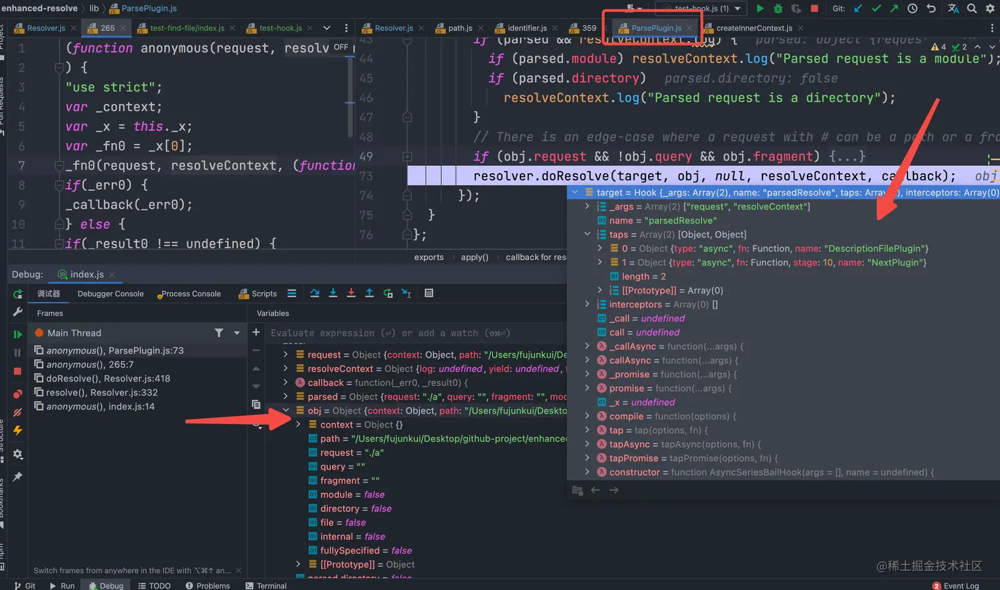

`ParsePlugin` 吃了 obj，以后对其进行初步解析，增加了如下属性 【红色是吃进去的，绿色是吐出来的】

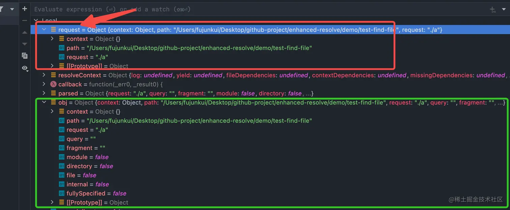

然后下一个要执行 hook 是`parsedResolve`，其绑定的业务插件是 `DescriptionFilePlugin`，`NextPlugin`插件属于流程插件，可以忽略。

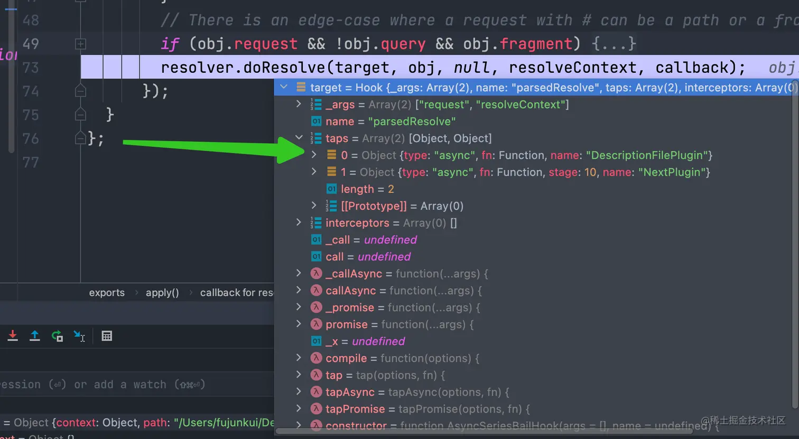

### 3.2 视察 `DescriptionFilePlugin`工种的工作

当前流程的 `DescriptionFilePlugin` 插件的核心是在 `DescriptionFileUtils.loadDescriptionFile`方法里，

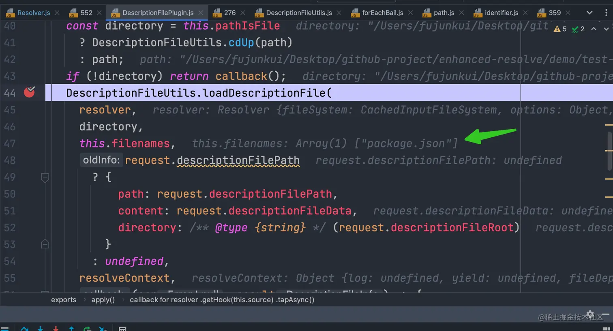

当看到 `['package.json']`的那一刻是不是可以联想并猜测到：此插件的作用就是在实现`查找当前的路径` 是否是一个 具有`package.json`文件的模块？继续 debug `loadDescriptionFile`方法，

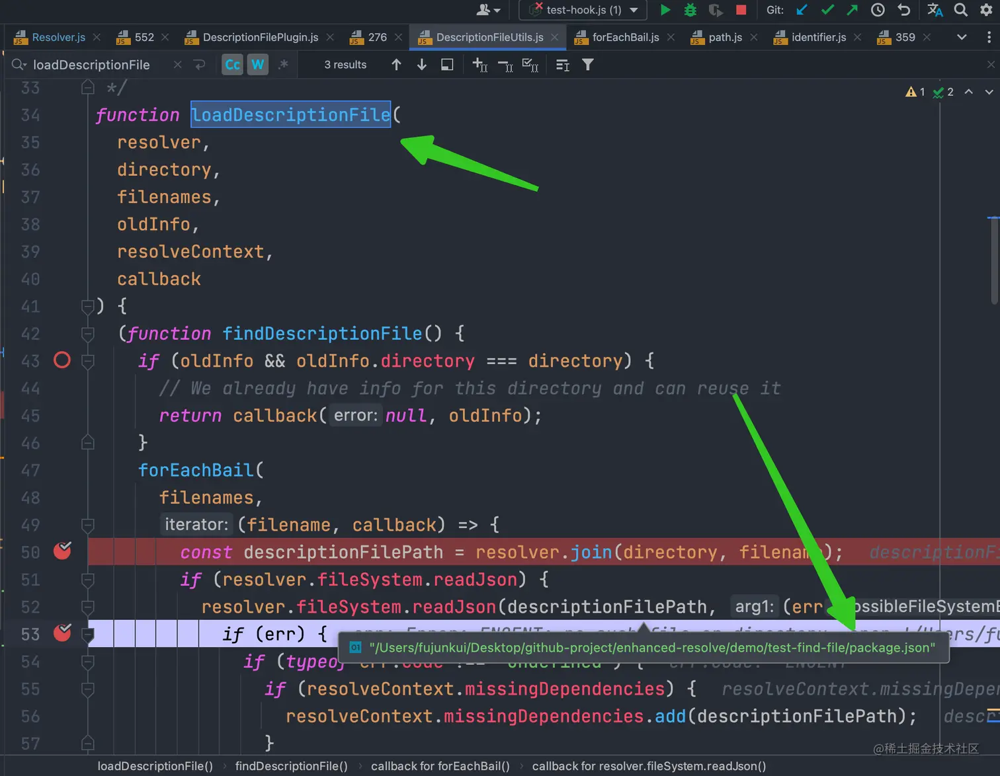

看到这个路径拼接，验证了猜想是正确的，继续 debug 发现，走到了此方法的 callback 函数里，执行了一个 `cdUp` 的方法。

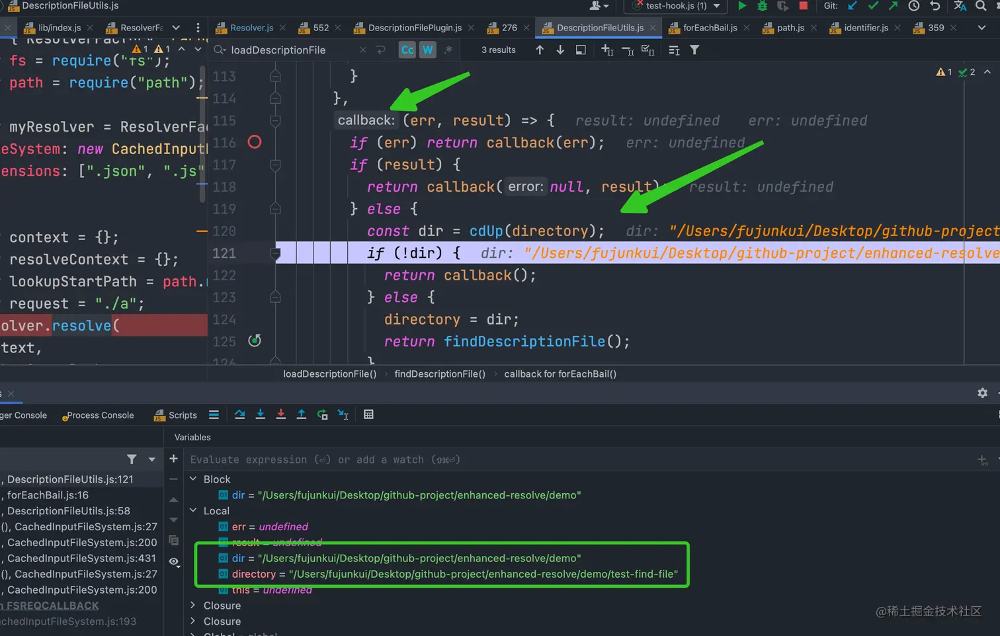

我们不去看方法实现，仅仅看变更，变量从`directory`变成了 `dir`，数据从`/Users/fujunkui/Desktop/github-project/enhanced-resolve/demo/test-find-file`变成了`/Users/fujunkui/Desktop/github-project/enhanced-resolve/demo`，卧槽，还真是进入了上级目录，`cdUp` 66666。

不出所料的话，他会一直 `cdUp` 知道进入到根目录的,查找 `/package.json` 为止 【图中，我把 enhance-resolve 项目的 package.json 文件给删除了，不删除的话找到这一级就停止了】 部分截图

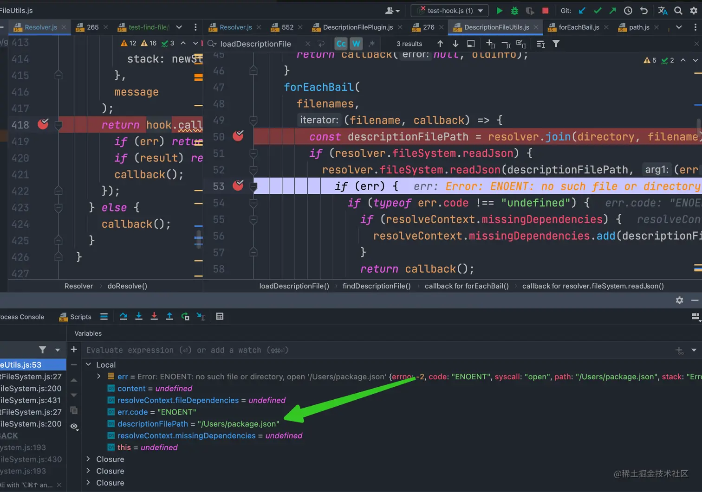

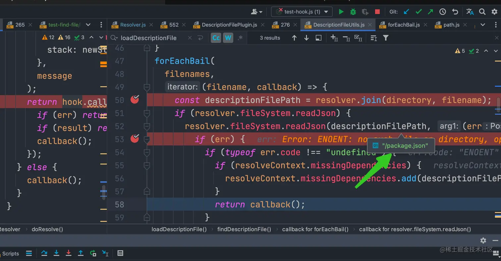

最后找呀找呀，就是找不到一个目录具有`package.json` 文件，没办法只能走 `callback` 了。

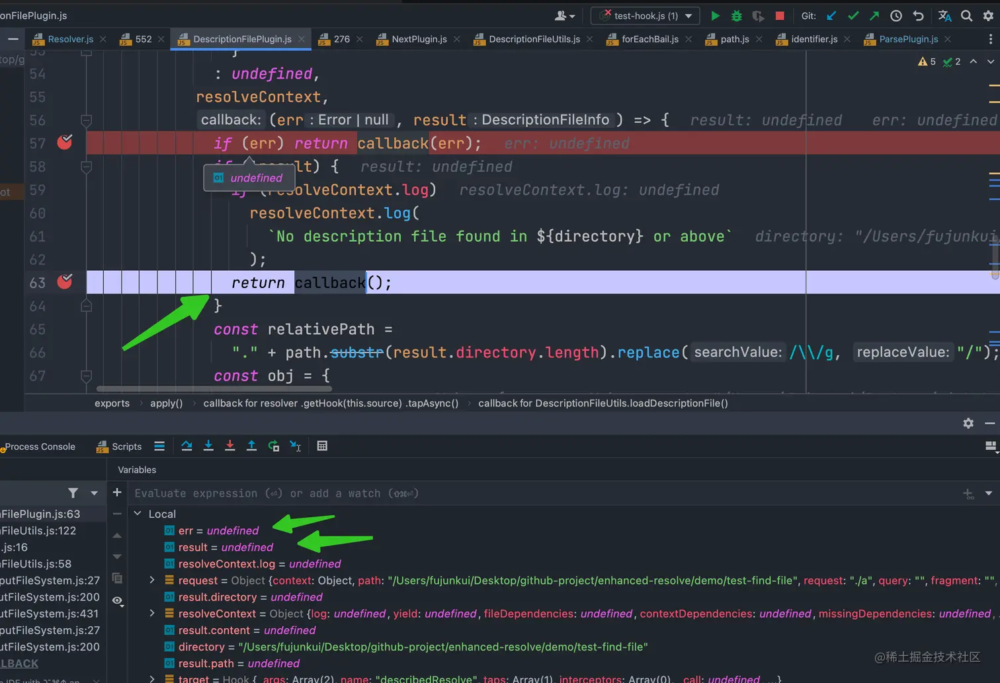

结果就是这个插件一顿 cdUp 操作，啥都没变，注意此处的 `callback()`返回值为空，他就要进入此 hook 的下一个插件了，`NextPlugin` 正式登场。

### 3.3 外卖小哥 `NextPlugin` 正式登场

`NextPlugin` 核心代码如下：

```
apply(resolver) {
 const target = resolver.ensureHook(this.target);
 resolver
  .getHook(this.source)
  .tapAsync("NextPlugin", (request, resolveContext, callback) => {
   resolver.doResolve(target, request, null, resolveContext, callback);
  });
}
```

直接调用 `resolver.doResolve` 把上一个 hook 的丢出的数据，给下一个 hook 使用，不做任何改变（像极了 辛苦帮商家送餐的外卖小哥，点赞）。

那就有请下一位 hook 闪亮登场：

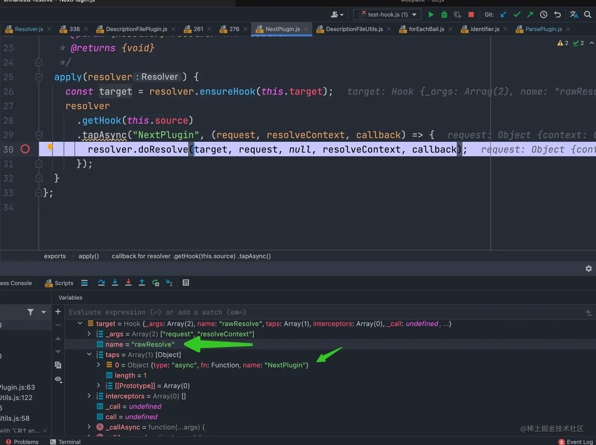

好家伙，下一个 hook 是 `rawResolve`，让我们来看看他的监听者 都有谁，拉倒吧，还是 `NextPlugin` 外卖小哥，这就是外卖小哥点饭（外卖小哥送给外卖小哥）？？？

那就继续吧，看看这个 `rawResolve` 的下一个 hook 是谁，监听的插件都有谁？

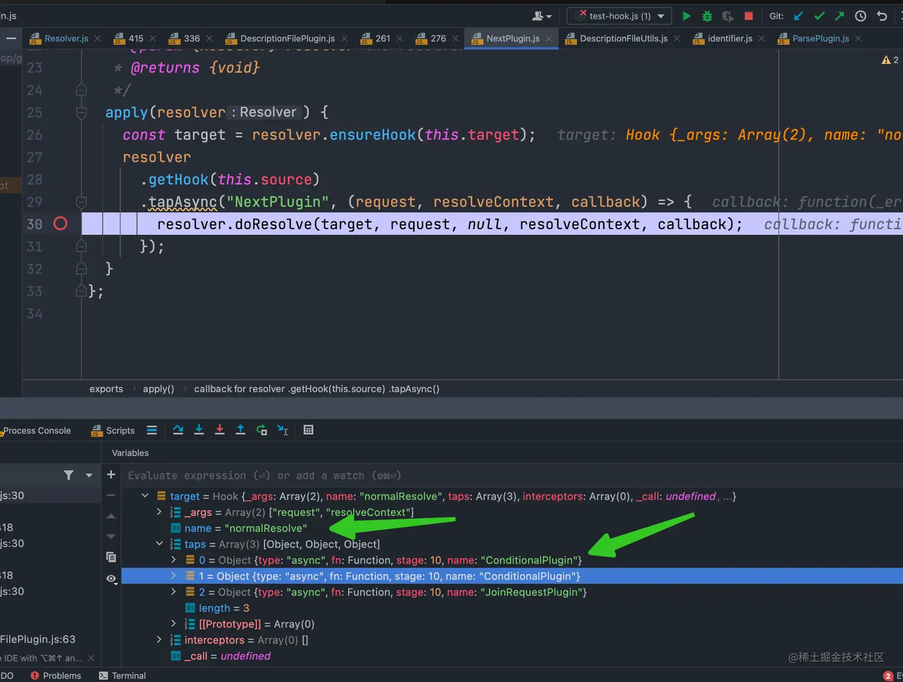

下一个 hook 名叫 `normalResolve`，竟然有 3 个插件监听了此 hook，那么开始表演吧。

### 3.4 视察 hook 名为`normalResolve` 下面的三个工种（插件）的工作

#### 3.4.1 第一位和第二位 靓仔都是 `ConditionalPlugin` (翻译为中文就是：条件插件)

大致猜测一下条件插件：就是满足了哪些条件才会继续执行下去。

两者的区别在初始化的传参里：

```
plugins.push(
 new ConditionalPlugin(
  "after-normal-resolve",
  { module: true },
  "resolve as module",
  false,
  "raw-module"
 )
);
plugins.push(
 new ConditionalPlugin(
  "after-normal-resolve",
  { internal: true },
  "resolve as internal import",
  false,
  "internal"
 )
);
```

总体代码是：

```
class ConditionalPlugin {
 constructor(source, test, message, allowAlternatives, target) {
  this.source = source;
  this.test = test;
  this.message = message;
  this.allowAlternatives = allowAlternatives;
  this.target = target;
 }

 apply(resolver) {
  const target = resolver.ensureHook(this.target);
  const { test, message, allowAlternatives } = this;
  const keys = Object.keys(test);
  resolver
   .getHook(this.source)
   .tapAsync("ConditionalPlugin", (request, resolveContext, callback) => {
    for (const prop of keys) {
     if (request[prop] !== test[prop]) return callback();
    }
    resolver.doResolve(
     target,
     request,
     message,
     resolveContext,
     allowAlternatives
      ? callback
      : (err, result) => {
        if (err) return callback(err);

        // Don't allow other alternatives
        if (result === undefined) return callback(null, null);
        callback(null, result);
        }
    );
   });
 }
};
```

执行结果如下： 第一次 插件的 callback 结果是 空【下图】，进入 第二个 插件，

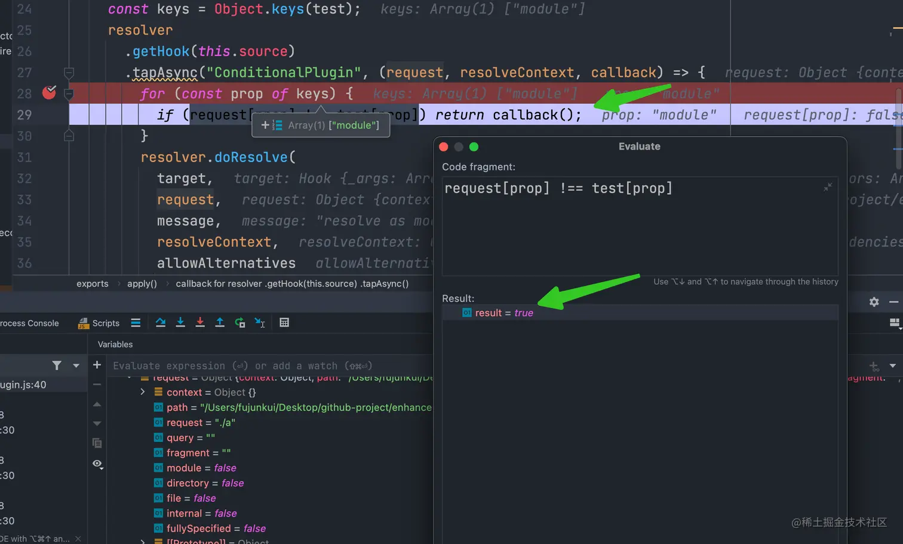

第二个插件的 callback 结果是 空【下图】， 进入 `JoinRequestPlugin` 插件

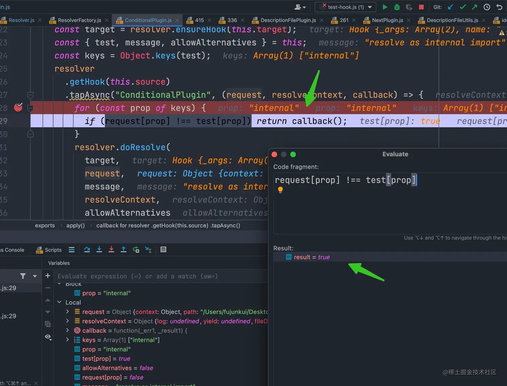

#### 3.4.2 视察 `JoinRequestPlugin` 插件的工作

看名字就知道是干啥的，任务比较简单，就是把 `path 和 request 合并成新的路径 赋值给 path`（绿色圈中部分），

```
resolver.join(request.path, request.request),
```

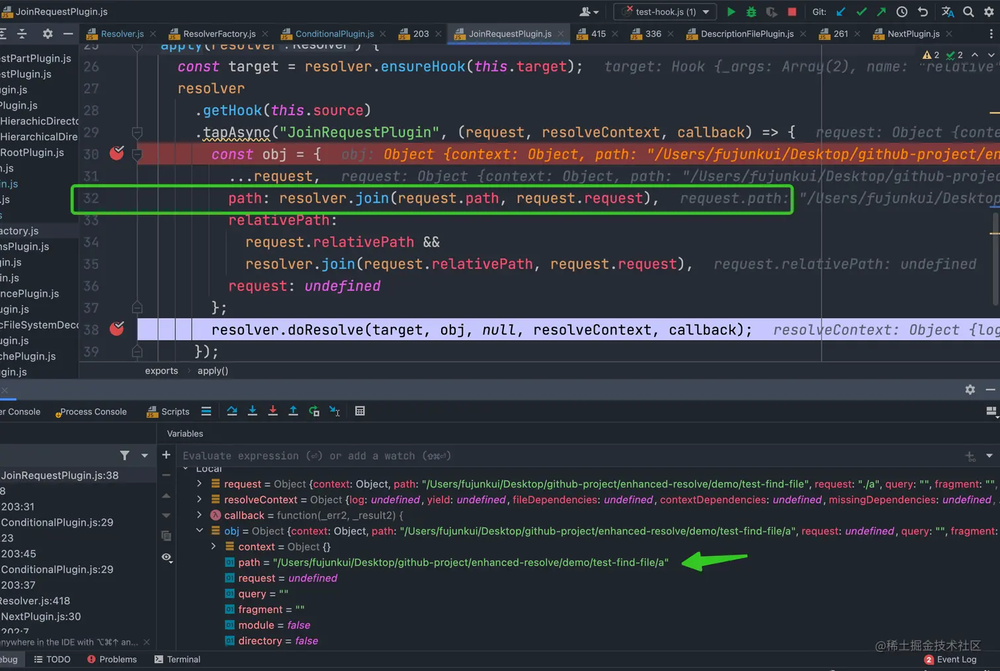

这个 hook 的事情完成了，有请下一个 hook `relative`，以及它的两位监听者们。

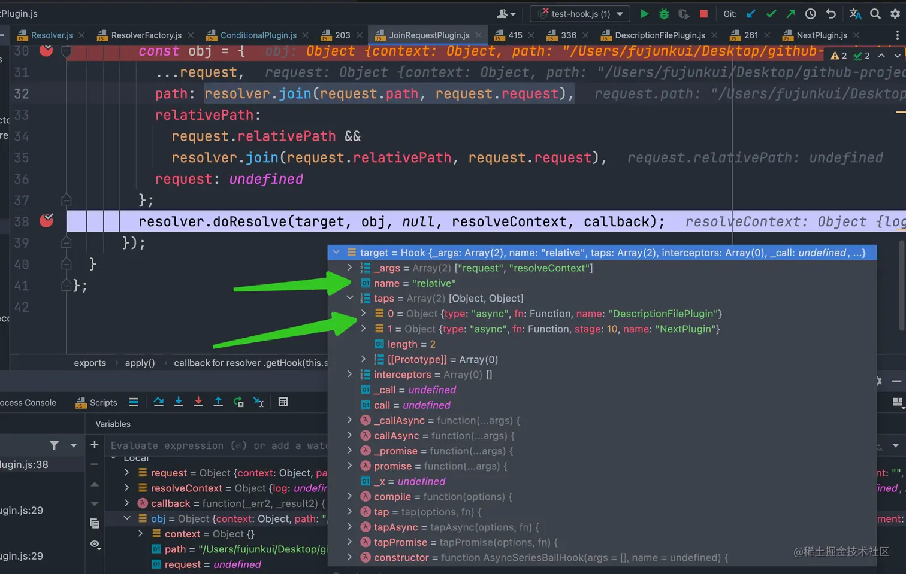

### 3.5 视察 hook 名为`relative` 下面的两个工种（插件）的工作

兜兜转转的又进入 `DescriptionFilePlugin` 插件了，但是 此时的参数和之前的不一样了，但是好像也没有什么不同，最后还是 callback 为空，灰头土脸的走进下一个插件了。

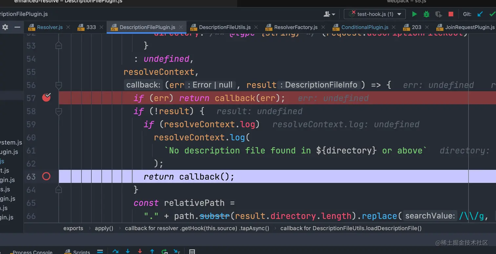

继续走到 `NextPlugin`，然后被送到 `describedRelative` 的 hook，此 hook 的监听者有：

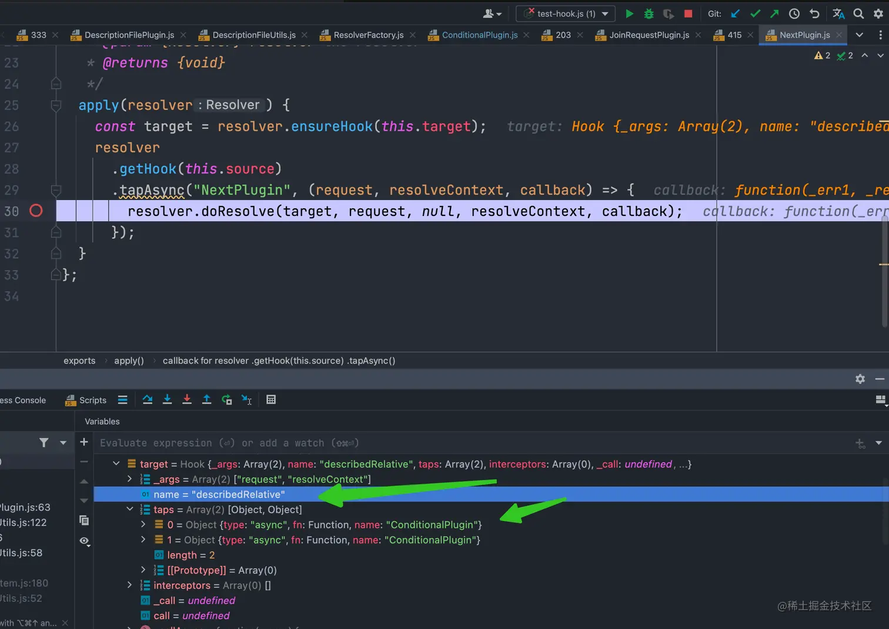

### 3.5 视察 hook 名为`describedRelative` 下面的两个工种（条件插件）的工作

条件插件要满足的第一个逻辑就是，不是文件夹，推测我们是满足的，开始 debug。

```
plugins.push(
 new ConditionalPlugin(
  "described-relative",
  { directory: false },
  null,
  true,
  "raw-file"
 )
);
plugins.push(
 new ConditionalPlugin(
  "described-relative",
  { fullySpecified: false },
  "as directory",
  true,
  "directory"
 )
);
```

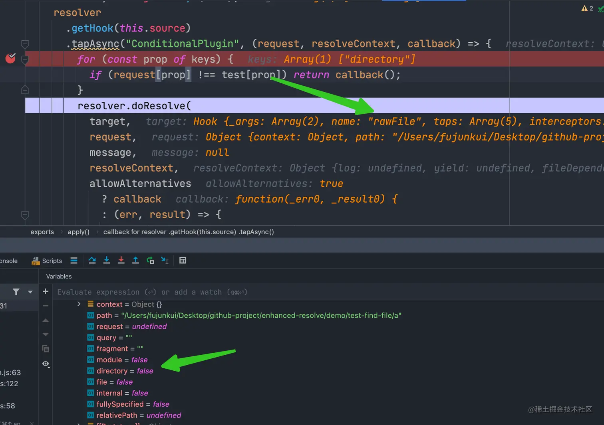 确实满足了不是文件夹的条件，推进到下一个 hook `rawFile`，其相关的监听者有 5 个。

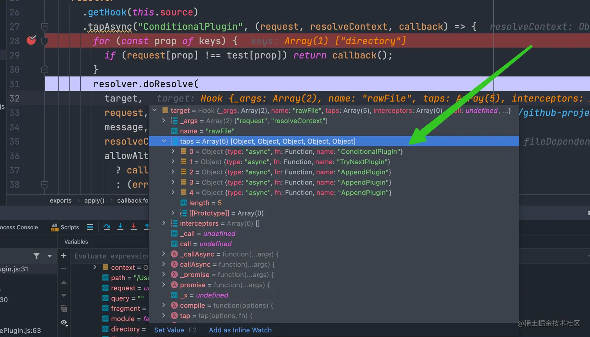

### 3.6 视察 hook 名为`rawFile` 下面的工种的工作

不满足此插件，走进下一个插件`TryNextPlugin`:

```
// raw-file
plugins.push(
 new ConditionalPlugin(
  "raw-file",
  { fullySpecified: true },
  null,
  false,
  "file"
 )
);
```

`TryNextPlugin`（尝试下一个插件） 的代码如下：

```
apply(resolver) {
 const target = resolver.ensureHook(this.target);
 resolver
  .getHook(this.source)
  .tapAsync("TryNextPlugin", (request, resolveContext, callback) => {
   resolver.doResolve(
    target,
    request,
    this.message,
    resolveContext,
    callback
   );
  });
}
```

个人感觉其实此处的逻辑更应该是尝试下一个`hook`，而不是`插件`，所以改为 `TryNextHook`更好.之所以这么说看下面的代码：

```
plugins.push(new TryNextPlugin("raw-file", "no extension", "file"));
```

上面代码简单理解为，被查找的文件是 不带扩展的文件，可以直接走到 名为 `file` 的 hook 里。此 hook 的监听插件有：

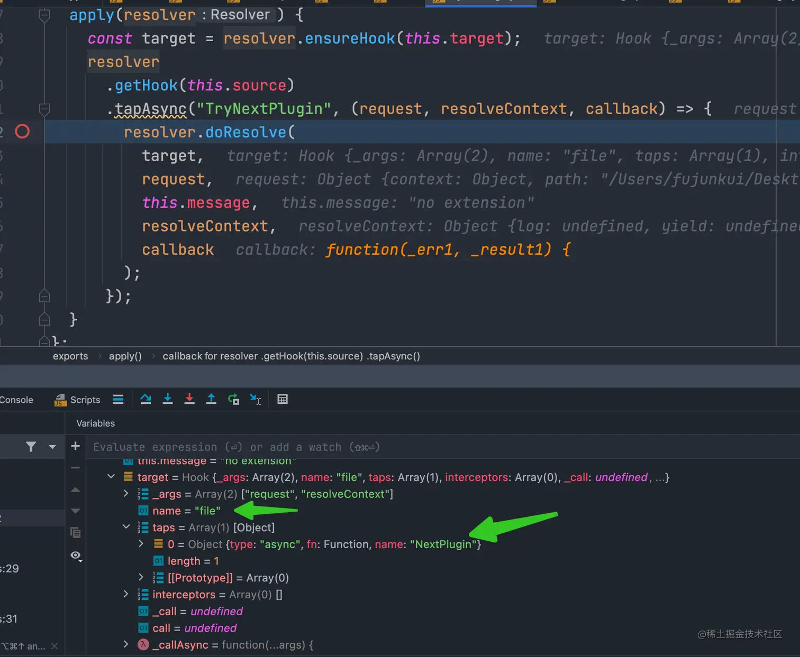

那就继续走 `NextPlugin` 插件的逻辑，然后走向了 `finalFile` 的 hook 【下图】,进入 `FileExistsPlugin` 插件的逻辑里。

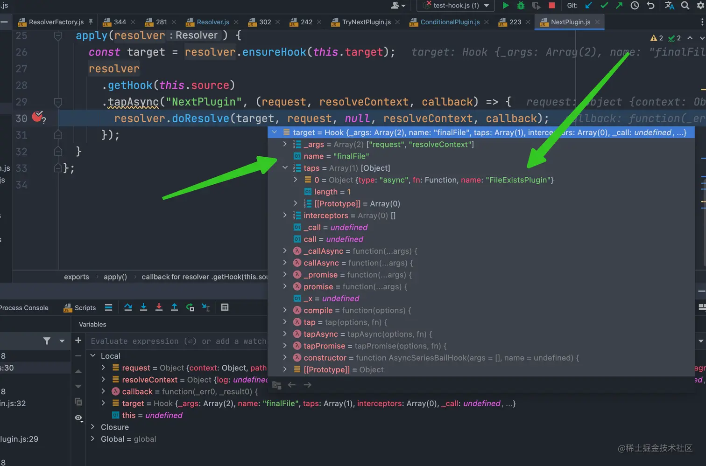

### 3.7 视察 hook 名为`finalFile` 下面的工种`FileExistsPlugin`插件的工作

代码比较简单：获取查找路径，直接判断是不是文件即可。

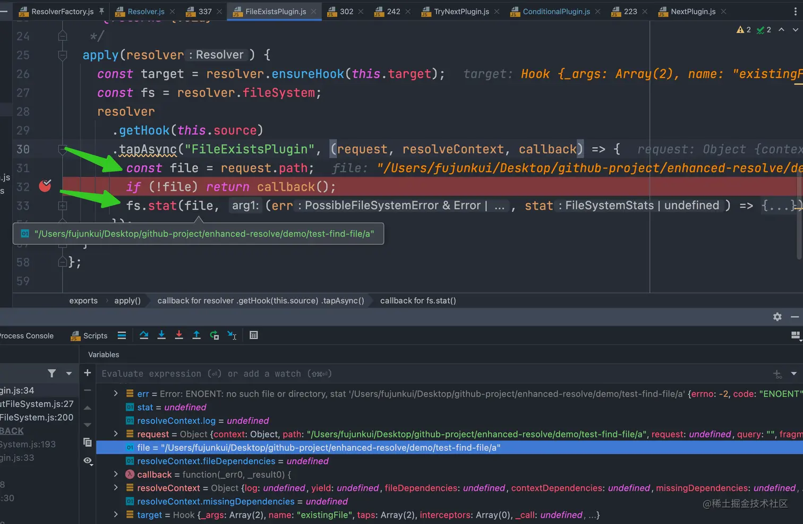

发现不是文件，那就执行 callback 函数，此插件的 callback 函数是`Resolver 中的 hook.callAsync` 中的 callback 函数

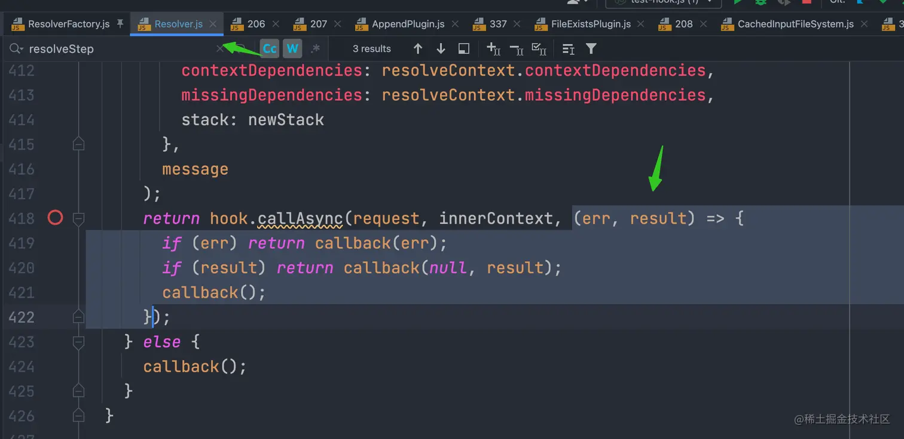

然后 `Resolver 中的 hook.callAsync` 中的 callback 函数接受到的 err 和 result 都是 undefined，就又走了 `doResolve` 中接受的 callback 函数，那就要开始从现在这个 `finalFile` 向前找了，查找的过程要忽略掉 外卖小哥型插件 比如`TryNextPlugin`和`NextPlugin`。

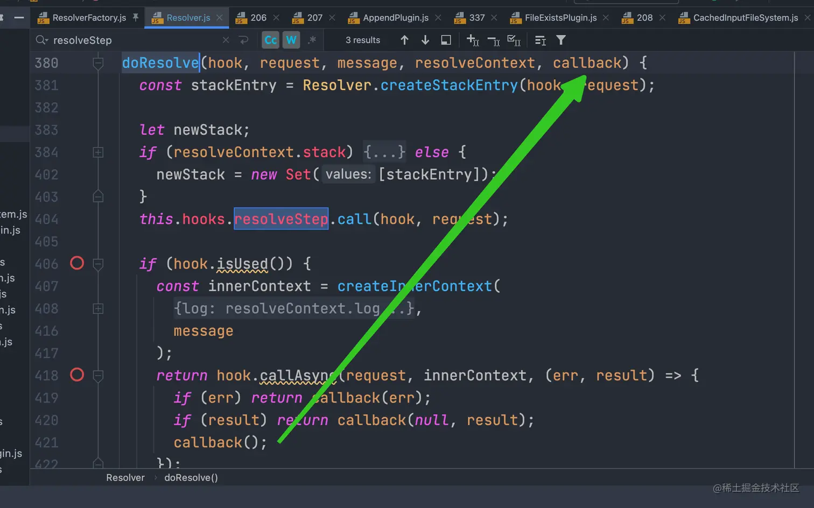

`finalFile` 上一个是 `file`的 hook 监听 （`NextPlugin`可忽略）， `file` 的上一个是 `raw-file`，触发 `raw-file` 下的插件的监听，接下来就是查找监听了 hook 位 `raw-file` 的插件了。

这块的代码可能因为都叫 callback，并且跳来跳去的有些难以理解，可以参考我下面简化过的代码。

```
let { AsyncSeriesBailHook } = require("tapable");

const hook1 = new AsyncSeriesBailHook(["request", "resolveContext"], "hook1");
const hook2 = new AsyncSeriesBailHook(["request", "resolveContext"], "hook2");

const hook1Tap1 = hook1.tapAsync(
 "hook1Tap1",
 (request, resolveContext, callback) => {
  console.log("hook1Tap1", request, resolveContext);
  return callback();
 }
);

const hook1Tap2 = hook1.tapAsync(
 "hook1Tap2",
 (request, resolveContext, callback) => {
  console.log("hook1Tap2", request, resolveContext);
  return callback();
 }
);

const hook2Tap1 = hook2.tapAsync(
 "hook2Tap1",
 (request, resolveContext, callback) => {
  console.log("hook2Tap1", request, resolveContext);
  return callback();
 }
);

const hook2Tap2 = hook2.tapAsync(
 "hook2Tap2",
 (request, resolveContext, callback) => {
  console.log("hook2Tap2", request, resolveContext);
  return callback("err");
 }
);

hook1.callAsync("111", "222", () => {
 console.log("hook1 callback");
 hook2.callAsync("333", "455", err => {
  console.log("hook2 callback", err);
 });
});
```

执行结果如下：

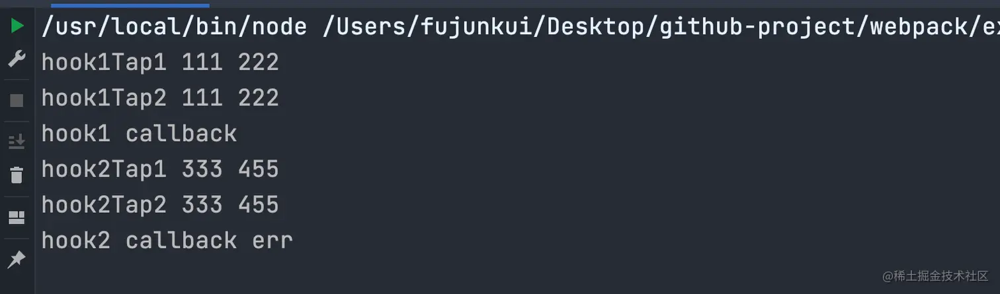

这块的内容是定义了两个`异步的hook`,然后在`hook1 调用 callAsync `的时候，里面传递了 `hook2 的 callAsync `调用，这样就会在调用完 `hook1` 的触发事件，然后去接着调用 `hook2` 的触发事件。

这样是不是可以理解 多个 hook 之前传递 callback 的逻辑了？

那么接下来就要找监听了 hook 名为 `raw-file` 的插件有哪些了，直接看 `ResolverFactory` 注册时间得知 【下图】，有 3 个插件监听了。而现在的顺序 又是按照监听顺序倒着执行 callback 的，那就应该是先执行 `AppendPlugin` 插件了，打上断点，跑一下

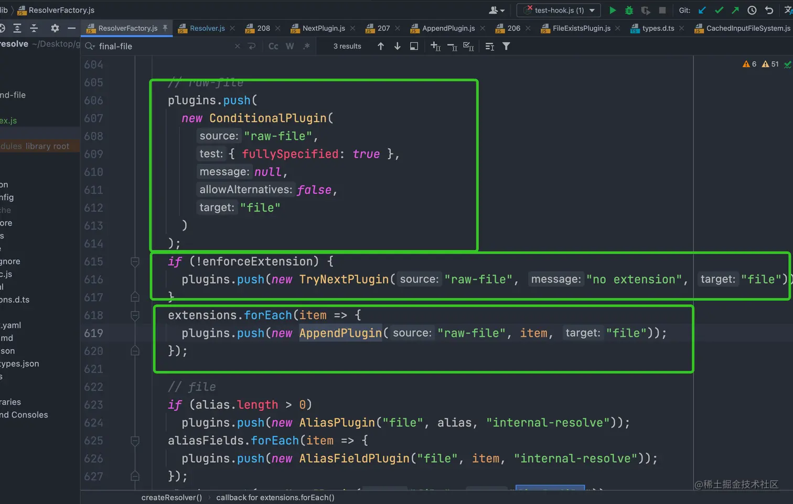

### 3.8 回首掏，去视察 hook 名为`raw-file` 下面的工种`AppendPlugin`插件的工作

`AppendPlugin` 代码较为简单，就是把传入的 `this.appending` 和 `request.path` 进行拼接，生成新的 `request.path`，

```
module.exports = class AppendPlugin {

 constructor(source, appending, target) {
  this.source = source;
  this.appending = appending;
  this.target = target;
 }

 apply(resolver) {
  const target = resolver.ensureHook(this.target);
  resolver
   .getHook(this.source)
   .tapAsync("AppendPlugin", (request, resolveContext, callback) => {
    const obj = {
     ...request,
     path: request.path + this.appending,
     relativePath:
      request.relativePath && request.relativePath + this.appending
    };
    resolver.doResolve(
     target,
     obj,
     this.appending,
     resolveContext,
     callback
    );
   });
 }
};
```

查找 `this.appending` 是在实例化时候传入的，断点得知。这个就是我们传入的 `extensions` 配置

```
const myResolver = ResolverFactory.createResolver({
 fileSystem: new CachedInputFileSystem(fs, 4000),
 extensions: [".json", ".js", ".ts"]
});
```

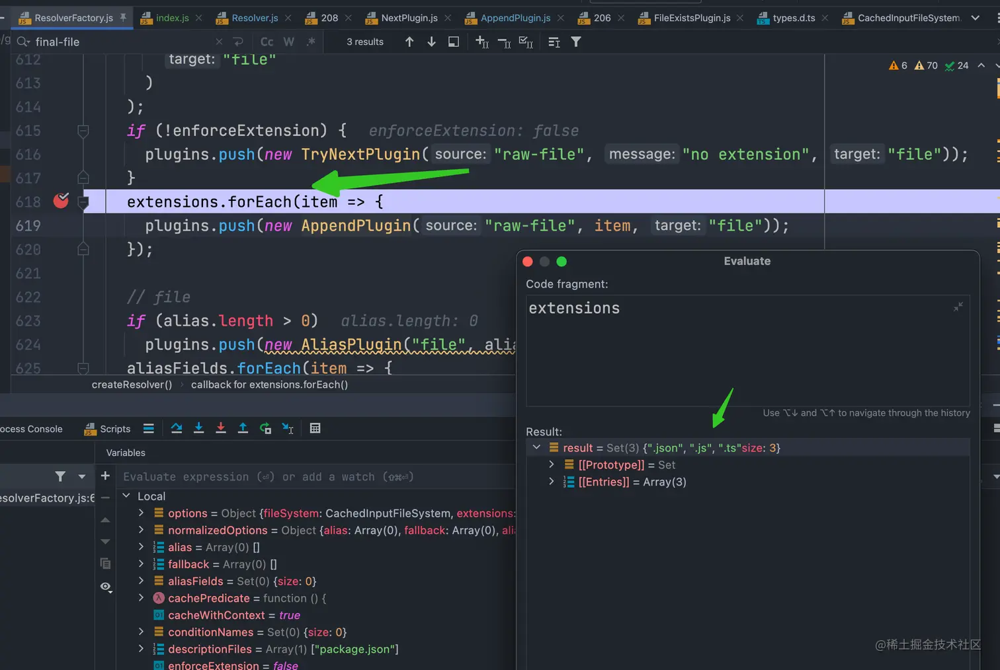

然后断点到此处，看吃进去了啥，吐出来了啥。

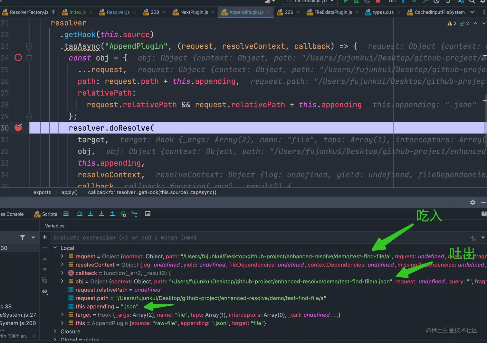

然后下一个 hook 是 `file`，只有一个 `NextPlugin` 插件监听了此 hook，用来推进流程【下图】。

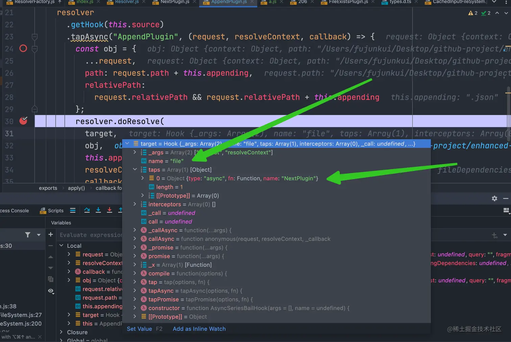

而 `NextPlugin` 插件是将流程 从 `file` 推向了 `final-file` hook，走到 3.7 的流程，判断一下带有此后缀的文件是否存在，不存在的话，继续 重复 `raw-file` hook 的 `AppendPlugin` 的流程，此时的参数是 `this.appending` 是 `.js` 【下图】

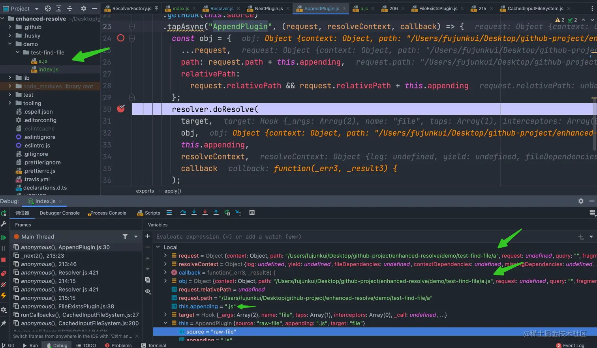

继续 重复以上的操作： `NextPlugin` 插件是将流程 从 `file` 推向了 `final-file` hook，然后 `FileExistsPlugin` 插件判断到，此文件存在，推进流程到 `existingFile` 的 hook，此 hook 有 2 个插件监听【下图】。

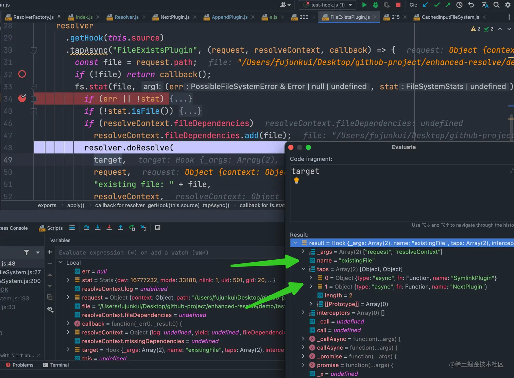

### 3.9 文件存在了，下一步去视察 hook 名为`existingFile` 下面的插件的工作

先去执行`SymlinkPlugin` 通过 `fs.readlink` 方法判断其是否是符号链接下的文件，[符号链接 symlink\_什么是符号链接或符号链接？ 如何为 Windows 和 Linux 创建 Symlink？\_cunjiu9486 的博客-CSDN 博客](https://link.juejin.cn/?target=https%3A%2F%2Fblog.csdn.net%2Fcunjiu9486%2Farticle%2Fdetails%2F109076948)，

再补充一点 [硬链接和软链接的区别？ - 掘金 (juejin.cn)](https://juejin.cn/post/7075577743726870535)

> 关于符号链接这里有特殊说明，假设你新建了 `b.js`，删除了当前目录下的 `a.js`，当前目录情况如下：

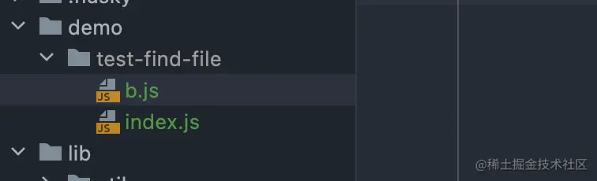 建立硬链接 进行测试：

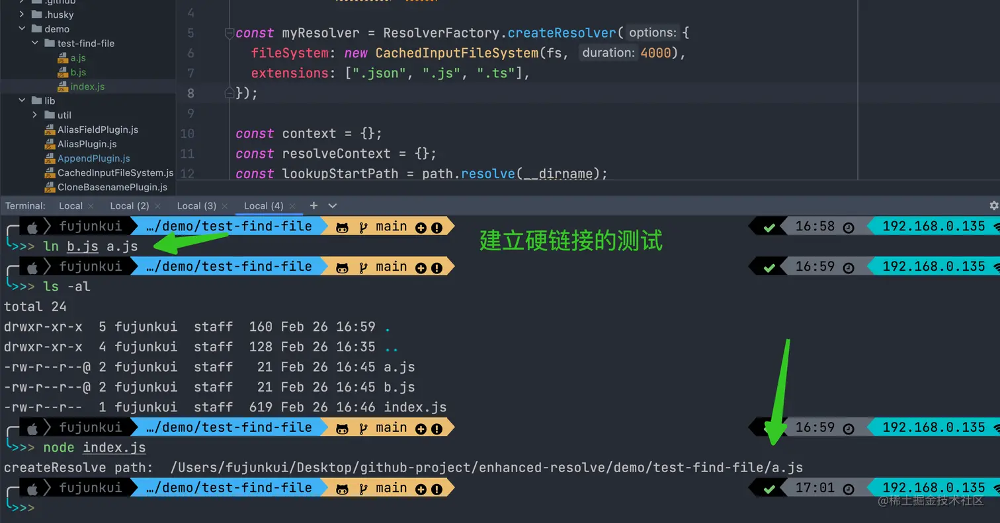

建立软链接，进行测试：

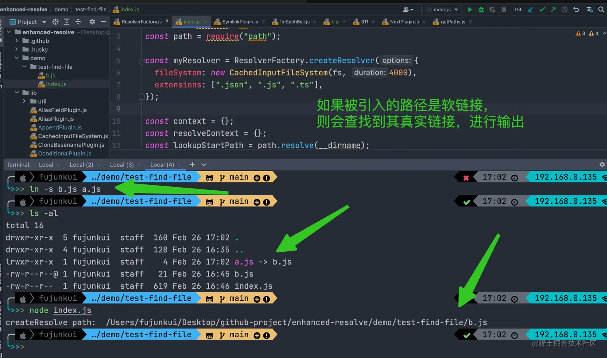

> 其实软链接，还区分绝对路径和相对路径的情况【下图】，本次只考虑相对路径，大家可以使用绝对路径进行 debug.

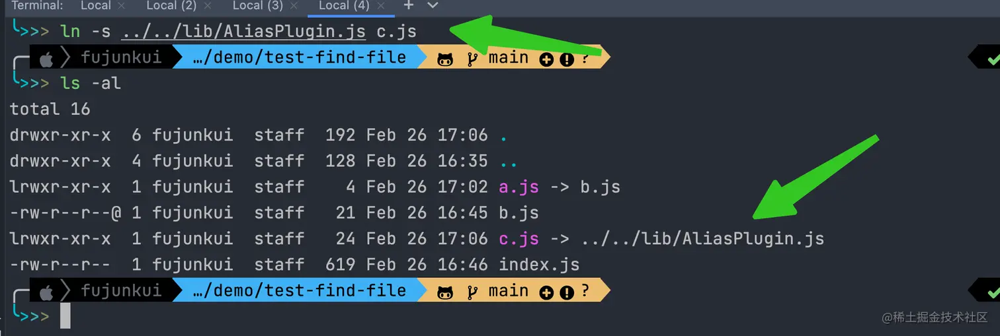

我们进行软链接的 debug，最后发现查找到 b.js 的路径，那么继续 debug。

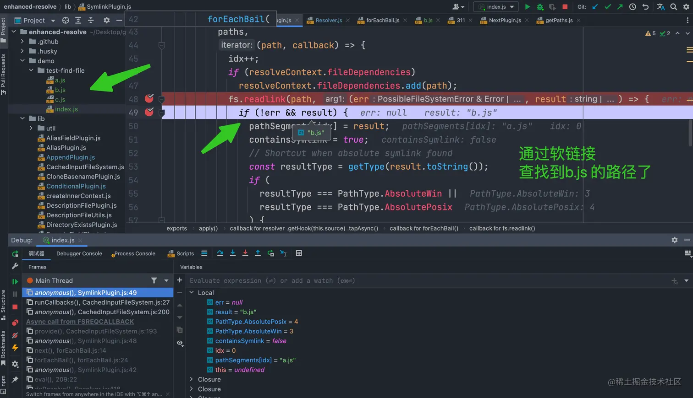

到此是发现了软链接的源文件，那么下一步肯定是判断 此源文件是否是存在，又走到 `existingFile`的 hook 【下图】，重复 3.9 的步骤，又走 `SymlinkPlugin` 插件的逻辑（担心软链接的源文件还是软链接），

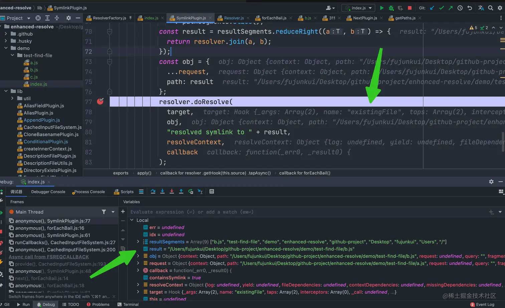

继续 debug `SymlinkPlugin`，发现走到了 `callback()` 的情况【下图】，那就是要进入下一个监听者 （NextPlugin）了，

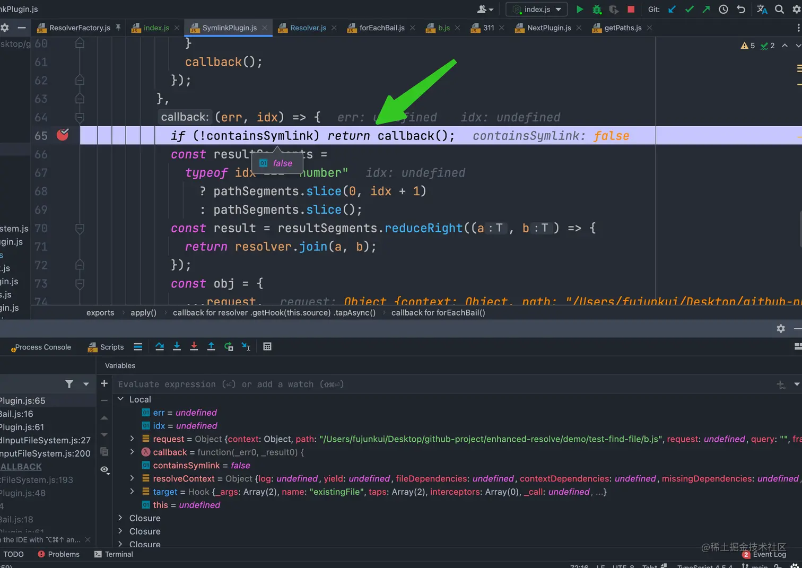

在 `NextPlugin`中发现终于走到了最后的 hook `resolved`，只有一个插件 `ResultPlugin` 进行监听。

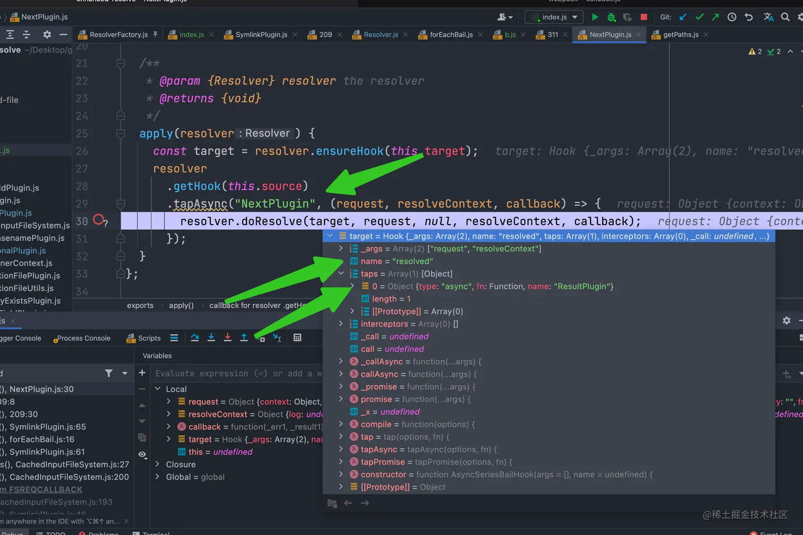

进入 `ResultPlugin` 插件内部，其主要是调用了 `result` 的 hook，

```
apply(resolver) {
 this.source.tapAsync(
  "ResultPlugin",
  (request, resolverContext, callback) => {
   const obj = { ...request };
   if (resolverContext.log)
    resolverContext.log("reporting result " + obj.path);
   resolver.hooks.result.callAsync(obj, resolverContext, err => {
    if (err) return callback(err);
    if (typeof resolverContext.yield === "function") {
     resolverContext.yield(obj);
     callback(null, null);
    } else {
     callback(null, obj);
    }
   });
  }
 );
}
```

debug 一下那些插件监听了此 hook，发现是空的，直接走到自身的 callback 函数里，

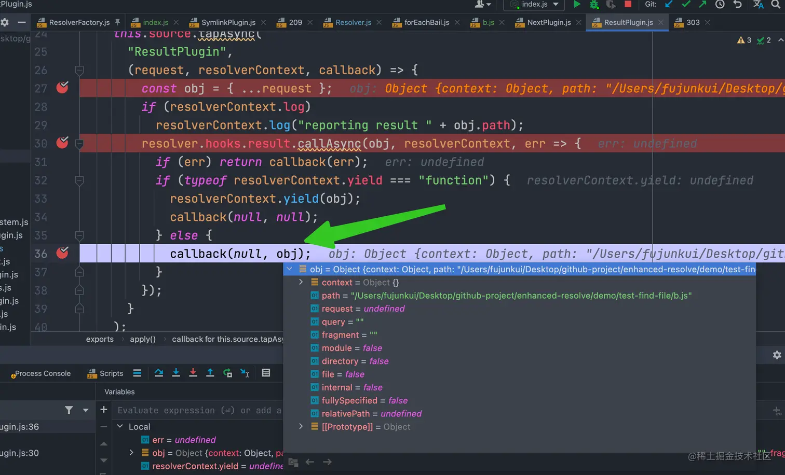

继续 debug 此 callback 函数，就会发现这个 callback 在一层一层的向上传递值，接着传到 `Resolver 里的 resolve 函数`里， 经过 `finishResolved` 处理解析一次【下图】，最后传递给 我们自身的 callback 函数里。

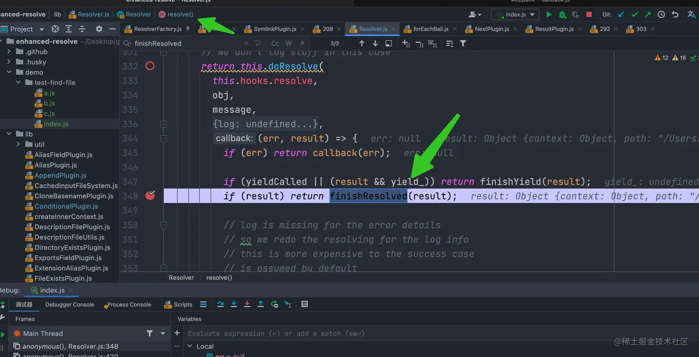

debug 停在我们自己监听的 callback 函数里，至此完成整体流程。

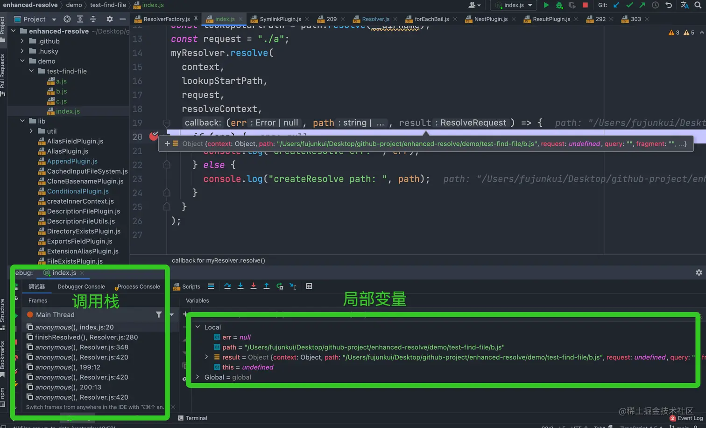

## 4 完结撒花，回顾总结。

通过一步一步的 debug，会发现 enhance-resolve 这个库，把 tapable 给用的出神入化，核心的处理逻辑都在 `Resolver` 上，而 `ResolverFactory` 则像是 流水线的 线长，借用`Resolver` 的能力，去指定流水线的流程，分配流水线每个流程应该协作的工种。

总的逻辑通下来，你会发现，所有的插件都是在对 `obj 对象`做数据变更，每个插件都有自己的职责，互不干涉，互不影响，通过 `NextPlugin`，这个外卖小哥插件，把 数据在各个 hook 流程之间进行流转，进而建立起一套高效的流水线系统，`耦合性低，定制化程度高，功能强大`。

这里就不画流程图做总结了，偷个懒，因为此文章耗时 `7个小时`左右 （啊，我的眼镜），从头到尾 debug 下来，发现收获不少，以后完全可以模仿此库基于自己的业务流程，开发定制一套属于自己的高效可定制化的可插拔插件的工程。

希望大家看完此文章会有所收获，慢慢的开始自己的学习源码之路。冲吧，兄弟们。

> 另外放出一个基于此库开发的一个根据不同文件后缀进行条件编译的插件：[@fu1996/webapck-resolver-mode-plugin - npm (npmjs.com)](https://link.juejin.cn/?target=https%3A%2F%2Fwww.npmjs.com%2Fpackage%2F%40fu1996%2Fwebapck-resolver-mode-plugin)

兄弟们，别忘记思考解答一下开头的问题，学有所获。下一篇文档 的方向是 解析 webpack 源码。


