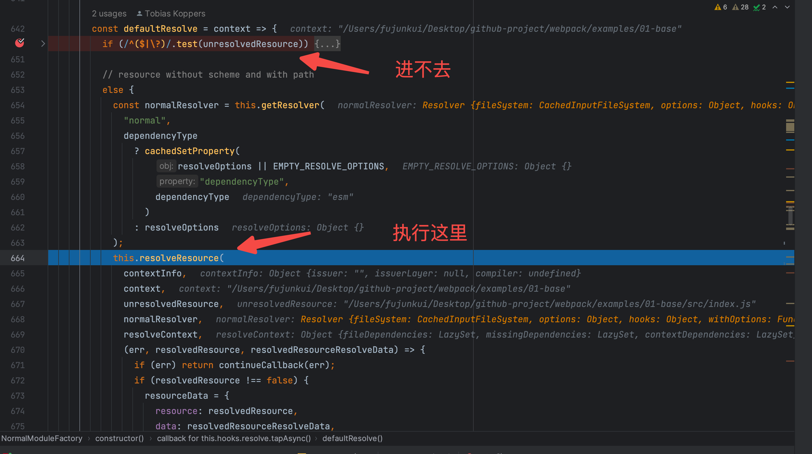

## 1. 书接上回，从 `this.factorizeQueue.add(options, callback);` 开始

不是很清楚上下文的兄弟，可以去看下我之前写的 `（源码篇01）浅析webpack5中Compiler中重要的hook调用过程`。

> 此文比较干，各位读者开始阅读前，请准备好 `瓜子，可乐，矿泉水`，好好享受阅读源码的乐趣。


### 1.1 通过 factorizeQueue 了解 AsyncQueue

那么 这个 `this.factorizeQueue` 指的是什么呢？谁来创建的呢？首先此处的 this 指的是 `Compilation` 的 实例对象，那就去 `Compilation` 查找，全局搜索一下 `Compilation.js` 文件，找到了，代码如下（中文注释是我加的）：

```
/** @type {AsyncQueue<Module, Module, Module>} 进程依赖项队列 */
  this.processDependenciesQueue = new AsyncQueue({
   name: "processDependencies",
   parallelism: options.parallelism || 100,
   processor: this._processModuleDependencies.bind(this)
  });
  /** @type {AsyncQueue<Module, string, Module>} 添加模块队列 */
  this.addModuleQueue = new AsyncQueue({
   name: "addModule",
   parent: this.processDependenciesQueue,
   getKey: module => module.identifier(),
   processor: this._addModule.bind(this)
  });
  /** @type {AsyncQueue<FactorizeModuleOptions, string, Module | ModuleFactoryResult>} 分解队列 */
  this.factorizeQueue = new AsyncQueue({
   name: "factorize",
   parent: this.addModuleQueue,
   processor: this._factorizeModule.bind(this)
  });
  /** @type {AsyncQueue<Module, Module, Module>} 构建队列 */
  this.buildQueue = new AsyncQueue({
   name: "build",
   parent: this.factorizeQueue,
   processor: this._buildModule.bind(this)
  });
  /** @type {AsyncQueue<Module, Module, Module>} 重新构建的队列 */
  this.rebuildQueue = new AsyncQueue({
   name: "rebuild",
   parallelism: options.parallelism || 100,
   processor: this._rebuildModule.bind(this)
  });
```

你会发现好家伙，这不仅仅只有一个队列呀，这里是有一堆的队列。但是都是 `AsyncQueue` 创建的不同名称的实例。 那根据 `this.factorizeQueue.add(options, callback);` 我们下一步就是去看 `AsyncQueue` 中的 `add` 方法了。

### 1.2 深入 `AsyncQueue` 中的 `add` 方法

在深入了解 add 之前，我们先要了解 它的 构造函数都需要哪些参数，以便我们更好的理解其内部的工作原理。

```
constructor({ name, parallelism, parent, processor, getKey }) {
  this._name = name;
  this._parallelism = parallelism || 1;
  this._processor = processor;
  this._getKey =
   getKey || /** @type {(T) => K} */ (item => /** @type {any} */ (item));
  /** @type {Map<K, AsyncQueueEntry<T, K, R>>} */
  this._entries = new Map();
  /** @type {ArrayQueue<AsyncQueueEntry<T, K, R>>} */
  this._queued = new ArrayQueue();
  /** @type {AsyncQueue<any, any, any>[]} */
  this._children = undefined;
  this._activeTasks = 0;
  this._willEnsureProcessing = false;
  this._needProcessing = false;
  this._stopped = false;
  this._root = parent ? parent._root : this;
  if (parent) {
   if (this._root._children === undefined) {
    this._root._children = [this];
   } else {
    this._root._children.push(this);
   }
  }

  this.hooks = {
   /** @type {AsyncSeriesHook<[T]>} */
   beforeAdd: new AsyncSeriesHook(["item"]),
   /** @type {SyncHook<[T]>} */
   added: new SyncHook(["item"]),
   /** @type {AsyncSeriesHook<[T]>} */
   beforeStart: new AsyncSeriesHook(["item"]),
   /** @type {SyncHook<[T]>} */
   started: new SyncHook(["item"]),
   /** @type {SyncHook<[T, Error, R]>} */
   result: new SyncHook(["item", "error", "result"])
  };

  this._ensureProcessing = this._ensureProcessing.bind(this);
 }
```

入参如下：`name, parallelism, parent, processor, getKey`。name 字段是绑在实例身上的 \_name，\_parallelism 先忽略，`parent` 属性是比较重要的， 有 `parent`属性的情况下，实例的 `this._root` 指向的是 父级的 `parent._root`，否则指向的就是实例本身。并且会把自身丢进 父级的 `this._root._children` 里。

> (另外在此构造函数里的 `hooks`就是给当前实例绑定一些执行周期的钩子，比较容易扩展，都是老 webpack 玩家了，这里就不过多的介绍了。这里要注意 新建实例的 `_willEnsureProcessing`,`_needProcessing`和 `_stopped` 默认值都是 `false` 状态。)

分析一下 1.1 中的代码：

```
this.addModuleQueue = new AsyncQueue({
   name: "addModule",
   parent: this.processDependenciesQueue,
   getKey: module => module.identifier(),
   processor: this._addModule.bind(this)
});
this.factorizeQueue = new AsyncQueue({
   name: "factorize",
   parent: this.addModuleQueue,
   processor: this._factorizeModule.bind(this)
});
this.buildQueue = new AsyncQueue({
   name: "build",
   parent: this.factorizeQueue,
   processor: this._buildModule.bind(this)
});
```

1. this.addModuleQueue 中的 \_root 指向的是 this.processDependenciesQueue.\_root，也就是 processDependenciesQueue 自身，
2. this.factorizeQueue 中的 \_root 指向的是 this.addModuleQueue.\_root，而 this.addModuleQueue.\_root 指向的是 processDependenciesQueue
3. this.buildQueue 中的 \_root 指向的是 this.factorizeQueue.\_root，而 this.factorizeQueue.\_root 指向的是 processDependenciesQueue

这意味着上面创建的队列中的 父子关系是如下图的：


知道了父子关系以后，就开始看 `add` 函数具体执行了什么操作，直接断点到这里，看下入参都是什么？（记不着的兄弟去看我前一篇文章。）


进入 `add` 函数内部。


大致的逻辑就是 判断一下 `this._stopped` 当前的实例队列是不是暂停的状态，是暂停的状态就 直接 `callback` 抛出错误。 那核心的步骤就在 `this.hooks.beforeAdd.callAsync`这个 hook 了，老规矩，debug 这个 hook 看一下有哪些 监听者。


发现这个 hook 没有一个监听者，直接执行了本身的 callback 函数，继续 debug 下去。进入 hook 的内部，


部分没有走到的逻辑 直接跳过，根据 `item 和 callback` 实例化`AsyncQueueEntry` 对象，并赋值给 `newEntry`变量。 稍微看下 `AsyncQueueEntry` 类。

```
const QUEUED_STATE = 0;
const PROCESSING_STATE = 1;
const DONE_STATE = 2;

class AsyncQueueEntry {
 /**
  * @param {T} item the item
  * @param {Callback<R>} callback the callback
  */
 constructor(item, callback) {
  this.item = item;
  /** @type {typeof QUEUED_STATE | typeof PROCESSING_STATE | typeof DONE_STATE} */
  this.state = QUEUED_STATE;
  this.callback = callback;
  /** @type {Callback<R>[] | undefined} */
  this.callbacks = undefined;
  this.result = undefined;
  /** @type {WebpackError | undefined} */
  this.error = undefined;
 }
}
```

可以看到对于 AsyncQueueEntry 的`this.state`字段有 3 个状态可选（看 jsDoc 部分，也就是 `this.state` 的上一行），初始创建的 实例是 `QUEUED_STATE` 状态，也就是排队状态。


大致知道了 `newEntry` 变量承载了什么东西，继续 debug 下一步。 

没有进入 if 语句的 成功分支，走了 else 部分（也就是红色圈中部分）。此处的代码量比较少，但是比较核心。 首先看 148 行 `this._queued.enqueue(newEntry);` 就是把当前的 `newEntry` 实例 丢入到 自身的 队列里。 接下来 149 行，找到该实例的父级 也就是 `_name` 为 `processDependencies` 的实例。在 150 行 将其父级的 `_needProcessing` 变更为 true， 因为默认创建的实例的 `_willEnsureProcessing` 的状态为 false，所以此处会走进 151 行的判断逻辑，去执行 152-154 行的代码，将`父级(processDependencies)`的 `_ensureProcessing` 丢进定时器里（注意是父级的，异步函数会在同步函数执行完毕以后调用，另外异步函数也是有优先级之分的哈，不一定是最先丢进去的，最先执行）。 继续 debug, 触发 156 的 hook 钩子。  这个钩子真可怜，没有人注册监听事件。（就不放 s 图了，上次放的 s 图导致违规了）。

至此同步的函数执行完毕了，别忘了之前还向定时器里丢了一个异步的 `父级(processDependencies)`的 `_ensureProcessing` 方法，下一步直接断点蹲在 `_ensureProcessing`处。

### 1.3 浅浅的总结一下~

1. webpack 中的 `Compilation` 实例，创建了 4 个有父子关系的异步队列
2. 最先开始 工作的是 `factorizeQueue` 队列，执行了 `factorizeQueue` 队列的 add 方法。
3. 在 add 方法中，将 `factorizeQueue`队列的`父级(processDependencies)`队列的`_ensureProcessing` 方法放入了定时器中。
4. 至此，同步函数执行完毕，开始执行 `父级(processDependencies)`的 `_ensureProcessing` 的方法。

## 2. 异步队列要开始了

### 2.1 执行 `processDependencies` 队列的 `_ensureProcessing` 方法

直接断点到 `_ensureProcessing` 方法，验证一下猜想。


相关代码贴出来

```
 _ensureProcessing() {
  console.log("queue _ensureProcessing");
  // 100 的并发量
  while (this._activeTasks < this._parallelism) {
   const entry = this._queued.dequeue();
   if (entry === undefined) break;
   this._activeTasks++;
   entry.state = PROCESSING_STATE;
   console.log(`异步队列名称：${this._name}，开始工作了：${entry.item}`);
   this._startProcessing(entry);
  }
  this._willEnsureProcessing = false;
  if (this._queued.length > 0) return;
  if (this._children !== undefined) {
   // this._children 是之前创建的 addModule factorize 和  build的 AsyncQueue
   // lib/Compilation.js 的 944 行
   for (const child of this._children) {
    while (this._activeTasks < this._parallelism) {
     const entry = child._queued.dequeue();
     if (entry === undefined) break;
     this._activeTasks++;
     entry.state = PROCESSING_STATE;
     child._startProcessing(entry);
    }
    if (child._queued.length > 0) return;
   }
  }
  if (!this._willEnsureProcessing) this._needProcessing = false;
 }
```

开始分析流程，this 指向的是 `processDependencies` 的实例队列，而在上一步是给它的子队列`factorizeQueue`里放入了东西`newEntry`。


所以会直接从 273 行，break 出来，开始执行 `289`行，将自己的 `_willEnsureProcessing` 状态改为了 false。

通过之前提到的父子关系（老父亲带着 3 个儿子），我们继续看 281 行的代码。很显然是可以走进这个条件判断的，继续 debug。

```
for (const child of this._children) {
    while (this._activeTasks < this._parallelism) {
     const entry = child._queued.dequeue();
     if (entry === undefined) break;
     this._activeTasks++;
     entry.state = PROCESSING_STATE;
     child._startProcessing(entry);
    }
    if (child._queued.length > 0) return;
   }
```

> 这块代码的主要含义还是，遍历子队列，并取出相关的任务 赋值给 `entry`变量，如果`entry` 不存在，说明子队列为空，直接 break，开始遍历下一个子队列。如果子队列有数据，对父级当前进行的任务数量加一（`this._activeTasks++;`），然后把相关任务的状态改为 `PROCESSING_STATE`，也就是任务进行中，调用子队列的 `_startProcessing` 把任务传入。

毫无疑问的是，我们的 `factorizeQueue` 子队列中存在任务`newEntry`，继续 debug 验证猜想。 

下一步应该是进入`factorize` 队列的`_startProcessing` 方法了（注意队列已经切换了）。继续 debug，


注意看，此时的 this 指向 是 `factorize` 队列。那就继续调试 `_startProcessing` 方法。

调试 `this.hooks.beforeStart` hook,结果如下：  还是未绑定任何的插件，继续执行下去。


没有出现 err,直接忽略，开始看 316 行，此处的执行的 `this._processor`，让我们回顾一下 `1.2章节` 中的关于 `constructor` 的部分，核心代码如下图：


这意味着 我们要去看 实例化 `factorize` 时候传入的 `processor` 方法是什么？然后去执行它。 回顾 `1.2章节` 的代码


`processor` 指的是 `compilation` 中的 `_factorizeModule` 方法


断点到 `_factorizeModule` 上，你会发现其主要执行的是 `factory.create` 方法，而此时的 `factory` 是 `NormalModuleFactary` 的实例，这里本质上也就是去 执行 `NormalModuleFactary` 类的 `create` 方法。

### 2.2 执行 `NormalModuleFactary` 类的 `create` 方法

断点进入该 `create` 函数，核心代码逻辑如下：


从`742` 到 `755` 行，很明显的都可以看出仅仅是变量的赋值和变量的初始化，而所有的变量都是存在了`resolveData` 对象里。走一下断点，看一下里面都是什么数据。


此处没啥难点，继续向下走，要进入`beforeResolve`的 hook 里了，直接断点进入，

 发现此 hook 也没有被任何插件所监听，那就直接进入此 hook 的 callback 里。

 `err 和 result` 变量都是`undefined`，毫无疑问的又进入到了 801 行的 `factorize` 的 hook 了，那就继续断（慢慢的就会明白 webpack5 插件强大的背后，是难读的设计和调试）。开始调试 `NormalModuleFactary` 的 `factorize` 的 hook。

### 2.3 调试 `NormalModuleFactary` 的 `factorize` 的 hook

老规矩，首先查看监听此 hook 的插件有哪些，见下图


终于有插件进行监听了（注意此处`NormalModuleFactory`插件的`stage`属性），说明这个 hook 还是蛮重要的。继续断点，进入`ExternalModuleFactoryPlugin`的内部。


发现此插件的逻辑分为两部分，第一部队是去一步一步解构赋值传入的 `resolveData` 的数据。（不明白此处作者为啥不使用 es6 的对象解构语法去处理。。。。），然后生命两个函数，最后调用`handleExternals` 函数，传入 `ExternalModuleFactoryPlugin`插件 实例的 `externals` 属性，注意看此处的 `externals` 属性是 `/^(\/\/|https?:\/\/|std:)/` （这个正则表达式用于匹配字符串的开头是否以”//“或”http://“或”https://“或”std:“）。

> ExternalModuleFactoryPlugin 是 Webpack 的内置插件之一，它的作用是帮助 Webpack 处理外部的模块引入。在使用 Webpack 打包时，如果一个模块需要从外部引入，可以通过设置 externals 属性实现。ExternalModuleFactoryPlugin 插件会通过检查这些外部模块的配置，生成对应的 ExternalModule 对象，在 Webpack 运行过程中当这些模块被请求时，ExternalModuleFactoryPlugin 会负责处理这个请求。

进入`handleExternals` 函数里，结果如下图：

 由于我们的本次的依赖是本地依赖，所以正则匹配失败了，那么结果就是要走到 `callback` 里了。转了一圈啥也没有做，callback 为空，那就继续断点，向下执行，进入 `NormalModuleFactory` 插件里。

### 2.4 进入 `NormalModuleFactory` 插件执行`factorize` 的 hook 【核心逻辑】

断点进入：

 进入以后你会发现，这个 hook 又触发了 `resolve` 的 hook，这不就是套娃吗？然后继续断点看监听了`resolve`的 hook 上都有哪些插件？

 你会发现监听此 hook 的还是这哥们自身，这不是耍我们呢吗？？？？？ 实则不然，他完全可以写的很优雅，但是为了能尽可能的把 hook 给暴露出去，增强 webpack 的定制化能力，不得不这么做。

> 如果是你，易读和强大的能力你会选择哪个呢？

继续断点下去。

 你会发现此 hook 的逻辑竟然高达 400 行左右的代码，一起去断点看看做了什么吧，我会把某些当前无用的方法过滤掉。

```
const {
  contextInfo,
  context, // 上下文：/Users/fujunkui/Desktop/github-project/webpack/examples/01-base
  dependencies,
  dependencyType,
  request, // 路径是：/Users/fujunkui/Desktop/github-project/webpack/examples/01-base/src/index.js
  assertions,
  resolveOptions,
  fileDependencies,
  missingDependencies,
  contextDependencies,
} = data
const contextScheme = getScheme(context) // undefined
let scheme = getScheme(request) // undefined
if (!scheme) {
  const requestWithoutMatchResource = request
  scheme = getScheme(requestWithoutMatchResource)
  if (!scheme && !contextScheme) {
    const firstChar = requestWithoutMatchResource.charCodeAt(0)
    const secondChar = requestWithoutMatchResource.charCodeAt(1)
    console.log('dependencies start with')
    noPreAutoLoaders = firstChar === 45 && secondChar === 33 // startsWith "-!"
    noAutoLoaders = noPreAutoLoaders || firstChar === 33 // startsWith "!"
    noPrePostAutoLoaders = firstChar === 33 && secondChar === 33 // startsWith "!!";
    const rawElements = requestWithoutMatchResource
      .slice(
        noPreAutoLoaders || noPrePostAutoLoaders
          ? 2
          : noAutoLoaders
            ? 1
            : 0,
      )
      .split(/!+/)
    unresolvedResource = rawElements.pop()
    elements = rawElements.map((el) => {
      const { path, query } = cachedParseResourceWithoutFragment(el)
      return {
        loader: path,
        options: query ? query.slice(1) : undefined,
      }
    })
    scheme = getScheme(unresolvedResource)
  }
  const continueCallback = () => {
    // ....
  }
  this.resolveRequestArray(
    contextInfo,
    contextScheme ? this.context : context,
    elements,
    loaderResolver,
    resolveContext,
    (err, result) => {
      if (err)
        return continueCallback(err)
      loaders = result
      continueCallback()
    },
  )
  if (scheme) {
    // ...条件进不去
  }
  else if (contextScheme) {
    // ...条件进不去
  }
  else { defaultResolve(context) }
}
```

部分核心代码的运行时的参数截图如下：  此处主要是判断 此文件的 request 路径是否以某些行内 loader 的方式进行开头的。 [详情见官网](https://webpack.js.org/concepts/loaders/#inline)


`resolveRequestArray`是必须要执行的，此处附上相关的运行结果


最后走进了 `defaultResolve(context)` 里。进入 此函数看执行过程。



最后进入`resolveResource`函数里，断点进入。


调用`resolver.resolve`的方法，获取到 `unresolvedResource` 的真实路径。

> 关于此处，如果你不了解 `resolver.resolve`的方法的原理，可以去看我前面的文章，`【webpack核心库】耗时7个小时，用近50张图来学习enhance-resolve中的数据流动和插件调度机制`，可以搜索一下上面的标题，也是干货满满。

继续断点，走到 callback 接受 `resolve` 处理以后的结果如下图。 

进入 callback 里。


发现最后走到了 `continueCallback` 函数里。


关于此函数，内容有些多，此处就不做进行解析了。直接断点回到刚刚的 `this.hooks.resolve.callAsync`的部分。在其 `callback` 内部打上断点。

 这样就可以跳过`continueCallback`的部分，

### 2.5 进入 `resolve` hook 的内部

继续断点


因为 `err 和 result`都为空，最后走到了`afterResolve`的 hook 里。 大家都应该会调试了，直接说结果了，没有插件去监听`afterResolve`的 hook，所以直接进其内部了。


进入此 hook 内部以后，又是一堆的错误判断，最后走进了 `createModule` 的 hook。

### 2.6 进入 `createModule` 的 hook 【将路径等信息变为 Module】

此 hook 还是无插件监听，直接上图看其 callback 做了啥：


此处对整体的 webpack 来说是比较核心的，将路径代表的文件给变成了模块化的`Module`对象。（读者可以好好理解其背后的含义）

至于 Module 对象 不是本章的重点，这里只需要明白 `路径代表的文件变为了 Module对象` 即可。 然后继续向下执行，调用 `module`的 hook。直接看注册此 hook 的`SideEffectsFlagPlugin`插件。

> Webpack 5 中的 SideEffectsFlagPlugin 主要用于优化项目的构建速度和代码体积。它能够在打包时根据配置文件中的 "sideEffects" 属性，自动确定哪些模块是有副作用的（即会对全局状态产生影响），哪些模块是纯粹的（即不会对全局状态产生影响）。当一个模块被判断为无副作用时，Webpack 5 会将其标记为 "side-effect-free"，这样就可以进行一系列优化操作，如 tree shaking、scope hoisting 等，以减小最终打包出来的代码体积和提高加载速度。因此，通过合理配置 "sideEffects" 属性，并使用 SideEffectsFlagPlugin 插件，可以帮助开发者更好地优化自己的 Webpack 5 项目。


此插件里注册了两个监听函数。其执行结果如下：


执行完毕，将根据路径创建的 module 实例通过 callback 传递出去。继续单步断点，看此 callback 会走进哪个 hook 里。


最后走进了 `factorize` 的 hook，

至此，实现了一个 文件变成了一个 Module 的过程。继续向下执行 callback，看下一步是做什么？


走到了 `factory.create` 的 callback 函数了，也就是 `_factorizeModule`方法。还记得这个方法是哪个队列的 `processor`方法吗？ 贴上代码：

```
this.factorizeQueue = new AsyncQueue({
   name: "factorize",
   parent: this.addModuleQueue,
   processor: this._factorizeModule.bind(this)
});
```

让我们继续执行下去，

 执行到 `callback` 里的 `callback`，继续进入此 `callback`（链路太长了，绕来绕去的）

进入到 `AsyncQueue.js`文件。

 再调用 `_handleResult` 去处理`_processor`后的结果。

### 2.7 进入 `_handleResult` 方法

上图：


这个方法比较简单，直接调用了 `result` 的 hook，此 hook 也没有插件进行监听，直接执行自身的 callback 函数，进入 此 hook 的内部。


红色圈中部分，将队列子项`AsyncQueueEntry`的状态改为完成的状态。然后找到父级，将父级用于计数当前激活任务的值减一。

```
// 如果父级用有需要进行的任务并且父级需要去执行。就把相关任务添加进异步里。
if (root._willEnsureProcessing === false && root._needProcessing) {
    root._willEnsureProcessing = true;
    setImmediate(root._ensureProcessing);
 }
```

当前父级不需要执行什么任务，此处跳过。继续向下执行。

```
  if (inHandleResult++ > 3) {
    process.nextTick(() => {
     callback(error, result);
     if (callbacks !== undefined) {
      for (const callback of callbacks) {
       callback(error, result);
      }
     }
    });
   } else {
    callback(error, result);
    if (callbacks !== undefined) {
     for (const callback of callbacks) {
      callback(error, result);
     }
    }
   }
```

此时的 `inHandleResult` 判断没有走进 if 分支，走到 else 分支。这里你会发现不管走进那个条件里，核心代码都是一样的，唯一的区别在于是否包裹在`process.nextTick`里。

继续调试下去，执行`callback(error, result);`，此处的 `callback`是从 `AsyncQueueEntry`身上取到的。回想一下这里的 `callback`的来源是哪里？


是`AsyncQueue` 调用`add`时候传入的 `callback` 函数。


回想一下调用这个方法的位置：


兜兜转转的，又回到了 `Compilation.js` 这个文件。继续调试，大概率是要进入 `addModule`这个方法的。


```
 addModule(module, callback) {
  this.addModuleQueue.add(module, callback);
 }
```

看到这个代码，感觉是不是有些相似，又回到了本文（梦）开始的地方。

关于`addModuleQueue.add`后，接下来的路，各位读者，还需要我再出一篇文章去解析吗？有需要的读者，`可以在评论区评论告诉我哈`。毕竟每个 `AsyncQueue` 里的具体执行内容不一样。


