本章知识点：

1. Object.preventExtensions 和 Object.defineProperty 的用法和作用
2. webpack 中的 pitch loader 和 normal loader 的本质以及调度过程
3. loader-runner 中巧用 this 指向和闭包实现异步 loader
4. 100 行代码递归调用实现一个 loader-runner 的迷你版

## 0. 开篇

今天换个学习方式去了解 `loader-runner` 的源代码，`手把手的带你去了解我是通过什么方式去学习源码的，希望能帮助到大家`。

在我们写完相关的业务逻辑以后，我们往往会写单元测试，去保证我们的逻辑准确，以及后续的变更不会影响之前的逻辑。

今天我们就通过学习阅读单元测试的方式去学习 loader-runner 的源代码。


## 1. 磨刀不误砍柴工，选择好的工具效率 10 倍加

loader-runner 的代码库地址：[Github 地址](https://github.com/webpack/loader-runner) 【强烈推荐打开慢的兄弟，使用 Gitee 导入的方式进行拉取】

本地使用的编辑器工具是 webstorm，因为方便对单个测试用例进行执行调试。

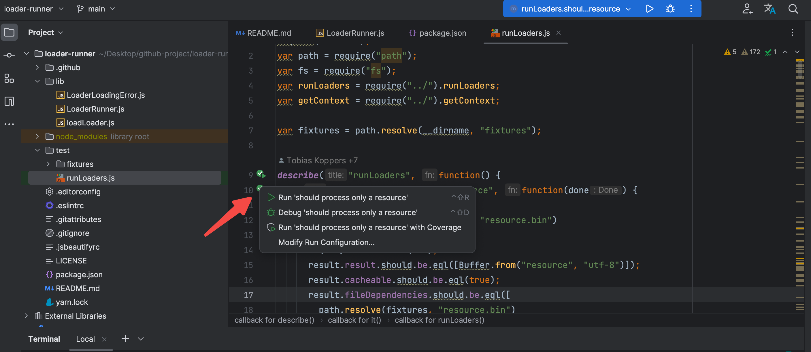

好的代码库都是自带 `README.md`，所以在我们拉取完代码库以后，要去阅读一下相关的 `README.md`的文档，这里面信息会因为代码库功能的不同，有不同的目录风格结构，有些详细，有些简略，很不辛的，当前这个库的 `README.md` 就只有使用方式，无任何的其他说明。。。


这就要靠我们自己去分析了，接下来的话，我会去看当前项目的目录结构，因为此项目属于`nodejs`项目，一般会有 lock 文件，然后就发现了`yarn.lock`。我们执行 `yarn install` 进行依赖的安装。对于`nodejs`项目，另外一个重要的地方就是 package.json 里的 `scripts` 配置了。

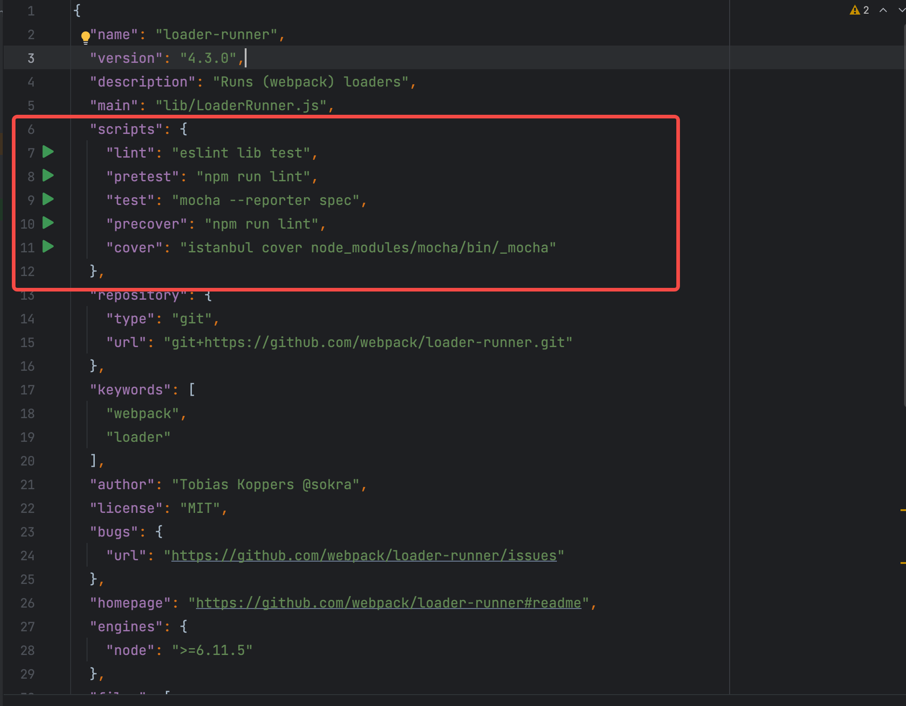

初步分析 发现 `scripts` 配置

1. "lint": 这个命令使用 ESLint 工具检查 lib 和 test 目录中的代码，以查找代码样式或语法错误。
2. "pretest": 这个命令在执行 test 命令之前被执行。在这种情况下，它运行 lint 命令，以确保代码格式正确，然后再运行测试。
3. "test": 这个命令使用 Mocha 测试套件运行测试，并使用 --reporter spec 标志指定报告的格式为 spec。
4. "precover": 这个命令在执行 cover 命令之前被执行。在这种情况下，它运行 lint 命令，以确保代码格式正确，然后再执行覆盖率测试。
5. "cover": 这个命令使用 Istanbul 工具检查代码的覆盖率，并使用 node_modules/mocha/bin/\_mocha 进行测试。

总体来说主要做了 `lint（格式化）`、`test（单元测试）`和`cover（覆盖率）`，我们主要去 运行一下 `npm run test`

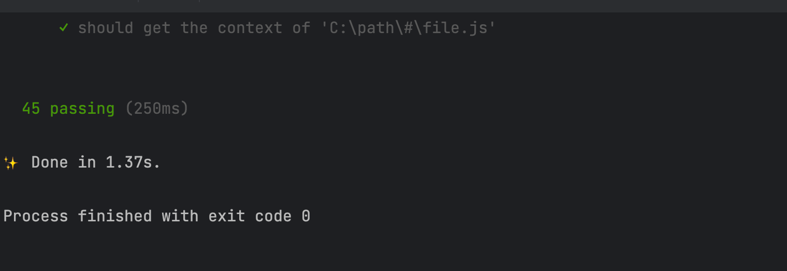

目前来说，全部通过，我们就可以根据单元测试文件进行学习了。

## 2. 开始跟着单元测试进行学习

相关的单元测试文件一般在 test 目录，开整

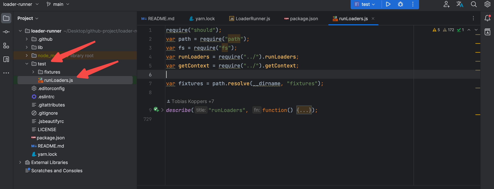

简单的基础知识让 GPT 作为代表说明一下

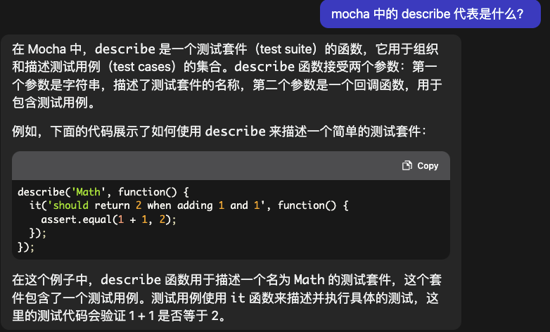

### 2.1 来个简单的第一条，学习一下 loader-runner 的基础用法

```
it("should process only a resource", function(done) {
  runLoaders({
   resource: path.resolve(fixtures, "resource.bin")
  }, function(err, result) {
   if(err) return done(err);
   result.result.should.be.eql([Buffer.from("resource", "utf-8")]);
   result.cacheable.should.be.eql(true);
   result.fileDependencies.should.be.eql([
    path.resolve(fixtures, "resource.bin")
   ]);
   result.contextDependencies.should.be.eql([]);
   done();
  });
 });
```

运行一下，过了。

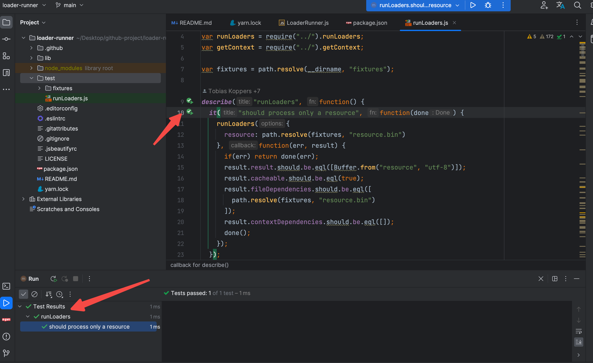

接下来分析一下这个用例都做了什么？

```
runLoaders({
   resource: path.resolve(fixtures, "resource.bin")
  }, function(err, result) {
    // 省略部分代码
    })

```

调用导入的 `runLoaders` 传入 `resource` 的参数，接受一个带有 `err和 result`的 callback 函数，相对来说，读起来还是比较简单的，接下来对测试的用例的执行结果进行分析。

```
  if(err) return done(err);
   // result 应该读取到了 内容为 `resource` 并且是utf8格式的buffer
   result.result.should.be.eql([Buffer.from("resource", "utf-8")]);
   // cacheable 字段应该为 true
   result.cacheable.should.be.eql(true);
   // fileDependencies 字段应该是一个 包含了 resource.bin 的绝对路径
   result.fileDependencies.should.be.eql([
    path.resolve(fixtures, "resource.bin")
   ]);
   // contextDependencies 字段应该 为空
   result.contextDependencies.should.be.eql([]);
   done();
```

简单来说，仅仅传入了`resource`参数，`loader-runner`仅仅会作为内容读取工具来用。验证一下 `resource.bin` 的内容，

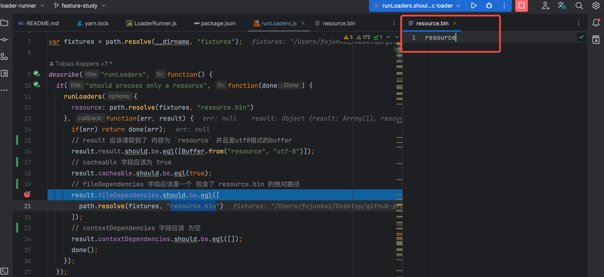

### 2.2 测试 简单的 同步 loader

代码如下：

```
it("should process a simple sync loader", function(done) {
  runLoaders({
   resource: path.resolve(fixtures, "resource.bin"),
   loaders: [
    path.resolve(fixtures, "simple-loader.js")
   ]
  }, function(err, result) {
   if(err) return done(err);
   result.result.should.be.eql(["resource-simple"]);
   result.cacheable.should.be.eql(true);
   result.fileDependencies.should.be.eql([
    path.resolve(fixtures, "resource.bin")
   ]);
   result.contextDependencies.should.be.eql([]);
   done();
  });
 });
```

可以发现 `runLoaders` 的配置多了一个 `loaders` 的 入参，其参数是 `simple-loader.js` 的路径。

查看一下 `simple-loader.js`的文件内容。

```
module.exports = function(source) {
 return source + "-simple";
};
```

导出一个方法，并且对传入的 `source` 参数 拼接了 `-simple` 内容。

分析上述用例的结果会发现核心的代码是: `result.result.should.be.eql(["resource-simple"]);` 这说明之前的 `resource.bin`文件中的 `resource` 文本，经过此 loader 的处理 变更为 `resource-simple`了。

这不又意外学习到了`如何编写一个简易的同步的loader`。

### 2.3 同步会写了，不会写异步，作为一个追求完美的程序员，继续向下看

```
it("should process a simple async loader", function(done) {
  runLoaders({
   resource: path.resolve(fixtures, "resource.bin"),
   loaders: [
    path.resolve(fixtures, "simple-async-loader.js")
   ]
  }, function(err, result) {
   if(err) return done(err);
   result.result.should.be.eql(["resource-async-simple"]);
   result.cacheable.should.be.eql(true);
   result.fileDependencies.should.be.eql([
    path.resolve(fixtures, "resource.bin")
   ]);
   result.contextDependencies.should.be.eql([]);
   done();
  });
 });
```

此用例的 loader 换为了 `simple-async-loader.js`的文件，我们来读一下：

```
// simple-async-loader.js
module.exports = function(source) {
 var callback = this.async();
 setTimeout(function() {
  callback(null, source + "-async-simple");
 }, 50);
};
```

是不是看到`var callback = this.async();` 就蒙了？


我们先记录一个 `TODO`:

1. 这里怎么有 this ?
2. 这里的 this 指向了谁？
3. 这里的 this 除了 async 以外是否还有其他的方法呢？

后期学习了源码以后我们一步一步的解答。

### 2.4 异步可不仅仅是有定时器一种哦，试试 Promise

```
it("should process a simple promise loader", function(done) {
  runLoaders({
   resource: path.resolve(fixtures, "resource.bin"),
   loaders: [
    path.resolve(fixtures, "simple-promise-loader.js")
   ]
  }, function(err, result) {
   if(err) return done(err);
   result.result.should.be.eql(["resource-promise-simple"]);
   result.cacheable.should.be.eql(true);
   result.fileDependencies.should.be.eql([
    path.resolve(fixtures, "resource.bin")
   ]);
   result.contextDependencies.should.be.eql([]);
   done();
  });
 });
```

`simple-promise-loader.js` 的内容如下：

```
module.exports = function(source) {
 return Promise.resolve(source + "-promise-simple");
};
```

这个`simple-promise-loader.js`的方法也太简单了把，它导出了一个函数，这个函数接收一个参数 source，并返回一个 Promise 对象。这个 Promise 对象的值是 source + "-promise-simple"，也就是将传入的 source 字符串加上一个后缀字符串 "-promise-simple"，然后作为 Promise 对象的值进行返回。

### 2.5 同步学会了，异步也学了两种，来个合集吧？

```
it("should process multiple simple loaders", function(done) {
  runLoaders({
   resource: path.resolve(fixtures, "resource.bin"),
   loaders: [
    path.resolve(fixtures, "simple-async-loader.js"),
    path.resolve(fixtures, "simple-loader.js"),
    path.resolve(fixtures, "simple-async-loader.js"),
    path.resolve(fixtures, "simple-async-loader.js"),
    path.resolve(fixtures, "simple-loader.js")
   ]
  }, function(err, result) {
   if(err) return done(err);
   result.result.should.be.eql(["resource-simple-async-simple-async-simple-simple-async-simple"]);
   result.cacheable.should.be.eql(true);
   result.fileDependencies.should.be.eql([
    path.resolve(fixtures, "resource.bin")
   ]);
   result.contextDependencies.should.be.eql([]);
   done();
  });
 });
```

loaders 中的入参，都是我们之前分析过的内容。 其中`simple-async-loader`是一个异步的 loader 会对 source 后拼接 `-async-simple` 内容。 `simple-loader`是一个同步的 loader 会对 source 后拼接 `-simple` 内容。

测试用例的结果中 `result.result.should.be.eql(["resource-simple-async-simple-async-simple-simple-async-simple"]);`

基础的 `resource.bin` 的文件提供了 `resource` 文本，那么第一个拼接的内容是 `-simple`，但是从 loader 的顺序来说，

```
loaders: [
    path.resolve(fixtures, "simple-async-loader.js"),
    path.resolve(fixtures, "simple-loader.js"),
    path.resolve(fixtures, "simple-async-loader.js"),
    path.resolve(fixtures, "simple-async-loader.js"),
    path.resolve(fixtures, "simple-loader.js")
]
```

我们的第一个是 `simple-async-loader.js` 最后一个是 `simple-loader.js`，这说明我们的`loader 的执行顺序是从后向前执行的`，有点不符合代码阅读的习惯了。记录一个 TODO 吧，看稍后的源码分析中是否会解惑。

TODO:

1. 为什么 loader 的执行顺序是从后向前执行的？

### 2.6 总结

我们大致看了几个简单的测试用例，总结一下目前的 TODO，就要开始简单的调试代码了

关于 loader 中的 this 的 TODO

1. loader 中的 this 是什么?
2. this 对象 除了 async 方法以外是否还有其他的方法呢？

关于 loader 的执行顺序

1. 为什么 loader 的执行顺序是从后向前执行的？

## 3. 开始调试，理解 pitch loader 和 normal loader

### 3.1 对 loader 用到的物料进行组装

我们选择测试用例的 `should process a simple async loader` 开始调试，使用 webstorm 的好处就是可以直接点击 测试用例旁边的 debug xxx 按钮开始调试

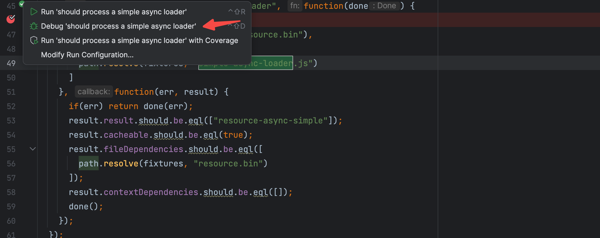

第一步：调试进入 主程序 `runLoaders` 方法

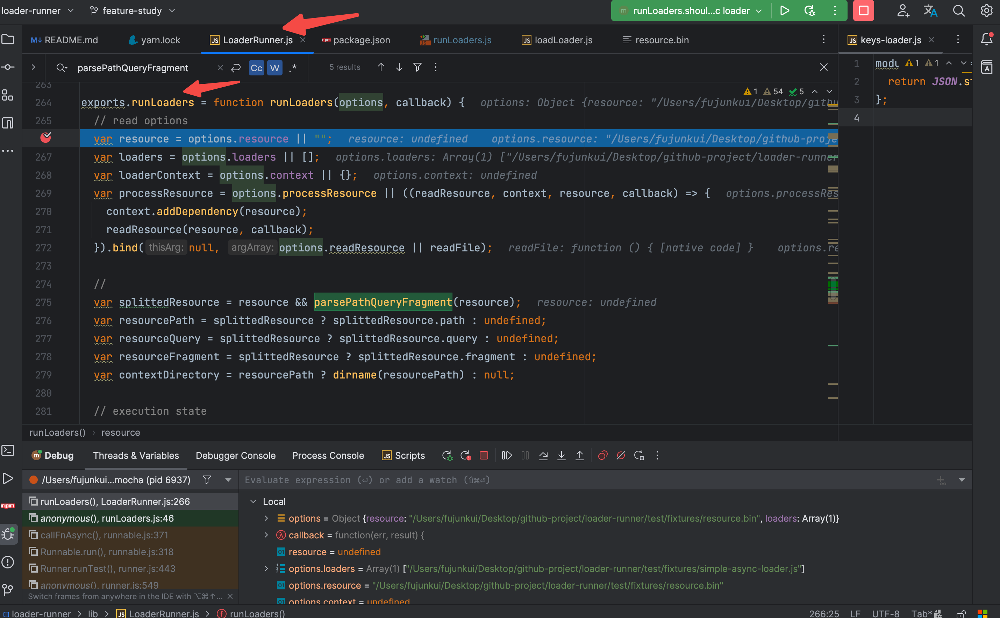

我们要追踪的事 loader 的执行过程，前面的 配置解析和路径解析可以忽略，跳到

```
 // prepare loader objects
 loaders = loaders.map(createLoaderObject);
```

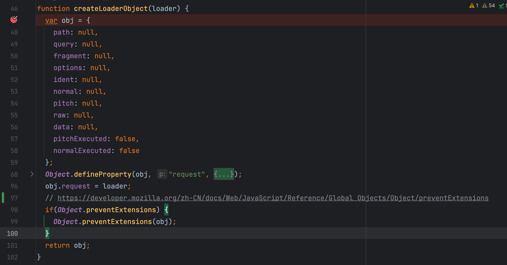

此时我们的 loader 还仅仅是一个路径而已，当调用 `obj.request = loader;`，此时会因为

```
Object.defineProperty(obj, "request", {
  enumerable: true,
  get: function() {
   return obj.path.replace(/#/g, "\0#") + obj.query.replace(/#/g, "\0#") + obj.fragment;
  },
  set: function(value) {
   if(typeof value === "string") {
    var splittedRequest = parsePathQueryFragment(value);
    obj.path = splittedRequest.path;
    obj.query = splittedRequest.query;
    obj.fragment = splittedRequest.fragment;
    obj.options = undefined;
    obj.ident = undefined;
   } else {
    // 省略。。。
  }
 });
```

其中的 set 方法 对 loader 进行判断，对 obj 对象 进行赋值。 至此调用完 `createLoaderObject` 方法以后，我们的 loaders 变成了一个个的 obj 对象。

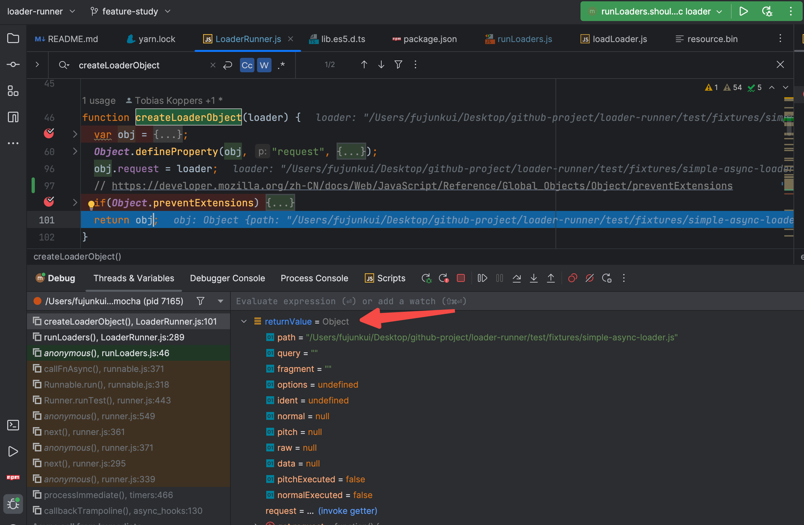

loader 处理完毕以后，开始处理 loader 用到的上下文。

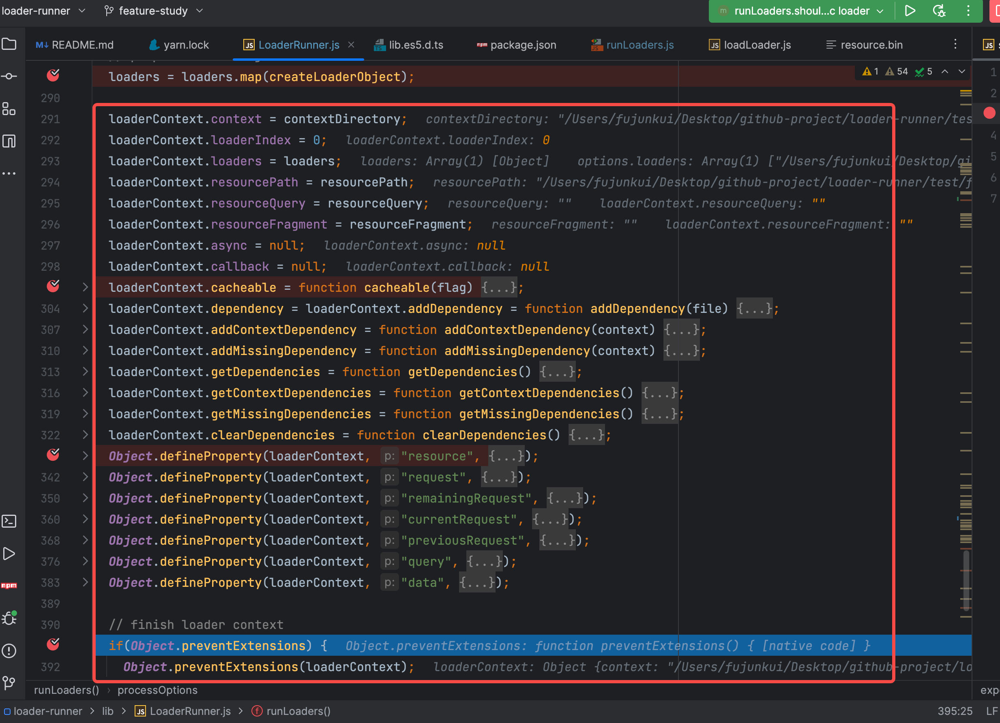

又是一顿操作，然后锁定了 `loaderContext` 对象。

接下来开始调用 `iteratePitchingLoaders` 来消费物料。

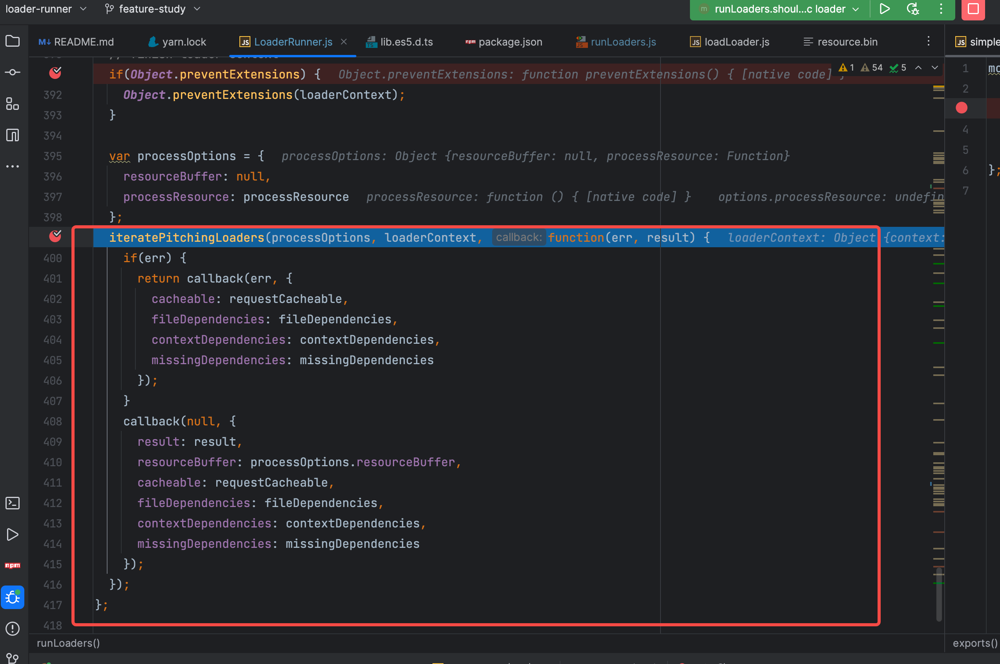

`iteratePitchingLoaders` 是 loader runner 中的核心业务逻辑。

### 3.2 分析 `iteratePitchingLoaders` 的 大体逻辑

放上核心代码，贴心的我写了注释哦。 

```
function iteratePitchingLoaders(options, loaderContext, callback) {
 // abort after last loader 最后一个pitch loader 执行完毕后，转而调用 processResource 去执行 normal loader
 if(loaderContext.loaderIndex >= loaderContext.loaders.length)
  return processResource(options, loaderContext, callback);
 // 当前的 loader 对象
 var currentLoaderObject = loaderContext.loaders[loaderContext.loaderIndex];

 // iterate 判断当前的 loader 是否执行过 pitch 方法
 if(currentLoaderObject.pitchExecuted) {
  // 执行过以后 loaderContext 上下文的索引 loaderIndex + 1
  loaderContext.loaderIndex++;
  // 继续调用执行 iteratePitchingLoaders 方法
  return iteratePitchingLoaders(options, loaderContext, callback);
 }

 // load loader module 加载 loader 模块，之前都是loader 的绝对路径，
 // 此处通过 loadLoader 中的 require方法把loader 的绝对路径变为 对应的 node 模块
 loadLoader(currentLoaderObject, function(err) {
  if(err) {
   loaderContext.cacheable(false);
   return callback(err);
  }
  // 获取到 loader 中导出的 pitch 方法
  var fn = currentLoaderObject.pitch;
  // 将当前执行的 loader 的 pitchExecuted 标识变更为 true，代表执行过 pitch 方法，会影响上面的判断
  currentLoaderObject.pitchExecuted = true;
  // 当前 loader的 pitch 方法不存在，不去执行，继续调用 iteratePitchingLoaders
  if(!fn) return iteratePitchingLoaders(options, loaderContext, callback);

  // 如果存在 pitch 方法，去执行对应的loader 的 pitch 方法
  runSyncOrAsync(
   fn,
   loaderContext,
   // 注意传递给pitch 方法的 参数是如下这些
   [loaderContext.remainingRequest, loaderContext.previousRequest, currentLoaderObject.data = {}],
   function(err) {
    if(err) return callback(err);
    var args = Array.prototype.slice.call(arguments, 1);
    var hasArg = args.some(function(value) {
     return value !== undefined;
    });
    // 如果 pitch 方法 执行完毕，存在有效的返回值 就开始调用 iterateNormalLoaders
    // 反之则继续执行向下执行 pitch 方法
    if(hasArg) {
     loaderContext.loaderIndex--;
     iterateNormalLoaders(options, loaderContext, args, callback);
    } else {
     iteratePitchingLoaders(options, loaderContext, callback);
    }
   }
  );
 });
}
```

大家也会将 loader 分为 `pitch loader 和 normal loader`，而此处执行的就是 loader 的 pitch 方法，大家看的过程中的核心关注点可以是 `pitchExecuted` 和 `loaderIndex`这两个参数。

下面是对于此函数的执行流程的解析：

```
【第一次执行的时候】

1. 根据 pitchExecuted 为 false 的标识去执行 loadLoader 方法，

2. loadLoader 主要是通过node的 require 方法去加载 loader 模块，真正的业务逻辑在其加载完模块以后的 callback 函数里，

3. callback 函数 获取到 loader 模块暴露出的 pitch 方法，并且把当前执行的 loader 对象的 pitchExecuted 标识改为 true

4. 如果当前 loader 的 pitch 方法存在，就会去执行 runSyncOrAsync 方法，
5. 如果 pitch 方法不存在，二次调用 iteratePitchingLoaders 方法进行递归处理


【第二次执行的时候】
1. 因为第一步修改 currentLoaderObject.pitchExecuted 的标识为 true，成功进入if 判断

2. if 判断中会使 loaderContext.loaderIndex++ 的索引增加，

3. 增加完毕以后继续调用 iteratePitchingLoaders 方法递归处理

【第三次执行的时候】
1. 因为第二次执行的时候loaderIndex索引的增加会导致 currentLoaderObject 的值变更为下一个loader，此时完成了 pitch loader 的切换
2. 新的pitch loader 会再次进入第一次执行时候的判断，如此循环往复
```

递归调用的核心是终止条件，那么此处的终止条件有哪些呢？

```
递归的终止条件，满足其中一个即可退出递归循环
```

条件 1：在 runSyncOrAsync 的 callback 方法中会判断 pitch loader 的执行结果是否有返回值，有返回值的情况下 会进行终止，并且开始调用 iterateNormalLoaders 方法，开始执行 `normal loader `的递归调用。

条件 2：所有的 pitch loader 执行完毕，也就是 满足 `loaderContext.loaderIndex >= loaderContext.loaders.length` 的 条件，会去执行 `processResource` 方法。

```
function processResource(options, loaderContext, callback) {
 // set loader index to last loader
 loaderContext.loaderIndex = loaderContext.loaders.length - 1;

 var resourcePath = loaderContext.resourcePath;
 if(resourcePath) {
  options.processResource(loaderContext, resourcePath, function(err) {
   if(err) return callback(err);
   var args = Array.prototype.slice.call(arguments, 1);
   options.resourceBuffer = args[0];
   iterateNormalLoaders(options, loaderContext, args, callback);
  });
 } else {
  iterateNormalLoaders(options, loaderContext, [null], callback);
 }
}
```

所谓的 `processResource` 方法，其核心逻辑是

1. 重置 上下文的 `loaderContext.loaderIndex` 为 最后一个 loader 的索引
2. 开始调用 `iterateNormalLoaders` 方法，开始执行 `normal loader `的递归调用。

### 3.3 分析 `iterateNormalLoaders` 的 大体逻辑

直接上代码

```
function iterateNormalLoaders(options, loaderContext, args, callback) {
 if(loaderContext.loaderIndex < 0)
  return callback(null, args);

 var currentLoaderObject = loaderContext.loaders[loaderContext.loaderIndex];

 // iterate
 if(currentLoaderObject.normalExecuted) {
  loaderContext.loaderIndex--;
  return iterateNormalLoaders(options, loaderContext, args, callback);
 }

 var fn = currentLoaderObject.normal;
 currentLoaderObject.normalExecuted = true;
 if(!fn) {
  return iterateNormalLoaders(options, loaderContext, args, callback);
 }

 convertArgs(args, currentLoaderObject.raw);

 runSyncOrAsync(fn, loaderContext, args, function(err) {
  if(err) return callback(err);

  var args = Array.prototype.slice.call(arguments, 1);
  iterateNormalLoaders(options, loaderContext, args, callback);
 });
}
```

此处的业务逻辑和之前分析过的 pitch loader 的相关逻辑是一样的，不同的点在于，此处的 索引是 递减的，也就是 `从后向前 执行的`，看到这里是不是可以理解了，为什么 loader 的执行顺序是从后向前执行的呢？

到现在的话，才大致明白了 对 pitch loader 和 normal loader 的调度层的业务逻辑。关于 loader 中的 this 相关的疑问是在 `runSyncOrAsync` 方法中进行解答。

## 4. 八股文之 this 的指向问题，闭包

不管是在 pitch loader 的执行中 还是在 normal loader 的执行中，最后的最后都是调用的 `runSyncOrAsync` 方法，只不过是传参的不同。

pitch loader 的传参

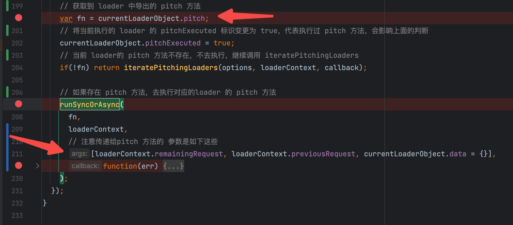

normal loader 的传参

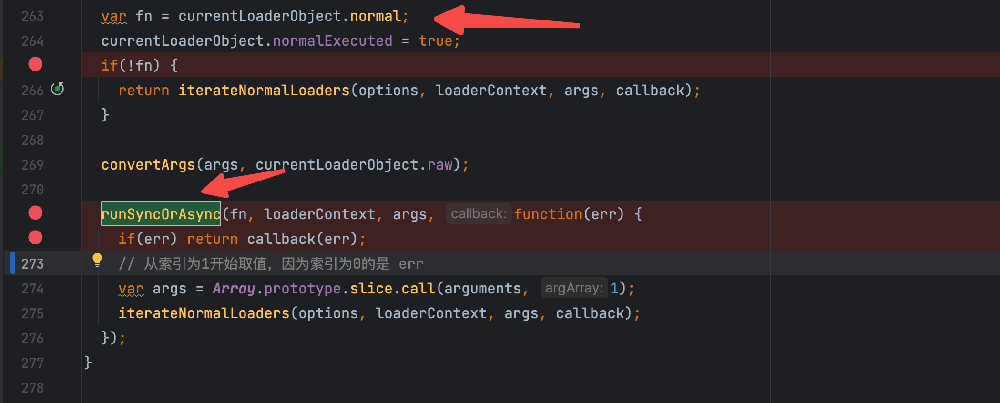

在 `runSyncOrAsync` 方法中，核心代码 只有一行 `fn.apply(context, args)`；

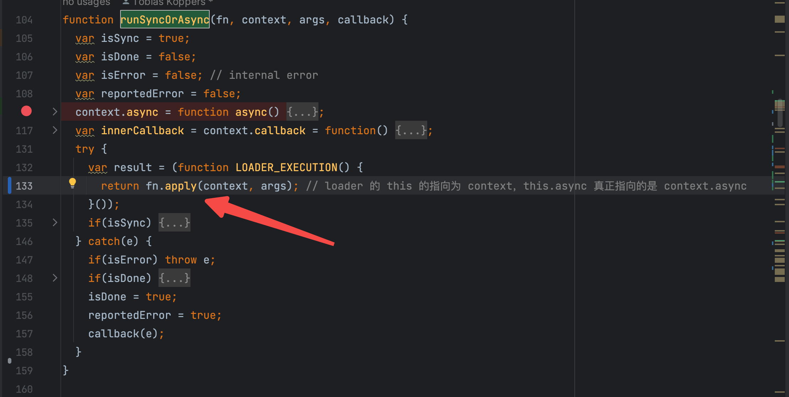

我们在 loader 中使用的`this 都是指向了 context`，而 loader 中接受的所有参数都是来自于`iteratePitchingLoaders` 方法的 `[loaderContext.remainingRequest, loaderContext.previousRequest, currentLoaderObject.data = {}]`以及 `iterateNormalLoaders` 方法的 `上一个 loader 的处理的值`。

this 相关的 TODO 至此也全部解开了，接下来我们再去看下这个函数是怎么实现`异步 loader 和 promise 返回值处理的`。

关于异步的实现解析 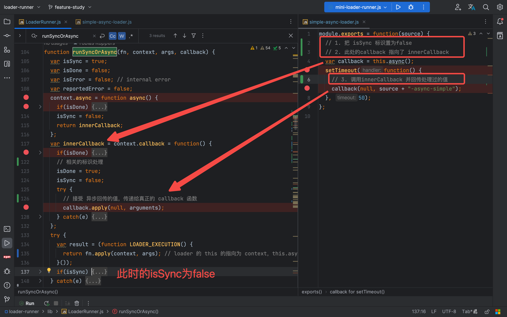

关于 promise 返回值的处理

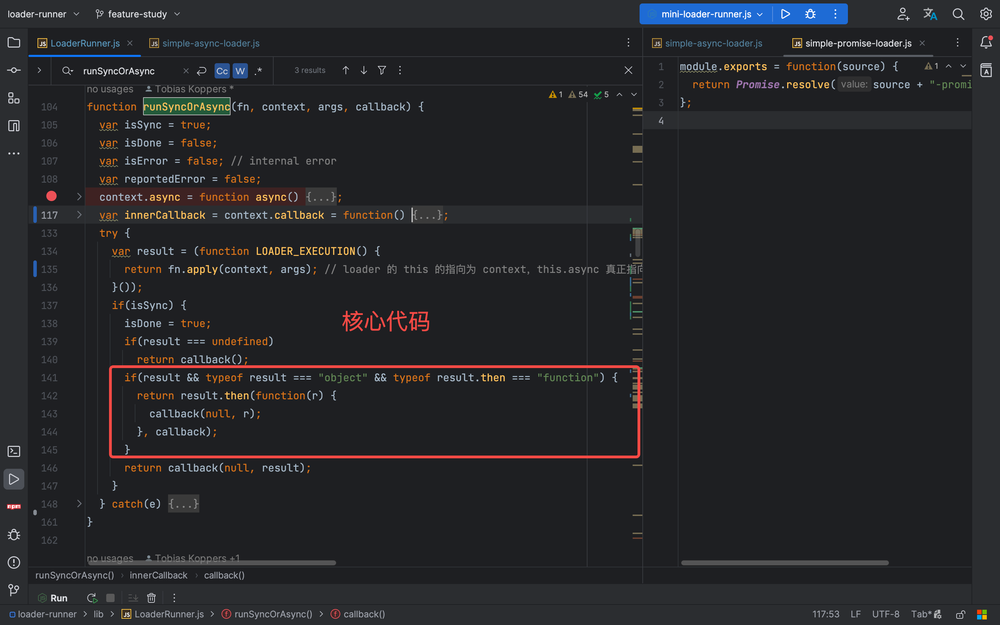

## 5. 100 行左右手写一个简单的 loader 调度

整体分析下来，发现 loader-runner 的实现中比较难以理解的就是关于 pitch loader 和 norma loader 的调度。稍微手写了一下简易版的实现。代码运行效果如下：

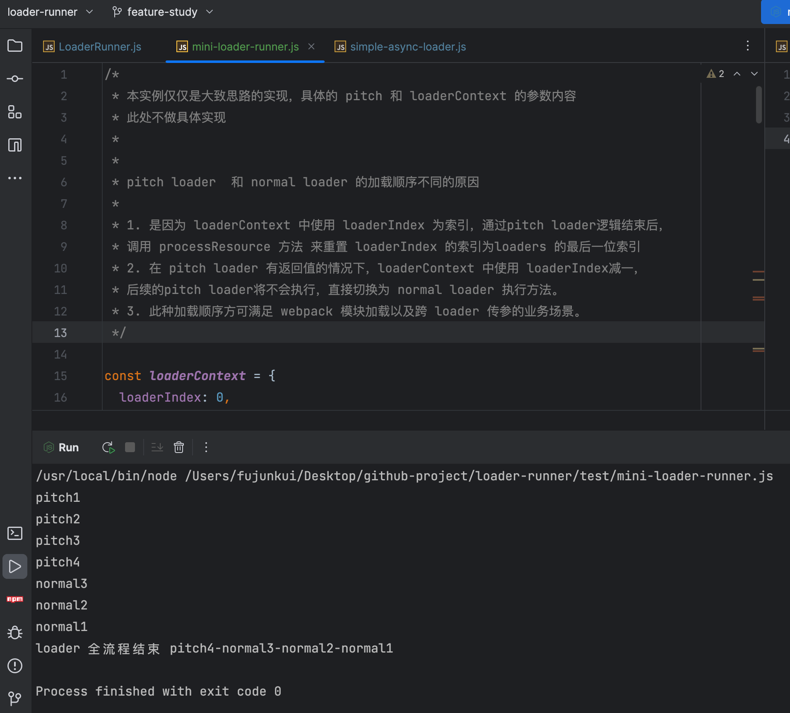

具体代码如下：

Github 地址为：[点击查看](https://github.com/fu1996/loader-runner/blob/feature-study/test/mini-loader-runner.js)

如果你喜欢这篇文章，可以给我的 GitHub 项目点一个 star，ღ( ´･ᴗ･` )比心，我也会持续更新 webpack5 源码系列，感兴趣的朋友可以对我的专栏进行订阅。

```
/*
 * 本实例仅仅是大致思路的实现，具体的 pitch 和 loaderContext 的参数内容
 * 此处不做具体实现，可以把48行的注释放开，查看运行效果。
 *
 *
 * pitch loader  和 normal loader 的加载顺序不同的原因
 *
 * 1. 是因为 loaderContext 中使用 loaderIndex 为索引，通过pitch loader逻辑结束后，
 * 调用 processResource 方法 来重置 loaderIndex 的索引为loaders 的最后一位索引
 * 2. 在 pitch loader 有返回值的情况下，loaderContext 中使用 loaderIndex减一，
 * 后续的pitch loader将不会执行，直接切换为 normal loader 执行方法。
 * 3. 此种加载顺序方可满足 webpack 模块加载以及跨 loader 传参的业务场景。
 */

const loaderContext = {
 loaderIndex: 0,
 resource: 'resource',
};

const loaderObj = [
 {
  pitchExecuted: false,
  normalExecuted: false,
  pitch: function() {
   console.log("pitch1");
  },
  normal: function(source) {
   console.log("normal1");
   return source + '-normal1'
  }
 },
 {
  pitchExecuted: false,
  normalExecuted: false,
  pitch: function() {
   console.log("pitch2");
  },
  normal: function(source) {
   console.log("normal2");
   return source + '-normal2'
  }
 },
 {
  pitchExecuted: false,
  normalExecuted: false,
  pitch: function() {
   console.log("pitch3");
   // return 'pitch3'
  },
  normal: function(source) {
   console.log("normal3");
   return source + '-normal3'
  }
 },
 {
  pitchExecuted: false,
  normalExecuted: false,
  pitch: function() {
   console.log("pitch4");
   return 'pitch4'
  },
  normal: function(source) {
   console.log("normal4");
   return source + '-normal4'
  }
 },
];

loaderContext.loaders = loaderObj;

function iterateNormalLoaders(args) {
 if(loaderContext.loaderIndex < 0) {
  console.log("loader 全流程结束", args);
  return ;
 }
 var currentLoaderObject = loaderContext.loaders[loaderContext.loaderIndex];
 if(currentLoaderObject.normalExecuted) {
  loaderContext.loaderIndex--;
  return iterateNormalLoaders(args);
 }
 const fn = currentLoaderObject.normal;
 currentLoaderObject.normalExecuted = true;
 if(!fn) return iterateNormalLoaders(args);
 args = fn.apply(loaderContext, [args]);
 iterateNormalLoaders(args);
}

function processResource() {
 // pitch loader  和 normal loader 的切换器
 // loaderContext.loaderIndex 置为 loaders 的最后的索引，因为
 // pitch loader  和 normal loader 数量可能不一致，切换到 normal loader 的时候，需要从最后一位开始执行
 loaderContext.loaderIndex = loaderContext.loaders.length - 1;
 iterateNormalLoaders(loaderContext.resource);
}

function iteratePitchingLoaders() {
 if(loaderContext.loaderIndex >= loaderContext.loaders.length) {
  return processResource();
 }

 var currentLoaderObject = loaderContext.loaders[loaderContext.loaderIndex];
 if(currentLoaderObject.pitchExecuted) {
  loaderContext.loaderIndex++;
  return iteratePitchingLoaders();
 }
 const fn = currentLoaderObject.pitch;
 currentLoaderObject.pitchExecuted = true;
 if(!fn) return iteratePitchingLoaders();
 const args = fn.apply(null, []);
 if(args) {
  loaderContext.loaderIndex--;
  iterateNormalLoaders(args);
 } else {
  iteratePitchingLoaders();
 }
}

iteratePitchingLoaders();
```
